## Q&A

### `char*[]` 和`char**` 有什么区别?

`char*[]` 是一个指向字符指针数组的指针，它可以看作是一个指针数组，每个元素都是一个指向字符的指针。

而 `char**` 是一个指向字符指针的指针，它可以看作是一个指向字符指针的指针，也可以表示一个指向字符串数组的指针。

因为`char[]`是一个指向字符数组头部的指针。

简单来说，`char*[]` 表示一个字符指针数组，而 `char**` 表示一个字符指针的指针。

### 指针和引用有什么区别?

引用和指针是C++中两种不同的概念，它们在使用和语法上有一些重要区别：

1. **定义和声明**：
   - 指针使用`*`符号来声明，例如：`int* ptr;`
   - 引用使用`&`符号来声明，例如：`int& ref = var;`

2. **初始化**：
   - 指针可以在声明后再指向其他变量或空指针，例如：`int* ptr = nullptr;`，`ptr = &var;`
   - 引用在声明时必须初始化，并且不能再指向其他变量，例如：`int& ref = var;`

3. **操作符**：
   - 指针通过`*`操作符来访问所指向的对象，例如：`*ptr = 10;`
   - 引用直接访问所引用的对象，不需要使用操作符，例如：`ref = 10;`

4. **空值**：
   - 指针可以指向空值（`nullptr`），表示不指向任何对象。
   - 引用必须在初始化时指向一个有效的对象，不能引用空值。

5. **重定义**：
   - 指针可以被重新赋值指向其他对象或空指针。
   - 引用在初始化后不能再引用其他对象，它始终引用同一个对象。

6. **地址**：
   - 指针存储对象的地址，需要使用取地址运算符`&`获取地址。
   - 引用在初始化时绑定到对象，不存储地址。

总的来说，指针提供了更多灵活性，可以指向不同的对象或空值，可以动态改变其指向的对象；而引用提供了更简洁的语法和更直接的访问方式，但不能重新绑定到其他对象。在选择使用指针还是引用时，可以根据具体情况和需求来决定。

### 常量指针和指针常量之间有什么区别?

常量指针和指针常量是两种不同的概念，它们之间有一定的区别。下面分别介绍常量指针和指针常量的概念和区别：

1. 常量指针（Constant Pointer）：
- 常量指针是指一个指针，其指向的对象是常量，不能通过该指针修改指向的对象的值。
- 声明常量指针时需要在指针前面加上 `const` 关键字。
- 常量指针本身的值（即指向的地址）是可以改变的，但指向的对象的值是不能改变的。

示例：
```cpp
int x = 10;
const int* ptr = &x; // 常量指针，指向的对象是常量
// *ptr = 20; // 无法修改 ptr 指向对象的值
x = 20; // 可以修改 x 的值
```

2. 指针常量（Pointer Constant）：
- 指针常量是指一个指针本身是常量，即指针的值（即指向的地址）是不可修改的。
- 声明指针常量时需要在指针后面加上 `const` 关键字。
- 指针常量不能修改指针本身指向的地址，但可以通过该指针修改指向的对象的值。

示例：
```cpp
int x = 10;
int* const ptr = &x; // 指针常量，指针本身是常量
*ptr = 20; // 可以修改 ptr 指向对象的值
// ptr = nullptr; // 无法修改 ptr 的值
```

综上所述，常量指针和指针常量的区别在于：常量指针指向的对象是常量，不能修改其值；而指针常量指针本身是常量，不能修改指针的值。在使用指针时，根据具体需求选择合适的类型可以帮助我们更好地管理内存和保证数据的安全性。

### 常量指针，常引用，常量之间有什么关系？

在C++中，常量指针、常引用和常量是三个涉及常量性（constness）的不同概念。它们之间的关系在于它们都用于限定数据的可修改性和访问方式，但应用的上下文和具体含义有所不同。

1. **常量（Constant）**:
   常量是指一旦初始化后其值就不能改变的变量。在C++中，可以使用`const`关键字来声明常量。例如：
   ```cpp
   const int constantValue = 10;
   ```
   这里`constantValue`被初始化为10，之后它的值就不能被改变了。

2. **常量指针（Pointer to Constant）**:
   常量指针是指向常量的指针，这意味着通过这个指针不能改变它指向的值，但是指针本身的值（即存储的地址）可以改变，它可以指向别的地址。声明常量指针的语法如下：
   ```cpp
   const int* ptrToConstant = &constantValue;
   ```
   这里`ptrToConstant`是一个指针，指向一个`const int`类型的数据。你不能通过`ptrToConstant`来改变这个数据的值，但是`ptrToConstant`可以指向另一个`const int`类型的数据。

3. **指针常量（Constant Pointer）**:
   这是一个指针，它的值（即它所指向的地址）不可以改变，但是指向的数据的值可以改变（除非它指向的也是一个常量）。声明指针常量的语法如下：
   ```cpp
   int value = 5;
   int* const constantPtr = &value;
   ```
   **这里`constantPtr`必须初始化**，且之后不能再指向其他的地址，但是`constantPtr`指向的`value`是可以改变的。

4. **常引用（Constant Reference）**:
   常引用是对常量的引用，或者是对变量的只读引用。它不允许通过引用来修改它绑定的对象。**常引用在声明时必须初始化**，并且不能被重新绑定到另一个对象。声明常引用的语法如下：
   
   ```cpp
   const int& refToConstant = constantValue;
   ```
   这里`refToConstant`是一个引用，它引用了一个`const int`类型的数据。通过`refToConstant`不能改变这个数据的值。

这三个概念的共同点是它们都利用`const`关键字来限制修改数据。区别在于指针常量（Constant Pointer）关注的是指针自身值的不变性，常量指针（Pointer to Constant）关注的是指针所指向的数据的不变性，而常引用（Constant Reference）则是引用的一种特殊形式，确保通过引用不能修改绑定的数据。

在实际编程实践中，这些概念用于提高代码安全性，防止非预期的修改，以及在接口设计中表达函数对输入参数的修改意图。


### 关于复制构造函数

>  Q:在函数列表和返回值中出现了类的对象是否会调用复制构造函数?如果会,那么如果我在类中自定义了复制构造函数,使得复制的结果并不等于复制原本,那么这时候调用复制构造函数来生成副本显然会出现错误,我的推测是否正确?

在C++中，当函数列表中出现类的对象时，拷贝构造函数可能被调用。但是，编译器会尽可能地通过优化来避免额外的拷贝。这种优化通常称为（Named）Return Value Optimization（(N)RVO）或Copy Elision。在C++17标准中，这种优化在某些情况下是强制性的。

当你通过值将对象传递给函数时，拷贝构造函数会被调用来创建参数的本地副本。例如：

```cpp
void foo(MyClass obj) {
    // ...
}

MyClass myObj;
foo(myObj);  // 调用 MyClass 的拷贝构造函数来创建 foo 的参数 obj 的副本
```

**如果参数是通过引用传递的，无论是const引用还是非const引用，都不会调用拷贝构造函数。**

当函数返回一个对象时，理论上也会调用拷贝构造函数来创建返回值的副本。但是，实际上编译器通常会应用 (N)RVO，从而避免这些额外的拷贝。在C++17及更高版本中，这种优化是保证的，在某些情况下拷贝构造函数的调用可以省略。

如果你在类中自定义了拷贝构造函数，并且使得复制的结果与原对象不同，这通常是不推荐的设计。拷贝构造函数的预期行为是创建一个与原对象状态相同的新对象。如果你违反了这个预期，那么当拷贝构造函数被调用时（如在函数参数传递或返回值时），可能会出现逻辑错误或不一致的行为。

例如，如果你的自定义拷贝构造函数故意改变了成员变量的值，那么在函数调用中创建的副本将与原始对象有所不同。这可能导致程序的其它部分出现不可预料的行为，因为它们可能依赖于对象的拷贝与原对象具有相同的状态。

这里是一个示例：

```cpp
class MyClass {
public:
    int value;

    MyClass(int val) : value(val)    // 自定义拷贝构造函数，故意改变了 value 的值
    MyClass(const MyClass& other) : value(other.value + 1)};

void foo(MyClass obj) {
    // 如果 MyClass 的实例是通过拷贝传递的，则 obj.value 将不同于传入对象的 value
}

MyClass a(5);
foo(a);  // foo 中的 obj.value 将会是 6，而不是 5
```

在这个例子中，`foo` 函数接收的参数并不反映传入对象 `a` 的实际状态，这可能导致错误或者混乱。

在设计类时，拷贝构造函数应该保持对象状态的一致性，确保对象的拷贝是原对象的精确副本。如果你需要不同的复制行为，你应该考虑使用不同的函数或操作符来明确这种行为，而不是改变拷贝构造函数的语义。这样做可以确保代码清晰和可预测，同时符合其他程序员的期望。

### 对象间用等号赋值为什么不导致复制构造函数被调用?

在C++中，对象间的等号赋值操作并不会导致拷贝构造函数被调用，而是会触发**拷贝赋值操作符(Copy Assignment Operator)**的调用。这两者是不同的概念和操作。

**拷贝构造函数** 的调用场景包括：

1. 当使用一个已存在的对象来初始化一个新对象时（例如，`MyClass obj1 = obj2;`）。
2. 当对象作为参数通过值传递给函数时（尽管编译器优化可能会省略这个过程）。
3. 当函数返回一个对象时（同样，编译器优化可能会省略这个过程）。

**拷贝赋值操作符** 的调用场景是：

1. 当一个已经存在的对象被用来给另一个已经存在的对象赋值时（例如，`obj1 = obj2;`）。

以下是两者的一个简单示例来说明区别：

```cpp
class MyClass {
public:
    int value;

    // 构造函数
    MyClass(int val) : value(val)    // 拷贝构造函数
    MyClass(const MyClass& other) : value(other.value) {
        // 这里是拷贝构造函数的实现，它会在新对象初始化时被调用
    }

    // 拷贝赋值操作符
    MyClass& operator=(const MyClass& other) {
        if (this != &other) { // 防止自赋值
            this->value = other.value;
        }
        return *this;
        // 这里是拷贝赋值操作符的实现，它会在对象之间的赋值时被调用
    }
};

int main() {
    MyClass a(10);     // 构造函数被调用
    MyClass b = a;     // 拷贝构造函数被调用，因为初始化新对象b
    MyClass c(20);     // 构造函数被调用
    c = a;             // 拷贝赋值操作符被调用，因为c已存在，现在只是赋新值
    return 0;
}
```

在这个示例中：

- `MyClass b = a;` 使用了 `a` 来初始化 `b`，所以这里调用了拷贝构造函数。
- `c = a;` 是赋值操作，因为 `c` 已经被构造了，所以这里调用了拷贝赋值操作符。

这种区分是很重要的，因为它影响着类的设计，特别是当涉及到资源管理（如动态内存分配）时。如果你有需要管理的资源，你需要确保正确实现拷贝赋值操作符和拷贝构造函数（以及移动构造函数和移动赋值操作符，如果你的类需要支持移动语义）。

### 引用指向的对象如果被销毁,那么这时候对于原引用的引用怎么办?

**引用一旦被初始化就不能再引用其他的对象了,即完全绑定**

在C++中，**引用本身不能被显式销毁**。引用一旦被初始化后，就会一直绑定到它最初被绑定的对象上，直到这个引用的作用域结束。引用的生命周期是由它所引用的对象的作用域决定的。当对象的作用域结束时，对象会被销毁，但是引用本身并没有销毁的概念——它只是失去了有效的绑定对象。

考虑下面的示例：

```cpp
int main() {
    int a = 5;
    int& ref_a = a; // ref_a 是对变量 a 的引用
    // ...
} // ref_a 的作用域在这里结束，但我们不需要（也不能）显式销毁它
```

当`main`函数结束执行时，`a`和`ref_a`的作用域都结束了。`a`作为一个局部变量会被自动销毁。由于`ref_a`是`a`的引用，所以在`a`被销毁时，`ref_a`自然也就没有了它所引用的对象。

引用和它所引用的对象之间的这种关系是由编译器在编译时期就决定的，而不是运行时可以改变的。因此，没有一个操作或函数可以用来“销毁”一个引用，正如你不能改变一个引用一旦绑定后所指向的对象一样。

在某些高级语言中，如Java或C#，引用可以被赋予新的对象或者赋值为`null`来"断开"引用，但在C++中这是不可能的。如果你需要更灵活的引用关系，可以考虑使用指针，指针可以被重新赋值来指向另一个对象，或者赋值为`nullptr`来表示它不指向任何对象。

**悬垂引用（Dangling Reference）**是指引用已经释放或者失效的内存的引用。当对象被销毁或者释放后，指向它的引用仍然存在，但是再通过这个引用访问对象就会导致未定义的行为，因为引用的内存地址已经不再有效或者可能已经被重新分配给其他用途。

这里有几个导致悬垂引用的常见情况：

1. **局部变量的引用返回**：如果你从一个函数返回一个局部变量的引用，那么当函数退出时，局部变量的存储空间将被释放，任何保留的引用都将成为悬垂引用。

```cpp
int& func() {
    int local = 42;
    return local; // 返回局部变量的引用，会产生悬垂引用
}
```

2. **释放动态内存后的引用**：如果你释放了一个对象的动态分配的内存（例如使用`delete`），但是保留了一个指向该内存的引用，该引用也将成为悬垂引用。

```cpp
int* ptr = new int(42); // 动态分配内存
int& ref = *ptr;        // 创建指向动态分配内存的引用
delete ptr;             // 释放内存
// 'ref' 现在成为悬垂引用
```

3. **指向对象成员的引用**：如果你有一个引用指向对象的一个成员，然后删除了整个对象，那么指向成员的引用也会变成悬垂引用。

```cpp
class MyClass {
public:
    int value;
    MyClass(int val) : value(val)};

MyClass* myObject = new MyClass(42);
int& ref = myObject->value;
delete myObject;
// 'ref' 现在指向已经被释放的内存
```

4. **迭代器失效**：在C++的STL容器中，迭代器可能因为容器的修改操作（如插入、删除元素）而失效。失效的迭代器可以被视为一种悬垂引用。(**可以通过为迭代器重新赋值使其指向一个有效的位置来修正这个错误**)

```cpp
std::vector<int> vec = {1, 2, 3};
auto it = vec.begin(); // 'it' 是指向 vec 第一个元素的迭代器
vec.clear();           // 清空 vec，'it' 现在变成了悬垂迭代器
```

**避免悬垂引用**：

- 不要返回局部变量的引用或指针。
- 确保在引用或指针失效前不再使用它们。
- 当使用动态内存时，合理安排对象的生命周期，并确保在对象的生命周期结束后不再使用其引用。
- 使用智能指针（如`std::unique_ptr`或`std::shared_ptr`）来管理动态内存，以避免手动管理内存的复杂性。

悬垂引用是C++编程中一个常见的问题，它可以导致程序崩溃或不可预测的行为，因此理解它们并知道如何避免是非常重要的。

### 课上例题的解释说明(列表初始化)

```c++
#include <cstddef>
#include <iostream>

using namespace std;

class A {
  int v;

public:
  A(int n) { v = n; }
  A() { cout << "Build Function Called" << endl; }
};

int main() {
  A *arr[4] = {new A(), NULL, new A()};
  return 0;
}
```

Q:这是一种什么样的类对象构造方式?请为我详细介绍这种构造方式,并解释为什么只创建了两个对象.

A:这是一种使用列表初始化的方式来构造类对象数组。在这个例子中,我们创建了一个指向类`A`对象的指针数组`arr`,数组的大小为4。通过列表初始化,我们可以在数组创建时直接指定每个元素的初始值。

让我详细介绍这种构造方式:

1. **列表初始化**:
   
   - 在C++11中引入了列表初始化的概念,允许使用花括号`{}`来初始化数组、向量等容器。
   
   - 通过在花括号内提供初始值列表,可以在创建数组时直接指定每个元素的初始值。
   
   - 列表初始化可以用于各种类型的数组,包括内置类型数组和对象数组。
   
   - ```c++
     #include <iostream>
     using namespace std;
     class A {
       int v;
     
     public:
       A(int n) {
         v = n;
         cout << "Build Function Called" << endl;
       }
       A() { cout << "Build Function Called" << endl; }
     };
     int main() {
       A arr[4] = {1, 2}; // 创建了4个对象
       return 0;
     }
     ```
   
2. 指针数组:
   - 在这个例子中,我们创建了一个指向类`A`对象的指针数组`arr`。
   - 数组的每个元素都是一个指向`A`对象的指针,而不是`A`对象本身。
   - 通过列表初始化,我们可以在创建数组时直接指定每个指针元素的初始值。

3. 对象创建:
   - 在列表初始化中,我们使用`new`操作符来动态创建`A`类的对象。
   - `new A()`会调用`A`类的默认构造函数来创建一个新的对象,并返回指向该对象的指针。
   - 我们将这些指针作为初始值赋给指针数组`arr`的相应元素。

4. 初始化列表:
   - 在这个例子中,初始化列表为`{new A(), NULL, new A()}`。
   - 第一个元素`new A()`会创建一个新的`A`对象,并将其指针赋给`arr[0]`。
   - **第二个元素`NULL`是一个空指针,表示`arr[1]`不指向任何对象。**
   - 第三个元素`new A()`会创建另一个新的`A`对象,并将其指针赋给`arr[2]`。

5. 未初始化的元素:
   - 在这个例子中,数组`arr`的大小为4,但初始化列表中只提供了3个值。
   - **对于未显式初始化的元素`arr[3]`,它会被默认初始化为`nullptr`,即空指针。(同arr[1])**

现在,让我解释为什么只创建了两个对象:

- 在初始化列表中,我们只使用`new A()`创建了两次`A`类的对象。
- 第一个`new A()`创建了一个对象,并将其指针赋给`arr[0]`。
- 第二个`new A()`创建了另一个对象,并将其指针赋给`arr[2]`。
- 初始化列表中的`NULL`表示`arr[1]`不指向任何对象,它只是一个空指针。
- 未显式初始化的`arr[3]`被默认初始化为`nullptr`,也不指向任何对象。

因此,虽然数组`arr`的大小为4,但实际上只有`arr[0]`和`arr[2]`指向了动态创建的`A`类对象,而`arr[1]`和`arr[3]`为空指针。所以,只有两个`A`类对象被创建。

需要注意的是,使用动态分配的对象时,需要注意的是,使用动态分配的对象时,**我们有责任在不再需要这些对象时手动释放内存**。在上述例子中,我们使用`new`操作符动态创建了对象,但没有使用`delete`操作符释放内存,这可能会导致内存泄漏。

为了正确管理动态分配的对象,我们应该在适当的时候调用`delete`操作符来释放内存。例如:

```cpp
int main() {
  A *arr[4] = {new A(), NULL, new A()};
  
  // 使用 arr 数组进行操作
  
  // 释放动态分配的对象
  delete arr[0];
  delete arr[2];
  
  return 0;
}
```

在这个例子中,我们在使用完`arr`数组后,通过`delete arr[0]`和`delete arr[2]`释放了动态分配的对象。这样可以避免内存泄漏。

另外,还有一些其他的注意事项:

1. 初始化顺序:
   - **列表初始化按照初始值的顺序来初始化数组元素。**
   - 在上述例子中,`arr[0]`首先被初始化为`new A()`创建的对象指针,然后`arr[1]`被初始化为`NULL`,以此类推。

2. 默认构造函数:
   - 在创建`A`类的对象时,我们使用了默认构造函数`A()`。
   - 默认构造函数没有参数,它会输出一条消息表示构造函数被调用。
   - 如果类没有显式定义默认构造函数,编译器会自动生成一个默认构造函数。

3. 构造函数的调用:
   - 当我们使用`new A()`创建对象时,会调用`A`类的默认构造函数。
   - 在上述例子中,默认构造函数输出了一条消息,表示构造函数被调用。
   - 由于我们创建了两个对象,所以默认构造函数被调用了两次,输出了两条消息。

总结起来,这种使用列表初始化构造类对象数组的方式允许我们在创建数组时直接指定每个元素的初始值。通过使用`new`操作符,我们可以动态创建类的对象,并将其指针赋给数组元素。需要注意的是,我们要负责在适当的时候释放动态分配的对象,以避免内存泄漏。同时,列表初始化按照初始值的顺序来初始化数组元素,未显式初始化的元素会被默认初始化为空指针。

### 在函数中定义了静态变量，在递归调用该函数时,这个变量会有什么变化？

在C++函数中定义的静态变量具有以下特性：

1. 它们在程序执行期间只被初始化一次。
2. 它们的生命周期持续到程序结束。
3. 它们的作用域仅限于包含它们的函数，但是它们在函数调用之间保持其值。

当一个函数包含一个静态变量并且这个函数被递归调用时，无论这个函数被调用多少次，静态变量都不会重新初始化。它将保留上一次函数调用结束时的值。这意味着递归调用中的每个函数实例都会看到相同的静态变量，而不是每个调用都有自己的独立副本。

**这个特性可以在需要保持跨多个递归调用的状态时非常有用，比如计数器或累加器。**

下面是一个简单的例子，说明了递归函数中静态变量的行为：

```cpp
#include <iostream>

void recursiveFunction(int n) {
    static int count = 0; // 静态变量只初始化一次
    count++;
    std::cout << "In call " << count << ": n = " << n << std::endl;

    if (n > 0) {
        recursiveFunction(n - 1);
    }
}

int main() {
    recursiveFunction(3);
    return 0;
}
```

输出将会是：

```
In call 1: n = 3
In call 2: n = 2
In call 3: n = 1
In call 4: n = 0
```

如你所见，即使函数`recursiveFunction`被多次调用，变量`count`也只被初始化一次，并在每次递归调用中累加。每个调用都不会重置`count`，而是从上一次调用保留的值开始计数。这是因为静态局部变量在栈帧间是共享的，而不是每个栈帧一个独立的副本。

### 作业里出现的问题(类)

```c++
#include <iostream>
#include <string>
using namespace std;
class Base {
public:
  int k;
  Base(int n) : k(n) {}
};
class Big {
public:
  int v;
  Base b; // 在提供了只有参数的构造函数的情况下,为什么这里b能被创建?
  Big(int n) : v(n), b(n) {} // 为什么这种形式能让它重新初始化?
};
int main() {
  int n;
  while (cin >> n) {
    Big a1(n);
    Big a2 = a1;
    cout << a1.v << "," << a1.b.k << endl;
    cout << a2.v << "," << a2.b.k << endl;
  }
}
```

### 如果函数返回值的类型是常引用.引用.指针.变量,请对比他们的区别

在C++中,函数返回值可以是常引用、引用、指针或变量。下面我将对比它们的区别:

1. 常引用 (const reference)
   - 返回一个常引用意味着返回值是一个对常量的引用。
   - 常引用返回的是一个不可修改的引用,无法通过该引用修改原始对象。
   - 常引用可以引用临时对象、字面值等。
   - 常引用可以**避免不必要的对象拷贝,提高性能**。

2. 引用 (reference)
   - 返回一个引用意味着返回值是一个对变量的引用。
   - 通过返回的引用可以直接修改原始对象。
   - 引用必须绑定到一个已存在的对象,不能引用临时对象或字面值。
   - 引用可以避免对象拷贝,提高性能。

3. 指针 (pointer)
   - 返回一个指针意味着返回一个指向对象的内存地址。
   - 通过返回的指针可以间接访问和修改原始对象。
   - 指针可以为空 (nullptr),需要在使用前进行空指针判断。
   - 指针可以表示对象的所有权转移,但需要手动管理内存。

4. 变量 (variable)
   - 返回一个变量意味着返回值是一个独立的对象副本。
   - 返回的变量与原始对象是完全独立的,对返回值的修改不会影响原始对象。
   - 返回变量时会发生对象拷贝,可能会有一定的性能开销。
   - 返回变量适用于返回小的、简单的对象或内置类型。

选择函数返回值类型取决于具体的需求和设计考虑:
- 如果返回值不需要被修改,且可能引用临时对象,则使用常引用。
- 如果返回值需要被修改,且引用的对象在函数外部有效,则使用引用。
- 如果返回值表示对象的所有权转移或可能为空,则使用指针。
- 如果返回值是一个独立的副本,且对象较小或是内置类型,则使用变量。

需要根据实际情况权衡性能、安全性和语义的需求来选择合适的返回值类型。

### 关于常引用作为函数的返回值

>  如果一个函数的返回值类型为常引用,但引用的是函数内部新建的变量,那么:
>
> 1. 这个常引用在函数结束后是否会成为垂悬引用?
> 2. 如果不会成为垂悬引用,是否意味着引用的变量在被使用之后函数才会结束?
> 3. 这样做与直接返回变量本身有什么区别?

如果一个函数返回一个在函数内部新建变量的常引用,那么这个引用在函数结束后确实会成为**垂悬引用 (dangling reference)**。这是因为当函数返回时,函数内部的局部变量会被销毁,而返回的引用仍然指向那个已经被销毁的变量。

访问垂悬引用是未定义行为 (undefined behavior),可能会导致程序崩溃或产生意想不到的结果。即使返回的是常引用,也无法避免这个问题,因为常引用只是禁止通过引用修改对象,并不能延长对象的生命周期。

示例:

```cpp
const int& getNumber() {
    int num = 42;
    return num;  // 返回局部变量的常引用
}

int main() {
    const int& ref = getNumber();  // ref 成为了垂悬引用
    // 使用 ref 会导致未定义行为
    return 0;
}
```

**正确的做法是直接返回变量本身,而不是返回引用。当函数返回一个变量时,会创建一个临时对象来存储返回值,而这个临时对象在表达式的生命周期内是有效的**

修改后的示例:

```cpp
int getNumber() {
    int num = 42;
    return num;  // 返回变量本身
}

int main() {
    int result = getNumber();  // 获取函数返回的值
    // 使用 result 是安全的
    return 0;
}
```

直接返回变量自身有以下区别和优点:
1. 避免了垂悬引用的问题,因为返回的是一个独立的对象副本。
2. 返回值的生命周期与表达式的生命周期相同,不依赖于函数内部的局部变量。
3. 返回值可以被直接使用和修改,不受常量性的限制。

总之,在函数内部动态创建的变量,应该直接返回变量本身,而不是返回引用,以避免垂悬引用的问题。返回常引用的目的是为了避免不必要的拷贝,但前提是引用的对象在函数外部有效且生命周期足够长。

>  在刚才的问题之中,当返回常引用之后,函数是否已经结束,并且销毁了函数中生成的临时变量?

当函数返回常引用后,函数确实已经结束执行,并且销毁了函数中生成的临时变量。

**在C++中,当函数返回时,会执行以下步骤:**
1. **计算返回值表达式。**
2. **销毁函数内部的局部变量。**
3. **将返回值传递给调用方。**
4. **函数执行结束。**

当函数返回常引用时,第一步会计算返回值表达式,即获取要返回的引用。但是,这个引用所引用的对象(函数内部新建的变量)在第二步中就会被销毁。然后,函数将这个引用返回给调用方,但实际上引用已经指向了一个不再存在的对象。

因此,在函数返回之后,通过常引用访问函数内部新建的变量是危险的,因为该变量已经被销毁,访问它会导致未定义行为。

示例:

```cpp
const int& getNumber() {
    int num = 42;
    return num;  // 返回局部变量的常引用
}

int main() {
    const int& ref = getNumber();  // ref 成为了垂悬引用
    // 使用 ref 会导致未定义行为,因为 num 已经被销毁
    return 0;
}
```

在上面的示例中,当 `getNumber()` 函数返回时,局部变量 `num` 已经被销毁,但 `ref` 仍然引用了 `num`。在函数返回后访问 `ref` 会导致未定义行为。

总之,函数返回常引用后,函数已经结束,并销毁了函数内部生成的临时变量。返回的常引用如果引用了函数内部的变量,就会成为垂悬引用,访问它会导致未定义行为。因此,应该避免返回函数内部新建变量的引用,而是直接返回变量本身。

> 如果是返回变量,那么创建副本是在什么环节创建的?
> 你在之前的回复中提到
> 在C++中,当函数返回时,会执行以下步骤:
> 1. 计算返回值表达式。
> 2. 销毁函数内部的局部变量。
> 3. 将返回值传递给调用方。
> 4. 函数执行结束。
>     创建副本是否在这四个环节中的其中一个,还是说这个流程的表述是不准确的?

你提出了一个很好的问题。我在之前的回复中给出的函数返回步骤描述确实不够准确,没有明确指出创建副本的环节。让我来更正和补充说明。

在C++中,当函数返回非引用类型(如变量)时,会执行以下步骤:
1. 计算返回值表达式。
2. 在调用方的空间创建一个临时对象,用于存储返回值。
3. 将返回值表达式的结果复制或移动到临时对象中。
4. 销毁函数内部的局部变量。
5. 函数执行结束,返回临时对象。

创建副本的环节发生在第2步和第3步之间。当函数返回一个变量时,会在调用方的空间创建一个临时对象,然后将返回值表达式的结果复制或移动到这个临时对象中。这个临时对象就是返回值的副本。

示例:

```cpp
int getNumber() {
    int num = 42;
    return num;  // 返回变量本身
}

int main() {
    int result = getNumber();  // 获取函数返回的值
    // 使用 result 是安全的
    return 0;
}
```

在上面的示例中,当 `getNumber()` 函数返回时,会在 `main()` 函数的空间创建一个临时对象,并将 `num` 的值复制到这个临时对象中。然后,函数销毁局部变量 `num`,并将临时对象作为返回值传递给 `result`。

需要注意的是,在某些情况下,编译器可能会进行返回值优化(RVO)或命名返回值优化(NRVO),以避免不必要的复制。这些优化会在可能的情况下直接在调用方的空间构造返回值,而不是创建临时对象。但即使进行了优化,返回的也是一个独立的对象,而不是函数内部的变量。

总之,当函数返回变量时,会在调用方的空间创建一个临时对象,并将返回值复制或移动到该临时对象中。这个临时对象就是返回值的副本,它的生命周期与表达式的生命周期相同。访问该副本是安全的,不会导致垂悬引用的问题。

### 为什么说赋值运算符 =只能重载为成员函数?使用中文回复,通过代码给出例子,如果重载成普通函数会怎么样?

在C++中，赋值运算符`=`必须重载为成员函数，这是因为赋值运算符至少需要一个操作数是调用它的对象本身（即左值必须是对象本身），而成员函数可以保证第一个操作数（即*this）是一个类的实例。如果将赋值运算符重载为非成员函数（即全局函数），那么左值可能不是类的实例，这与赋值操作的基本要求相违背。

下面是一个简单的类`MyClass`，其中赋值运算符被重载为成员函数的示例：

```cpp
class MyClass {
public:
    int value;

    MyClass(int val) : value(val)    // 赋值运算符重载为成员函数
    MyClass& operator=(const MyClass& other) {
        if (this != &other) { // 避免自赋值
            this->value = other.value;
        }
        return *this;
    }
};

int main() {
    MyClass a(1);
    MyClass b(2);
    a = b; // 调用赋值运算符
    return 0;
}
```

如果尝试将赋值运算符重载为非成员函数，例如：

```cpp
class MyClass {
public:
    int value;

    MyClass(int val) : value(val)    // 假设我们尝试将赋值运算符重载为非成员函数
};

// 错误的尝试：赋值运算符作为非成员函数
MyClass operator=(MyClass& lhs, const MyClass& rhs) {
    lhs.value = rhs.value;
    return lhs;
}
```

上面的尝试是不允许的，编译器会报错，因为赋值运算符必须是成员函数。事实上，如果你尝试这么做，编译器会提供类似于以下的错误消息：

```
error: ‘MyClass MyClass::operator=(const MyClass&)’ must be a non-static member function
```

这意味着赋值运算符必须是非静态的成员函数。因此，在C++中，赋值运算符只能被重载为成员函数。这样设计的原因之一是，赋值操作涉及到对象状态的改变，而成员函数直接对类的内部状态具有访问权限，这使得成员函数成为管理对象状态变化的合适方式。

### 关于指针的一些疑惑(I)

> 如果在`cont<<ptr<<endl;`
> 这里的`ptr`是一个字符类型的指针,则在这里它会被认为是一个字符数组的首地址并尝试访问这个数组从而完成输出操作.

是的，当 `ptr` 是一个字符类型的指针并且使用 `cout << ptr` 进行输出时，C++ 的 `iostream` 库会将 `ptr` 解释为指向以空字符 `\0` 结尾的 C 风格字符串的指针。`cout` 会从指针指向的地址开始输出字符直到遇到空字符为止。

例如：

```cpp
char* ptr = new char[10];
strcpy(ptr, "Hello");
cout << ptr << endl;
```

这段代码会输出字符串 "Hello" 后跟一个换行符。这是因为 `strcpy` 函数将一个以 `\0` 结尾的字符串复制到了 `ptr` 指向的内存中，而 `cout` 检测到 `ptr` 是一个 `char*` 类型，就尝试将它作为 C 风格字符串输出。

重要的是要确保 `ptr` 确实指向一个有效的以 `\0` 结尾的字符数组。如果没有空字符来标记字符串的结束或 `ptr` 指向的内存没有被正确初始化，那么 `cout` 将会继续输出内存中的连续字符，直到偶然遇到一个 `\0`，这可能导致未定义行为，包括输出垃圾数据或导致程序崩溃。

> 对于指针使用[]操作符访问,则编译器会将这个指针认为是一个数组,并尝试访问索引位置的元素,这个说法正确吗?

是的，这个说法基本上是正确的。在 C++ 中，当你对指针使用下标操作符（`[]`），编译器会按照数组访问的方式来处理该指针。具体来说，表达式 `ptr[index]` 等价于 `*(ptr + index)`。

当你写下 `ptr[index]`，编译器会计算出从 `ptr` 开始，向前移动 `index` 个元素的位置，并解引用该位置的指针，以得到存储在那里的值。这里的 `index` 通常是一个整数值。

这种行为适用于任何类型的指针，包括字符指针。例如：

```cpp
int* ptr = new int[10];
ptr[3] = 5;  // Sets the fourth element (index 3) to 5
```

在这个例子中，`ptr` 是一个指向 `int` 的指针，指向一个动态分配的包含 10 个整数的数组。`ptr[3] = 5;` 这行代码实际上是将 `ptr` 所指向的数组的第四个元素（从 0 开始计数）设置为 5。

同样的概念也适用于字符指针，这也是为什么可以将字符指针当作指向字符串的数组来处理。但请记住，这种数组访问方式并不提供越界检查，因此你需要确保你的下标操作是在有效的范围内。

> 类似的将指针视作是数组的操作还有哪些?

在C++中，指针被广泛地用作数组，因为数组名在大多数表达式中会被转换为指向其第一个元素的指针。这里有一些常见的将指针视作数组的操作：

1. **下标访问（Subscripting）**:
   如前所述，使用 `ptr[index]` 可以访问指针 `ptr` 指向的数组中的第 `index` 个元素。

2. **指针算术（Pointer Arithmetic）**:
   - 使用 `ptr + index` 可以获得指针 `ptr` 向后移动 `index` 个元素的位置。
   - 使用 `ptr - index` 可以获得指针 `ptr` 向前移动 `index` 个元素的位置。
   - 两个指针可以相减，`ptr2 - ptr1` 会返回两个指针之间的元素数量。

3. **迭代（Iteration）**:
   通过指针可以遍历数组。例如，使用循环可以通过指针递增来遍历数组的每个元素：
   ```cpp
   for (int* p = arr; p != arr + n; ++p) {
       // 使用 *p 访问元素
   }
   ```
   其中 `arr` 是数组名，`n` 是数组中的元素数量。

4. **与C标准库函数的交互（Interaction with C Standard Library Functions）**:
   许多C标准库函数（如 `memcpy`, `strcmp`, `strcpy` 等）需要指针参数来指代数组。

5. **动态内存管理（Dynamic Memory Management）**:
   使用 `new[]` 和 `delete[]` 运算符分配和释放内存时，返回的是指向分配数组的指针。

6. **函数参数（Function Parameters）**:
   当数组作为参数传递给函数时，它被转换为指向其第一个元素的指针。函数内部可以使用该指针遍历数组元素。

7. **返回数组（Returning Arrays from Functions）**:
   由于C++不允许直接返回局部数组，所以通常会返回指向数组的指针。

**请记住，在使用指针作为数组时，你必须保证指针指向的内存是有效的，且你的操作不会造成越界，这是因为C++不会自动进行边界检查。对于越界的内存访问，程序可能会崩溃或产生未定义行为。**


### 关于指针的一些了解 (II)

> 请告诉我 int* 和 int** 和int***的区别和使用方法,以此类推,总结不同类型指针的使用方法
>
> 为我说明它们的内存释放方式,假设在我没有指明它指向的内存大小的时候,以及多级指针指向的指针指向内存大小未知的时候

在C或C++语言中，`int*`、`int**` 和 `int***` 是指针类型，它们分别是指向整数、指向整数指针和指向整数指针的指针。

这里简要解释一下它们的含义和基本用法：

1. `int*` 是一个指向整型的指针。它可以存储一个整型变量的地址。
   ```cpp
   int a = 10;
   int* p = &a; // p 是一个指向整数的指针，存储了 a 的地址
   ```

2. `int**` 是一个指向 `int*` 的指针，即它可以存储一个整型指针的地址。
   ```cpp
   int* p = &a;
   int** pp = &p; // pp 是一个指向指针的指针，存储了 p 的地址
   ```

3. `int***` 是一个指向 `int**` 的指针，即它可以存储一个指向整型指针的指针的地址。
   ```cpp
   int** pp = &p;
   int*** ppp = &pp; // ppp 是一个指向指针的指针的指针，存储了 pp 的地址
   ```

使用这些指针时，你需要考虑以下两点：

- 指针的解引用（dereference）: 通过使用解引用操作符 `*` 你可以访问指针指向的值。对于 `int**` 或 `int***` 等多级指针，你需要多次解引用来获取最终的值。
- 指针的内存管理：分配给指针的内存需要适当地释放，以防止内存泄露。

内存释放方式取决于内存是如何分配的。如果你使用 `malloc` 或 `new` 分配了内存，你必须使用 `free` 或 `delete` 来释放它。对于多级指针，你需要释放指向的每一级分配的内存。

例如：

```cpp
int* p = new int;       // 分配一个整数
int** pp = new int*;    // 分配一个指针
*pp = new int;          // 分配另一个整数，并让 pp 指向它

delete *pp;  // 释放 pp 所指向的整数
delete pp;   // 释放指针本身
delete p;    // 释放第一个整数
```

如果你没有分配固定大小的内存，那么你必须要知道内存的大小以正确地释放它。对于动态分配的数组，你应该使用 `delete[]` 而不是 `delete`。

```cpp
int* p = new int[10]; // 分配10个整数的数组
// ...
delete[] p; // 释放整个数组
```

当涉及到多级指针，尤其是指向动态分配数组的指针时，释放内存变得更加复杂。你需要首先释放最内层的指针指向的内存，然后依次向外释放：

```cpp
int** pp = new int*[10]; // 分配10个指针
for (int i = 0; i < 10; ++i) {
    pp[i] = new int[10]; // 分配10个整数的数组给每个指针
}
// ...
for (int i = 0; i < 10; ++i) {
    delete[] pp[i]; // 释放每个指针指向的数组
}
delete[] pp; // 最后释放指针数组本身
```

**在多级指针的情况下，如果你不知道指向的指针指向的内存大小，就没有通用的方法来释放内存。你必须跟踪分配的大小，这样才能正确地释放它。**通常，这涉及到记录分配的大小或使用数据结构（如动态数组、链表等）来管理动态分配的内存。

### 复合关系中的循环定义是什么?如何避免?

**在C++中，如果两个类相互引用对方，且至少一个类需要知道另一个类的完整定义，那么会出现循环定义的问题。**

**这是因为在C++中，一个类的定义需要在使用该类的成员之前完全可见。**

为了理解为什么使用指针可以避免循环定义，我们需要先理解C++中类的声明（forward declaration）和定义的区别。

- **类的声明** 只是告诉编译器这个类的名字，而不需要知道类的细节。
- **类的定义** 描述了类的全部结构，包括它的所有成员。

**当你有两个类A和B，它们互相含有对方的实例时，会出现编译错误，因为编译器需要知道被包含对象的完整大小以分配内存。**但是如果你使用指针，情况就不同了。

**使用指针的关键优势是指针的大小在编译时是已知的，不管它指向的类的定义是否完整。**这意味着你可以在类A中包含指向类B的指针，即使类B尚未完全定义，反之亦然。在这种情况下，你只需要在类A中前向声明类B，不需要其完整定义。

这里是一个简单的例子：

```cpp
class B; // 前向声明，足够声明指向B的指针

class A {
    B* b; // 使用前向声明的类型的指针
public:
    void setB(B* b);
};

class B {
    A* a; // 此时A类已定义，可以使用指针
public:
    void setA(A* a);
};
```

在上面的代码中，即使A和B类互相引用，也没有循环定义的问题，因为它们使用了指针而不是直接包含对象。使用指针意味着你只需要知道被引用类的名字，而不需要知道它的大小或布局。这允许你在类的定义中包含对不完全类型的指针，从而避免了编译错误。

### C风格字符串和C++风格字符串

C++字符串和C字符串在概念和用法上有很大的区别，下面我会分别介绍它们。

**C字符串**

在C语言中，字符串是以空字符`'\0'`结尾的字符数组。这意味着C字符串是一连串的字符，内存中排列在一起，最后以空字符作为结束标志。C字符串的操作通常通过标准库中的一系列函数来实现，比如`strcpy()`、`strcat()`、`strlen()`等。这些函数定义在`<string.h>`头文件中。

例如，定义和初始化一个C字符串可以这样写：

```c
char c_string[] = "Hello, World!";
```

这行代码会在内存中创建一个数组，包含了字符串`"Hello, World!"`的每个字符和一个额外的空字符`'\0'`来标示字符串的结束。

操作C字符串需要格外小心，因为它们容易出现缓冲区溢出和其他安全问题。例如，当使用`strcpy()`复制字符串时，如果目标缓冲区大小不足以容纳源字符串，就会发生溢出。

**C++字符串**

C++提供了`std::string`类，它是C++标准库（STL）的一部分，定义在`<string>`头文件中。`std::string`管理和操作字符串的工作更加直观和安全。`std::string`对象会自动管理内存，用户不需要担心内存分配和释放的问题。

例如，定义和初始化一个C++字符串可以这样写：

```cpp
#include <string>

std::string cpp_string = "Hello, World!";
```

`std::string`类提供了许多成员函数来执行常见操作，如`append()`、`insert()`、`find()`、`substr()`等，这些操作比C字符串的相应操作更加安全和方便。

此外，`std::string`支持操作符重载，如`+`用于连接字符串，`==`用于比较字符串等，使得代码更加清晰易懂。

**总结**

C字符串是基于字符数组的，必须以空字符结束，使用时需要手动管理内存和注意安全问题。C++字符串则是一个类，提供了大量方便的成员函数和操作符重载，自动管理内存，使用更加安全方便。在C++中，除非有特殊需要，通常推荐使用`std::string`来处理字符串。

### 关于第二次上机的一道题目的讨论

> 0208:编程填空：a+b+c问题
>
> - 总时间限制:  1000ms 
>
> - 内存限制:  65536kB 
>
> - 描述 
>
>   完善代码，使其能够按照指定⽅式输出 
>
> ```c++
> #include <iostream>
> using namespace std;
> // 在此处补充你的代码
> int main() {
>     int t;
>     cin >> t;
>     while (t --){
>         int aa, bb, cc;
>         cin >> aa >> bb >> cc;
>         A a(aa);
>         B b(bb);
>         C c(cc);
>         A* x = &a;
>         A* y = &b;
>         A* z = &c;
>         cout << (x->get_value() + y->get_value() + z->get_value()) << " ";
>         cout << ((*x) + y + z)->get_value() << endl;
>     }
>     return 0;
> }
> ```
>
> - 输入
>
>   第一行是数据组数t 每组数据1行，为三个整数 a 和 b 和 c
>
> - 输出
>
>   对每组数据，输出 a+b+c，连续输出两次中间空格隔开。(数据保证结果在int范围内)  每组数据输出占一行
>
> - 样例输入
>
>   `3 1 2 3 1 2 4 6 6 6`
>
> - 样例输出
>
>   `6 6 7 7 18 18`

```c++
#include <iostream>
using namespace std;
class A {
private:
  int val;

public:
  A() {}
  A(int n) { val = n; }
  int get_value() { return val; }
  friend A operator+(const A &a, A *b) {
    A temp(a.val + b->val);
    return temp;
  }
  friend A operator+(const A &a, const A &b) {
    A temp(a.val + b.val);
    return temp;
  }
  A *operator->() { return this; } // 奇怪的一句代码
};

class B : public A {
public:
  B() {}
  B(int n) : A(n) {}
};

class C : public A {
public:
  C() {}
  C(int n) : A(n) {}
};
int main() {
    int t;
    cin >> t;
    while (t --){
        int aa, bb, cc;
        cin >> aa >> bb >> cc;
        A a(aa);
        B b(bb);
        C c(cc);
        A* x = &a;
        A* y = &b;
        A* z = &c;
        cout << (x->get_value() + y->get_value() + z->get_value()) << " ";
        cout << ((*x) + y + z)->get_value() << endl;
    }
    return 0;
}
```

- 我是否可以理解为
  如果类内重载了->操作符，则在遇到原始->操作符不满足代码需要的时候会调用重载之后的操作符，并尝试对这个操作符函数的返回值调用原始的-> 定义，如果不行则检查是否有对应的重载可以满足该需求，但是最后均会调用一次原始的->来结束

> 你的理解基本正确，但让我们稍微澄清和细化一下这个过程。特别是，“最后均会调用一次原始的->来结束”这部分需要具体化。实际上，这个过程更多关于对返回类型的 `->` 操作的连续调用，直到达到一个可以直接使用原生 `->` 操作的类型（通常是指针类型），而不是“结束”于一个原生 `->` 操作的调用。
>
> 当你重载 `->` 操作符时，编译器会在你尝试使用这个操作符时自动调用你定义的重载版本。如果重载版本返回的是一个对象（或对象的引用），编译器会检查这个对象是否也重载了 `->`。如果是，那么编译器将继续调用这个新返回的对象的重载版本。这个过程会持续进行，直到某个 `->` 的调用返回了一个原始指针。在这一点上，编译器会使用这个指针来访问指向对象的成员，使用的是 `->` 的原始（非重载）语义。
>
> ### 关键点：
>
> - **重载 `->` 操作符的类**：可以返回任何类型，但如果返回的是非指针类型的对象，这个对象也应该重载了 `->`，以便编译器可以继续进行成员访问尝试。
> - ==**终止条件**：这个连续调用链会一直进行，直到遇到一个返回原始指针的 `->` 调用。这时，就会使用原始指针的原生 `->` 功能来访问成员。==
>
> ### 示例说明：
>
> 假设有一个类 `Wrapper` 重载了 `->` 并返回另一个 `Wrapper` 类的实例，这个过程可以无限进行，但实际上没有实际用途，除非链的某个环节返回一个原始指针，如下所示：
>
> ```cpp
> class MyClass {
> public:
>     void foo() { std::cout << "MyClass::foo()" << std::endl; }
> };
> 
> class Wrapper {
> private:
>     MyClass* ptr;
> public:
>     Wrapper(MyClass* p) : ptr(p) {}
>     MyClass* operator->() { return ptr; }  // 返回原始指针
> };
> 
> int main() {
>     MyClass obj;
>     Wrapper wrap(&obj);
>     wrap->foo();  // 这里会调用 Wrapper::operator->() 来获取 MyClass 的指针，然后调用 MyClass::foo()
> }
> ```
>
> 在这个示例中，`Wrapper` 类重载了 `->` 操作符，并返回一个指向 `MyClass` 类实例的指针。当我们使用 `wrap->foo()` 时，实际上首先调用了 `Wrapper` 的 `->` 重载，这个重载返回 `MyClass` 类的一个指针，然后通过这个指针调用 `MyClass::foo()` 方法。这个过程中只有一次 `->` 的重载调用，之后就是直接使用原始指针的原生 `->` 功能。

- C++不允许定义新的运算符

- 所有的运算符重载都对于参数的顺序有严格要求

- 重载后运算符的含义应该符合⽇常习惯

  - ` complex_a + complex_b`
  -  ` word_a > word_b` 
  - ` date_b = date_a + n`

- 运算符重载不改变运算符的优先级

- 以下运算符不能被重载: 

  - `.` 访问运算符

  - ` :: `作⽤域解析运算符

    - > 在 C++ 中，`::` 被称为作用域解析运算符。它不是用来执行传统意义上的运算，而是用于指定一个标识符（比如变量名、函数名、类型名等）的作用域。这个运算符可以用在多种情境中，包括但不限于：
      >
      > 1. **访问全局变量**：当局部作用域内有与全局变量同名的变量时，可以使用 `::` 运算符来访问全局变量。
      >    
      >    ```cpp
      >    int x = 10; // 全局变量
      >    
      >    void function() {
      >      int x = 20; // 局部变量
      >      cout << ::x; // 打印全局变量x，结果为10
      >    }
      >    ```
      >
      > 2. **指定类成员**：在类外部调用静态成员函数或访问静态成员变量时，使用类名加 `::`。
      >    
      >    ```cpp
      >    class MyClass {
      >    public:
      >      static int myStaticVar;
      >      static void myStaticFunction() {}
      >    };
      >    
      >    int MyClass::myStaticVar = 0; // 定义静态成员变量
      >    
      >    void function() {
      >      MyClass::myStaticFunction(); // 通过作用域解析运算符调用静态成员函数
      >    }
      >    ```
      >
      > 3. **在类继承中解决命名冲突**：当子类继承的多个父类有同名成员时，可以用作用域解析运算符明确指定使用哪一个父类的成员。
      >    
      >    ```cpp
      >    class Base1 {
      >    public:
      >      void function() {}
      >    };
      >    
      >    class Base2 {
      >    public:
      >      void function() {}
      >    };
      >    
      >    class Derived : public Base1, public Base2 {
      >    public:
      >      void callFunction() {
      >        Base1::function(); // 明确调用Base1的function
      >      }
      >    };
      >    ```
      >
      > 4. **访问命名空间中的成员**：当使用命名空间组织代码时，可以用 `::` 来访问命名空间内的成员。
      >    
      >    ```cpp
      >    namespace MyNamespace {
      >      void myFunction() {}
      >    }
      >                                                                                                                                        
      >    void function() {
      >      MyNamespace::myFunction(); // 使用作用域解析运算符访问命名空间中的函数
      >    }
      >    ```
      >
      > 作用域解析运算符是 C++ 中用于明确指定作用域的重要工具，特别是在复杂的程序中，它有助于保持代码的清晰和有序。

  - `?:`三目运算符

    - > 在 C++ 中，`?:` 是条件运算符，也称为三元运算符。它是唯一的一个三元运算符，格式如下：
      >
      > ```cpp
      > condition ? expression1 : expression2
      > ```
      >
      > 工作原理如下：
      >
      > - 首先，评估 `condition`（一个布尔表达式）。
      > - 如果 `condition` 为 `true`，则表达式的结果是 `expression1` 的值。
      > - 如果 `condition` 为 `false`，则表达式的结果是 `expression2` 的值。
      >
      > 这个运算符常被用来在单一行内对简单条件进行判断，可以看作是 `if-else` 语句的简化形式。
      >
      > ### 示例
      >
      > ```cpp
      > int a = 10, b = 20;
      > int max = (a > b) ? a : b; // 如果 a > b 成立，则 max = a，否则 max = b
      > ```
      >
      > 在这个例子中，如果 `a` 大于 `b`，则 `max` 将被赋值为 `a` 的值，否则 `max` 将被赋值为 `b` 的值。这是一种非常紧凑的方式来写条件赋值语句。
      >
      > 条件运算符非常适合进行简单的条件判断，但如果条件非常复杂或者执行的操作比较多，使用标准的 `if-else` 语句会更清晰易懂。

  - `sizeof` (用于计算内存大小)

- **重载运算符 `() `,` []` ,` ->` 或者赋值运算符 = 时, 运算符重载函数必须声明为类的成员函数**

- 重载运算符是为了让它能作用于对象, 因此重载运算符**不允许操作数都不是对象**

- 关于 `->` 的重载(⼀般用于智能指针的实现)

- > 在 C++ 中，`->` 操作符通常用于指针类型，用来访问指针指向的对象的成员。但是，在定义类或结构体时，你可以重载 `->` 操作符来改变它的标准行为。重载 `->` 操作符可以让你的自定义类型模拟指针的行为，这在实现**智能指针、迭代器**等需要对指针行为进行封装或扩展的场景中非常有用。
  >
  > ### `->` 操作符的重载方式
  >
  > 重载 `->` 操作符需要遵循一定的规则：
  > - 它必须是成员函数。
  > - 它不接受参数。
  > - **它可以返回任何类型，但返回的类型必须是能够通过 `->` 访问成员的类型（通常是指针或者是定义了 `->` 操作符的类的对象）。**
  > - > 这句话的意思是，在重载 `->` 操作符时，你可以让它返回任意类型的值，但这个返回的类型必须支持 `->` 操作。换句话说，你可以继续通过返回的对象使用 `->` 来访问成员。这通常意味着返回类型要么是一个原始指针（因为原始指针自然支持 `->` 操作），要么是某个类的实例，而这个类同样重载了 `->` 操作符。
  >   >
  >   > ### 示例：自定义智能指针
  >   >
  >   > 假设我们有一个自定义的智能指针类，这个类通过重载 `->` 操作符来管理某个对象。为了演示连续使用 `->` 的情况，我们让这个智能指针类返回一个指向自己的指针。这通常不是实际应用中的做法，但可以帮助理解这个概念。
  >   >
  >   > ```cpp
  >   > #include <iostream>
  >   > 
  >   > class Test {
  >   > public:
  >   >     void method() const { std::cout << "Test method called" << std::endl; }
  >   > };
  >   > 
  >   > template <typename T>
  >   > class SmartPointer {
  >   > private:
  >   >     T* ptr;
  >   > public:
  >   >     SmartPointer(T* p = nullptr) : ptr(p) {}
  >   >     ~SmartPointer() { delete ptr; }
  >   > 
  >   >     // 重载->操作符
  >   >     SmartPointer* operator->() {
  >   >         std::cout << "SmartPointer -> operator called" << std::endl;
  >   >         return this;
  >   >     }
  >   > 
  >   >     // 提供一个访问ptr的方法，用来最终调用Test的方法
  >   >     T* get() const { return ptr; }
  >   > };
  >   > 
  >   > int main() {
  >   >     SmartPointer<Test> smartPtr(new Test());
  >   >     smartPtr->get()->method();  // 链式调用
  >   > 
  >   >     return 0;
  >   > }
  >   > ```
  >   >
  >   > 在这个示例中，`SmartPointer` 类重载了 `->` 操作符，使得当我们使用 `smartPtr->` 时，实际上调用的是 `SmartPointer` 类的 `->` 操作符重载函数。这个重载函数打印一条消息，并返回指向 `SmartPointer` 实例自身的指针。然后，我们可以继续使用 `->` 来调用 `SmartPointer` 实例的其他成员函数，比如 `get()`。`get()` 函数返回存储在智能指针中的原始指针，我们可以通过它访问 `Test` 实例的 `method()`。
  >   >
  >   > 注意，这个示例主要用于演示目的，展示了重载 `->` 操作符可以让你控制成员访问的过程，并且可以通过返回不同的类型来实现不同的行为。在实际应用中，智能指针类通常会直接返回原始指针指向的对象，以便可以直接通过智能指针访问该对象的成员，而不是像上面示例那样返回自身的指针。
  >
  > ### 一般使用场景
  >
  > `->` 操作符通常在实现智能指针、迭代器或类似指针的抽象时重载。智能指针是一种封装了原始指针的类，提供了自动内存管理的功能，例如，`std::unique_ptr`、`std::shared_ptr`。通过重载 `->` 操作符，智能指针类可以使得对它的操作就像是对普通指针的操作一样。
  >
  > ### 代码示例
  >
  > 下面是一个简单的智能指针类的实现，它重载了 `->` 和 `*` 操作符，用来管理一个动态分配的对象。
  >
  > ```cpp
  > #include <iostream>
  > 
  > template <typename T>
  > class SmartPointer {
  > private:
  >     T* ptr; // 原始指针
  > 
  > public:
  >     // 构造函数
  >     SmartPointer(T* p = nullptr) : ptr(p) {}
  > 
  >     // 析构函数
  >     ~SmartPointer() {
  >         delete ptr;
  >     }
  > 
  >     // 重载->操作符
  >     T* operator->() const {
  >         return ptr;
  >     }
  > 
  >     // 重载*操作符
  >     T& operator*() const {
  >         return *ptr;
  >     }
  > };
  > 
  > class MyClass {
  > public:
  >     void show() {
  >         std::cout << "MyClass::show()" << std::endl;
  >     }
  > };
  > 
  > int main() {
  >     SmartPointer<MyClass> p(new MyClass());
  > 
  >     p->show();  // 通过重载的->操作符访问MyClass的成员函数
  >     (*p).show();  // 通过重载的*操作符访问MyClass的成员函数
  > 
  >     return 0;
  > }
  > ```
  >
  > 在这个示例中，`SmartPointer` 类重载了 `->` 和 `*` 操作符。通过这种方式，`SmartPointer` 实例在使用时的行为就像是指针一样，可以直接访问其管理的对象的成员。这对于创建能够自动管理资源的类非常有用，因为它简化了内存管理，同时保持了代码的简洁性和易读性。


### 关于虚函数的问题

> 　如果想在继承关系中声明虚函数来实现多态,是不是必须要在基类中声明虚函数,再在派生类中定义自己的虚函数,其中基类中的同名同参数列表的虚函数是必须的？

是的,您的理解是正确的。在继承关系中实现多态,必须满足以下条件:

1. 在基类中声明虚函数:
   - 基类中需要将要实现多态的成员函数声明为虚函数,使用virtual关键字。
   - 虚函数可以有自己的实现,也可以是**纯虚函数**(在函数声明后加上 = 0)。
   - **纯虚函数使得基类成为抽象类,不能直接实例化,只能作为派生类的基类。**

2. 在派生类中重写虚函数:
   - 派生类需要重写基类中声明的虚函数,提供自己的实现。
   - **派生类中的虚函数必须与基类中的虚函数具有相同的函数名、参数列表。**
   - 关于返回值类型
   
     - > 　你刚才提到虚函数对于返回值也有要求,而不是只对函数名,参数列表或者是否含有const关键字有要求?
       >
       > 
       >
       > 您提出了一个很好的问题。**实际上,虚函数的返回值类型在派生类中可以有一定的变化,但需要满足一定的条件。**这里我需要对之前的说法进行更正和补充。
       >
       > 在派生类中重写虚函数时,对返回值类型有以下要求:
       >
       > 1. **如果基类的虚函数返回值类型是非引用类型,那么派生类中重写的虚函数可以返回与基类相同的类型,也可以返回基类返回类型的派生类类型。**
       >
       > 2. **如果基类的虚函数返回值类型是引用类型或指针类型,那么派生类中重写的虚函数必须返回与基类相同的返回类型。**
       >
       > 下面是一个示例代码,演示了虚函数返回值类型在派生类中的变化:
       >
       > ```cpp
       > class Base {
       > public:
       >     virtual Base* clone() const {
       >         return new Base(*this);
       >     }
       > };
       > 
       > class Derived : public Base {
       > public:
       >     Derived* clone() const override {
       >         return new Derived(*this);
       >     }
       > };
       > ```
       >
       > 在上述代码中:
       >
       > - Base类中声明了一个虚函数clone(),返回值类型为Base*。
       >
       > - Derived类继承自Base类,并重写了clone()函数,返回值类型为Derived*,这是允许的,因为Derived*是Base*的派生类类型。
       >
       > 这种返回值类型的协变(covariant return type)允许派生类的虚函数返回更具体的类型,提供了更好的类型安全性和灵活性。
       >
       > 然而,如果基类的虚函数返回值类型是引用类型或指针类型,派生类中重写的虚函数必须返回与基类相同的返回类型。例如:
       >
       > ```cpp
       > class Base {
       > public:
       >     virtual Base& getReference() {
       >         return *this;
       >     }
       > };
       > 
       > class Derived : public Base {
       > public:
       >     Derived& getReference() override {
       >         return *this;
       >     }
       > };
       > ```
       >
       > 在这个例子中,Base类的虚函数getReference()返回Base&类型,派生类Derived中重写的getReference()函数也必须返回Base&类型,而不能返回Derived&类型。
       >
       > 总结一下,虚函数在派生类中重写时,对返回值类型有一定的要求:
       >
       > - 对于非引用类型的返回值,派生类可以返回与基类相同的类型,也可以返回基类返回类型的派生类类型。
       > - 对于引用类型或指针类型的返回值,派生类必须返回与基类相同的返回类型。
       >
       > 除了返回值类型,虚函数在派生类中重写时,函数名、参数列表以及const关键字都必须与基类中的虚函数相同。
       >
   - **派生类中的虚函数可以使用override关键字显式标记,以确保它确实是重写了基类的虚函数。**

下面是一个示例代码,演示了在继承关系中声明和重写虚函数:

```cpp
class Base {
public:
    virtual void foo() {
        cout << "Base::foo()" << endl;
    }
    
    virtual void bar() = 0;
};

class Derived : public Base {
public:
    void foo() override {
        cout << "Derived::foo()" << endl;
    }
    
    void bar() override {
        cout << "Derived::bar()" << endl;
    }
};
```

在上述代码中:

- Base类中声明了两个虚函数:foo()和bar()。其中,foo()有自己的实现,而bar()是纯虚函数。

- Derived类继承自Base类,并重写了foo()和bar()函数,提供了自己的实现。

- 通过在派生类中使用override关键字,明确表示这些函数是重写了基类的虚函数。

当通过基类指针或引用调用虚函数时,会根据实际指向的对象类型来调用相应的派生类中的虚函数实现,实现了多态性。

```cpp
Base* ptr = new Derived();
ptr->foo();  // 输出 "Derived::foo()"
ptr->bar();  // 输出 "Derived::bar()"
```

需要注意的是,如果派生类没有重写基类中的虚函数,那么调用时仍然会执行基类中的实现。如果基类中的虚函数是纯虚函数,而派生类没有提供实现,那么派生类也会成为抽象类,无法实例化。

总之,在继承关系中实现多态,必须在基类中声明虚函数,并在派生类中重写这些虚函数。基类中的同名同参数列表的虚函数是必须的,它们为派生类提供了一个统一的接口,允许通过基类指针或引用来调用派生类的实现,实现了运行时的多态性。

### 关于宏的使用

> C++中的宏是预处理指令，通常用于代码替换。它们在编译器编译代码之前由预处理器处理。宏的使用可以分为几个主要类别：
>
> ### 1. 对象宏
>
> 对象宏是简单的替换宏。例如：
>
> ```cpp
> #define PI 3.14159
> ```
>
> 这将在代码中所有出现 `PI` 的地方替换为 `3.14159`。
>
> ### 2. 函数宏
>
> 函数宏类似于函数，可以接受参数。例如：
>
> ```cpp
> #define MIN(a, b) ((a) < (b) ? (a) : (b))
> ```
>
> 这会将 `MIN(x, y)` 替换为 `((x) < (y) ? (x) : (y))`。
>
> ### 3. 条件编译
>
> 可以使用宏来控制哪些代码被编译。例如：
>
> ```cpp
> #define DEBUG
> 
> #ifdef DEBUG
>  std::cout << "Debug information";
> #endif
> ```
>
> 如果定义了 `DEBUG`，则相关代码会被编译和执行。
>
> ### 4. 文件包含守卫
>
> 防止头文件被多次包含：
>
> ```cpp
> #ifndef MY_HEADER_H
> #define MY_HEADER_H
> 
> // 头文件内容
> 
> #endif // MY_HEADER_H
> ```
>
> ### 5. 宏中的注意事项
>
> - **括号保护**：在函数宏中使用参数时，应该用括号将每个参数括起来，以及整个宏定义本身，防止运算符优先级问题。
> - **宏的长度**：宏不能被分割成多行，但可以使用反斜杠 (`\`) 在视觉上分割成多行。
> - **副作用**：避免在宏中使用具有副作用的表达式，因为宏参数可能被计算多次。
> - **代码可读性**：过度使用宏会降低代码的可读性和维护性。
>
> ### 6. 宏 vs 内联函数
>
> 在现代C++中，宏通常不是最佳选择。如果可能，最好使用内联函数代替宏，因为内联函数提供类型安全，不会产生宏的副作用，并且更容易调试。
>
> ### 7. 编译器特定的宏
>
> 编译器可能提供特定的宏，例如用于调试的 `__LINE__` 和 `__FILE__`，或用于判断编译器类型和版本的宏。
>
> ### 总结
>
> 虽然宏在C++中是强大的工具，但由于它们的复杂性和潜在的问题，推荐在现代C++编程中谨慎使用它们。使用宏时，保持简洁和清晰是关键。在很多情况下，模板、内联函数或其他语言特性可能是更好的选择。

### string 的capacity方法返回值

>  在 C++ 中，`std::string` 类的 `capacity` 方法返回的是字符串的当前分配的字符数，而不包括结尾的空字符（`'\0'`）。这个数字表示字符串可以容纳的字符数，而不需要重新分配内存。`capacity` 方法提供了一种方式来了解字符串对象当前的内存分配情况，这对于优化内存使用和避免不必要的内存重新分配非常有用。
>
>  **`capacity` 方法的返回值至少与字符串的长度（`size` 或 `length` 方法的返回值）一样大，但通常要大一些，因为当字符串增长时，内存通常会以块的形式分配，以减少重新分配的次数**。
>
>  这种内存分配策略称为**“预留空间”（over-allocation）。**
>
>  以下是一个使用 `std::string::capacity` 方法的例子：
>
>  ```cpp
>  #include <iostream>
>  #include <string>
>  
>  int main() {
>   std::string str = "Hello, World!";
>  
>   std::cout << "String content: " << str << std::endl;
>   std::cout << "String size: " << str.size() << std::endl;
>   std::cout << "String capacity: " << str.capacity() << std::endl;
>  
>   // 添加字符，不需要重新分配内存
>   str += "!";
>  
>   std::cout << "String size after append: " << str.size() << std::endl;
>   std::cout << "String capacity after append: " << str.capacity() << std::endl;
>  
>   return 0;
>  }
>  ```
>
>  在这个例子中，我们创建了一个 `std::string` 对象 `str` 并打印了它的内容、大小和容量。然后我们向字符串末尾添加了一个感叹号，并再次打印了更新后的大小和容量。你可能会注意到，即使添加了一个字符，字符串的容量也可能不会改变，因为现有的内存块可能仍然有足够的空间来容纳额外的字符。
>
>  如果你想确保字符串的容量至少为特定的大小，可以使用 `std::string::reserve` 方法来预留足够的空间。这可以提高性能，特别是当你知道将要添加大量字符到字符串中时。
>
>  请注意，`capacity` 方法返回的容量只是一个估计值，实际的内存分配细节取决于 `std::string` 的内部实现和使用的 C++ 标准库的实现。

### c++中typedef关键字什么时候使用,这是必要的吗?

> `typedef` 关键字在 C++ 中用于为类型创建一个新的名称（别名）。它可以使代码更易读，更易于维护，并且可以提高代码的可移植性。使用 `typedef` 的情况通常包括但不限于以下几点：
>
> 1. **简化复杂类型**：当类型非常复杂或冗长时，使用 `typedef` 可以简化代码，并使变量和函数的声明更加清晰。例如，对于指针的指针或模板类型的实例化。
>
>    ```cpp
>    typedef int* IntPtr; // IntPtr 现在是 int* 的别名
>    typedef std::vector<std::string> StringVector; // StringVector 现在是 std::vector<std::string> 的别名
>    ```
>
> 2. **创建常量**：`typedef` 可以与 `const` 关键字结合使用，为特定类型的常量创建别名。
>
>    ```cpp
>    typedef const int& ConstIntRef; // ConstIntRef 现在是 const int 的引用的别名
>    ```
>
> 3. **提高可读性**：为类型创建更具描述性的名称，可以帮助理解代码中数据的实际含义。
>
>    ```cpp
>    typedef unsigned long ulong; // 更具描述性的类型名称
>    ```
>
> 4. **兼容性和可移植性**：在不同的编译器或平台之间保持代码的一致性，特别是在需要与 C 语言代码互操作时。
>
>    ```cpp
>    typedef void* Handle; // 在 C 和 C++ 之间传递时，保持一致的类型名称
>    ```
>
> 5. **模板编程**：在模板类或函数中，使用 `typedef` 可以简化模板参数的名称，使得模板的使用更加直观。
>
>    ```cpp
>    template<typename T>
>    struct MyContainer {
>        typedef T value_type;
>        // ...
>    };
>    ```
>
> 虽然 `typedef` 非常有用，但它并不是必要的。
>
> ==**using关键字**==
>
> C++11 引入了 `using` 关键字，它提供了一种更现代和灵活的方式来创建类型别名（也称为类型推导指引）。`using` 在语法上更加简洁，并且可以用于声明变量、函数和别名，而 `typedef` 只能用于声明别名。
>
> ```cpp
> using IntPtr = int*; // 使用 using 创建别名
> using StringVector = std::vector<std::string>;
> ```
>
> 总的来说，`typedef` 在某些情况下可以使代码更加清晰和易于维护，但它并不是编写 C++ 代码的必要条件。你可以根据代码的可读性和个人偏好选择是否使用 `typedef` 或 `using`。

### 三维数组设计(上机作业)

> ## C:很难蒙混过关的CArray3d三维数组模板类
>
> - 总时间限制: 1000ms
>
> - 内存限制: 65536kB
>
> - 描述
>
>   实现一个三维数组模版CArray3D，可以用来生成元素为任意类型变量的三维数组，输出指定结果
>
>   ```c++
>   #include <iostream>
>   #include <iomanip> 
>   #include <cstring>
>   using namespace std;
>   template <class T>
>   class CArray3D
>   {
>   // 在此处补充你的代码
>   };
>                                   
>   CArray3D<int> a(3,4,5);
>   CArray3D<double> b(3,2,2);
>   void PrintA()
>   {
>   	for(int i = 0;i < 3; ++i) {
>   		cout << "layer " << i << ":" << endl;
>   		for(int j = 0; j < 4; ++j) {
>   			for(int k = 0; k < 5; ++k) 
>   				cout << a[i][j][k] << "," ;
>   			cout << endl;
>   		}
>   	}
>   }
>   void PrintB()
>   {
>   	for(int i = 0;i < 3; ++i) {
>   		cout << "layer " << i << ":" << endl;
>   		for(int j = 0; j < 2; ++j) {
>   			for(int k = 0; k < 2; ++k) 
>   				cout << b[i][j][k] << "," ;
>   			cout << endl;
>   		}
>   	}
>   }
>                                   
>   int main()
>   {
>                                   
>   	int No = 0;
>   	for( int i = 0; i < 3; ++ i ) {
>   		a[i];
>   		for( int j = 0; j < 4; ++j ) {
>   			a[j][i];
>   			for( int k = 0; k < 5; ++k )
>   				a[i][j][k] = No ++;
>   			a[j][i][i];	
>   		}
>   	}
>   	PrintA();
>   	memset(a[1],-1 ,20*sizeof(int));	
>   	memset(a[1],-1 ,20*sizeof(int));
>   	PrintA(); 
>   	memset(a[1][1],0 ,5*sizeof(int));	
>   	PrintA();
>                                   
>   	for( int i = 0; i < 3; ++ i )
>   		for( int j = 0; j < 2; ++j )
>   			for( int k = 0; k < 2; ++k )
>   				b[i][j][k] = 10.0/(i+j+k+1);
>   	PrintB();
>   	int n = a[0][1][2];
>   	double f = b[0][1][1];
>   	cout << "****" << endl;
>   	cout << n << "," << f << endl;
>   		                                
>   	return 0;
>   }
>   ```
>
>   
>
> - 输入
>
>   无
>
> - 输出
>
>   等同于样例
>
> - 样例输入
>
>   `无`
>
> - 样例输出
>
>   ```
>   layer 0:
>   0,1,2,3,4,
>   5,6,7,8,9,
>   10,11,12,13,14,
>   15,16,17,18,19,
>   layer 1:
>   20,21,22,23,24,
>   25,26,27,28,29,
>   30,31,32,33,34,
>   35,36,37,38,39,
>   layer 2:
>   40,41,42,43,44,
>   45,46,47,48,49,
>   50,51,52,53,54,
>   55,56,57,58,59,
>   layer 0:
>   0,1,2,3,4,
>   5,6,7,8,9,
>   10,11,12,13,14,
>   15,16,17,18,19,
>   layer 1:
>   -1,-1,-1,-1,-1,
>   -1,-1,-1,-1,-1,
>   -1,-1,-1,-1,-1,
>   -1,-1,-1,-1,-1,
>   layer 2:
>   40,41,42,43,44,
>   45,46,47,48,49,
>   50,51,52,53,54,
>   55,56,57,58,59,
>   layer 0:
>   0,1,2,3,4,
>   5,6,7,8,9,
>   10,11,12,13,14,
>   15,16,17,18,19,
>   layer 1:
>   -1,-1,-1,-1,-1,
>   0,0,0,0,0,
>   -1,-1,-1,-1,-1,
>   -1,-1,-1,-1,-1,
>   layer 2:
>   40,41,42,43,44,
>   45,46,47,48,49,
>   50,51,52,53,54,
>   55,56,57,58,59,
>   layer 0:
>   10,5,
>   5,3.33333,
>   layer 1:
>   5,3.33333,
>   3.33333,2.5,
>   layer 2:
>   3.33333,2.5,
>   2.5,2,
>   ****
>   7,3.33333
>   ```
>
>   
>
> - 提示
>
>   建议做法： 1. a[i][j][k] 这个表达式的第一个[]返回一个内部类的对象，该内部类也重载了[],且返回值为指针。 2. 必要时需重载对象到指针的强制类型转换运算符

```c++
#include <cstring>
#include <iomanip>
#include <iostream>

using namespace std;
template <class T> class CArray3D {
  // 在此处补充你的代码
public:
  T *p_i;
  int ni, nj, nk;
  CArray3D(int i, int j, int k) : ni(i), nj(j), nk(k) {
    p_i = new T[i * j * k]; // 为了保持内存的连续性
  }                      
  class CArray2D { // 只是一个暂时存储地址的类,用于重载[]操作符
  public:
    T *p_j;
    int nk;
    CArray2D(T *p_j, int nk) : p_j(p_j), nk(nk) {}
    T *operator[](int index) { return p_j + nk * index; }
    operator T *() { return p_j; } // memset需要将对象重载为void*
  };
  CArray2D operator[](int index) { return CArray2D(p_i + nj * nk * index, nk); }
  operator T *() { return p_i; }
};

CArray3D<int> a(3, 4, 5);
CArray3D<double> b(3, 2, 2);
void PrintA() {
  for (int i = 0; i < 3; ++i) {
    cout << "layer " << i << ":" << endl;
    for (int j = 0; j < 4; ++j) {
      for (int k = 0; k < 5; ++k)
        cout << a[i][j][k] << ",";
      cout << endl;
    }
  }
}
void PrintB() {
  for (int i = 0; i < 3; ++i) {
    cout << "layer " << i << ":" << endl;
    for (int j = 0; j < 2; ++j) {
      for (int k = 0; k < 2; ++k)
        cout << b[i][j][k] << ",";
      cout << endl;
    }
  }
}

int main() {
  int No = 0;
  for (int i = 0; i < 3; ++i) {
    a[i];
    for (int j = 0; j < 4; ++j) {
      a[j][i];
      for (int k = 0; k < 5; ++k)
        a[i][j][k] = No++;
      a[j][i][i];
    }
  }
  PrintA();
  memset(a[1], -1, 20 * sizeof(int));
  memset(a[1], -1, 20 * sizeof(int));
  PrintA();
  memset(a[1][1], 0, 5 * sizeof(int));
  PrintA();

  for (int i = 0; i < 3; ++i)
    for (int j = 0; j < 2; ++j)
      for (int k = 0; k < 2; ++k)
        b[i][j][k] = 10.0 / (i + j + k + 1);
  PrintB();
  int n = a[0][1][2];
  double f = b[0][1][1];
  cout << "****" << endl;
  cout << n << "," << f << endl;
  return 0;
}

```

> 为什么这里需要对于类型转换运算符进行重载,它是如何被调用的?

这段代码实现了一个三维数组的类模板`CArray3D`，其中类型转换运算符的重载是为了实现两个主要目的：

1. **支持`memset`函数的调用**：`memset`函数需要一个`void*`类型的指针作为其第一个参数。**在`CArray3D`和`CArray2D`中重载类型转换运算符`operator T*()`是为了在需要时能够将`CArray3D`或`CArray2D`的实例隐式转换为`T*`类型的指针，这样就可以直接使用这些实例作为`memset`的参数。**例如，在`main`函数中的`memset(a[1], -1, 20 * sizeof(int));`调用中，`a[1]`首先通过`CArray3D`的`operator[]`返回一个`CArray2D`实例，然后这个实例通过`CArray2D`的类型转换运算符被隐式转换为`T*`类型的指针，最终转换为`void*`以满足`memset`的参数要求。

2. **简化数组访问的语义**：重载类型转换运算符使得可以更自然地使用数组访问语法。例如，当你使用`a[i][j][k]`时，`a[i]`返回一个`CArray2D`实例，然后`[j]`操作符在`CArray2D`上被调用，返回一个`T*`类型的指针，最后`[k]`操作就可以直接应用于这个指针。这种设计让`CArray3D`的使用更加接近于普通三维数组的使用方式。

类型转换运算符的重载在这里是隐式的，编译器在需要将`CArray3D`或`CArray2D`对象转换为`T*`类型的指针（例如，在`memset`调用中）时自动调用它。这种隐式转换让类的使用更加方便，但也需要小心，因为它可能导致一些不易察觉的错误或混淆，特别是在类型转换可能不明显或隐式发生的情况下。

这段代码通过将复杂的多维数组抽象为更简单的数据结构（即一维数组），并利用重载的操作符和类型转换来模拟多维数组的访问方式，展示了C++模板和操作符重载的强大功能。然而，这种方法也隐藏了内存布局的复杂性和可能的类型转换错误，因此在设计类似的抽象时需要格外注意清晰性和安全性。

### 关于`memset`函数

> 请告诉我`memset`的定义
>
> 对于无类型的指针,`memset`在参数层面是不是会对c++内置数据类型进行转换,而对于用户自定义的数据类型则需要自己指定强制类型转化运算符来实现`memset`的正常工作?
>
> 
>
> `memset` 函数是 C 语言标准库中的一个函数，其定义在 `<cstring>`（在 C 语言中为 `<string.h>`）中。`memset` 用于将一块内存中的所有字节都设置为特定的值。它的原型如下：
>
> ```cpp
> void* memset(void* ptr, int value, size_t num);
> ```
>
> - `ptr` 是指向要填充的内存块的指针。
> - `value` 是要设置的值，虽然它是一个 `int` 参数，但是函数会自动将该值转换为 `unsigned char`，并填充每个字节。
> - `num` 指定了要设置的字节数。
>
> 对于你的疑问：
>
> 1. **无类型的指针与类型转换**：
>    - 在 `memset` 中，第一个参数是 `void*` 类型，这意味着它可以接受任何类型的指针。在使用时，不需要显示地进行类型转换，因为在 C/C++ 中，任何类型的指针都可以隐式转换为 `void*` 类型。
>    - 关于“对于 C++ 内置数据类型进行转换”的理解，实际上 `memset` 操作的是字节。**它并不关心指针指向的具体数据类型，只是简单地将每个字节都设置为 `value` 参数指定的值（实际上是 `value` 的低 8 位）。**
> 2. **用户自定义类型**：
>    - **对于用户自定义的数据类型，使用 `memset` 需要谨慎，因为直接对复杂的对象使用 `memset` 可能会破坏对象的状态，特别是如果对象中含有虚函数表指针或是动态分配的内存指针时。**==这样会使得对象被破坏而不能被正常的访问==
>    - 在这种情况下，`memset` 可能会覆盖这些指针，导致未定义行为。==所以需要对类型转换运算符进行重载,从而使得`memset`的操作变得安全可靠==
>    - 并不存在“指定强制类型转换运算符来实现 `memset` 的正常工作”的说法。如果需要初始化或清零一个自定义类型的对象，应该通过构造函数、成员函数或者重载的运算符来实现，而不是使用 `memset`。实际上，对于非平凡类型（non-trivial types），即包含自定义构造函数、析构函数、复制构造函数或赋值运算符的类型，直接使用 `memset` 来设置对象的内存是不安全的，也是不推荐的做法。
>
> 总的来说，`memset` 是一个底层的内存操作函数，适用于简单的内置类型或者 POD（Plain Old Data）类型的内存初始化。对于复杂的用户定义类型，建议使用类型自己的方法来初始化或清理对象，以避免破坏对象的完整性和安全性。

### 比较器,比较函数

> 在编程中，特别是在处理排序、搜索等操作时，经常需要比较数据元素来确定它们的相对顺序。为此，许多编程语言和库提供了比较器（Comparator）和比较函数（Comparison Function）的概念，以定义数据元素之间比较的逻辑。
>
> ### 比较器（Comparator）
>
> 比较器通常是一个对象或函数，用于定义两个对象之间比较的方式。在面向对象的编程语言中，比较器可能是实现了特定比较接口或者有着特定比较方法的对象。比较器的目的是提供一个自定义的比较策略，让你可以控制数据结构（如树、堆、数组等）的排序和组织方式。
>
> 在C++中，比较器可以是一个函数，也可以是一个重载了`operator()`的类或结构体。例如，当使用标准库函数`std::sort`时，你可以提供一个比较器来定义排序的具体行为。
>
> ### 比较函数（Comparison Function）
>
> 比较函数是实现比较逻辑的具体函数。它通常接受两个参数（表示要比较的对象），并返回一个布尔值来指示第一个参数是否应该排在第二个参数之前。在C++中，这种函数通常返回`true`来表示第一个参数小于第二个参数，用于排序算法中确定元素的顺序。
>
> ### 示例
>
> 下面是一个C++示例，展示了如何使用比较函数和比较器类来对一个整数数组进行排序。
>
> #### 使用比较函数
>
> ```cpp
> #include <algorithm>
> #include <iostream>
> #include <vector>
> 
> // 比较函数
> bool compareInts(int a, int b) {
>     return a < b; // 升序排列
> }
> 
> int main() {
>     std::vector<int> values = {4, 1, 3, 5, 2};
>     std::sort(values.begin(), values.end(), compareInts);
> 
>     for (int value : values) {
>         std::cout << value << ' ';
>     }
>     std::cout << '\n';
> 
>     return 0;
> }
> ```
>
> #### 使用比较器类
>
> ```cpp
> #include <algorithm>
> #include <iostream>
> #include <vector>
> 
> // 比较器类
> struct CompareInts {
>     bool operator()(int a, int b) const {
>         return a < b; // 升序排列
>     }
> };
> 
> int main() {
>     std::vector<int> values = {4, 1, 3, 5, 2};
>     std::sort(values.begin(), values.end(), CompareInts());
> 
>     for (int value : values) {
>         std::cout << value << ' ';
>     }
>     std::cout << '\n';
> 
>     return 0;
> }
> ```
>
> ### 结论
>
> 比较器和比较函数提供了一种灵活的方式来定义排序和搜索算法中元素之间的比较逻辑。通过自定义比较器，你可以轻松地实现复杂的排序规则，如基于对象的多个属性的排序，或者实现降序而不是默认的升序排序。这种灵活性使得标准算法更加强大且适用于广泛的场景。
>
>
> 当然也可以是**Lamba表达式**

### `lamba`表达式

> 起源
>
> ## E:白给的list排序
>
> - 总时间限制: 
>
>   1000ms
>
> - 内存限制: 
>
>   65536kB
>
> - 描述
>
>   程序填空，产生指定输出
>
> - 输入
>
>   无
>
> - 输出
>
>   9.8,7.3,3.4,2.6,1.2,
>
> - 样例输入
>
>   `无`
>
> - 样例输出
>
>   `同输出 `
>
> - 来源
>
>   Guo Wei
>
> ```c++
> #include <algorithm>
> #include <cstdio>
> #include <iostream>
> #include <list>
> 
> using namespace std;
> int main() {
>   double a[] = {1.2, 3.4, 9.8, 7.3, 2.6};
>   list<double> lst(a, a + 5);
>   lst.sort(
>       // 在此处补充你的代码
>       [](double a, double b) { return a > b; }
>       // 在此处补充你的代码
>   );
>   for (list<double>::iterator i = lst.begin(); i != lst.end(); ++i)
>     cout << *i << ",";
>   return 0;
> }
> ```

#### 介绍

> ==**Lambda 表达式是**== C++11 引入的一种方便创建**匿名函数**对象的方式。使用 Lambda 表达式，你可以在需要传递一个简单函数时，不必定义一个单独的函数或者函数对象，从而使代码更简洁、更灵活。Lambda 表达式广泛应用于算法、事件处理、异步编程等场景。
>
> Lambda 表达式的基本语法如下：
>
> ```cpp
> [ capture ] ( parameters ) -> return_type {
>     function_body
> }
> ```
>
> 各部分说明：
> - **capture**：捕获列表，定义了 Lambda 表达式可以访问的外部变量，以及如何访问它们（值捕获、引用捕获等）。
> - **parameters**：参数列表，与普通函数的参数列表相似。对于不接受任何参数的 Lambda，可以省略参数列表或写一个空的括号 `()`。
> - **return_type**：返回类型。在很多情况下，Lambda 的返回类型可以被编译器自动推断，此时可以省略 `-> return_type` 部分。
> - **function_body**：函数体，包含了 Lambda 表达式的执行语句。
>
> ### 捕获列表
> Lambda 表达式可以捕获外部作用域中的变量，使得这些变量可以在函数体内被访问。捕获方式有以下几种：
> - `[=]`：以值的方式捕获所有外部变量。
> - `[&]`：以引用的方式捕获所有外部变量。
> - `[a]`：仅以值的方式捕获外部变量 `a`。
> - `[&a]`：仅以引用的方式捕获外部变量 `a`。
> - `[=, &a]`：以值的方式捕获所有外部变量，但是 `a` 以引用的方式捕获。
> - `[&, a]`：以引用的方式捕获所有外部变量，但是 `a` 以值的方式捕获。
>
> ### 示例
> 不带捕获的 Lambda 表达式：
> ```cpp
> auto func = []() {
>     cout << "Hello, Lambda!" << endl;
> };
> func(); // 调用 Lambda 表达式
> ```
>
> 带有捕获的 Lambda 表达式：
> ```cpp
> int x = 10;
> auto add_x = [x](int a) -> int {
>     return a + x;
> };
> cout << add_x(5); // 输出：15
> ```
>
> Lambda 表达式是 C++ 中一个非常强大的特性，能够让你以非常灵活和简洁的方式编写代码，特别是在使用标准库中的算法或进行事件驱动编程时。

#### 捕获

> 
>
> Lambda 表达式的捕获列表定义了函数体外部的变量如何在函数体内部被使用。捕获列表写在 Lambda 表达式的开头，位于方括号`[]`内。通过捕获列表，你可以明确指定哪些外部变量被捕获以及捕获的方式（通过值或引用）。这对于控制函数体内变量的访问和修改是非常有用的。
>
> ### 捕获方式
> - **值捕获 `[=]`**：以值的方式捕获外部作用域中的所有变量。Lambda 表达式的函数体内不能修改这些变量的值（除非变量被声明为`mutable`）。
> - **引用捕获 `[&]`**：以引用的方式捕获外部作用域中的所有变量。这允许在 Lambda 表达式的函数体内修改这些变量的值。
> - **混合捕获**：可以混合使用值捕获和引用捕获，同时指定不同的变量以不同的方式捕获。
>
> ### 明确捕获
> - **单个变量值捕获 `[var]`**：仅以值的方式捕获单个变量`var`。
> - **单个变量引用捕获 `[&var]`**：仅以引用的方式捕获单个变量`var`。
> - **以初始化的方式捕获 `[name = expr]`**：通过表达式`expr`初始化一个新的变量`name`，并在 Lambda 函数体内使用。这种方式允许以值捕获方式修改变量，或者捕获移动操作符不能捕获的变量（如临时变量、不可复制的对象等）。
>
> ### 特殊捕获
> - **隐式捕获和明确捕获的混合使用**：可以在捕获列表中混合使用隐式捕获（`[=]`或`[&]`）和明确捕获。例如`[=, &var]`表示以值捕获所有变量，但`var`变量通过引用捕获。
> - **捕获`this`指针 `[=, this]`或`[this]`**：当 Lambda 表达式被一个类成员函数中定义时，可以捕获当前对象的`this`指针，以访问类的成员变量和函数。
>
> ### 示例
> ```cpp
> #include <iostream>
> #include <vector>
> #include <algorithm>
> 
> int main() {
>     int x = 10;
>     int y = 20;
>     std::vector<int> vec = {1, 2, 3, 4, 5};
> 
>     // 值捕获
>     auto lambda_val = [x]() { std::cout << "Value capture: " << x << std::endl; };
>     lambda_val();
> 
>     // 引用捕获
>     auto lambda_ref = [&y]() { std::cout << "Reference capture before: " << y << std::endl; y = 30; };
>     lambda_ref();
>     std::cout << "Reference capture after: " << y << std::endl; // y的值已经被修改为30
> 
>     // 混合捕获
>     auto lambda_mix = [x, &y]() { std::cout << "Mixed capture: " << x << ", " << y << std::endl; };
>     lambda_mix();
> 
>     // 捕获列表中初始化捕获
>     auto lambda_init = [z = x + y]() { std::cout << "Init capture: " << z << std::endl; };
>     lambda_init();
> 
>     return 0;
> }
> ```
>
> Lambda 表达式的捕获机制提供了强大的灵活性，允许在不破坏封装性的同时访问和操作外部变量。正确地使用捕获可以在保持代码清晰和简洁的同时，实现复杂的功能。

#### 我可以理解为指定函数的作用域吗?

> 可以这样理解，**Lambda 表达式的捕获列表确实在一定程度上指定了其作用域内可以访问的外部变量，并定义了如何访问这些变量（通过值还是通过引用）。**
>
> **通过捕获列表，你可以细粒度地控制Lambda表达式对函数体外变量的访问权限和方式，从而实现闭包的概念。**
>
> 在编程中，**闭包**（Closure）是一种特殊的函数，它可以捕获并包含其所在作用域中的变量。在C++中，Lambda表达式就是实现闭包的一种方式。捕获列表允许Lambda表达式捕获其定义所在作用域中的变量，因此，Lambda表达式及其捕获列表共同定义了一个可以访问和操作特定外部变量的作用域。
>
> 通过这种方式，Lambda表达式能够访问那些不在其直接作用域内的变量，但又通过捕获列表明确指定为可访问的。这让Lambda表达式非常灵活和强大，能够用于各种场合，包括事件处理、算法操作、以及任何需要小型函数对象的场景。
>
> 因此，虽然Lambda表达式不是“指定函数的作用域”在传统意义上的作用域（如函数或类的作用域），它通过捕获列表提供了一种机制，以限定和明确Lambda函数体内可访问的外部变量，从而在语义上创建了一个含有特定外部变量的“作用域”。这个“作用域”的界定是在Lambda表达式被定义的时候就已经确定的，确保了代码的清晰性和正确性。

### Try Catch

### `typename`

> 在 C++ 中，`typename` 关键字用于指明紧随其后的标识符是一个类型。这在模板编程中尤其有用，特别是在处理依赖于模板参数的类型时。`typename` 的使用可以分为两大类情况：
>
> ### 1. 在模板定义中声明模板参数为类型
>
> **当定义一个模板时，你可以使用 `typename` 关键字（或者 `class` 关键字，两者在这里可以互换）来声明一个模板参数是一个类型。**例如：
>
> ```cpp
> template <typename T>
> class MyArray {
>     // 实现细节...
> };
> ```
>
> 在这里，`typename T` 告诉编译器，`T` 是一个将在模板实例化时被指定的类型参数。
>
> ### 2. 指定依赖于模板参数的类型
>
> ==更复杂的用法涉及到所谓的**依赖类型**（dependent types），即类型依赖于另一个模板参数。在这种情况下，必须在类型名前使用 `typename` 关键字，以明确告诉编译器该名称表示一个类型，特别是在编译器无法确定该名称是否类型的上下文中。这通常出现在模板的成员函数中，当引用一个由模板参数决定的嵌套类型时。==
>
> ```cpp
> template <typename Container>
> void printFirst(const Container& container) {
>     // 使用 typename 指定 Container::const_iterator 是一个类型
>     typename Container::const_iterator it = container.begin();
>     if (it != container.end()) {
>         std::cout << *it << std::endl;
>     }
> }
> ```
>
> 在这个例子中，`Container::const_iterator` 可能是一个类型，也可能是一个成员变量或其他东西；这取决于 `Container` 的具体实现。由于 `Container` 是一个模板参数，编译器在编译 `printFirst` 函数时不知道 `Container` 将是什么。因此，我们使用 `typename` 明确指出 `Container::const_iterator` 是一个类型。
>
> ### 为什么需要 `typename`？
>
> 在模板定义中，编译器可能无法确定某个名称是否表示类型，因为该名称可能依赖于某个模板参数，而该参数直到模板实例化时才被确定。没有足够的信息判断这个名称是一个类型、静态成员变量还是成员函数。`typename` 关键字解决了这个问题，它向编译器明确指出，无论模板参数如何，随后的名称都是一个类型。
>
> ### `typename` 和 `class` 关键字的区别
>
> 在模板参数声明中，`typename` 和 `class` 可以互换使用，没有区别。但是，在指定依赖于模板参数的类型时，只能使用 `typename`，而不能使用 `class`。
>
> ```cpp
> template <typename T>
> void function() {
>     typename T::subType* ptr; // 正确
>     // class T::subType* ptr; // 错误！不能用 class 替换 typename
> }
> ```
>
> 总之，`typename` 关键字是 C++ 模板编程中的基础，它在声明模板类型参数和指定依赖类型时扮演着重要角色。

### sort函数如果使用函数对象的话是否一定要声明()被重载为常量成员函数,即不可修改任何成员变量?

> 是的，如果你在 `std::sort` 函数中使用函数对象（也称为仿函数或 functor），并且这个函数对象是用来比较元素的，那么它的调用操作符（`operator()`）应该被声明为 `const` 成员函数。这是因为 `std::sort` 可能在容器的元素上执行非修改性的操作（例如比较），而这些操作不应该修改容器中的元素。
>
> 当 `operator()` 被声明为 `const` 成员函数时，它表明该函数不会修改对象的任何成员变量，因此可以在 `const` 对象上调用。这是 C++ 标准库算法的一个要求，特别是那些需要比较元素的算法，如 `std::sort`、`std::set` 和 `std::map` 等。
>
> 以下是一个符合要求的函数对象类的示例：
>
> ```cpp
> class MyCompare {
> public:
>     bool operator()(const Type1 &a, const Type2 &b) const {
>         // 比较逻辑，这里不会修改任何成员变量
>         return a.someMember < b.someMember;
>     }
> };
> ```
>
> 在这个例子中，`Type1` 和 `Type2` 是你想要比较的元素类型。`MyCompare` 类的 `operator()` 函数被声明为 `const`，这意味着它可以在常量上下文中使用，例如作为 `std::sort` 的参数。
>
> 如果你的函数对象需要修改其内部状态或成员变量，那么它就不能被声明为 `const`，这样的函数对象不适合用作 `std::sort` 或类似的算法，因为这些算法要求比较操作不会改变任何元素的状态。在这种情况下，你可能需要重新设计你的函数对象，使其在比较时不依赖于可变状态。

### decltype和auto的区别

> `decltype` 和 `auto` 都是 C++11 标准引入的关键字，用于类型推导，但它们的用途和行为有显著的区别。下面详细介绍这两者之间的区别：
>
> ### auto
>
> `auto` 关键字用于自动类型推导，主要用在变量声明中，代替显式类型声明。编译器会根据变量的初始赋值表达式推导出变量的类型。
>
> - **用法示例**：
>   ```cpp
>   auto x = 5;    // x 被推导为 int
>   auto y = 3.14; // y 被推导为 double
>   ```
>
> - **行为特点**：
>   - `auto` 必须有一个初始化表达式，因为编译器需要这个表达式来推导类型。
>   - 如果初始化表达式的类型是引用，则 `auto` 推导出的类型是引用所指向的基本类型（非引用类型）。
>   - `auto` 也可以与修饰符一起使用，如 `auto*`, `auto&`, `auto&&`，用以推导指针或引用。
>
> ### decltype
>
> `decltype` 关键字用于查询表达式的类型，并且不计算表达式的值。它主要用于需要精确类型匹配的场景，例如模板编程、泛型编程中，或当操作涉及多种类型混合时。
>
> - **用法示例**：
>   ```cpp
>   int x = 5;
>   decltype(x) y = x;  // y 的类型与 x 的类型（int）相同
>         
>   int& z = x;
>   decltype(z) w = x;  // w 是 int& 类型
>   ```
>
> - **行为特点**：
>   - `decltype` 可以用于任何表达式，不仅仅是变量。
>   - 如果表达式是变量，则 `decltype` 返回该变量的类型，包括引用性（如果有的话）。
>   - 对于更复杂的表达式，`decltype` 能精确地推导出表达式的类型和值类别（例如左值、右值）。
>
> ### 主要区别
>
> 1. **推导的类型**：
>    - `auto` 忽略顶层 const 和引用，并推导出与初始化表达式底层类型相匹配的类型。
>    - `decltype` 完全根据所给表达式的类型推导出相同的类型，包括顶层 const 和引用。
>
> 2. **依赖的信息**：
>    - `auto` 依赖于变量的初始化表达式。
>    - `decltype` 依赖于其参数表达式本身，可以是任何复杂的表达式。
>
> 3. **使用场景**：
>    - `auto` 主要用于简化变量声明，减少编码时的冗余，特别是当类型名称非常复杂时（如 STL 容器的迭代器类型）。
>    - `decltype` 通常用于模板编程中需要精确类型匹配的情境，或者当函数的返回类型依赖于其参数类型时。
>
> ### 总结
>
> 虽然 `decltype` 和 `auto` 都是类型推导工具，但 `auto` 更多用于简化代码和增加可读性，而 `decltype` 则用于在需要精确类型匹配的场合提供严格的类型推导。选择使用哪一个，取决于具体的编程需求和上下文。

### 使用string为C风格的字符串赋值

> 在 C++ 中，`std::string` 类型的成员函数 `c_str()` 用于返回一个指向以空字符（null character）结尾的字符数组的指针，即一个 `const char*` 类型的指针。这个字符数组包含了 `std::string` 对象中存储的字符串内容，并且保证了在 `std::string` 对象的生命周期内，返回的字符数组是有效的。
>
> `c_str()` 成员函数非常有用，因为它允许你将 `std::string` 对象与那些需要 C 风格字符串（即以 `'\0'` 结尾的字符数组）的函数或接口一起使用。例如，许多标准库函数和第三方库函数仍然使用 C 风格的字符串作为输入参数。
>
> 下面是一个使用 `c_str()` 成员函数的例子：
>
> ```cpp
> #include <iostream>
> #include <string>
> 
> int main() {
>     std::string str = "Hello, World!";
>     const char* cstr = str.c_str();
> 
>     // 使用 C 风格字符串
>     printf("%s\n", cstr);
> 
>     return 0;
> }
> ```
>
> 在这个例子中，`str` 是一个 `std::string` 对象，调用 `c_str()` 成员函数后，我们得到了一个指向字符串内容的 `const char*` 类型的指针 `cstr`。然后我们使用 `printf` 函数打印这个 C 风格字符串，这是标准的 C 语言 I/O 函数，它接受 `const char*` 类型的参数。
>
> 需要注意的是，`c_str()` 返回的指针指向的数据不应该被修改，因为它是一个 `const` 指针。如果你需要修改返回的数据，你应该先复制字符串内容到一个新的字符数组中，然后对那个数组进行修改。
>
> 此外，`c_str()` 返回的指针在 `std::string` 对象生命周期内有效。如果你在 `std::string` 对象被销毁后访问这个指针，那么将会导致未定义行为。因此，通常建议在使用 `c_str()` 返回的指针时，确保 `std::string` 对象仍然存在。
>
> 之后再调用`strcpy()`函数就可以了(定义在`<cstring>`中)

## C++补充知识

### 命令行参数

#### 命令行界面

- 命令行界面 Command Line Interface, CLI
  - 在**图形用户界面**得到普及之前使用最为广泛的**用户界面**
  - 用户可以通过键盘输入指令 计算机收到指令后予以执行
  - Windows 系统中常见的命令行界面 : 命令提示符 (cmd.exe),当然还有很多同类型的程序，比方说**终端**等
- 将用户在 CMD 窗口输入可执行文件名的方式启动程
  序时 , 跟在可执行文件名后面的那些字符串 , 称为**命令行参数**

```cmd
 :: 使用notepad打开sample.txt
notepad sample.txt

REM 使用copy命令复制file1.txt 到file2.txt
copy file1.txt file2.txt 

REM 如果你确实需要在命令提示符中添加说明，你可以使用 & 运算符来分隔命令，并使用 REM 来添加注释

notepad sample.txt & REM 使用notepad打开sample.txt
copy file1.txt file2.txt & REM 使用copy命令复制file1.txt到file2.txt
```

> 在 CMD 批处理脚本中，通常使用以下方法进行注释：
>
> 1. 使用双冒号 `::` 来注释。这是非官方的注释方法，但在大多数情况下有效。一些情况下可能会出现问题，特别是在复杂的批处理脚本中。
>
>    ```bat
>    :: 这是一个注释
>    ```
>
> 2. 使用 `REM`。这是官方的注释命令，总是被解释为注释。
>
>    ```bat
>    REM 这是一个注释
>    ```
>
> 3. 在 CMD 中，注释必须占据一行的开始，并且 `REM` 命令通常独占一行。`::` 也是如此，它通常用于批处理文件中作为注释，而且通常独占一行。
>
> 4. 在命令提示符直接输入命令时，并不常见也不必要添加注释。注释主要是为了批处理文件(`.bat`或者`.cmd`)中的可读性和文档目的。在实际的命令行操作中，通常是执行命令而不添加注释的。
>

```C++
int main(int argc, char *argv[]) {
    return 0;
}
```

- 参数`argc`是启动程序时 , 命令行参数的个数
  - C/C++语言规定 , 可执行程序程序本身的文件名 ,也算一个命令行参数: `argc` 的值至少是 1
- 参数`argv` 是**指针数组** , 其中每个元素都是一个`char*`类型的指针,该指针指向一个字符串, 这个字符串里就存放着**命令行参数**
  - `argv[0]` 指向的字符串就是第一个命令行参数,即可执行程序的文件名
  - `argv[1]` 指向第二个命令行参数
  - `argv[2]` 指向第三个命令行参数


```c
#include <stdio.h>
int main(int argc, char *argv[]) {
  for (int i = 0; i < argc; i++)
    printf("%s\n", argv[i]);
  return 0;
}
```

> `char* argv[]` 和 `char *argv[]` 实际上是完全相同的，它们都表示一个指向字符指针的数组。在C语言中，声明数组时，指针符号(`*`)可以放在类型名前面或者后面，这并不影响数组的类型。
>
> 所以，不管是 `char* argv[]` 还是 `char *argv[]`，它们都表示一个包含字符指针的数组。

#### 命令行重定向

- 重定向输出
  - `sample.exe > out.txt`将**标准输出**重定向到out.txt 文件中

- 重定向输入
  - `sample.exe < in.txt`将in.txt 文件中的内容重定向到**标准输入**中

### 位运算

### 负整数的表示方式

- 解决方案之一： 设置**符号位**
  - 最左边一位( 最高位 )作为符号位 : 表示整数的正负
    - 符号位为0说明该整数是非负的
    - 符号位为1说明该整数是负的
    - 除符号位外的其余位 ,非负整数 = 绝对值,负整数(**补码**) = 绝对值取反再加 1(取反就是把 0 变成 1 把 1 变成 0)

### 位运算

- 用途

  - 对某个整数类型变量中的某一位 (bit) 进行操作

  - 判断某一位是否为 1

  - 只改变其中某一位 而保持其他位都不变

- 分类(参考**真值表**)

  - `&` 按位与:双目操作符,对两个对象的二进制形式的每一位做**且**的操作,返回运算结果
  
    - 将某变量中的某些位清0或保留某些位不变
  
  - `|` 按位与:双目操作符,对两个对象的二进制形式的每一位做**或**的操作,返回运算结果
  
    - 将某变量中的某些位置变为1或保留某些位不变
  
  - `^` 按位异或:双目操作符,对两个对象的二进制形式的每一位做**异或**的操作,返回运算结果
  
    - 将某变量中的某些位取反，且保留其他位不变
  
    - ==只有对应的两个二进位**不相同**时 , 结果的对应二进制位是1,否则为0==
  
    - 异或运算的特点是：如果`a^b =c` ，那么就有 `c^b = a `以及 `c^a =b`(穷举法可证),此规律可以用来进行最简单的加密和解密
  
    - 可以用来交换两个变量
  
      - ```c++
        a = a ^ b;
        b = b ^ a;
        a = a ^ b;
        ```
  
  - `~` 取反:单目操作符,对对象的二进制形式的每一位做**取反**的操作,返回运算结果
  
  - `<<`  左移:双目操作符,`a<<b`将a的二进制形式左移b位(左移时, 高位丢弃 , 低位补 0)
  
  - `>>`  右移:双目操作符,`a>>b`将a的二进制形式右移b位(右移时, 移出最右边的位就被丢弃;如果原符号位为1,则右移时高位就补充 1;如果原符号位为0,则右移时高位就补充 0)
  
#### ==掩码==

  掩码（Mask）是一个用于指定哪些位是可操作的，哪些位是不可操作的二进制数。在位运算中，掩码用于选择性地保留（set）、清除（clear）、翻转（toggle）或检查（check）二进制数中的位。

  掩码通常与以下位操作一起使用：

  1. **按位与（AND）**：用来清除位或者按位复制值。
     - 清除位：如果掩码在某位为0，则结果在该位也为0，不管原数在该位是什么值。
     - 复制位：如果掩码在某位为1，原数在该位的值将被复制到结果中。
  
  2. **按位或（OR）**：用来设置位。
     - 设置位：如果掩码在某位为1，则结果在该位也为1，不管原数在该位是什么值。
  
  3. **按位异或（XOR）**：用来翻转位。
     - 翻转位：如果掩码在某位为1，原数在该位的值将被翻转（0变1，1变0）。
  
  4. **按位非（NOT）**：用来取反所有的位。
     - 取反位：每位都反转，通常不需要掩码。

  如何使用掩码：
  - **设置位**：要设置（turn on）第 `n` 位，可以创建一个掩码，其中只有第 `n` 位是1，其他位都是0，然后将它与原数进行按位或（OR）运算。
    ```cpp
    number |= (1 << n);
    ```
  
  - **清除位**：要清除（turn off）第 `n` 位，可以创建一个掩码，其中只有第 `n` 位是0，其他位都是1，然后将它与原数进行按位与（AND）运算。
    ```cpp
    number &= ~(1 << n);
    ```
  
  - **翻转位**：要翻转（toggle）第 `n` 位，可以创建一个掩码，其中只有第 `n` 位是1，其他位都是0，然后将它与原数进行按位异或（XOR）运算。
    ```cpp
    number ^= (1 << n);
    ```
  
  - **检查位**：要检查第 `n` 位是0还是1，可以创建一个掩码，其中只有第 `n` 位是1，其他位都是0，然后将它与原数进行按位与（AND）运算。如果结果不为0，则第 `n` 位是1，否则是0。
    ```cpp
    bool isSet = number & (1 << n);
    ```

  掩码是二进制操作中非常有用的工具，能够精确地控制位的状态，无论是在低级的硬件操作中，还是在需要位操作的算法中。

  > (2024/3/10上机课)
  >
  > 位运算是对整数在位级别上的操作，主要包括以下几种运算符：
  >
  > - `&`（按位与）
  > - `|`（按位或）
  > - `^`（按位异或）
  > - `~`（按位取反）
  > - `<<`（左移）
  > - `>>`（右移）
  >
  > 要修改一个整型的特定位，可以使用这些位运算符来实现不同的操作：
  >
  > 1. **设置（Set）位**：
  >    要设置（置1）整型中的特定位（例如，第 `n` 位），可以使用按位或运算符（`|`）结合一个只在第 `n` 位为1的掩码。
  >    ```cpp
  >    int setBit(int number, int n) {
  >        return number | (1 << n);
  >    }
  >    ```
  >
  > 2. **清除（Clear）位**：
  >    要清除（置0）整型中的特定位（例如，第 `n` 位），可以使用按位与运算符（`&`）结合一个只在第 `n` 位为0的掩码。
  >    ```cpp
  >    int clearBit(int number, int n) {
  >        return number & ~(1 << n);
  >    }
  >    ```
  >
  > 3. **切换（Toggle/Flip）位**：
  >    要切换整型中的特定位（例如，第 `n` 位），可以使用按位异或运算符（`^`）结合一个只在第 `n` 位为1的掩码。
  >    ```cpp
  >    int toggleBit(int number, int n) {
  >        return number ^ (1 << n);
  >    }
  >    ```
  >
  > 4. **检查（Check）位**：
  >    要检查整型中的特定位是否为1（例如，第 `n` 位），可以使用按位与运算符（`&`）结合一个只在第 `n` 位为1的掩码。
  >    ```cpp
  >    bool isBitSet(int number, int n) {
  >        return (number & (1 << n)) != 0;
  >    }
  >    ```
  >
  > 5. **修改（Modify）位**：
  >    如果你需要将第 `n` 位设置为 `v`（其中 `v` 是0或1），可以先清除该位，然后根据 `v` 的值设置它。
  >    ```cpp
  >    int modifyBit(int number, int n, int v) {
  >        int mask = 1 << n;
  >        return (number & ~mask) | (-v & mask);
  >    }
  >    ```
  >
  > 在上述函数中，`n` 表示位的索引，通常从0开始计算，即最低位的索引为0。这些运算通常假设整型是无符号的，但除了左移操作外，对有符号整型也是有效的。左移一个有符号整型可能会导致未定义的行为，如果被移出的位包含符号位。
  >
  > 记住，位运算对性能优化有好处，但它们也可能让代码更难以理解和维护。当你使用位运算时，应该确保它们的必要性，并在使用时添加适当的注释。
  >
  > > 描述
  > >
  > > 输入整数 n ( 0 <=n<= 2^30) , 以及整数i,j(0 <= i,j <31,i < j-1), 输出整数k(按十六进制输出结果 )，k的第i位和n相同，第j位和n不同，i,j之间的位是1, 其他位都是0。这里提到的所有的位，指的都是二进制位，最右边算第0位。
  > >
  > > 输入
  > >
  > > 第一行是整数 t，表示数据组数。
  > > 每组输入数据是一行，三个整数 n,i和j。
  > >
  > > 输出
  > >
  > > 对每组输入数据，按十六进制输出结果。
  > >
  > > 样例输入
  > >
  > > ```
  > > 2
  > > 23 3 5 
  > > 7 0 2
  > > ```
  > >
  > > 样例输出
  > >
  > > ```
  > > 30
  > > 3
  > > ```
  > >
  > > 提示
  > >
  > > 本题请写出完整的程序。
  >
  > ```c++
  > #include <iostream>
  > #include <iomanip>
  > using namespace std;
  > int main() {
  >   int t = 0;
  >   cin >> t;
  >   int n, i, j;
  >   while (t--) {
  >     cin >> n >> i >> j;
  >     int k = 0;
  >     for (int tr = i + 1; tr < j; tr++) {
  >       k |= (1 << tr);
  >     }
  >     bool flag_i = n & (1 << i);
  >     bool flag_j = n & (1 << j);
  >     if (flag_i) {
  >       k |= (1 << i);
  >     }
  >     if (!flag_j) {
  >       k |= (1 << j);
  >     }
  >     cout<<hex<<k<<endl;
  >   }
  >   return 0;
  > }
  > ```
  >
  > 

### 函数指针

- 在程序运行期间，每个函数都会占用一段连续的内存空间。
- 函数名即为该函数所占内存区域的**起始地址**，也即入口地址。
- 将函数的入口地址赋给一个指针变量，使该指针变量指向该函数。
- 通过指针变量就可以调用这个函数，这种指向函数的指针变量称为**函数指针**。


#### 定义和使用

函数指针的定义一般形式如下：
```C
返回值类型 (*指针变量名)(参数类型1, 参数类型2, ...);
```

其中：
- 返回值类型表示被指函数的返回值的类型。
- 参数类型1, 参数类型2, ... 分别表示函数的所有参数的类型。

举例：
```C
int (*pf)(int, char);
```
上面例子中，`pf` 是一个函数指针，它指向的函数应有以下特征：
- 返回值类型为 `int`。
- 该函数应具有两个参数，第一个参数类型为 `int`，第二个参数类型为 `char`。

函数指针的使用方法如下：

1. 用一个原型匹配的函数的名字给一个函数指针赋值。
2. 要通过函数指针调用它所指向的函数，写法为：`函数指针名(实参表)`。
3. 下面是一个示例

```c
#include <stdio.h>

void PrintMin(int a, int b) {
    if (a < b)
        printf("%d\n", a);
    else
        printf("%d\n", b);
}

int main() {
    void (*pf)(int, int);
    int x = 4, y = 5;
    pf = PrintMin;
    pf(x, y);
    return 0;
}
```

> 
>
> - `base` 是待排序数组的 起始地址
> - `nelem` 是待排序数组的 元素个数
> - `width` 是待排序数组的 每个元素的大小(以字节为单位)
> -  `pfCompare`是一个 函数指针 , 指向一个**比较函数**
>
> C语言的快速排序函数`qsort`需要传入一个**比较函数**的指针,`qsort `函数的用法规定 , 比较函数 " 的原型应是：
>
> `int 函数名(const void * elem1, const void * elem2);`
>
> 对于这个函数，你需要编写一个函数来比较两个元素的顺序。函数应该接受两个参数elem1和elem2，这两个参数是指向待比较的元素的指针。根据指针指向的实际元素值的大小关系，函数应该返回以下值：
>
> 1）如果`*elem1`应该排在`*elem2`前面，则函数返回一个负整数。
> 2）如果`*elem1`和`*elem2`在顺序上不确定，函数返回0。
> 3）如果`*elem1`应该排在`*elem2`后面，则函数返回一个正整数。
>
> 下面是一个示例C语言函数的结构：
>
> ```c
> int compare_elements(int *elem1, int *elem2) {
>  if (*elem1 < *elem2) {
>      return -1;
>  } else if (*elem1 > *elem2) {
>      return 1;
>  } else {
>      return 0;
>  }
> }
> ```
>
> 这个函数比较了elem1和elem2指向的元素值的大小关系，并根据上述规则返回相应的值。你可以根据实际情况修改函数的数据类型和比较逻辑。

```c
#include <stdio.h>
#include <stdlib.h>

#define NUM 5

int MyCompare(const void *elem1, const void *elem2) {
    unsigned int *p1 = (unsigned int *)elem1; // 对无类型的指针进行强制类型转换,方便进行解引用
    unsigned int *p2 = (unsigned int *)elem2;
    return (*p1 % 10) - (*p2 % 10);
}

int main() {
    unsigned int an[NUM] = {8, 123, 11, 10, 4};
    qsort(an, NUM, sizeof(unsigned int), MyCompare);
   
    for (int i = 0; i < NUM; i++) {
        printf("%d ", an[i]);
    }
    
    return 0;
}
```

### c语言的输入输出语句

在c++中使用的话需要以下条件

```c++
#include<cstdio>
using namespace std;
```

#### `int scanf(const char *,...);`

- 关于为什么使用`const char *`指向字符串：c语言

- **[参数可变](https://c.biancheng.net/view/344.html)**的函数
  - 第一个参数是**格式化字符串**
  - 后面的参数是**变量的地址（注意&的使用）**
- 函数作用：按照第一个参数指定的格式, 将数据读入后面的变量
- 返回值（int）：
  - `>0` 成功读入的数据项个数
  - 0 没有项被赋值
    - 输入不匹配：当`scanf`在读取输入时，如果输入与格式化字符串不匹配，则会返回0。例如，如果格式化字符串中指定了要读取整数，但用户输入了一个字符，那么`scanf`将无法成功匹配，返回0。
  - `EOF` 第一个尝试输入的字符是EOF（结束）

#### `int printf(const char *, ...);`

- 参数可变的函数
  - 第一个参数是**格式字符串**
  - 后面的参数是**待输出的变量**
- 函数作用 :按照第一个参数指定的格式,将后面的变量在屏幕上输出
- printf返回值
  - 成功打印的字符数；
  - `<0` 输出出错；

> note:对于POJ 上某些题 , 返回值为 EOF  ==>判断输入数据已经全部读完
>
> 参数可变的函数示例：
>
> ```c
> // 函数add() 计算可选参数之和
> // 参数：第一个强制参数指定了可选参数的数量，可选参数为double类型
> // 返回值：和值，double类型
> double add( int n, ... )
> {
>   int i = 0;
>   double sum = 0.0;
>   va_list argptr;
>   va_start( argptr, n );             // 初始化argptr
>   for ( i = 0; i < n; ++i )       // 对每个可选参数，读取类型为double的参数，
>     sum += va_arg( argptr, double ); // 然后累加到sum中
>   va_end( argptr );
>   return sum;
> }
> ```
>
> **格式化字符串里的格式控制符号**
>
> - `%d`: 用于读入或输出 `int` 类型的整数。
> - `%c`: 用于读入或输出单个字符 `char` 类型。
> - `%f`: 用于读入或输出浮点数 `float` 类型。
> - `%s`: 用于读入或输出字符串，对应 `char *` 类型。
> - `%lf`: 用于读入或输出双精度浮点数 `double` 类型。
> - `%e`: 用于以科学计数法格式输出浮点数。
> - `%x`: 用于以十六进制形式读入或输出 `int` 类型的整数。
> - `%u`: 用于读入或输出无符号整数 `unsigned int` 类型。
> - `%I64d`: 用于在Windows平台下读入或输出64位整数 `_int64` 类型。
> - `%lld`: 用于在Linux平台下读入或输出长整型 `long long` 类型。
> - `%p`: 用于输出指针的地址值。
> - `%.5lf`: 用于输出 `double` 类型的浮点数，精确到小数点后五位。
>
> 这些格式化占位符是C语言标准库函数 `printf` 和 `scanf` 及其相关函数的一部分。在使用这些占位符时，您需要确保提供的变量类型与占位符匹配，否则可能导致未定义行为。
>
> `scanf()`函数格式中 ,如有非控制符也非空格字符,且输入数据中相应位置也出现该字符，则该字符会被跳过

#### `char* gets(char * s)`

- 读取一行

- 从标准输入读取一行到字符串 s

  - 如果成功 , 返回值就是 s 地址

  - 如果失败 , 返回值是 NULL

  - 可以根据返回值是 NULL 判定输入数据已经读完

>  Note:调用时要确保 s 指向的缓冲区足够大,否则可能发生内存访问错误

- `int sscanf(const char * buffer, const char * format, ...)` 从字符串中读取数据
- `int sprinf(const char * buffer, const char * format, ...)` 向字符串中输出数据

## C到C++

### 动态内存分配

在C++中，`new`运算符用于在程序运行时动态分配内存。相应地，`delete`运算符用于释放那些通过`new`运算符分配的内存。这使得程序能够根据需要分配和释放恰当数量的内存。

分配单个对象的语法如下：

```cpp
T* p = new T; // T是数据类型，p是指向T类型的指针
```

这段代码为类型`T`的对象分配内存，并将内存的地址赋给指针`p`。例如，为`int`类型分配内存的代码会是这样：

```cpp
int* pn = new int; // 动态分配一个int大小的内存空间
```

指针`pn`指向一块可以存储`int`值的内存。可以通过`*pn`来访问并修改这块内存。

初始化动态分配的对象(调用**构造函数**)：

```cpp
int* pn = new int(5); // 分配内存并初始化为5
```

动态分配数组：

```cpp
T* p = new T[N]; // T是数据类型，p是指向T的指针，N是数组大小
```

这段代码为类型`T`的`N`个元素分配内存，并将数组的起始地址赋值给`p`。数组访问越界是个常见错误，应当避免。

示例：

```cpp
int* pn = new int[100]; // 分配100个int大小的数组
pn[0] = 10; // 正确
pn[100] = 30; // 一般可以过编译,但是错误，越界
```

**程序从操作系统动态分配所得的内存空间 , 使用完后应该释放 ,交还操作系统 , 以便操作系统将这片内存空间分配给其他程序使用,==否则即便程序运行结束 , 这部分内存空间仍然有可能不会被操作系统收回==**(取决于操作系统如何设计) ,从而成为被白白浪费掉的内存垃圾,这种现象也称为**内存泄漏**

**释放内存**的操作：

```cpp
delete pn; // 释放单个对象的内存,调用pn指向的动态分配对象的析构函数
```

> 在C++中，不能连续对同一个指针进行多次delete操作的原因是由于堆内存管理的机制。
>
> 当使用`new`运算符分配内存时，会在堆内存中创建一个对象，并返回该对象的地址。当我们使用`delete`运算符释放这块内存时，会将内存返回给系统，并且指针变为无效。如果之后再次使用`delete`来释放同一个指针指向的内存，由于该内存已经被释放并且指针已经无效，这样的操作就会导致未定义行为。
>
> 连续对同一个指针进行多次delete操作可能会导致以下问题：
> 1. 可能会破坏堆内存管理的数据结构，导致内存泄漏或程序崩溃。
> 2. 重复释放已经释放的内存可能会导致程序出现未定义行为，从而产生难以预测的结果。
>
> 因此，为了避免这种情况的发生，应该注意只对已经分配的内存进行一次delete操作，并且在释放内存后将指针设置为`nullptr`，以避免误操作导致对已经释放的内存进行操作。

释放数组：

```cpp
delete[] pArray; // 释放数组内存
```

如果要求分配的空间太大 , 操作系统找不到足够的内存来满足 ,那么动态内存分配就会失败 . 保险做法是在进行较大的动态内存分配时, 要判断一下分配是否成功

判断的方法是：**如果new 表达式返回值是 NULL, 则分配失败 ; 否则分配成功**

```c++
#include <iostream>

int main() {
    int* pn = new int[10000]; // Allocating memory for an array of 10 integers

    if (pn == nullptr) {
        std::cout << "内存分配失败" << std::endl; // Memory allocation failed
    } else {
        std::cout << "内存分配成功" << std::endl; // Memory allocation successful
        delete[] pn; // Don't forget to free the allocated memory
    }
    return 0;
}
```

正确地匹配`new`和`delete`以及`new[]`和`delete[]`是非常重要的，以防止内存泄漏和其他内存相关问题。

### 引用

下面的写法定义了一个 引用 ，并将其初始化为引用某个变量。

`类型名 & 引用名 = 某变量名;`

```c++
int n = 4;
int & r = n; // r引用了n,r的类型是int &
```

- 某个变量的**引用**,**等价于**这个变量,相当于该变量的一个别名。

```c++
#include <iostream>
using namespace std;

int main() {
    int n = 4;
    int &r = n;
    
    cout << "初始值：" << n << endl;  // 输出初始值
    
    r = 4;  // 通过引用 r 修改变量 n 的值为 4
    cout << "修改后的值：" << r << endl;  // 输出修改后的值

    n = 5;  // 直接修改变量 n 的值为 5，由于 r 和 n 指向同一内存位置，r 的值也会被修改
    
    cout << "最终值：" << r << endl;  // 输出最终值

    return 0;
}
```

- 定义引用时**一定**要将其**初始化**成引用某个变量。

- 初始化后，它就一直引用该变量(相当于绑定了)，不会再引用别的变量了。
- 引用只能引用变量(或者变量的引用) ，**不能引用常量和表达式**。
- 使用引用可以用于交换函数的参数传递

```c++
void swap(int &a, int &b) {
    int tmp;
    tmp = a;
    a = b;
    b = tmp;
}
```

- 引用可以作为函数的返回值

```c++
int n = 4;

int& SetValue() {
    return n;
}

int main() {
    SetValue() = 40;  // 修改引用返回的值，但实际上是修改了 n 的值
    cout << n << endl;  // 输出修改后的 n 的值
	return 0;
}
```

### 常引用

定义引用时，前面加 `const` 关键字，即为**常引用**

```c++
int n;
const int & r = n; // r的类型是 const int &
```

- 不能通过常引用去修改其引用的内容(只能通过修改常引用引用的值自身来使得常引用的值发生改变)

```c++
int n = 100;
const int & r = n;
r = 200; // 编译错
n = 300; // 没问题
```

在 C++ 中，**常引用（`const T &`）**和**非常引用（`T &`）**是不同的类型，它们之间不能直接进行初始化或赋值操作。常引用是指向不可修改的对象，而非常引用是指向可修改的对象。

==非常引用（`T &`）可以用来初始化常引用（`const T &`），因为常引用可以指向可修改的对象，但**反过来是不行的**。==

```c++
int value = 10;
const int constValue = 20;

int& ref = value;           // 正确:非常引用绑定到可修改的对象
const int& constRef = ref;  // 正确:常引用绑定到非常引用,不会修改对象

const int& constRef2 = constValue;  // 正确:常引用绑定到常量对象
int& ref2 = constRef2;              // 错误:非常引用不能绑定到常引用

```


### `const`关键字的用法

- 定义**常量**

```c++
const int MAX_VAL = 23
const string SCHOOL_NAME = "Peking University";
```

- 定义**常量指针**
  - 不可通过常量指针修改其指向的内容
  - 不能把常量指针赋值给非常量指针，反过来可以
  - 函数参数为常量指针时，可避免函数内部不小心改变
    参数指针所指地方的内容
  - **不能把常量指针赋值给非常量指针,反过来可以**
  
  > 不能把常量指针赋值给非常量指针,反过来可以
  > 这句话的原理是否和刚才的情况相似?
  > 即
  > 非常量指针可能在这样的赋值之后通过常量指针作为中介修改常量指针指向的位置.
  >
  > 你的理解完全正确。不能把常量指针赋值给非常量指针,而反过来是可以的,这个原理与常引用和非常引用的情况类似。
  >
  > 常量指针(`const T*`)是指向常量的指针,它不允许通过指针来修改指向的对象,但指针本身可以被修改。
  > 非常量指针(`T*`)是指向可修改对象的指针,它允许通过指针来修改指向的对象,同时指针本身也可以被修改。
  >
  > 将常量指针赋值给非常量指针是不允许的,因为这样做会去除常量性,允许通过非常量指针来修改原本应该是常量的对象。这违反了常量指针的约束,可能导致意料之外的行为。
  >
  > 示例:
  >
  > ```cpp
  > int value = 10;
  > const int constValue = 20;
  > 
  > const int* constPtr = &constValue;  // 常量指针指向常量
  > int* ptr = constPtr;                // 错误:不能将常量指针赋值给非常量指针
  > 
  > int* ptr2 = &value;          // 非常量指针指向可修改的对象
  > const int* constPtr2 = ptr2; // 正确:可以将非常量指针赋值给常量指针
  > ```
  >
  > 在上面的示例中,我们可以看到:
  > - 常量指针`constPtr`指向常量`constValue`,不能通过`constPtr`来修改`constValue`。
  > - 将常量指针`constPtr`赋值给非常量指针`ptr`是错误的,因为这样会去除常量性。
  > - 非常量指针`ptr2`指向可修改的对象`value`,可以通过`ptr2`来修改`value`。
  > - 将非常量指针`ptr2`赋值给常量指针`constPtr2`是正确的,因为常量指针可以指向可修改的对象,但不能通过`constPtr2`来修改对象。
  >
  > 总之,不能将常量指针赋值给非常量指针,因为这样做会去除常量性,允许通过非常量指针来修改原本应该是常量的对象。这与常引用和非常引用的情况类似。将非常量指针赋值给常量指针是可以的,因为常量指针可以指向可修改的对象,但不能通过常量指针来修改对象。

```c++
int n,m;
const int * p = & n;
* p = 5; // 编译出错
n = 4; // ok
p = &m; // //ok, 常量指针的指向可以变化

const int * p1; 
int * p2;
p1 = p2; //ok
p2 = p1; //error
p2 = (int *) p1; //ok, 强制类型转换

void MyPrintf ( const char * p ){
strcpy( p,"this "); // 编译出错
printf("%s",p ); //ok
}
```

- 定义**常引用**
  - 不能通过常引用修改其引用的变量

```c++
int n;
const int & r = n;
r = 5; // error
n = 4; // ok
```

### 内联函数

- 函数调用是有时间开销的。如果函数本身只有几条语
  句，执行非常快，而且函数被反复执行很多次，相比
  之下调用函数所产生的这个开销就会显得比较大。
- 为了减少函数调用的开销，引入了**内联函数**机制。编
  译器处理对内联函数的调用语句时，是将整个函数的
  代码插入到调用语句处，而不会产生调用函数的语句。

```c++
inline int Max( int a,int b){
if(a > b) return a;
return b;
}
```

> 内联成员函数
>
> - 在成员函数前面加上`inline`关键字之后,成员函数就会成为内联成员函数
> - 将整个函数写在类定义的内部,函数也会成为内联成员函数

### 函数重载

- 一个或多个函数，名字相同，然而**参数个数**或**参数类
  型**不相同，这叫做**函数的重载**。
- 函数重载使得函数命名变得简单。
- 编译器根据调用语句的中的实参的个数和类型判断应
  该调用哪个函数。
- 以下三个函数是重载关系：

```c++
int Max (double f1,double f2 ) {...}
int Max int n1,int n2 ) {...}
int Max int n1,int n2,int n3 ) {...}
```

在函数重载中，**函数的返回值类型通常不会被用来区分重载的函数。**函数重载仅仅通过函数名称和参数列表来区分不同的函数。因此，即使函数的返回值类型不同，只要函数名称相同,参数列表(参数个数和类型)不同，这些函数就会被认为是重载的。

```c++
int func(int a);
float func(double a); // 参数列表不同，可以重载
void func(int a, double b); // 参数列表不同，可以重载
double func(int a, int b, int c); // 参数列表不同，可以重载
```

### 函数缺省参数

**在C++中，可以为函数的参数提供默认值**，这样在调用函数时，如果不提供相应的参数，就会使用这些默认值。但是有一些规则需要遵守：

1. 只有最右边的连续若干个参数可以有默认值。这意味着一旦某个参数有了默认值，其右侧的所有参数也必须有默认值。
2. 调用函数时，不能跳过中间的参数只提供最右边的参数。

基于您提供的`func`函数定义：

```cpp
void func(int x1, int x2 = 2, int x3 = 3) {
    // ...
}
```

下面是这个函数的几种调用方式：

```cpp
func(10);       // 等效于 func(10, 2, 3)
func(10, 8);    // 等效于 func(10, 8, 3)
// func(10, , 8); // 这是错误的，不能跳过参数
```

对于最后一种情况，如果您想调用`func`并只指定`x1`和`x3`，不能使用`func(10, , 8)`的形式，因为这违反了语法规则。如果需要指定`x3`但使用`x2`的默认值，您必须显式传递`x2`的默认值：

```cpp
func(10, 2, 8); // 显式传递x2的默认值
```

这样，即使您想使用`x2`的默认值，也需要在调用时指定它。

- 函数参数可缺省的目的在于提高程序的可扩充性。

- 即如果某个写好的函数要添加新的参数，而原先那些
  调用该函数的语句，未必需要使用新增的参数，那么
  为了避免对原先那些函数调用语句的修改，就可以使
  用缺省参数。下面给出了解释

  - > 这句话的意思是，如果你已经有一个在多处调用的函数，然后你想要为这个函数添加一个新的参数，但不想修改所有已经存在的调用代码，你可以给这个新参数一个默认值。这样，原有的代码在调用这个函数时就不需要改动，因为它们会自动使用这个新参数的默认值。而新的代码可以使用这个新参数来调用函数，如果需要的话。
    >
    > 下面是一个具体的例子：
    >
    > 假设原先有一个函数：
    >
    > ```cpp
    > // 原先的函数
    > void displayMessage(std::string message) {
    >     std::cout << message << std::endl;
    > }
    > 
    > // 在代码的多个地方调用这个函数
    > displayMessage("Hello, World!");
    > displayMessage("Welcome to C++ programming!");
    > ```
    >
    > 现在，你想要添加一个新的参数`bool addNewline`，以便有选择地添加换行符。如果直接添加这个参数，你将不得不修改所有调用这个函数的地方。为了避免这种情况，你可以给新参数一个缺省值：
    >
    > ```cpp
    > // 修改后的函数，为新参数提供了缺省值false
    > void displayMessage(std::string message, bool addNewline = false) {
    >     if (addNewline) {
    >         std::cout << message << std::endl; // 添加换行符
    >     } else {
    >         std::cout << message; // 不添加换行符
    >     }
    > }
    > 
    > // 现有的调用不需要修改，会使用缺省值false
    > displayMessage("Hello, World!");
    > displayMessage("Welcome to C++ programming!");
    > 
    > // 新的调用可以使用新参数
    > displayMessage("Hello, New World!", true);
    > displayMessage("No newline here", false);
    > ```
    >
    > 在这个例子中，即使`displayMessage`函数被修改了，所有原有的函数调用都不需要改动，因为它们会自动应用`addNewline`参数的默认值`false`。新的代码可以利用这个新的功能，根据需要传递`true`或`false`。

## 面向对象编程(类)

### 类的介绍

>  关于内存分配

结构体和类的内存空间大小取决于其成员变量的大小之和。对于一个类，`sizeof()`可以用来计算其所占用的内存空间大小。每个对象都有自己的存储空间，因此一个对象的成员变量的改变不会影响到另一个对象。

> 关于对象间的运算

和结构变量一样，对象之间可以使用"="进行赋值操作，但通常情况下不能直接使用"=="等**比较运算符**进行比较，除非相应的运算符被重载。

> 关于成员变量的访问和成员函数的调用

- 对于**对象自身**或者**对象的引用**,使用`对象名/引用名.成员名`进行访问
- 对于**对象的指针**,使用`指针->成员名`进行访问

### 访问权限

在*C*++中，类对象的访问权限由类的成员访问修饰符（public、private、protected）来控制。这些访问修饰符决定了类的成员（包括成员变量和成员函数）对外部代码的可见性和可访问性。

1. **公有成员（public）**：
   - 公有成员在类的外部和内部均可以访问，没有访问限制。
   - 外部代码可以通过类对象直接访问公有成员，也可以通过类的公有成员函数来访问。
   - 公有成员常用于定义类的接口，提供对外部代码的访问点。
2. **私有成员（private）**：
   - 私有成员只能在所属类的成员函数中直接访问，类外部无法直接访问(这种机制叫做**隐藏**)。
   - 便于修改成员变量的类型等属性 ==> 只需要修改成员函数
   - 外部代码无法直接访问私有成员，需要通过类的公有成员函数提供的接口来间接访问。
   - 私有成员通常用于隐藏类的实现细节，确保数据的**封装**和安全性。
3. **受保护成员（protected）**：
   - 受保护成员可以在所属类及其派生类中访问，类外部无法直接访问。
   - 外部代码无法直接访问受保护成员，但派生类可以访问这些成员。
   - 受保护成员通常用于在类的继承层次结构中共享数据或行为。

访问权限控制是面向对象编程中的重要概念，可以帮助实现信息隐藏、封装和继承等特性，提高代码的安全性和可维护性。通过合理地设计类的成员访问权限，可以有效管理类的接口和内部实现，确保类的正确使用并降低外部代码对类内部的依赖。上述关键字在出现次数和先后次序上都没有限制。

> 如果某个成员前面没有上述关键字,则被**缺省地认为是私有成员**
>
> 用Struct定义类的唯一区别:**默认访问权限是公有**

### 构造函数(Constructor)

#### 通用构造函数

**通用构造函数**是一种特殊的成员函数，它在类的对象被创建时自动调用，用以初始化对象。

1. **自动初始化行为：**
   - **全局变量：**未经初始化的全局基本类型变量会被自动设置为0。
   - **局部变量：**未经初始化的局部基本类型变量会有一个随机的初始值。

2. **默认构造函数：**
   - 如果一个类中没有显式地定义任何构造函数，编译器会自动生成一个默认的无参数构造函数，它不会执行任何操作。
   - 如果类中定义了至少一个构造函数，则编译器不会自动生成默认的无参数构造函数。

3. **构造函数特性：**
   - 构造函数的名称与类名相同。
   - 构造函数不能有返回类型，即使是`void`也不可以。
   - 构造函数可以有参数，支持重载（即一个类可以有多个构造函数，只要它们的参数列表不同）。

4. **初始化作用：**
   - 构造函数的主要作用是初始化对象，比如为成员变量赋予初始值。
   - 使用构造函数可以避免编写单独的初始化函数，并确保在使用对象之前它已被适当初始化。

5. **构造函数的访问性：**
   - 构造函数通常应该是公有的（`public`），以便可以从类外部创建对象。
   - 私有构造函数（`private`）会限制对象的创建，例如，它们常用于实现单例模式。

6. **对象的初始化：**
   - 对象一旦通过构造函数被创建，并完成初始化后，就不能再通过调用任何构造函数来重新初始化。
   - 正确编写构造函数是一个好习惯，因为它确保了对象在创建时总会拥有合理的初始值。
7. **构造函数的重载**:
   - 可以通过函数重载设计不同参数列表的构造函数

```c++
#include <iostream>

class CSample {
    int x;
public:
    CSample() {
        std::cout << "Constructor1 called" << std::endl;
    }
    CSample(int n) {
        x = n;
        std::cout << "Constructor2 called" << std::endl;
    }

    ~CSample() {
        std::cout << "Destructor called" << std::endl;
    }
};

int main() {
    CSample array1[2];
    std::cout << "step1" << std::endl;
    
    CSample array2[2] = {4, 5};
    std::cout << "step2" << std::endl;
    // C++允许使用初始化列表来初始化类对象数组。在这种情况下，编译器会根据列表中的值来调用合适的构造函数来初始化数组元素。

    CSample array3[2] = {2};
    std::cout << "step3" << std::endl;
    // 有参数则传递,没有则调用无参数构造函数

    CSample* array4 = new CSample[2];
    delete[] array4;

    return 0;
}
```

```c++
#include <iostream>

class Test {
public:
    Test(int n) {
        std::cout << 1 << std::endl;
    }

    Test(int n, int m) {
        std::cout << 2 << std::endl;
    }

    Test() {
        std::cout << 3 << std::endl;
    }
};

int main() {
    Test array1[3] = {1, Test(1, 2)};

    Test array2[3] = {1, (1, 2)};

    return 0;
}

```

> 逗号操作符表达式（Comma Operator Expression）是C++中的一种操作符，表示为逗号`,`。逗号操作符可以用来连接多个表达式，并返回最后一个表达式的值。在逗号操作符表达式中，逗号左边的表达式会被执行，但其结果会被忽略；而逗号右边的表达式会被计算，并返回其值作为整个逗号操作符表达式的值。
>
> 逗号操作符主要在以下两种情况下使用：
> 1. 在`for`循环中的迭代部分，可以使用逗号操作符连接多个表达式，例如：
>    ```cpp
>    for (int i = 0, j = 10; i < 5; i++, j--) {
>        // do something
>    }
>    ```
> 2. 在某些复杂表达式中，可以使用逗号操作符连接多个表达式，例如：
>    ```cpp
>    int x = (a = 5, b = 10, a + b);
>    ```
>
> 需要注意的是，逗号操作符的优先级较低，因此在复杂表达式中使用时，可能需要加上括号来明确运算顺序。此外，由于逗号操作符会使代码变得难以理解，因此在一般情况下建议尽量避免过度使用逗号操作符表达式，以提高代码的可读性和可维护性。

#### 复制构造函数(拷贝构造函数)

- 只有一个参数,即**对同类对象的引用**

    - ```c++
      类名::类名(类名&){}
      类名::类名(const 类名&){} // 能以常量对象作为参数
      ```

- 如果没有定义复制构造函数 , 那么编译器生成默认复制构造函数

- 如果定义的自己的复制构造函数 , 则默认的复制构造函数不存在

- 不允许有形如`X::X(X)` 的构造函数

#### 类型转换构造函数

- 类型转换构造函数是C++中一个特殊类型的构造函数，它允许对象从一种类型**隐式地转换**成另一种类型。这类构造函数符合以下特征：

  - 它们只有一个参数，这使得编译器可以使用单个值来构造新对象。
  - 它们不是复制构造函数，复制构造函数通常有一个相同类类型的参数（通常是引用）。

  类型转换构造函数允许在需要特定类型对象时，从提供的单个值隐式构造该类型的对象。这种转换通常是隐式的，除非构造函数前被明确地标记为`explicit`。

  #### 示例

  假设你有一个`MyString`类，它可以从`const char*`类型隐式转换：

  ```cpp
  class MyString {
  public:
      // 类型转换构造函数
      MyString(const char* s) {
          // 在这里分配内存并复制字符串
      }
      // ...
  };
  
  void printString(const MyString& str) {
      // 输出字符串
  }
  
  int main() {
      // 虽然该函数的参数是MyString类型的变量,但是由于类型转换构造函数的存在,系统会通过已给的字符串作为参数自动创建一个MyString的临时对象
      printString("This is a string");
  
      return 0;
  }
  ```

  在上面的例子中，当`printString`被调用并传入一个`const char*`类型的字符串字面量时，`MyString`的类型转换构造函数会被隐式调用，构造一个`MyString`类型的临时对象。

  #### 防止隐式转换

  `explicit`关键字用于防止构造函数定义的隐式类型转换。如果你不希望在上述`MyString`类中的构造函数进行隐式转换，你可以这样声明：

  ```cpp
  class MyString {
  public:
      // 显式类型转换构造函数
      explicit MyString(const char* s) {
          // 在这里分配内存并复制字符串
      }
      // ...
  };
  
  void printString(const MyString& str) {
      // 输出字符串
  }
  
  int main() {
      // 由于构造函数是 explicit 的，下面的代码将不合法：
      // printString("This is a string"); // 错误！
  
      // 必须显式地构造 MyString 对象
      printString(MyString("This is a string"));
  
      return 0;
  }
  ```

  使用`explicit`关键字后，上述代码中的隐式转换将不再被允许。这样做可以提供更多的类型安全，并防止可能导致错误的隐式转换。

### 析构函数(Destructor)

析构函数是一个特殊的成员函数，它的名字与类名相同，在前面加上一个波浪号（`~`）。它没有返回值，也不接受参数。

- **数量**：一个类最多只能有一个析构函数。

- **自动调用**：析构函数在对象消亡时自动被调用。

- **作用**：定义析构函数的目的是为了让对象在消亡前做一些善后工作，例如释放分配的空间。

- **缺省析构函数**：如果定义类时没有写析构函数，则编译器会自动生成一个缺省（默认）析构函数。

- **缺省析构函数的行为**：缺省析构函数什么也不做。

- **自定义析构函数**：如果定义了析构函数，则编译器不会生成缺省析构函数。

- **析构函数和对象数组**：当对象数组的生命周期结束时，对象数组的每个元素的析构函数都会被调用。例如，如果使用`new`关键字创建了一个对象数组，那么在使用`delete[]`释放时，会调用每个对象的析构函数。

```cpp
Ctest* pTest = new Ctest[3]; // 分配一个对象数组
delete[] pTest; // 调用每个对象的析构函数并释放数组
```

如果使用`delete`而不是`delete[]`，那么只会调用数组第一个对象的析构函数。

- **`delete`运算符**：`delete`运算符会导致析构函数的调用。

```cpp
Ctest* pTest = new Ctest; // 分配一个单一对象
delete pTest; // 调用对象的析构函数并释放对象
```

- **析构函数在特定场景下的调用**：当一个对象作为函数的返回值返回时，析构函数会在复制返回值之后被调用。

下面是一个示例代码，其中包含一个简单的类`CMyclass`，它有一个析构函数，该析构函数在对象生命周期结束时输出一条消息：

```cpp
#include <iostream>
using namespace std;

class CMyclass {
public:
    CMyclass() {
        // Constructor
    }
    ~CMyclass() {
        cout << "Destructor called" << endl;
    }
};

CMyclass fun(CMyclass sobj) {
    return sobj;
}

int main() {
    CMyclass obj;
    obj = fun(obj);
    return 0;
}
```

在上面的代码中，当`fun`函数被调用时，参数`sobj`是通过拷贝构造函数创建的。当`fun`返回时，返回值也是通过拷贝构造函数创建的。**每当一个临时对象超出其作用域，它的析构函数将被调用。**因此，在`main`函数中，你会看到析构函数被调用多次：一次是函数返回时创建的临时对象，一次是`main`函数结束时`obj`对象的析构函数。

### 各种构造函数,析构函数的调用时机

在C++中，构造函数和析构函数是类的特殊成员函数，它们在对象的生命周期中的特定时刻被调用。以下是它们各自的调用时机的详细总结：

#### 通用构造函数（普通构造函数）

通用构造函数是指除复制构造函数和类型转换构造函数以外的所有构造函数。它们可以有多个参数，也可以没有参数（默认构造函数）。

**调用时机**：
- 当创建一个类的新对象时，如果没有提供初始值，则调用默认构造函数（无参数的构造函数）。

  - **如果只提供了含有参数的构造函数,则初始化对象必须调用构造函数**

  - ```c++
    class A {
      int v;
    
    public:
      A(int n) { v = n; }
    };
    // 此时编译器不再给出默认的无参构造函数,如果想要使用无参数的方式构造对象,则需要显式的将无参构造函数定义出来
    int main() {
      A a2(1);
      return 0;
    }
     A a1, a2; a1 = a2;
    ```
  
- 当创建对象并提供一个或多个初始化参数时，调用相应的构造函数。

- 当通过**直接初始化（使用圆括号）**或**列表初始化（使用花括号）**方式创建对象时。

- 如果一个类成员是对象，并且在其类的构造函数中没有显式初始化，那么该成员对象的默认构造函数会被调用。

#### 复制构造函数

复制构造函数用于创建一个类的新对象作为现有对象的副本。

**调用时机**：
- 当一个对象以值传递的方式传递给函数时。
- 当一个对象以值传递的方式从函数返回时。
- 当使用另一个同类型的对象==**初始化新对象**==时（例如`Type obj1 = obj2;`或`Type obj1(obj2);`）。
- > *当编译器生成临时对象时，比如在表达式中转换或调整对象类型。(这种情况通常发生在将一个子类对象赋值给基类对象或引用时。)*

> 在C++中，参数可以通过值传递、指针传递或引用传递。当使用引用（尤其是常量引用）传递参数时，可以在不牺牲性能的情况下增加代码的效率和安全性。以下是使用引用和常量引用的具体实现及其优化效果的解释：
>
> **使用引用传递参数**
>
> 当你使用引用传递参数时，实际上传递的是参数的别名，而不是它的副本。这意味着函数体内对参数所做的更改将影响原始数据。
>
> **具体实现**：
>
> ```cpp
> void increment(int& value) {
>     value += 1;
> }
> 
> int main() {
>     int i = 0;
>     increment(i);
>     // i 的值现在是1，因为它通过引用传递给 increment 函数
> }
> ```
>
> **使用常量引用传递参数**
>
> 常量引用是一种特殊类型的引用，它不允许通过引用修改数据。这在你需要保证传入的参数在函数内部不会被改变时非常有用，同时又想避免复制成本，尤其是对于大型对象。
>
> **具体实现**：
>
> ```cpp
> void print(const std::string& str) {
>     std::cout << str;
>     // str 不能被修改，因为它是通过常量引用传递的
> }
> 
> int main() {
>     std::string hello = "Hello, World!";
>     print(hello);
>     // hello 可以安全地传递给 print 函数，且不会被修改
> }
> ```
>
> **优化效果**
>
> 1. **避免不必要的复制**：当通过值传递大型对象时，会发生复制，这可能涉及分配内存和复制数据，这可能是一个昂贵的操作。通过引用传递避免了这种复制，因此可以提高性能。
>
> 2. **节省内存**：引用传递不需要额外的内存来存储参数的副本，这对于内存使用是一个优化。
>
> 3. **常量引用保护数据**：当使用常量引用时，你可以保护原始数据不被修改，这提供了更好的安全性，尤其是在使用库或大型代码基时，这样的保护尤为重要。
>
> 4. **函数接口清晰**：使用常量引用参数还可以使函数的意图更加明确，即该函数不会修改传入的参数。
>
> 5. **支持临时对象**：常量引用还可以接受临时对象作为参数，而非常量引用则不行。
>
> 6. **提高代码可读性**：通过明确区分哪些参数可以被修改（引用）和哪些不应被修改（常量引用），代码的可读性和可维护性得到了提升。
>
> 总的来说，使用引用和常量引用传递参数能够提高程序的性能和可维护性，尤其是在处理大型对象时。然而，使用引用时还应该注意确保引用的生命周期和作用域，避免悬垂引用等问题。

#### 类型转换构造函数

类型转换构造函数是一个只有一个参数的构造函数，或者所有参数都有默认值，它允许隐式转换或显式转换成类类型。

**调用时机**：

- 当将一个对象初始化为不同类型时，如果存在一个可以接受该类型参数的构造函数，则会调用该构造函数。
- 在需要将一个类型隐式转换为类类型以满足表达式或函数调用的语境时。
- 使用`static_cast`进行显式类型转换时。

#### 析构函数

析构函数用于在对象生命周期结束时进行清理工作，如释放资源、内存等。

**调用时机**：
- 当对象的生命周期结束时（例如，一个局部对象的函数返回时或包含它的作用域结束时）。
- 当通过`delete`操作符删除一个动态分配的对象时。
- 当一个临时对象的生命期结束时（通常是在创建它的全表达式结束之后）。
- 对于一个对象数组，当通过`delete[]`操作符删除数组时，每个元素的析构函数都会被调用。
- 当一个包含对象成员的类对象被销毁时，它的成员对象的析构函数也会被调用。

通常，析构函数是不可重载的，每个类只能有一个析构函数。编译器会在适当的时间自动调用析构函数，不需要手动调用。

理解这些构造函数和析构函数的调用时机对于编写效率高、资源管理恰当的C++程序至关重要。它们的自动调用特性有助于避免资源泄露和其他常见的编程错误。

### 赋值运算符函数

赋值运算符函数(assignment operator function)是一个特殊的成员函数,用于定义当使用赋值运算符`=`对类的对象进行赋值时的行为。它在类中的作用是实现对象之间的赋值操作,将一个对象的值赋给另一个对象。

以下是关于赋值运算符函数的详细介绍:

1. 作用:
   - 赋值运算符函数定义了当使用赋值运算符`=`对类的对象进行赋值时的行为。
   - 它允许你自定义赋值操作的逻辑,例如深拷贝、资源管理等。
   - 如果没有显式定义赋值运算符函数,编译器会提供一个默认的赋值运算符函数,该函数会逐个赋值类的每个成员变量。

2. 调用时机:
   - 当使用赋值运算符`=`将一个对象赋值给另一个对象时,会调用赋值运算符函数。
   - 例如,`a1 = a2;`会调用`a1`的赋值运算符函数,将`a2`的值赋给`a1`。
   - **赋值运算符函数通常在已经创建了对象之后调用,用于修改对象的值。**

3. 语法:
   - 赋值运算符函数的函数名为`operator=`。
   - 它接受一个常量引用参数,表示要赋值的源对象。
   - 它返回一个对当前对象的引用,以支持连续赋值。(意味着它有一个隐式的参数(在这里是this指针)用于指向等号左边的元素,即被赋值对象)
   - 一般形式为:`Type& operator=(const Type& other);`
   - 支持函数重载
   
4. 和复制构造函数的区别:
   - 复制构造函数用于在创建对象时,使用另一个同类型的对象来初始化新对象。
   - 赋值运算符函数用于在对象已经创建后,将一个对象的值赋给另一个对象。
   - 复制构造函数在对象创建时调用,而赋值运算符函数在对象创建后的赋值操作时调用。
   - 复制构造函数有一个常量引用参数,而赋值运算符函数通常有一个常量引用参数和一个`this`指针。

下面是一个示例,展示了赋值运算符函数的定义和使用:

```cpp
class MyClass {
private:
    int value;

public:
    MyClass(int val) : value(val) {}

    // 赋值运算符函数重载 1: 接受 MyClass 对象
    MyClass& operator=(const MyClass& other) {
        if (this != &other) {
            value = other.value;
        }
        return *this;
    }

    // 赋值运算符函数重载 2: 接受整数值
    MyClass& operator=(int val) {
        value = val;
        return *this;
    }
};

int main() {
    MyClass obj1(10);
    MyClass obj2(20);
    
    obj1 = obj2;  // 调用重载 1,接受 MyClass 对象
    obj1 = 30;    // 调用重载 2,接受整数值
    
    return 0;
}

```

### 成员函数重载和参数默认

- **任何有定义的表达式都可以成为函数参数的默认值**
  - 包括运算表达式,函数等等

- 成员函数也可以重载

- 成员函数/构造函数也可以带默认值参数

- **使用缺省函数要注意避免有函数重载时的二义性**
  - 例如函数既有默认参数,又有无参数的函数重载,此时调用函数时不指定参数,则会报错,编译器不知道调用哪一个函数

### this指针 

##### c语言中类的实现

> 使用struct结构体和含有类指针(this)作为参数的函数

在c++,这一指针被作为成员函数的隐式参数(不被写出来),保证了成员函数对于自身成员变量和其他成员函数的访问权限

##### c++中的this

作用:指向成员函数所作用的对象

**非静态成员函数可以直接使用`this`来代表指向该函数作用的对象的指针**

在C++中，this指针是一个隐式参数，指向当前对象的指针。它可以用来访问当前对象的成员变量和成员函数。以下是this指针的主要使用时机：

1. **消除同名歧义**：
当成员变量与局部变量或函数参数同名时，可以使用this指针来区分它们。

```cpp
class Person {
private:
    std::string name;
public:
    void setName(const std::string& name) {
        this->name = name; // 使用this指针区分同名的成员变量和参数
    }
};
```

2. **返回当前对象的引用**：
在某些情况下，我们希望函数返回当前对象的引用，以支持**链式调用**。这时可以使用this指针来返回当前对象的引用。

```cpp
class Person {
public:
    Person& setAge(int age) {
        this->age = age;
        return *this; // 返回当前对象的引用，支持链式调用
    }
private:
    int age;
};

Person person;
person.setAge(20).setAge(30); // 链式调用
```

3. **实现自赋值检查**：
在赋值运算符重载函数中，我们需要检查自赋值(即用自己给自己赋值)的情况，以避免不必要的操作和资源释放。可以使用this指针来比较当前对象与传入的对象是否相同。

```cpp
class MyString {
public:
    MyString& operator=(const MyString& other) {
        if (this != &other) { // 检查自赋值
            // 执行赋值操作
        }
        return *this;
    }
};
```

4. **传递当前对象的指针**：
有时我们需要将当前对象的指针传递给其他函数或对象，可以直接使用this指针。

```cpp
class Widget {
public:
    void registerObserver(Observer* observer) {
        observer->addWidget(this); // 将当前对象的指针传递给Observer
    }
};
```

5. > 在const成员函数中访问非const成员变量：
> 在const成员函数中，this指针的类型为const指针，不能修改成员变量。但是，如果我们需要在const成员函数中访问非const成员变量，可以使用const_cast来去除this指针的const限定。

```cpp
class MyClass {
public:
    void constFunction() const {
        int* ptr = const_cast<int*>(&this->nonConstMember); // 去除this指针的const限定
        // 访问非const成员变量
    }
private:
    int nonConstMember;
};
```

> 需要注意的是，在使用const_cast去除this指针的const限定时，要确保对非const成员变量的访问是合理且必要的，不会破坏对象的常量性。

### 静态`static`

- 类

  - 静态成员

    - 普通成员变量人手一份,静态成员变量所有类对象公有
    - sizeof运算符不会计算静态成员变量
    - 普通成员函数必须具体作用于某个对象,静态成员函数不具体作用于某个对象
    - 静态成员不需要通过对象就可以访问

    - 静态成员变量必须在类外初始化，而且只能初始化一次。(实质是全局变量,但是仍要遵循权限访问规则)

    - 静态成员变量和静态成员函数可以通过类名和作用域解析运算符（::）访问，也可以通过对象访问。
      - `类名::成员名`
      - `对象名.成员名`
      - `指针->成员名`
      - `引用.成员名`
    
    - 设置静态成员这种机制的**目的**
      - 将与某些类紧密相关的全局变量和函数写到类里面
      - 看上去像一个整体
      - 易于维护和理解

**在静态成员函数中,不能访问非静态的成员(因为不作用于具体对象)**

### 常量成员函数

> **RECALL:**
>
> ---
>
> - **变量**
>   
>   - 声明不可变变量。
>     ```cpp
>     const int maxScore = 100;
>     ```
>   
> - **指针**
>   - 指向常量数据的指针（指针指向的数据不能被改变,但是可以通过修改数据本身达到修改数据的效果,只是不能通过指针修改）。
>     ```cpp
>     const int* ptr = &value;
>     ```
>   - 常量指针（指针自身的值不能被改变，但指向的数据可以改变）。
>     ```cpp
>     int* const ptr = &value;
>     ```
>   - 指向常量数据的常量指针（指针自身和指向的数据都不能被改变）。
>     ```cpp
>     const int* const ptr = &value;
>     ```
>
> - **引用**
>   - 对常量的引用（通过引用不能修改其绑定的变量,但是可以通过修改值本身来达到修改的目的）。
>     ```cpp
>     const int& ref = value;
>     ```
>
> - **函数**
>   - 函数如果在参数列表后使用`const`，说明该函数是一个**常量成员函数**，不会修改对象的状态。(**可以用来区分函数重载**)
>     ```cpp
>     int getValue() const { /* ... */ }
>     ```
>   - `const`可以用于函数参数，表示参数在函数内不能被修改。
>     
>     ```cpp
>     void myFunction(const int param) { /* ... */ }
>     ```
>   - 函数返回值前使用`const`，表示返回的值是常量，不能被修改。
>     ```cpp
>     const int getNumber() { return 42; }
>     ```
>   
> - **类的成员**
>   - 类成员函数声明为`const`，意味着它们不会修改**对象的成员变量**。
>     ```cpp
>     class MyClass {
>     public:
>         int getValue() const { /* ... */ }
>     };
>     ```
>   - `const`数据成员，一旦被初始化后不能被修改。
>     
>     ```cpp
>     class MyClass {
>     private:
>         const int constantValue;
>     public:
>         MyClass(int v) : constantValue(v)    };
>     ```
>
> 使用`const`可以提高代码的安全性，防止不小心修改不应该改变的数据，同时可以帮助编译器优化代码。在设计类和函数接口时，合理使用`const`可以使得接口的使用更加清晰，也更容易理解代码的意图。

- 常量对象
  - 具有不可被修改的特质,只能使用:
    - 构造函数
    - 析构函数
    - ==常量成员函数(const在参数列表之后)  -->**成员函数的const重载**==
    
      - > (第一次上机 2024/3/10)
        >
        > **常量对象只能调用静态成员函数和常量成员函数**
        >
        > > 程序填空，使得程序输出:
        > > 2
        > > 1
        > > 1
        > > 0
        >
        > ```c++
        > #include <iostream>
        > using namespace std;
        > class A
        > {
        > 	static int num;
        > public:
        > 	A(){num+=1;}
        > 	void func()
        > 	{
        > 		cout<< num <<endl;
        > 	}
        >     // begin
        >     void func()const
        >     {
        >       num--;
        >       cout<<num<<endl;
        >     }
        >     // end
        > };
        > 
        > int A::num=1;
        > 
        > int main()
        > {
        > 	A a1;
        > 	const A a2 = a1;
        > 	A & a3 = a1;
        > 	const A & a4 = a1;
        > 
        > 	a1.func();
        > 	a2.func();
        > 	a3.func();
        > 	a4.func();
        > 
        > 	return 0;
        > }
        > ```
        >
        > > 输入:
        > > 无
        > >
        > > 输出:
        > > 2
        > > 1
        > > 1
        > > 0
        > >
        > > 样例输入:
        > > None
        > >
        > > 样例输出:
        > > 2
        > > 1
        > > 1
        > > 0
    - 静态成员函数
- 常量成员函数
  - 常量成员函数不可以修改非静态属性(成员变量)的值,也不能调用同类的非常量成员函数(静态成员函数除外)


**在声明和定义常量成员函数都应该使用const关键字**

```c++
// 抓住重载的本质 ==> 让编译器去选择合适的重载函数
#include <iostream>
using namespace std;
class CTest {
private:
  int n;

public:
  CTest() { n = 1; }
  int GetValue() const { return n; }
  int GetValue() { return 2 * n; }
};
int main() {
  const CTest objTest1;
  CTest objTest2;
  cout << objTest1.GetValue() << ", " << objTest2.GetValue();
  return 0;
}
```

#### `mutable`成员变量

> 可以在const成员函数中修改的成员变量.

```c++
class CTest {
public:
  bool GetData() const {
    m_n1++;
    return m_b2;
  }

private:
  mutable int m_n1; // mutable关键字 使得该变量可以在常量成员函数中访问和修改(在我看来像是一种补救)
  bool m_b2;
};
```

### 成员对象和封闭类

#### 成员对象和封闭类

> 一个类的成员变量可以是另一个类的对象

有成员对象的类叫做**封闭类(enclosing)**

```c++
class CTyre {
  int radius;
  int width;

public:
  CTyre(int r, int w) : radius(r), width(w) {}
};
class CEngine {};
class CCar {
  int price;
  CTyre tyre;
  CEngine engine;

public:
  CCar(int p, int tr, int tw);
};
CCar::CCar(int p, int tr, int tw) : price(p), tyre(tr, tw){};  // 成员初始化列表
int main() {
  CCar car(20000, 17, 225);
  return 0;
}
```

>  如果 `CCar`类不定义构造函数, 则: `CCar car; // compile error `
>
> 因为编译器不明白` car.tyre`该如何初始化; 
>
> `car.engine` 的初始化没问题, 用默认构造函数即可 
>
> 任何生成封闭类对象的语句, 都要让编译器明白
>
> -> 对象中的成员对象, 是如何初始化的 
>
>  具体的做法就是,通过**封闭类的构造函数的初始化列表**

定义封闭类的构造函数时,添加初始化列表:

`类名::构造函数(参数表):成员变量1(参数表),成员变量2(参数表),...`

> 类对象的构造函数的初始化列表是一种特殊的语法,用于在构造函数中初始化类的成员变量。它位于构造函数的参数列表之后,冒号之前,由一系列以逗号分隔的成员初始化器组成。
>
> 初始化列表的语法如下:
>
> ```cpp
> class ClassName {
> public:
>     ClassName(parameters) : member1(value1), member2(value2), ... {
>         // 构造函数体
>     }
>     // ...
> private:
>     MemberType1 member1;
>     MemberType2 member2;
>     // ...
> };
> ```
>
> 其中,`member1(value1)`和`member2(value2)`是成员初始化器,用于初始化对应的成员变量`member1`和`member2`。`value1`和`value2`可以是常量、变量、表达式或其他类型的构造函数。
>
> 使用初始化列表的优点:
> 1. 必要性:对于常量成员、引用成员以及没有默认构造函数的类类型成员,必须在初始化列表中进行初始化,因为它们不能被赋值。
> 2. 效率:通过初始化列表直接初始化成员变量,避免了先调用默认构造函数,再进行赋值的过程,提高了效率。
> 3. 清晰性:初始化列表明确地指定了成员变量的初始值,使代码更加清晰和易于理解。
>
> 示例:
>
> ```cpp
> class Point {
> public:
>     Point(int x, int y) : x_(x), y_(y)
>     // ...
> private:
>     int x_;
>     int y_;
> };
> 
> class Rectangle {
> public:
>     Rectangle(int x, int y, int width, int height)
>         : topLeft_(x, y), width_(width), height_(height)
>     // ...
> private:
>     Point topLeft_;
>     int width_;
>     int height_;
> };
> ```
>
> 在上面的示例中,`Point`类的构造函数使用初始化列表来初始化`x_`和`y_`成员变量。`Rectangle`类的构造函数使用初始化列表来初始化`topLeft_`成员对象(通过调用`Point`类的构造函数),以及`width_`和`height_`成员变量。
>
> 使用初始化列表可以确保成员变量在构造函数体执行之前就已经被正确初始化了。这对于确保对象的有效性和一致性非常重要。
>
> 总之,类对象的构造函数的初始化列表提供了一种方便、高效且清晰的方式来初始化类的成员变量。它在某些情况下是必须的,并且可以提高代码的可读性和性能。

> 在初始化列表后面的构造函数体中,您可以编写任何需要在对象构造时执行的附加逻辑或操作。这部分代码会在成员变量初始化完成后执行。如果您没有任何需要在构造函数体中执行的操作,则可以将其留空或省略。
>
> 下面通过一个具体的示例来解释构造函数体的作用:
>
> ```cpp
> class Rectangle {
> public:
>     Rectangle(int width, int height) : width_(width), height_(height) {
>         std::cout << "Constructor body: Creating a rectangle." << std::endl;
>         area_ = calculateArea();
>     }
> 
>     int getArea() const {
>         return area_;
>     }
> 
> private:
>     int width_;
>     int height_;
>     int area_;
> 
>     int calculateArea() const {
>         return width_ * height_;
>     }
> };
> ```
>
> 在这个示例中,`Rectangle`类有一个构造函数,它接受宽度(`width`)和高度(`height`)作为参数。构造函数使用初始化列表来初始化`width_`和`height_`成员变量。
>
> 在初始化列表之后,构造函数体中有两行代码:
> 1. `std::cout << "Constructor body: Creating a rectangle." << std::endl;`
>    这行代码输出一条消息,表示正在创建一个矩形对象。这只是一个示例,用于演示在构造函数体中执行一些操作。
>
> 2. `area_ = calculateArea();`
>    这行代码调用了一个私有成员函数`calculateArea()`来计算矩形的面积,并将结果赋值给`area_`成员变量。这是在构造函数体中执行的一个有意义的操作,用于初始化对象的状态。
>
> 在这个例子中,构造函数体的作用是在成员变量初始化完成后,执行一些额外的操作,如输出消息和计算面积。
>
> 下面是使用`Rectangle`类的示例:
>
> ```cpp
> int main() {
>     Rectangle rect(5, 3);
>     std::cout << "Area: " << rect.getArea() << std::endl;
>     return 0;
> }
> ```
>
> 输出结果:
> ```
> Constructor body: Creating a rectangle.
> Area: 15
> ```
>
> 可以看到,在创建`Rectangle`对象时,构造函数体中的代码被执行,输出了一条消息,并计算了矩形的面积。
>
> 当然,在许多情况下,您可能不需要在构造函数体中执行任何操作,因为成员变量的初始化可以通过初始化列表完成。这时,您可以简单地将构造函数体留空或省略:
>
> ```cpp
> Rectangle(int width, int height) : width_(width), height_(height)
> ```
>
> 总之,构造函数体提供了一个地方,让您可以在对象构造时执行一些额外的操作或逻辑。您可以根据需要在构造函数体中编写代码,也可以将其留空或省略,这取决于您的具体需求。

#### 函数的调用顺序

- 封闭类对象生成时
  1. 执行所有成员对象的构造函数
  2. 执行封闭类的构造函数
- 对象成员的构造函数调用次序和**对象成员在类中的声明顺序**一致
- 与它们在成员初始化列表中出现的次序无关
- 封闭类的对象消亡时
  1. 执行封闭类的析构函数
  2. 执行成员对象的析构函数
- 次序和构造函数的调用次序相反

```c++
#include <iostream>
using namespace std;
class CTyre {
  int radius;
  int width;

public:
  CTyre(int r, int w) : radius(r), width(w) {
    cout << "CTyre contructor " << endl;
  }
  ~CTyre() { cout << "CTyre destructor" << endl; }
};
class CEngine {
  int engNum;

public:
  CEngine(int n) {
    engNum = n;
    cout << "CEngine contructor " << endl;
  }
  ~CEngine() { cout << "CEngine destructor" << endl; }
};
class CCar {
  int price;
  CEngine engine;
  CTyre tyre;

public:
  CCar(int p, int tr, int tw, int eNum);
  ~CCar() { cout << "CCar destructor" << endl; }
};
CCar::CCar(int p, int tr, int tw, int eNum)
    : price(p), tyre(tr, tw), engine(eNum) {
  cout << "CCar constructor" << endl;
};
int main() {
  CCar car(20000, 17, 225, 100);
  return 0;
}
```

> ```
> CEngine contructor 
> CTyre contructor
> CCar constructor  
> CCar destructor
> CTyre destructor
> CEngine destructor
> ```

#### 封闭类的复制构造函数

**封闭类的对象,如果是用默认复制构造函数初始化 -> 它里面包含的成员对象也会使用复制构造函数初始化**

```c++
#include <iostream>
using namespace std;
class A {
public:
  A() { cout << "default" << endl; }
  A(A &a) { cout << "copy" << endl; }
};
class B {
  A a;
};
int main() {
  B b1, b2(b1);
  return 0;
}
```

> ```
> // 说明b2.a是用类A的复制构造函数初始化,而调用复制构造函数时的 就是b1.a
> default
> copy
> ```

初始化**`const`成员**和**引用成员**时,必须在**成员初始化列表**中进行

```c++
#include <iostream>
using namespace std;
int f;
class CDemo {
private:
  const int num;
  int &ref;
  int value;

public:
  CDemo(int n) : num(n), ref(f), value(4) {}
};
int main() {
  cout << sizeof(CDemo) << endl;
  return 0;
}
```

> ```
> 12
> ```

### 友元

> 友元函数:
> ```cpp
> class Rectangle {
> private:
>     int width;
>     int height;
> 
> public:
>     Rectangle(int w, int h) : width(w), height(h)
> 
>     friend int calculateArea(const Rectangle& rect);  // 声明友元函数(一个非成员函数,也可以在这里定义出来)
> };
> 
> int calculateArea(const Rectangle& rect) {
>     return rect.width * rect.height;
> }
> 
> int main() {
>     Rectangle rect(5, 3);
>     int area = calculateArea(rect);
>     std::cout << "Area: " << area << std::endl;
>     return 0;
> }
> // 比如这样
> #include <iostream>
> class Rectangle {
> private:
>   int width;
>   int height;
> 
> public:
>   Rectangle(int w, int h) : width(w), height(h) {}
> 
>   friend int calculateArea(const Rectangle &rect) {
>     return rect.width * rect.height;
>   }
> };
> 
> int main() {
>   Rectangle rect(5, 3);
>   int area = calculateArea(rect);
>   std::cout << "Area: " << area << std::endl;
>   return 0;
> }
> ```
>
> 在这个例子中,`Rectangle`类有一个私有成员变量`width`和`height`。我们希望定义一个独立的函数`calculateArea`来计算矩形的面积,但由于`width`和`height`是私有成员,通常情况下外部函数无法直接访问它们。
>
> 为了解决这个问题,我们可以将`calculateArea`函数声明为`Rectangle`类的友元函数。通过在类内部使用`friend`关键字声明该函数,我们授予了`calculateArea`函数访问`Rectangle`类的私有成员的权限。
>
> **友元函数虽然在类内部声明,但它不是类的成员函数,因此在定义时不需要使用类名作为前缀。**
>
> **可以将一个类的成员函数 (包括构造/析构函数) 说明为另一个类的友元**
>
> ```c++
> class B {
> public:
>   void function();
> };
> class A {
>   friend void B::function();
> };
> ```
>
> 友元类:
>
> ```cpp
> class Engine {
> private:
>     int horsepower;
> 
> public:
>     Engine(int hp) : horsepower(hp)
> 
>     friend class Car;  // 声明 Car 类为 Engine 类的友元类
> };
> 
> class Car {
> private:
>     Engine engine;
> 
> public:
>     Car(int hp) : engine(hp)
> 
>     void displayEngineInfo() {
>         std::cout << "Engine horsepower: " << engine.horsepower << std::endl;
>     }
> };
> 
> int main() {
>     Car car(150);
>     car.displayEngineInfo();
>     return 0;
> }
> ```
>
> 在这个例子中,`Engine`类有一个私有成员变量`horsepower`,表示引擎的马力。`Car`类有一个`Engine`类型的成员变量`engine`。
>
> 我们希望在`Car`类中能够直接访问`Engine`类的私有成员`horsepower`,以便在`displayEngineInfo`函数中显示引擎的相关信息。
>
> 为了实现这一点,我们可以将`Car`类声明为`Engine`类的友元类。通过在`Engine`类内部使用`friend class Car;`语句,我们授予了`Car`类访问`Engine`类的私有成员的权限。
>
> 这样,在`Car`类的成员函数`displayEngineInfo`中,我们可以直接访问`engine.horsepower`,即使`horsepower`是`Engine`类的私有成员。
>
> 友元的使用方法总结如下:
 1. **友元函数**:
    - 在类内部使用`friend`关键字声明友元函数。
    - 友元函数可以访问类的私有成员。
    - 友元函数在类内部声明,但在类外部定义,不属于类的成员函数。

 2. **友元类**:
    - 在一个类内部使用`friend class ClassName;`语句声明另一个类为友元类。
    - ==**友元类可以访问当前类的私有成员。**==
    - **友元关系是单向的,即使类A是类B的友元类,类B也不能自动访问类A的私有成员。**
> 友元提供了一种突破类的封装性,允许外部函数或类访问类的私有成员的机制。但是,在使用友元时需要谨慎,因为过度使用友元可能会破坏类的封装性和数据隐藏的原则。以下是一些使用友元的注意事项:
>
> 1. 尽量避免过度使用友元,只在必要时才使用友元函数或友元类。
> 2. 友元函数和友元类应该是与当前类紧密相关的,并且有合理的理由需要访问类的私有成员。
> 3. **友元关系不是传递的,即如果类A是类B的友元类,类B是类C的友元类,但类A不会自动成为类C的友元类。**
> 4. **友元关系不是对称的,即如果类A是类B的友元类,但类B不会自动成为类A的友元类。**
> 5. 友元声明只是一种访问权限的控制,并不会影响类的实际实现。
>
> 总之,友元函数和友元类提供了一种灵活的机制,允许外部函数或类访问类的私有成员,突破了类的封装性。但是,在使用友元时需要谨慎,应该根据实际需求和设计原则来决定是否使用友元。过度使用友元可能会导致类的封装性被破坏,使代码的维护和理解变得更加困难。因此,在使用友元时,应该权衡利弊,并遵循良好的编程实践和设计原则。

### 运算符重载

#### 自定义数据类型和运算符重载

> c++预定义了一组运算符,用来表示对数据的运算,**但是只能用于基本的数据类型**
>
> - 整型
> - 实型
> - 字符型
> - 布尔型
>
> ```c++
> #include <iostream>
> 
> int main() {
>     // 算术运算符
>     int a = 5, b = 2;
>     int c;
> 
>     c = a + b; // 加法
>     c = a - b; // 减法
>     c = a * b; // 乘法
>     c = a / b; // 除法
>     c = a % b; // 模除
> 
>     // 递增和递减运算符
>     c = a++;   // 后缀递增
>     c = a--;   // 后缀递减
>     c = ++a;   // 前缀递增
>     c = --a;   // 前缀递减
> 
>     // 关系运算符
>     bool result;
>     result = a == b; // 等于
>     result = a != b; // 不等于
>     result = a > b;  // 大于
>     result = a < b;  // 小于
>     result = a >= b; // 大于等于
>     result = a <= b; // 小于等于
> 
>     // 逻辑运算符
>     result = (a == 5) && (b == 2); // 逻辑与
>     result = (a == 5) || (b == 3); // 逻辑或
>     result = !(a == b);            // 逻辑非
> 
>     // 位运算符
>     c = a & b;  // 位与
>     c = a | b;  // 位或
>     c = a ^ b;  // 位异或
>     c = ~a;     // 位取反
>     c = a << 1; // 左移
>     c = a >> 1; // 右移
> 
>     // 赋值运算符
>     c = a;      // 简单赋值
>     c += a;     // 加后赋值
>     c -= a;     // 减后赋值
>     c *= a;     // 乘后赋值
>     c /= a;     // 除后赋值
>     c %= a;     // 求模后赋值
>     c <<= 2;    // 左移后赋值
>     c >>= 2;    // 右移后赋值
>     c &= a;     // 按位与后赋值
>     c ^= a;     // 按位异或后赋值
>     c |= a;     // 按位或后赋值
> 
>     // 其他运算符
>     int* p = &a;          // 取地址运算符
>     c = *p;               // 解引用运算符
>     c = b ? a : b;        // 三元条件运算符
> 
>     // 类型相关运算符
>     float f = static_cast<float>(a); // 类型转换运算符
> 
>     // sizeof运算符
>     size_t size = sizeof(a); // 获取类型或对象所占字节的大小
> 
>     // typeid运算符（需要包含头文件<typeinfo>）
>     // const std::type_info& ti = typeid(a); // 获取对象的类型信息
> 
>     // new 和 delete 运算符
>     int* ptr = new int;    // 动态分配单个整数
>     delete ptr;            // 删除单个整数
>     ptr = new int[10];     // 动态分配整数数组
>     delete[] ptr;          // 删除整数数组
> 
>     // 函数调用运算符
>     // result = func(a, b); // 假设func是一个函数
> 
>     // 下标运算符
>     // c = array[2];       // 假设array是一个整数数组
> 
>     // 类成员访问运算符
>     // std::string str;
>     // char ch = str.at(2); // 访问对象成员函数
> 
>     // 类成员指针访问运算符
>     // struct MyClass {
>     //     int data;
>     //     void method()    // };
>     // MyClass obj;
>     // int MyClass::*ptrToData = &MyClass::data;
>     // void (MyClass::*ptrToMethod)() = &MyClass::method;
>     // obj.*ptrToData = 10;   // 对象成员数据指针访问
>     // (obj.*ptrToMethod)();  // 对象成员函数指针访问
> 
>     // 逗号运算符
>     // a = (b = 3, b + 2); // b被赋值为3，然后a被赋值为b+2
> 
>     // 显式类型转换运算符
>     // f = float(a);       // C风格转换
>     // f = (float)a;       // C++风格转换
> 
>     return 0;
> }
> 
> ```
>
> - **关于运算顺序**
>
> C++中的运算符优先级定义了表达式中运算符的运算顺序。当在表达式中混合使用多个运算符时，优先级高的运算符会先被计算。以下是C++中运算符的优先级顺序，从最高优先级（先计算）到最低优先级（后计算）：
>
> 1. **后缀运算符**：`()`,`[] `,`-> `,`.`,` ++`,` --`
> 2. **一元运算符**：`++` ,`--` ,`+`, `-` ,`!`,` ~` ,`(type)`, `*` ,`&`, `sizeof`
> 3. **类型转换运算符**：`static_cast ` ,`dynamic_cast `, `const_cast`, ` reinterpret_cast`
> 4. **乘除法运算符**：`* `,`/ `,`%`
> 5. **加减法运算符**：`+`,` -`
> 6. **位移运算符**：`<<`,` >>`
> 7. **关系运算符**：`<`,`<=`,` >`,` >=`
> 8. **相等运算符**：`==`,` !`,`=`
> 9. **位AND运算符**：`&`
> 10. **位XOR运算符**：`^`
> 11. **位OR运算符**：`|`
> 12. **逻辑AND运算符**：`&&`
> 13. **逻辑OR运算符**：`||`
> 14. **条件运算符（三元运算符）**：`?:`
> 15. **赋值运算符**：`= `,`+=`,`-=`,`*=`,`/=`,`%=`,` <<= `,`>>=`,` &= `,`^=`,`|=`
> 16. **逗号运算符**：`,` 
>
> **请注意，在运算符具有相同优先级的情况下，计算顺序通常是从左到右。唯一的例外是赋值运算符和一些一元运算符，它们的计算顺序是从右到左。**
>
> 为了避免混淆和错误，**最好使用圆括号来明确地指定运算的顺序**，尤其是在涉及多个运算符的复杂表达式中。

#### 自定义数据类型

C++提供了数据抽象的手段 ==> 允许用户**自己定义数据类型**, 通过调用**类**的成员函数, 对它的对象进行操作

#### 运算符重载

> 希望：对一些抽象数据类型 (即自定义数据类型), 也能够直接使用C++提供的运算符,这能使得:
>
> - 程序更简洁
> - 代码更容易理解

- 对已有的运算符(C++中预定义的运算符) 的含义 

- 使 **同一运算符**作用于 **不同的数据类型**时导致不同类型的行为

- 目的:扩展C++中提供的运算符的适用范围, 以用于类所表示的**抽象数据类型** 

-  同一个运算符, 对不同类型的操作数, 所发生的行为不同,实质上是函数重载 (根据参数列表,函数名称,const声明来判断是否是函数重载)

  - > 注意和返回值类型无关,怎样都可以

  - `(5, 10i) + (4, 8i) = (9, 18i) `

  - `5 + 4 = 9` 

  ```c++
  返回值类型 operator 运算符(形参列表){
      // 函数体
  }
  ```

  > 在程序编译的时候:
  >
  > - 把**运算符的表达式**变成**运算符函数的调用**
  > - 把**运算符的操作数**变成**运算符函数的操作数**
  > - 运算符被多次重载时,根据实参的类型决定调用哪个运算符函数
  > - 运算符既可以被重载为普通函数,也可以被重载为类的成员函数
  >   - 重载为**普通函数**时,参数个数为**运算符目数**
  >   - 重载为**普通函数**时,参数个数为**运算符目数-1**(有一个隐式参数this)

```c++
#include <iostream>
using namespace std;
class Complex {
public:
  double real, imag;
  Complex(double r = 0.0, double i = 0.0) : real(r), imag(i) {}
  Complex operator-(const Complex &c);
};
Complex operator+(const Complex &a, const Complex &b) {
  return Complex(a.real + b.real, a.imag + b.imag);
    // 返回一个临时对象
}
Complex Complex::operator-(const Complex &c) {
  return Complex(real - c.real, imag - c.imag);
    // 返回一个临时对象
}
int main() {
  Complex a(4, 4), b(1, 1), c;
  c = a + b; // 等价于c=operator+(a, b);
  cout << c.real << ", " << c.imag << endl;
  cout << (a - b).real << ", " << (a - b).imag << endl;
  // a-b等价于a.operator-(b)
  return 0;
}
```

> ```
> 5,5
> 3,3
> ```

#### 赋值运算符`=`重载

- 赋值运算符两边的类型可以**不匹配**
  -  把一个 int类型变量赋值给一个 Complex对象
  -  把一个 char * 类型的字符串赋值给一个字符串对象
  -   需要重载赋值运算符 ‘=’  
- 赋值运算符 ‘=’ 只能重载为**成员函数**

```c++
#include <cstring>
#include <iostream>

using namespace std;

/*
编写一个 String
包含一个char * 的成员变量指向动态分配的存储空间
该存储空间用于存放 ‘\0’ 结尾的字符串
*/
class String {
private:
  char *str;

public:
  String() : str(new char[1]) { str[0] = 0; }
  const char *c_str() { return str; }
  String &operator=(const char *s);
  ~String() { delete[] str; }
};
// 深拷贝的赋值运算符重载
String &String::operator=(const char *s) {
  delete[] str;
  str = new char[strlen(s) + 1];
  strcpy(str, s);
  return *this;
}
int main() {
  String s;
  s = "Good Luck,"; // 等价于s.operator = ("Good Luck,");
  cout << s.c_str() << endl;
  // String s2 = “hello!”; 这句代码如果不注释掉就会出错,没有定义相关的赋值运算符
  s = "Shenzhou 13!"; // 等价于s.operator = ("Shenzhou 13!");
  cout << s.c_str() << endl;
  return 0;
}
```

> ```
GoodLuck,
Shenzhou 13!
##### 关于重载运算符=的探寻

- **浅拷贝**

  - 浅拷贝相当于使得左值的指针指向了右值的指针指向的位置
  - 
  - 如不定义自己的赋值运算符, 那么S1=S2实际上导致 S1.str S2.str 指向同一地方
  - 如果S1对象消亡, 析构函数将释放S1.str指向的空间, 则S2消亡时还要释放一次, 不妥
  -  另外, 如果执行 S1 = "other"；会导致S2.str指向的地 方被delete

- **深拷贝**

  - 深拷贝相当于使得左值指向一片新开辟的内存空间,该空间中存储的内容是右值存储的内容
  - 

- **自赋值**

  - 如果在赋值运算符中没有对于**自赋值**的检测,可能会导致未定义的错误,同时浪费了资源

  - ```c++
    String & operator = (const String & s){
    if( this == &s ) return * this; // 通过这一步进行自赋值检测
    delete [] str; // 如果前一步没有检测,在这里会把原来的内存指向的位置删除,后一步的strcpy不能按照预期的方式工作
    str = new char[strlen(s.str)+1];
    strcpy( str, s.str);
    return * this;
    }
    ```

- 赋值运算符的返回值类型

  - **运算符重载时,好的风格 -- >尽量保留运算符的原本的特性**(即确有这个运算符所具有的一般性含义)

    - 在上面的例子中,返回值的类型为`String &`,这使得下面的运算操作成为了可能(既可以使用`.`成员操作符,也节省了空间)

  - ```c++
    // 考虑以下
    a = b =c;
    (a = b) = c; // (a==b)返回的值的类型时对a的引用
    
    a.operator=(b.operator=(c)); // 既完成了对于b的赋值又返回了新的对于b的引用
    (a.operator=(b)).operator=(c);
    ```

#### 运算符重载为友元

  - 一般情况下, 将运算符重载为**类的成员函数**, 是较好的选择

  -  重载为成员函数不能满足使用要求, 重载为普通函数 (成员函数对于参数的顺序有绝对的要求,即this一定位于运算符的左侧)

  - 普通函数又不能访问类的私有成员, 所以需要将运算符重载为友元函数(**针对于运算符的两个操作数倒序的情况**)

  - ```c++
    class Complex {
    public:
      Complex(double r = 0.0, double i = 0.0)
          : real(r), imaginary(i){}; // constructor
      Complex operator+(int r) { return Complex(real + r, imaginary); }
      friend Complex operator+(int r, const Complex &C);
    
    private:
      double real;      // real part
      double imaginary; // imaginary part
    };
    ```
  
  - 经过上述的重载,可以满足下面两种运算
  
    - ```c++
      c = 5 + c // 友元函数重载
      c = c + 5 // 成员函数重载
      ```

#### 流操作符的重载(插入,输出)

- 重载

> 在C++中，流操作符（如 `<<` 和 `>>`）通常用于输入输出操作，分别对应于插入操作（向流中写入数据）和提取操作（从流中读取数据）。这些操作符可以通过重载来扩展到用户定义的类型。
>
> 以 `<<` 操作符为例，当你想要让自定义类型支持插入到输出流（如 `std::ostream`），你需要定义一个非成员函数重载该操作符。这是因为第一个参数通常是一个流对象，而你不能直接修改标准库中的 `std::ostream` 类来添加成员函数。以下是一个简单的例子，演示如何为自定义类型 `MyClass` 实现 `<<` 流插入操作符：
>
> ```cpp
> #include <iostream>
> 
> class MyClass {
> public:
>     int value;
> 
>     MyClass(int val) : value(val)    // 你可以将友元函数放在类内部，这样它可以访问类的私有成员
>     friend std::ostream& operator<<(std::ostream& os, const MyClass& obj);
> };
> 
> // 实现插入操作符
> std::ostream& operator<<(std::ostream& os, const MyClass& obj) {
>     os << obj.value; // 输出 MyClass 的 value 成员
>     return os;       // 返回 std::ostream 对象的引用，以支持链式调用
> }
> 
> int main() {
>     MyClass myObject(10);
>     std::cout << myObject << std::endl; // 使用流操作符输出 myObject 的值
>     return 0;
> }
> ```
>
> 流提取操作符 `>>` 的重载方式类似，但通常用于输入流（如 `std::istream`）：
>
> ```cpp
> #include <iostream>
> 
> class MyClass {
> public:
>     int value;
> 
>     MyClass() : value(0)    // 友元函数，以便可以访问私有成员
>     friend std::istream& operator>>(std::istream& is, MyClass& obj);
> };
> 
> // 实现提取操作符
> std::istream& operator>>(std::istream& is, MyClass& obj) {
>     is >> obj.value; // 从输入流中提取值到 MyClass 的 value 成员
>     return is;       // 返回 std::istream 对象的引用，以支持链式调用
> }
> 
> int main() {
>     MyClass myObject;
>     std::cout << "Enter a number: ";
>     std::cin >> myObject; // 使用流操作符从用户输入中读取值
>     std::cout << "You entered: " << myObject.value << std::endl;
>     return 0;
> }
> ```
>
> 在上述例子中，`<<` 和 `>>` 操作符被重载为友元函数，这样它们就可以访问类的私有成员。这些操作符的返回类型是流的引用（`std::ostream&` 和 `std::istream&`），这是为了支持链式调用（如 `std::cout << obj1 << obj2`）。
>
> 在实现自定义流操作符时，要确保：
>
> 1. 对于输出操作符（`<<`），你应该只读取对象的状态，不要修改它。
> 2. 对于输入操作符（`>>`），你将改变对象的状态，根据从流中读取的数据设置对象的属性。
> 3. 两个操作符都应该返回流的引用，以便它们可以被链式使用。
> 4. 如果在输入操作符中遇到错误，应该设置流的错误状态（通过调用 `is.setstate(std::ios::failbit)`）。
> 5. 通常，流操作符会被重载为非成员函数，而且经常被声明为类的友元，以便它们可以访问类的私有和保护成员。

- 运算顺序

> 当你看到流操作符用于输出时，例如：
>
> ```cpp
> std::cout << obj1 << " " << obj2 << std::endl;
> ```
>
> 这条语句实际上是多个函数调用的链式组合。每个 `<<` 操作符都是一个函数调用，它接受左边的 `std::ostream` 对象的引用和右边的数据，然后返回 `std::ostream` 对象的引用以供下一个操作符使用。这意味着上面的语句可以展开成以下形式：
>
> ```cpp
> operator<<(operator<<(operator<<(std::cout, obj1), " "), obj2);
> operator<<(std::cout, std::endl); // std::endl 也是一个函数
> ```
>
> 这里我们看到，每个 `operator<<` 函数都是从左到右依次调用的。第一个 `operator<<` 调用将 `std::cout` 和 `obj1` 作为参数，处理它们，然后返回 `std::ostream` 对象的引用。然后这个引用和下一个参数（在这个例子中是一个字符串 `" "`）被传递给下一个 `operator<<` 调用，以此类推。
>
> `std::endl` 是一个特殊的操作符，因为它是一个流操纵符（manipulator），实际上是一个接受 `std::ostream` 引用的函数，执行换行和刷新缓冲区的操作。
>
> 所以，假设 `obj1` 和 `obj2` 都是 `MyClass` 类型的对象，其流插入操作符已经被重载，整个流表达式可以被展开为对 `operator<<` 的一系列调用：
>
> ```cpp
> std::ostream& temp1 = operator<<(std::cout, obj1); // 调用自定义的 operator<<
> std::ostream& temp2 = operator<<(temp1, " ");      // 调用标准库提供的 operator<<
> std::ostream& temp3 = operator<<(temp2, obj2);     // 再次调用自定义的 operator<<
> operator<<(temp3, std::endl);                      // 调用处理 std::endl 的 operator<<
> ```
>
> 上述代码中，每一个 `temp` 是一个 `std::ostream` 类型的引用，它代表流的当前状态。这种链式调用的方式使得我们可以连续地将多个值插入到流中。
>
> 对于输入流使用 `>>` 操作符，逻辑是类似的，只是方向相反，而且通常涉及到改变右侧参数的状态。如：
>
> ```cpp
> std::cin >> obj1 >> obj2;
> ```
>
> 可以被看作是：
>
> ```cpp
> std::istream& temp = operator>>(std::cin, obj1); // 调用自定义的 operator>>
> operator>>(temp, obj2);                          // 再次调用自定义的 operator>>
> ```
>
> 这里，每个 `operator>>` 调用改变了 `obj1` 和 `obj2` 的状态，并返回 `std::istream` 类型的引用以供下一个操作符使用。

- 输入输出操作

> **流操作符 `<<` 和 `>>` 在每一步调用中都会执行实际的输入或输出操作.**具体来说，每当这些操作符被调用时，它们会执行与它们重载函数定义中相对应的操作。
>
> 对于输出流操作符 `<<`（也就是 `operator<<`）：
>
> 1. 对于 `std::ostream`，当你执行 `std::cout << obj1`，假设 `obj1` 是一个原始类型（如 `int`，`double`），`std::cout` 的成员函数将直接被调用，它将 `obj1` 的值格式化为字符序列并将它们发送到标准输出（通常是终端或控制台）。
>
> 2. 如果 `obj1` 是一个自定义类型，并且你重载了 `operator<<` 来处理它，那么你的函数将在这一步被调用。你的函数定义了如何将对象的状态转换为字符序列，并将这些字符通过输出流对象发送。
>
> 对于输入流操作符 `>>`（也就是 `operator>>`）：
>
> 1. 当执行 `std::cin >> obj1` 时，如果 `obj1` 是一个原始类型，`std::cin` 的成员函数会从输入流中提取字符序列，并尝试将它们转换为 `obj1` 的类型，然后将值存储在 `obj1` 中。
>
> 2. 如果 `obj1` 是一个自定义类型，你需要为该类型提供一个重载的 `operator>>` 函数。这个函数定义了如何从输入流中读取数据，并根据读取的数据设置 `obj1` 的状态。
>
> 在链式调用中，如 `std::cout << obj1 << " " << obj2;`，每个 `operator<<` 的调用相当于一步输出操作。第一个 `operator<<` 将 `obj1` 的表示输出到流中，下一个将字符串 `" "` 输出到流中，接着是 `obj2` 的表示。这些调用是顺序执行的，因此输出操作的顺序与代码中操作符的顺序相同。
>
> 同理，对于输入操作 `std::cin >> obj1 >> obj2;`，每个 `operator>>` 的调用相当于一步输入操作。第一个 `operator>>` 从流中读取数据并存储到 `obj1`，接着第二个 `operator>>` 读取流中接下来的数据并存储到 `obj2`。
>
> 在每一步中，流对象会维护一个状态，它记录了当前的读或写位置。在输出时，如果流对象处于错误状态（比如因为之前的输出失败），后续的输出操作通常会被忽略。同样地，在输入时，如果流对象因为错误而设置了错误标志（例如类型不匹配或读取失败），后续的输入操作也会因为流的错误状态而可能不执行。

#### `operator[]`的重载

```c++
#include <iostream>
#include <memory>
using namespace std;
// 考虑定义一个整数数组类
class Array {
public:
  Array(int n = 10) : size(n) { ptr = new int[n]; }
    // 补充定义复制构造函数,完成形如 Array b(a); 方式的初始化,而缺省的复制构造函数不能完成数组元素空间的分配
  Array(Array &a) {
    ptr = new int[a.size];
    memcpy(ptr, a.ptr, sizeof(int) * a.size);
    size = a.size;
  }

  ~Array() { delete[] ptr; }
  int &operator[](int subscript) {
    return ptr[subscript];
    // 这里的ptr虽然只是一个指针,但是当使用[]运算符的时候,会被认为是一个该类型的数组
  }
  // 使用引用作为返回值是为了可以实现我们常用的赋值操作
  const Array &operator=(const Array &a) {
    if (ptr == a.ptr) {
      return *this;
    }
    delete[] ptr;
    ptr = new int[a.size];
    memcpy(ptr, a.ptr, sizeof(int) * a.size);
    /*
    memcpy是内存拷贝函数, 要 #include <memory>
    它将从a.ptr起的sizeof(int) * a.size 个字节拷贝到地址ptr
    */
    size = a.size;
    return *this;
  }
  // 这里的常引用作为返回值有利有弊,建议使用引用作为返回值,这样方便后续的修改,当然也要考虑的需求

private:
  int size; // size of the array
  int *ptr; // pointer to first element of array
};
// 该类的对象就代表一个数组
// 希望能像普通数组一样使用该类的对象. 例如：
int main() {
  // 访问和赋值
  Array a(20);
  a[18] = 62;
  int n = a[18];
  cout << a[18] << ", " << n;
  // 两个类对象之间赋值
  Array c(20), b(30);
  c[18] = 62;
  b[18] = 100;
  b[25] = 200;
  cout << c[18] << ", " << a[25];

  return 0;
}
```

#### 重载类型转化运算符

- operator type(); 

- 必须为 , 不指定返回类型, 形参为空；

- 一般不改变被转换对象(即生成临时对象), 因此常定义为const 

- 类型转换自动调用

- ```c++
  operator TypeName() const;
  ```

```c++
#include <iostream>
using namespace std;
class Sample {
private:
  int n;

public:
  Sample(int i) {
    n = i;
    cout << "constructor called" << endl;
  }
  Sample operator+(int k) {
    Sample tmp(n + k);
    return tmp;
  }
  operator int() { // 可以指定返回值类型也可以不指定
    cout << "int convertor called" << endl;
    return n;
  }
};
int main() {
  Sample s(5);
  s = s + 4;
  cout << s << endl;
  cout << 3 + s << endl;
  s = 3 + s;

  Sample a(5);
  a = a + 4;
  cout << (int)a << endl;
  cout << 3 + (int)a << endl;
  s = 3 + (int)a;
  return 0;
}
// 还不完备,没有重载赋值运算符=
```

> ```
> constructor called
> constructor called
> int convertor called
> 9
> int convertor called
> 12
> int convertor called
> constructor called
> constructor called
> constructor called
> int convertor called
> 9
> int convertor called
> 12
> int convertor called
> constructor called
> ```

> **关于返回值**
>
> **在C++中，类型转换运算符（也称为转换函数）确实不需要指定返回类型，因为其返回类型隐含在运算符本身。类型转换运算符用于定义类或结构的隐式或显式转换行为。**(指定了之后会报错)
>
> 类型转换运算符的一般形式如下：
>
> ```cpp
> operator TypeName() const;
> ```
>
> 这里的`TypeName`是你希望转换到的类型。这个运算符必须是类的成员函数，并且不能指定返回类型，因为返回类型已经由运算符的名称隐式给出。
>
> 例如，如果你有一个名为`MyClass`的类，并希望它能够转换为`int`类型，你可以这样写：
>
> ```cpp
> class MyClass {
> public:
>     ...
>     operator int() const {
>         return value; // 假设value是能代表MyClass对象状态的int类型的成员
>     }
>     ...
> };
> ```
>
> 在这个例子中，`operator int()`是一个类型转换运算符，它允许`MyClass`的对象在需要`int`类型时自动转换成`int`。这意味着如果你有一个`MyClass`对象，你可以直接在需要`int`值的表达式中使用它，而不需要显式地调用转换函数。
>
> 需要注意的是，滥用隐式类型转换可能会导致代码难以理解和维护，因为它可能在不明显的地方引入了转换，有时会产生意外的结果。为了提高代码的清晰度，有时候建议使用`explicit`关键字来防止隐式转换，这样就需要显式地调用转换运算符。

#### 自增自减运算符的重载

- 前置运算符作为一元运算符重载(只有一个隐式参数this)
- 后置运算符作为二元运算符重载(有隐式参数this和一个占位符)

> 自增（`++`）和自减（`--`）运算符可以被重载以便它们能被用于用户自定义的类型。这些运算符通常有两种形式：前缀形式和后缀形式。
>
> 前缀形式直接对对象进行增加或减少操作，然后返回对象的引用。后缀形式也会进行增加或减少操作，但它返回对象操作前的值，这要求函数创建并返回对象的一个临时副本。
>
> 下面是自增和自减运算符重载的一个例子，使用一个简单的 `Integer` 类来演示：
>
> ```cpp
> class Integer {
> public:
>     Integer(int value) : value(value)    // 前缀自增重载
>     Integer& operator++() {
>         ++value; // 增加对象的值
>         return *this; // 返回当前对象的引用
>     }
> 
>     // 后缀自增重载
>     Integer operator++(int) {
>         Integer temp = *this; // 保存当前对象的副本
>         ++(*this); // 使用前缀自增来增加对象的值
>         return temp; // 返回原始对象的副本
>     }
> 
>     // 前缀自减重载
>     Integer& operator--() {
>         --value; // 减少对象的值
>         return *this; // 返回当前对象的引用
>     }
> 
>     // 后缀自减重载
>     Integer operator--(int) {
>         Integer temp = *this; // 保存当前对象的副本
>         --(*this); // 使用前缀自减来减少对象的值
>         return temp; // 返回原始对象的副本
>     }
> 
>     int getValue() const { return value; } // 获取对象的值 
> 
> private:
>     int value;
> };
> 
> int main() {
>     Integer num(10);
> 
>     ++num; // 使用重载的前缀自增运算符
>     std::cout << num.getValue() << std::endl; // 输出 11
> 
>     num++; // 使用重载的后缀自增运算符
>     std::cout << num.getValue() << std::endl; // 输出 12
> 
>     --num; // 使用重载的前缀自减运算符
>     std::cout << num.getValue() << std::endl; // 输出 11
> 
>     num--; // 使用重载的后缀自减运算符
>     std::cout << num.getValue() << std::endl; // 输出 10
> 
>     return 0;
> }
> ```
>
> 在上述代码中，我们为 `Integer` 类重载了自增和自减运算符。**注意到后缀版本接受一个未使用的 `int` 参数，这是为了区分前缀版本和后缀版本的重载；这个参数是个占位符，用来告诉编译器这是后缀运算符重载。**
>
> > **不需要你在调用时显式传入占位符参数。**编译器会根据你使用运算符的方式自动区分你是想要调用前缀版本还是后缀版本，并且在后缀版本中自动传入一个占位值。
> >
> > 当你在对象上使用自增或自减运算符时，如果你在运算符之后没有加任何东西（即 `++object` 或 `--object`），那么编译器会识别为前缀版本。如果你在运算符之后加了一个空的括号对（即 `object++` 或 `object--`），编译器会识别为后缀版本，并自动提供一个整数参数。
> >
> > 这是自动完成的。在后缀形式的成员函数定义中，哑元参数的存在只是为了语法上的区分，编译器不期望你在调用时提供这个参数。
> >
> > 例如：
> >
> > ```cpp
> > Counter counter(10);
> > Counter before, after;
> > 
> > before = counter++; // 调用后缀自增，编译器自动传入参数
> > after = ++counter;  // 调用前缀自增
> > ```
> >
> > 在这个例子中，编译器会自动理解 `counter++` 应该调用后缀形式的 `operator++(int)`，而 `++counter` 应该调用前缀形式的 `operator++()`。你不需要（也不可能）显式地为后缀版本提供占位参数。
>
> > **在C++中，后缀自增和自减运算符的占位符参数的数据类型是固定的，必须是`int`类型。**这是由C++语言标准规定的，用以区分重载的前缀和后缀版本的自增和自减运算符。
> >
> > 这个`int`类型的参数不用于函数的实现，它只是一个语法要求，使得编译器能够区分前缀和后缀形式。因此，你不能使用其他类型作为这个占位符参数。如果你尝试使用其他类型，如`double`或`long`，编译器将不会接受它作为后缀自增或自减的合法重载。
> >
> > 下面是一个正确的后缀自增运算符重载的例子：
> >
> > ```cpp
> > class MyClass {
> > public:
> >     // 其他成员函数...
> > 
> >     // 后缀自增运算符重载
> >     MyClass operator++(int) {
> >         MyClass temp = *this;
> >         // 实际增加操作...
> >         return temp;
> >     }
> > };
> > ```
> >
> > 在这个例子中，虽然有一个占位符参数（通常表示为`int`），但在实现中我们并不使用它。它只是告诉编译器这个运算符是后缀版本的自增运算符。
>
> **前缀版本直接修改对象并返回引用，而后缀版本需要创建一个当前对象状态的副本，然后修改对象的状态并返回副本。这意味着后缀版本的性能可能会稍微差一点，因为它涉及到额外的对象副本的创建。**
>
> 在使用重载的自增和自减运算符时，需要保证这些操作符对你的类型是有意义的，以免违反直觉。通常，这些操作符用于迭代或者类似数字行为的自定义类型。

#### 运算符重载的注意事项

- **C++不允许定义新的运算符**
- **所有的运算符重载都对于参数的顺序有严格要求**
-  重载后运算符的含义应该符合日常习惯 
  - `complex_a + complex_b `
  - `word_a > word_b`
  - `date_b = date_a + n `
-  运算符重载不改变运算符的优先级 
-  **以下运算符不能被重载: `.`, `::`, `?:`, `sizeof `**
- **重载运算符`()`,`[]`, `->`或者赋值运算符`=`时, 运算符重载函 数必须声明为类的成员函数**

- 重载运算符是为了让它能作用于对象, 因此重载运算符**不允许操作数都不是对象**

  - > 这句话的意思是，在C++中，运算符重载是通过在类中创建特定的成员函数或友元函数来实现的，以便让运算符能够用于类的对象。**一个重载的运算符至少需要有一个操作数是用户定义的类型（即对象），这是因为重载的本质是提供了一个类的成员函数或友元函数的新版本。**
    >
    > 举个例子，假设我们有一个 `Complex` 类用于表示复数，我们可以重载加法运算符（`+`）以便它能用于 `Complex` 对象：
    >
    > ```cpp
    > class Complex {
    > public:
    >     Complex(double r, double i) : real(r), imag(i)    // 重载 "+" 运算符，使之能够用于Complex对象之间的加法
    >     Complex operator+(const Complex& other) const {
    >         return Complex(real + other.real, imag + other.imag);
    >     }
    > 
    > private:
    >     double real, imag;
    > };
    > 
    > int main() {
    >     Complex c1(1.0, 2.0);
    >     Complex c2(2.0, 3.0);
    >     Complex c3 = c1 + c2; // 使用重载的 "+" 运算符
    >     return 0;
    > }
    > ```
    >
    > 在上面的代码中，`operator+` 被重载为 `Complex` 类的成员函数，它允许我们将两个 `Complex` 对象相加。至少有一个操作数必须是 `Complex` 类型，这样编译器才能知道应该调用哪个重载版本的运算符。
    >
    > **如果尝试重载一个运算符，而所有的操作数都是内置类型（如 `int`，`float` 等），这是不允许的，因为这将会改变语言已有的基本行为，而C++不允许这样做。例如，你不能为两个整数或两个指针重载加法运算符。**
    >
    > 简而言之，运算符重载的目的是为了让用户定义的类型能够使用运算符，至少其中一个操作数必须是该类型的对象。这也是一种封装和多态的表现，使得自定义类型在使用运算符时能够像内置类型一样自然。

- 有一个操作数是枚举类型也可以(不推荐使用)

#### 运算符重载的应用

#### 作为类传入其他函数

```c++
#include <algorithm>
#include <cstring>
#include <iostream>
#include <list>

using namespace std;

class TV_Drama {
public:
  char name[100];
  int actor;
  int story;
  int acting_skill;
  TV_Drama(char *_name, int _actor, int _story, int _acting_skill) {
    strcpy(name, _name);
    actor = _actor;
    story = _story;
    acting_skill = _acting_skill;
  }
};
void Printer(const TV_Drama &a) { cout << a.name << ';'; }
bool comparator_1(const TV_Drama &a, const TV_Drama &b) {
  return a.story >= b.story;
}
bool operator<(const TV_Drama &a, const TV_Drama &b) {
  return a.actor >= b.actor;
}
class comparator_2 {
public:
  bool operator()(const TV_Drama &a, const TV_Drama &b) {
    return a.acting_skill >= b.acting_skill;
  }
};
int main() {
  list<TV_Drama> lst;
  int n;

  cin >> n;
  char _name[100];
  int _actor, _story, _acting_skill;
  for (int i = 0; i < n; i++) {
    cin.ignore();
    cin.getline(_name, 100);
    cin >> _actor >> _story >> _acting_skill;
    lst.push_back(TV_Drama(_name, _actor, _story, _acting_skill));
  }

  lst.sort();
  for_each(lst.begin(), lst.end(), Printer);
  cout << endl;

  lst.sort(comparator_1);
  for_each(lst.begin(), lst.end(), Printer);
  cout << endl;

  lst.sort(comparator_2());
  for_each(lst.begin(), lst.end(), Printer);
  cout << endl;

  return 0;
}
```

> 在C++中，使用像 `comparator_2` 这样的类来定义排序逻辑是一种实现自定义比较器的方法。这种方法利用了C++的运算符重载和对象的可调用性（即函数对象，也称为仿函数 functor），允许对象被用作普通函数的方式调用。
>
> 函数对象（Functor）是一种使用对象来模拟函数的方式，这些对象拥有一个返回值和接受参数的 `operator()` 成员函数。它们可以存储状态（即成员变量），并且可以被传递和复制，而传统的函数指针则不能容易地做到这些。
>
> 这里是 `comparator_2` 类的修正版实现，使其成为一个有效的比较器（functor）：
>
> ```cpp
> class comparator_2 {
> public:
> bool operator()(const TV_Drama &a, const TV_Drama &b) const {
>  return a.acting_skill < b.acting_skill; // 注意这里是小于，以便于正常排序
> }
> };
> ```
>
> 当使用 `lst.sort(comparator_2());` 时，你实际上创建了 `comparator_2` 的一个匿名（临时）对象，并将它传递给 `sort` 方法。`sort` 方法会使用这个对象作为比较函数，从而根据 `acting_skill` 成员的值对 `list` 中的 `TV_Drama` 对象进行排序。
>
> 使用这种方式的优点包括：
>
> 1. **封装性**：比较逻辑被封装在一个对象中，可以携带状态（如果需要）。
> 2. **可重用性**：比较器可以作为一个独立的对象，在不同的排序调用之间传递和复用。
> 3. **灵活性**：可以定义多种不同的比较逻辑，每种逻辑对应一个不同的比较器类。
>
> C++标准库中很多其他算法也可以用类似的方式使用函数对象，比如 `std::sort`, `std::stable_sort`, `std::max_element`, `std::min_element`, `std::set`（在构造函数中传递比较器来排序集合中的元素）等等。此外，函数对象也可以用于创建线程（通过 `std::thread`）或用于定义回调函数。

### 继承和派生

#### 基本概念

- **继承**:在定义一个新的类B时, 如果该类与某个已有的类A相似 (指的是 B 拥有A的全部特点 ) 
- A—**基类** (父类 ), B—基类的**派生类**(子类 ) 
- 派生了是通过对基类进行修改和扩充得到的
  - **扩充**: 在派生类中, 可以添加新的成员变量和成员函数
  - **修改** : 在派生类中, 可以重新编写从基类继承得到的成员
- 派生类一经定义后, 可以独立使用, 不依赖于基类

```c++
class 派生类名: 派生方式说明符 基类名{
	......
}
```

派生类拥有基类的全部成员,包括

- private/protected/public **成员变量**
- private/protected/public **成员函数(方法)**

在派生类的各个成员函数中,**不能访问基类中的private成员**

> 关于这句话的理解
>
> 这句话的意思是,在派生类(子类)中,不能直接访问基类(父类)中被声明为private的成员(包括成员变量和成员函数)。这是因为private成员具有访问限制,只能在本类中被访问。
>
> 下面是一个具体的示例:
>
> ```cpp
> class Base {
> private:
>     int privateVar;
> 
> public:
>     int publicVar;
> 
> protected:
>     int protectedVar;
> };
> 
> class Derived : public Base {
> public:
>     void accessMembers() {
>         // 错误:不能访问基类的private成员
>         // privateVar = 10;
> 
>         // 正确:可以访问基类的public成员
>         publicVar = 20;
> 
>         // 正确:可以访问基类的protected成员
>         protectedVar = 30;
>     }
> };
> ```
>
> 在上面的示例中,我们定义了一个基类`Base`,其中包含一个private成员变量`privateVar`,一个public成员变量`publicVar`,以及一个protected成员变量`protectedVar`。
>
> 然后,我们定义了一个派生类`Derived`,它继承自`Base`类。在`Derived`类中,我们尝试访问基类的成员:
>
> 1. 尝试访问`privateVar`时,编译器会报错,因为`privateVar`是基类的private成员,派生类无法直接访问。
>
> 2. 访问`publicVar`是正确的,因为`publicVar`是基类的public成员,派生类可以直接访问。
>
> 3. 访问`protectedVar`也是正确的,因为`protectedVar`是基类的protected成员,派生类可以直接访问。
>
> 需要注意的是,虽然派生类不能直接访问基类的private成员,但是可以通过基类提供的public或protected接口(如果有)来间接访问private成员。
>
> 总结:派生类不能直接访问基类的private成员,这是为了保证封装性和数据的安全性。如果基类希望派生类能够访问某些成员,可以将它们声明为protected或public。

#### 派生类的内存空间

派生类对象的大小,等于**基类对象的大小+派生类自己的成员变量大小**

在派生类对象中,包含着基类对象,而且基类对象存储位置位于派生类对象新增的成员变量之前


#### 复合与继承

> **在C++中，继承和复合是实现代码重用的两种主要方式。**下面将具体介绍它们在C++中的应用和区别。
>
> ### 继承
>
> 在C++中，继承用于定义一个类（派生类）从另一个类（基类）继承属性和行为的机制。继承表示的是“是一个”（is-a）关系。
>
> **示例**：
>
> ```cpp
> // 基类
> class Animal {
> public:
>     void breathe() {
>         std::cout << "呼吸空气" << std::endl;
>     }
> };
> 
> // 派生类
> class Fish : public Animal {
> public:
>     void breathe() {
>         std::cout << "通过腮呼吸水中的氧气" << std::endl;
>     }
> };
> 
> // 使用
> int main() {
>     Fish myFish;
>     myFish.breathe();  // 输出: 通过腮呼吸水中的氧气
>     return 0;
> }
> ```
>
> 在这个例子中，`Fish` 类继承了 `Animal` 类，并重写了 `breathe` 方法来表达鱼类特有的呼吸方式。
>
> ### 复合
>
> 复合是将一个类的实例（成员）嵌入到另一个类中，表示的是“有一个”（has-a）关系。
>
> **示例**：
>
> ```cpp
> // 类Engine
> class Engine {
> public:
>     void start() {
>         std::cout << "发动机启动了" << std::endl;
>     }
> };
> 
> // 类Car
> class Car {
> private:
>     Engine engine; // Car类有一个Engine对象
> 
> public:
>     void startEngine() {
>         engine.start(); // 委托给Engine的start方法
>     }
> };
> 
> // 使用
> int main() {
>     Car myCar;
>     myCar.startEngine();  // 输出: 发动机启动了
>     return 0;
> }
> ```
>
> 在这个例子中，`Car` 类通过包含一个 `Engine` 类的对象来使用 `Engine` 的功能，这样 `Car` 类就具有了发动机的功能。
>
> ### 继承 vs. 复合
>
> 在C++中，继承通常用于以下场景：
>
> - 当你要建立两个类之间的一种类型和子类型关系时。
> - 当你需要基类的接口，并打算按照基类的接口实现你的类时。
>
> 而复合通常用于以下场景：
>
> - 当你要使用某个类的功能而不是它的接口时。
> - 当你需要从多个来源重用代码时，C++不支持多重继承，或者多重继承可能导致问题时，复合可以作为一种手段。
>
> 在C++编程中，通常建议尽可能使用复合来实现代码重用，因为它提供了更高的灵活性和更低的耦合度。然而，继承也是C++中一个非常重要的概念，尤其是在定义抽象基类和实现多态时。因此，应根据具体情况和设计需求来选择使用继承还是复合。

- 使用类的指针来作为复合的方式
  - **避免循环定义的方式:在一个类中使用另一个类的指针,而不是使用对象作为成员变量**
- 派生类中可以定义一个和基类成员同名的成员,这叫做**覆盖**
  - 在派生类中访问这类成员时,缺省的情况是访问派生类中定义的成员
  - 如果要访问在**基类中定义的同名成员**时,要使用**作用域符号`::`**
- 但是,一般基类和派生类不定义同名的成员变量

#### 权限说明符:`protected`

- 基类的private成员:可以被下列函数访问
  - 基类的成员函数
  - 基类的友元函数
- 基类的public成员:可以被下列函数访问
  - 基类的成员函数
  - 基类的友元函数
  - 派生类的成员函数
  - 派生类的友元函数
  - 其他的函数
- 基类的protected成员:可以被下列函数访问
  - (可访问范围比private成员大, 比public成员小)
  - 基类的成员函数 
  - 基类的友员函数 
  - 派生类的成员函数可以访问当前对象的基类的保护成员
  - this指针指向的对象
  - 也可以访问其他同类对象的基类的保护成员
  - **派生类的友元函数也可以访问基类的保护成员**

```c++
class Father{
    private: int nPrivate; 
    public: int nPublic; 
    protected: int nProtected; 
};
class Son : public Father
{
    void AccessFather (){
		nPublic = 1; // ok
		nPrivate = 1; // wrong
		nProtected = 1;	// OK, 访问从基类继承的protected成员
		Son s;
		s.nProtected = 1;	// OK,访问其他同类对象的基类保护成员
		Father f;
		f.nProtected = 1; // wrong,f不是函数所作用的当前对象
    }
};
int main() {
	Father f;
	Son s;
	f.nPublic = 1; // ok
	s.nPublic = 1; // ok
	f.nProtected = 1; // wrong
	f.nPrivate = 1; // wrong
	s.nProtected = 1; // wrong
	s.nPrivate = 1; // wrong
	return 0;
}
```

- 公有继承(public) 
  - 基类的公有成员和保护成员作为派生类的成员时, 它们都**保持原有的状态**, 而基类的私有成员仍然是私有的, 不能 被这个派生类的子类所访问
-  私有继承 (private)
  -  **基类的公有成员和保护成员都作为派生类的私有成员**, 并且不能被这个派生类的子类所访问 
- 保护继承 (protected) 
  - **基类的所有公有成员和保护成员都成为派生类的保护成员**, 并且**只能被它的派生类成员函数或友元访问**, **基类的私有成员仍然是私有的 **

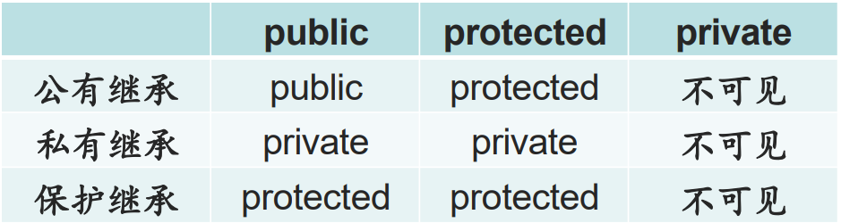

##### 派生类的构造函数

- ==在创建派生类时, 需要调用基类的构造函数==

  - 初始化派生类对象中从基类继承的成员

  - 在执行派生类的构造函数之前, 总是先执行基类的构造函数

- 调用基类构造函数的两种方式 : 

  - **显式方式:**在派生类的构造函数中, 为基类构造函数提供参数 

    - ```c++
      derived::derived(arg_derived-list):base(arg_base-list) 
      ```

  - **隐式方式:**在派生类的构造函数中, 省略基类构造函数时, 派生类的构造函数则自动调用基类的默认构造函数

- 派生类的析构函数被执行时, 执行完派生类的析构函数后, 自动调用基类的析构函数


```c++
#include <iostream>
using namespace std;

class Base {
public:
    int n;
    Base(int i) : n(i) {
        cout << "Base " << n << " constructed" << endl;
    }
    ~Base() {
        cout << "Base " << n << " destructed" << endl;
    }
};

class Derived : public Base {
public:
    Derived(int i) : Base(i) {
        cout << "Derived constructed" << endl;
    }
    ~Derived() {
        cout << "Derived destructed" << endl;
    }
};

int main() {
    Derived Obj(3);
    return 0;
}
```

> ```
> // 构造函数的调用顺序是从基类到派生类，而析构函数的调用顺序是相反的，从派生类到基类。
> Base 3 constructed
> Derived constructed
> Derived destructed
> Base 3 destructed
> ```

```c++
#include <iostream>
using namespace std;

class Bug {
public:
    int nLegs;
    int nColor;
    Bug(int legs, int color) : nLegs(legs), nColor(color) {
        // 构造 Bug
    }
};

class Skill {
public:
    Skill(int n) {
        // 构造 Skill，这里假设 Skill 类的构造函数没有输出
    }
};

class FlyBug : public Bug {
    int nWings;
    Skill sk1, sk2;
public:
    FlyBug(int legs, int color, int wings);
};

FlyBug::FlyBug(int legs, int color, int wings) : 
    Bug(legs, color), sk1(5), sk2(color), nWings(wings) {
    // 构造 FlyBug
}

int main() {
    FlyBug fb(6, 4, 2); // 假设 Bug 有 6 条腿，颜色为 4，翅膀数为 2
    return 0;
}
```

> 请注意，`FlyBug` 构造函数的初始化列表首先调用基类 `Bug` 的构造函数，然后按照它们在类定义中声明的顺序初始化 `sk1` 和 `sk2`。最后，`nWings` 成员变量被初始化。


**总结**

- 创建派生类的对象时, 执行一个派生类的构造函数之前: 
  - 调用基类的构造函数 
  - 初始化派生类对象中从基类继承的成员 
  - 调用成员对象类的构造函数(复合) 
  - 初始化派生类对象中成员对象 
-  派生类析构函数被执行时, 执行完派生类的析构函数后: 
  - 调用成员对象类的析构函数 
  - 调用基类的析构函数
  
##### public继承的赋值兼容规则


-　派生类的对象可以赋值给基类对象
  -　`b = d;`
-　派生类的对象可以初始化基类的引用
  -　`base & br = d;`
-　派生类对象的地址可以赋值给基类地址
  -　`base *pb = & d`
-　如果派生方式是`private`或者`protected`,则以上三条不可行

##### 基类与派生类的指针强制转换

在**公有派生**的情况下,

 - 派生类对象的地址可以直接赋给基类地址
   - `Base * ptrBase = &objDerived;`
   - `ptrBase`指向的是一个`Derived`类的对象
   -  `*ptrBase`可以看作一个`Base`类的对象, 访问它的`public`成员
   - 直接通过`ptrBase`, 不能够访问**objDerived由Derived类拓展的成员**
 - **即便是基类指针指向的是一个派生类的对象,也不能通过基类指针访问基类没有,派生类内有的成员**
 - 通过强制指针类型转换, 可以把`ptrBase`转换成`Derived`类的指针

```c++
Base * ptrBase = &objDerived;
Derived *ptrDerived = (Derived * ) ptrBase;
```

- 程序员要保证`ptrBase`指向的是一个`Derived`类的对象, 否则很容易会出错


```c++
#include <iostream>
using namespace std;
class Base {
	protected:
			int n;
	public:
			Base(int i):n(i) {
		cout << "Base " << n <<" constructed" << endl;
	}
	~Base() {
		cout << "Base " << n <<" destructed" << endl;
	}
	void Print() {
		cout << "Base:n=" << n << endl;
	}
}
;
class Derived:public Base {
	public:
			int v;
	Derived(int i):Base(i), v(2 * i) {
		cout << "Derived constructed" << endl;
	}
	~Derived() {
		cout << "Derived destructed" << endl;
	}
	void Func() {
	}
	;
	void Print() {
		cout << "Derived:v=" << v << endl;
		cout << "Derived:n=" << n << endl;
	}
}
;
int main() {
	Base objBase(5);
	Derived objDerived(3);
	Base * pBase = & objDerived ;
	// pBase->Func(); //error:Base类中没有Func成员函数
	// pBase->v = 5; // error:Base类内没有v成员变量
	pBase->Print();
	// Derived * pDerived = & objBase; //error
	Derived * pDerived = (Derived *)(& objBase); // 强制类型转换
	pDerived->Print(); // 这里可能会产生未定义的行为
	pDerived->v = 128; // 这里可能会产生未定义的行为
	objDerived.Print();
	return 0;
}
```


##### 直接基类和间接基类

在继承关系中,有直接基类和间接基类的概念。

1. 类的继承关系:
   - 类A派生类B,类B可再派生类C,类C派生类D,以此类推。
   - 在这个继承关系中,类A是最顶层的基类,其他类都直接或间接地继承自类A。

2. 直接基类和间接基类:
   - 类A是类B的直接基类,因为类B直接从类A派生而来。
   - 类B是类C的直接基类,类A是类C的间接基类。类C直接从类B派生,而类B又继承自类A,因此类A是类C的间接基类。
   - 类C是类D的直接基类,类A和类B是类D的间接基类。类D直接从类C派生,而类C继承自类B,类B又继承自类A,因此类A和类B都是类D的间接基类。

3. 声明派生类:
   - **在声明派生类时,派生类的首部只需要列出它的直接基类,不需要显式列出所有的间接基类。**
   - 派生类会沿着类的层次自动向上继承它的所有间接基类。

4. 派生类的成员:
   - **派生类的成员包括派生类自己定义的成员、直接基类中定义的成员以及所有间接基类的全部成员。**
   - 当派生类继承自基类时,它会自动获得基类中定义的所有成员(包括成员变量和成员函数),无需在派生类中重新定义这些成员。
   - 派生类可以访问和使用它继承的所有成员,包括直接基类和间接基类的成员。

5. 继承的好处:
   - 继承提供了一种模块化和层次化的方式来组织和设计类。
   - 通过继承,可以避免代码的重复编写,提高代码的复用性。
   - 继承允许派生类在继承基类成员的同时,添加或修改自己特有的成员,实现对基类功能的扩展和专门化。
   - **继承体现了"IS-A"的关系,即派生类是基类的一种特殊形式,符合现实世界中事物的层次结构和分类。**

6. 继承的注意事项:
   - 在设计类的继承关系时,要合理地选择基类和派生类,确保它们之间存在合适的"IS-A"关系。
   - **派生类不能直接访问基类中声明为private的成员,但可以通过基类提供的公共接口来间接访问。**
   - 在派生类中,可以重新定义(override)基类中的虚函数,以实现多态性。
   - 在某些情况下,过度使用继承可能导致类层次结构变得复杂和难以维护,因此要适度使用继承,并考虑其他设计模式和组合的方式。

#### *多继承*

多继承是指一个类可以同时继承多个基类的成员。在C++中,多继承通过在类的定义中列出多个基类来实现。下面我将通过一个具体的代码例子来详细介绍多继承的实现和相关细节。

```cpp
#include <iostream>
using namespace std;

// 基类1: Shape
class Shape {
protected:
    int width;
    int height;
public:
    Shape(int w, int h) : width(w), height(h)
    virtual int getArea() = 0;
};

// 基类2: Color
class Color {
protected:
    string color;
public:
    Color(string c) : color(c)
    void printColor() {
        cout << "Color: " << color << endl;
    }
};

// 派生类: Rectangle, 继承自Shape和Color
class Rectangle : public Shape, public Color {
public:
    Rectangle(int w, int h, string c) : Shape(w, h), Color(c)
    int getArea() override {
        return width * height;
    }
};

int main() {
    Rectangle rect(5, 3, "Red");
    rect.printColor();
    cout << "Area: " << rect.getArea() << endl;
    return 0;
}
```

在上述代码中:

1. 定义了两个基类:Shape和Color。
   - Shape类表示形状,有protected成员变量width和height表示宽度和高度,以及一个纯虚函数getArea()用于计算面积。
   - Color类表示颜色,有protected成员变量color表示颜色,以及一个成员函数printColor()用于打印颜色。

2. 定义了一个派生类Rectangle,它同时继承自Shape类和Color类。
   - Rectangle类的构造函数接受宽度、高度和颜色作为参数,并分别调用Shape和Color的构造函数进行初始化。
   - Rectangle类重写了getArea()函数,用于计算矩形的面积。

3. 在main()函数中,创建了一个Rectangle对象rect,并调用了它继承自Color类的printColor()函数和重写的getArea()函数。

多继承的一些细节:

1. 构造函数的调用顺序:
   - 当创建派生类对象时,首先调用基类的构造函数,然后调用派生类自己的构造函数。
   - **如果有多个基类,则按照它们在派生类定义中的顺序依次调用基类的构造函数。**
   - 在上述代码中,Rectangle类的构造函数先调用Shape类的构造函数,再调用Color类的构造函数,最后执行自己的构造函数体。

2. 名字冲突的解决:
   - 当派生类继承的多个基类中具有同名的成员时,会产生名字冲突。
   - **可以使用作用域解析运算符::来指定访问哪个基类的成员。**
   - 例如,如果Shape类和Color类都有一个名为print()的成员函数,在Rectangle类中可以通过Shape::print()和Color::print()来区分调用哪个基类的函数。

3. 虚继承:
   - 当多个派生类继承同一个基类时,如果该基类又是另一个类的派生类,就会产生重复继承的问题,导致派生类中包含多份基类的成员。
   
   - 通过**虚继承**可以解决这个问题。在继承基类时使用关键字virtual,表示虚继承。
   
   - 虚继承确保在派生类中只保留一份基类的成员,避免了重复继承的问题。
   
     下面是一个虚继承的示例:
   
     ```cpp
     class Base {
     protected:
         int data;
     public:
         Base(int d) : data(d)
         void print() {
             cout << "Base data: " << data << endl;
         }
     };
     
     class Derived1 : virtual public Base {
     public:
         Derived1(int d) : Base(d)
     };
     
     class Derived2 : virtual public Base {
     public:
         Derived2(int d) : Base(d)
     };
     
     class MultiDerived : public Derived1, public Derived2 {
     public:
         MultiDerived(int d) : Derived1(d), Derived2(d), Base(d)
     };
     ```
   
     在上述代码中:
     - Base类是基类,Derived1和Derived2都虚继承自Base类。
     - MultiDerived类继承自Derived1和Derived2,但是由于Derived1和Derived2都虚继承自Base类,因此MultiDerived类中只包含一份Base类的成员。
   
     4. 多重继承的菱形继承问题:
        - 多重继承可能导致菱形继承问题,即多个派生类继承同一个基类,而这些派生类又被一个类同时继承。
        - 菱形继承会导致基类的成员在派生类中出现多份,引起二义性和数据冗余。
        - 虚继承可以解决菱形继承问题,确保在最终的派生类中只保留一份基类的成员。
   
     5. 多继承的使用场景:
        - 多继承适用于一个类需要同时具有多个类的特性和行为的情况。
        - 例如,在图形库中,可以将形状和颜色分别作为基类,然后派生出具有形状和颜色属性的各种具体图形类。
        - 多继承可以实现类的组合和功能的复用,提高代码的模块化和可维护性。
   
     6. 多继承的缺点:
        - 多继承可能导致类层次结构变得复杂,增加了代码的理解和维护难度。
        - 多继承可能引入名字冲突和二义性问题,需要额外的措施来解决。
        - 过度使用多继承可能违反单一职责原则,使类的职责变得混乱。
   
     7. 虚基类和虚函数:
        - 虚基类是通过虚继承继承而来的基类,用于解决多重继承的菱形继承问题。
        - 虚函数是在基类中声明为virtual的成员函数,允许在派生类中进行重写,实现多态性。
        - 虚基类和虚函数是不同的概念,虚基类解决的是多重继承的问题,而虚函数解决的是多态性的问题。
   
     总之,多继承是C++中一个强大但复杂的特性。它允许一个类同时继承多个基类的成员,实现了类的组合和功能的复用。但是,多继承也带来了一些问题,如名字冲突、菱形继承等,需要谨慎使用。通过虚继承可以解决多重继承的一些问题,但过度使用多继承仍然可能导致代码的复杂性增加。在实践中,应根据具体的需求和设计原则来决定是否使用多继承,并采取适当的措施来处理多继承可能带来的问题。
   
     以下是一个更复杂的多继承示例,展示了如何处理名字冲突和菱形继承问题:
   
     ```cpp
     #include <iostream>
     using namespace std;
     
     class Animal {
     protected:
         string name;
     public:
         Animal(string n) : name(n)
         virtual void speak() = 0;
     };
     
     class Mammal : virtual public Animal {
     protected:
         int numLegs;
     public:
         Mammal(string n, int legs) : Animal(n), numLegs(legs)
         void speak() override {
             cout << "Mammal speaks." << endl;
         }
     };
     
     class Flyable {
     public:
         virtual void fly() = 0;
     };
     
     class Bat : public Mammal, public Flyable {
     public:
         Bat(string n) : Mammal(n, 2), Animal(n)
         void speak() override {
             cout << "Bat speaks." << endl;
         }
         void fly() override {
             cout << "Bat flies." << endl;
         }
     };
     
     class Dolphin : public Mammal {
     public:
         Dolphin(string n) : Mammal(n, 0), Animal(n)
         void speak() override {
             cout << "Dolphin speaks." << endl;
         }
     };
     
     int main() {
         Bat bat("Batty");
         Dolphin dolphin("Flipper");
     
         bat.speak();
         bat.fly();
     
         dolphin.speak();
     
         Animal* animals[] = {&bat, &dolphin};
         for (Animal* animal : animals) {
             animal->speak();
         }
     
         return 0;
     }
     ```
   
     在上述代码中:
   
     1. Animal类是一个抽象基类,表示动物,有一个纯虚函数speak()表示动物的叫声。
   
     2. Mammal类继承自Animal类,表示哺乳动物,添加了numLegs成员变量表示腿的数量,并重写了speak()函数。
   
     3. Flyable类是一个接口类,表示可飞行的能力,有一个纯虚函数fly()表示飞行。
   
     4. Bat类同时继承自Mammal类和Flyable类,表示蝙蝠,重写了speak()和fly()函数。
   
     5. Dolphin类继承自Mammal类,表示海豚,重写了speak()函数。
   
     6. 在Bat和Dolphin类的构造函数中,需要显式调用Animal类的构造函数,以解决菱形继承问题。
   
     7. 在main()函数中,创建了Bat和Dolphin对象,并分别调用它们的speak()和fly()函数。
   
     8. 通过将Bat和Dolphin对象的指针存储在Animal*类型的数组中,可以实现多态调用speak()函数。
   
     这个示例展示了多继承的一些常见用法,包括:
   
     - 通过虚继承解决菱形继承问题。
     - 通过重写虚函数实现多态性。
     - 使用接口类(Flyable)来表示一种能力或行为。
     - 在派生类的构造函数中显式调用虚基类的构造函数。
   
     多继承是一个强大的工具,但也带来了复杂性。在设计类层次结构时,需要仔细考虑类之间的关系,权衡多继承的必要性和可能带来的问题。合理运用多继承可以提高代码的复用性和灵活性,但过度使用可能导致代码的可读性和可维护性下降。因此,在实践中,应根据具体情况谨慎使用多继承,并遵循良好的设计原则

### 多态和虚函数

#### 虚函数和多态

##### 虚函数

- 在类的定义中，前面有 `virtual` 关键字的成员函数就是虚函数
- `virtual` 关键字只用在类定义里的函数声明中，写函数体时不用


##### 多态

> 根据**指针,引用**指向的对象类型来使用对应的**函数**

- 派生类的指针可以赋给基类**指针**。 
- 通过基类指针调用基类和派生类中的同名同参虚函数时: 
  - （1）若该指针指向一个基类的对象，那么被调用是基类的虚函数； 
  - （2）若该指针指向一个派生类的对象，那么被调用的是派生类的虚函数。 
- 这种机制就叫做**多态**

```c++
class CBase {
	public:
	virtual void SomeVirtualFunction() {
	}
}
;
class CDerived:public CBase {
	public :
	virtual void SomeVirtualFunction() {
	}
}
;
int main() {
	CDerived ODerived;
	CBase * p = & ODerived;
	p -> SomeVirtualFunction();
	//调用哪个虚函数取决于p指向哪种类型的对象
	return 0;
}
```

- 派生类的对象可以赋给基类**引用 **
- 通过基类引用调用基类和派生类中的同名同参虚函数时: 
  - （1）若该引用引用的是一个基类的对象，那么被调用是基 类的虚函数；
  -  （2）若该引用引用的是一个派生类的对象，那么被调用的 是派生类的虚函数。
-  这种机制也叫做“多态”

```c++
class CBase {
	public:
	virtual void SomeVirtualFunction() {
	}
}
;
class CDerived:public CBase {
	public :
	virtual void SomeVirtualFunction() {
	}
}
;
int main() {
	CDerived ODerived;
	CBase & r = ODerived;
	r.SomeVirtualFunction();
	//调用哪个虚函数取决于r引用哪种类型的对象
	return 0;
}
```

**作用:**

- 在面向对象的程序设计中使用多态，能够增强**程序的可扩充性**，即程序需要修改或增加功能 的时候，需要改动和增加的代码较少.
- 用基类指针数组存放指向各种派生类对象的指针，然后遍历该数组，就能对各个派生类对象做各种操作，是很常用的做法

**注意：**

- **在非构造函数，非析构函数的成员 函数中调用虚函数，是多态**
- 在构造函数和析构函数中调用虚函数，不是多态。
  -  编译时即可确定，调用的函数是自己的类或基类中定义的函数，不会等到运行时才决定调用自己的还是派生类的函数.
- 派生类中和基类中虚函数同名同参数表的函数，不加virtual也自动成为虚函数(但是最好写上)

#### 多态的实现原理

“多态”的关键在于通过基类指针或引用调用一个虚函数时，编译时不确定到底调用的是基类还是派 生类的函数，运行时才确定 ---- 这叫**“动态联编” **（dynamic binding）。

> 　动态联编(dynamic binding),也称为动态绑定或运行时多态(runtime polymorphism),是实现多态的关键机制之一。它允许在运行时根据对象的实际类型来确定调用哪个版本的虚函数,而不是在编译时静态确定。
>
> 动态联编的实现方法通常依赖于虚函数表(virtual function table,简称vtable)。**每个包含虚函数的类都有一个与之相关的虚函数表,该表存储了类的虚函数的地址。**当通过基类指针或引用调用虚函数时,程序会在运行时查找对象的虚函数表,并调用相应的函数实现。
>
> 下面我将详细介绍动态联编的实现方法和应用:
>
> 1. 虚函数表(vtable)的创建:
>    - 当一个类包含虚函数时,编译器会为该类生成一个虚函数表。
>    - **虚函数表是一个函数指针数组,其中存储了类的虚函数的地址。**
>    - **每个包含虚函数的类都有自己的虚函数表,派生类的虚函数表中包含了基类虚函数的地址和派生类重写的虚函数的地址。**
>
> 2. 对象的内存布局:
>    - 当创建一个包含虚函数的类的对象时,对象的内存布局中会包含一个指向虚函数表的指针(vptr)。
>    - 该指针通常位于对象的内存布局的开始位置,指向该对象所属类的虚函数表。
>    - 通过对象的虚函数表指针,可以访问到该对象的虚函数表,从而确定调用哪个版本的虚函数。
>
> 3. 通过基类指针或引用调用虚函数:
>    - 当通过基类指针或引用调用虚函数时,程序会在运行时根据对象的实际类型来确定调用哪个版本的虚函数。
>    - 具体的过程是:通过基类指针或引用访问对象的虚函数表指针,然后在虚函数表中查找相应的虚函数地址,并调用该函数。
>    - 这个过程在运行时动态进行,因此称为动态联编或动态绑定。
>
> 4. 动态联编的应用:
>    - 动态联编是实现多态的重要机制,它允许在运行时根据对象的实际类型来调用相应的虚函数实现。
>    - 通过动态联编,可以编写通用的代码,使用基类指针或引用来操作不同类型的对象,而无需关心对象的具体类型。
>    - 动态联编提供了一种灵活的设计方式,使得代码更加模块化、可扩展和易于维护。
>
> 下面是一个示例代码,演示了动态联编的应用:
>
> ```cpp
> class Shape {
> 	public:
> 	    virtual double getArea() const = 0;
> }
> ;
> class Circle : public Shape {
> 	public:
> 	    double getArea() const override {
> 		// 计算圆的面积
> 	}
> }
> ;
> class Rectangle : public Shape {
> 	public:
> 	    double getArea() const override {
> 		// 计算矩形的面积
> 	}
> }
> ;
> void printArea(const Shape& shape) {
> 	cout << "Area: " << shape.getArea() << endl;
> }
> int main() {
> 	Circle circle;
> 	Rectangle rectangle;
> 	printArea(circle);
> 	// 动态调用 
> 	Circle::getArea()
> 	printArea(rectangle);
> 	// 动态调用 Rectangle::getArea()
> 	Shape* shapes[] = {
> 		&circle, &rectangle
> 	}
> 	;
> 	for (Shape* shape : shapes) {
> 		cout << "Area: " << shape->getArea() << endl;
> 		// 动态调用相应的 getArea() 实现
> 	}
> 	return 0;
> }


在上述代码中:

- Shape类是一个抽象基类,包含一个纯虚函数getArea(),用于计算图形的面积。

- Circle类和Rectangle类继承自Shape类,并重写了getArea()函数,分别提供了计算圆面积和矩形面积的实现。

- printArea()函数接受一个Shape的引用,并调用其getArea()函数。由于Shape类中的getArea()是虚函数,所以在运行时会根据实际传入的对象类型来调用相应的getArea()实现。

- 在main()函数中,通过printArea()函数分别传入Circle对象和Rectangle对象,实现了动态调用不同类型对象的getArea()函数。

- 此外,通过将Circle对象和Rectangle对象的指针存储在Shape*类型的数组中,可以通过基类指针来访问不同类型对象的getArea()函数,实现了多态性。

动态联编的优点包括:

1. 提供了一种统一的接口:通过基类指针或引用,可以操作不同类型的对象,而无需关心对象的具体类型。

2. 实现了代码的复用:可以编写通用的代码,对不同类型的对象进行相同的操作,减少了代码的重复。

3. 提高了代码的可扩展性:可以在不修改已有代码的情况下,通过添加新的派生类来扩展功能。

4. 增强了代码的可维护性:通过将接口和实现分离,可以独立地修改和测试不同的部分,使得代码更加模块化和易于维护。

需要注意的是,动态联编会带来一定的运行时开销,因为在每次调用虚函数时都需要进行虚函数表的查找和函数地址的跳转。然而,这种开销通常是可以接受的,并且动态联编带来的灵活性和可扩展性的好处远大于其开销。

总之,动态联编是实现多态的关键机制,它允许在运行时根据对象的实际类型来确定调用哪个版本的虚函数。通过虚函数表和对象的内存布局,动态联编实现了在编译时不确定具体调用哪个函数,而在运行时动态确定的功能。动态联编提供了一种灵活、可扩展和易于维护的设计方式,是面向对象编程中实现多态的重要手段。

#### 虚析构函数

- 通过基类的指针删除派生类对象时，通常情况下只调用基类的析构函数 
-  但是，删除一个派生类的对象时，应该先调用派生类的析构函数，然后调用基类的析构函数。(符合一般的逻辑) 
- 解决办法：把基类的析构函数声明为virtual 
-  派生类的析构函数可以virtual不进行声明(会被自动声明)
-  通过基类的指针删除派生类对象时，首先调用派生类的析构函数，然后调用基类的析构函数 
- 一般来说，一个类如果定义了虚函数，则应该将析构函数也定义成虚函数。或者，一个类打算作为基类使用， 也应该将析构函数定义成虚函数。 
-  **注意：不允许以虚函数作为构造函数**

####  纯虚函数和抽象类 

  **纯虚函数**:没有函数体的虚函数,一般在函数体之后加上`=0`

- 包含纯虚函数的类叫抽象类 

- **抽象类只能作为基类来派生新类使用，不能创建抽象类的对象**

- **抽象类的指针和引用可以指向由抽象类派生出来的类的对象 **

   ```c++
   A a ; // 错，A 是抽象类，不能创建对象
   A * pa ; // ok,可以定义抽象类的指针和引用
   pa = new A ; //错误, A 是抽象类，不能创建对象
   ```

  

- 在抽象类的成员函数内可以调用纯虚函数，但是在构造 函数或析构函数内部不能调用纯虚函数。
-  如果一个类从抽象类派生而来，那么当且仅当它实现了 基类中的所有纯虚函数，它才能成为非抽象类

#### 访问机制对比


**总结**

- 虚函数和多态

  - 虚函数的调用规则：根据指向的对象确定
  - 多态的作用：可扩展
  - 多态的实现：虚函数表

- 虚函数的应用

  - 虚函数的访问权限：基类虚函数应为public

  - 纯虚函数和抽象类：抽象类不能生成对象
  - 成员函数中调用虚函数：只有在普通成员函数中调用虚函数才是动态联编

  - 虛析构函数：**定义虚函数的类析构函数应为virtual**
  - 不允许以虚函数作为构造函数


## 输入输出和文件操作

### 输入输出相关的类

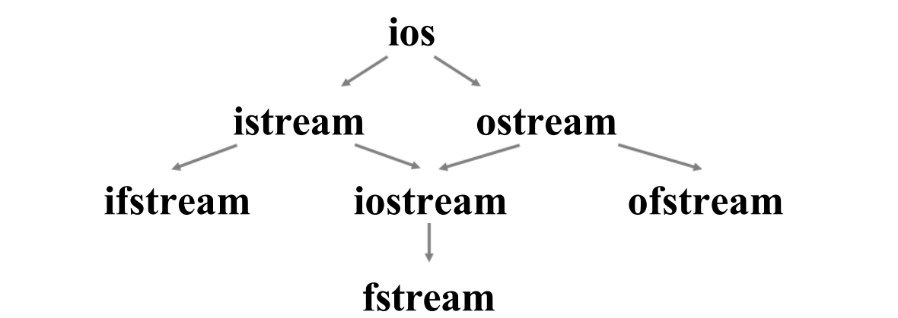

- `ios` 是基础的输入输出流类。
- `istream` 是用于输入操作的类，`cin` 是其实例，用于标准输入。
- `ostream` 是用于输出操作的类，`cout` 是其实例，用于标准输出。
- `iostream` 是既能用于输入又能用于输出的类。
- `ifstream` 是用于从文件读取数据的类。
- `ofstream` 是用于向文件写入数据的类。
- `fstream` 是既能从文件读取数据又能向文件写入数据的类。

#### 标准流对象

> 重定向: 将输入的源或输出的目的地改变

- 输入流对象
  - **cin ==> 与标准输入设备相连 **
    - cin 对应于标准输入流, 用于从键盘读取数据, 也可以被**重定向**为从文件中读取数据
- 输出流对象
  - **cout ==>与标准输出设备相连**
    - cout 对应于标准输出流, 用于向屏幕输出数据, 也可以被**重定向**为从文件中写入数据
  - **cerr ==>与标准错误输出设备相连**
    - cerr不使用缓冲区, 直接向显示器输出信息
  - **clog ==> 与标准错误输出设备相连**
    - 输出到clog中的信息先会被存放在缓冲区, 缓冲区满或者刷 新时才输出到屏幕

> ***
>
> 在C++中，标准错误输出设备是用于输出错误信息的流对象，与标准输出流（用于常规输出）分开，使得错误信息可以被单独捕获或重定向。标准错误输出在C++中通过预定义对象 `std::cerr` 表示。`std::cerr` 是 `std::ostream` 类的一个实例，不经过缓冲，直接向错误输出设备输出信息，这意味着一旦通过 `std::cerr` 输出信息，该信息会立即显示在错误输出设备上，通常是终端或命令行界面。
>
> 使用 `std::cerr` 输出错误信息的一个优点是它可以帮助开发者将应用程序的正常输出和错误信息分开，使得错误处理更加清晰。例如，当你的程序需要同时向标准输出写信息和处理潜在的错误时，你可以使用 `std::cout` 输出正常的程序信息，而使用 `std::cerr` 输出错误或警告信息，这样就可以很容易地将两者区分开来，也便于通过重定向将错误信息单独保存到文件中，进行日志记录或后续分析。
>
> 简单示例：
> ```cpp
> #include <iostream>
> 
> int main() {
>     std::cout << "这是一个正常的消息" << std::endl;
>     std::cerr << "这是一个错误消息" << std::endl;
>     return 0;
> }
> ```
> 在这个例子中，正常消息通过 `std::cout` 输出，而错误消息通过 `std::cerr` 输出，它们可以被分别处理或重定向到不同的输出设备或文件中。
>
> ***
>
> 在C++中，`std::clog` 是另一个标准输出流对象，类似于 `std::cout`，但它主要用于输出日志信息。`std::clog` 是 `std::ostream` 类的一个实例，与 `std::cout`（标准输出流）和 `std::cerr`（标准错误输出流）一样，是预定义的对象。不同于 `std::cerr`，`std::clog` 的输出是缓冲的，这意味着写入到 `std::clog` 的信息可能不会立即出现在目标设备上；它们会存储在缓冲区中，直到缓冲区被刷新（例如，程序结束，或显式调用刷新操作）。
>
> 使用 `std::clog` 的主要场景是记录程序的运行信息，特别是那些不是直接的错误报告，而是诊断信息或其他日志数据。与 `std::cerr` 不同的是，`std::clog` 提供了一种区分普通输出和错误输出之外的方式，用于输出那些可能对最终用户不是立即必要的信息。
>
> 使用 `std::clog` 非常简单，就像使用 `std::cout` 或 `std::cerr` 一样。你只需要包含 `<iostream>` 头文件，并使用 `std::clog` 流对象进行输出。
>
> ```cpp
> #include <iostream>
> 
> int main() {
>     std::clog << "这是一条日志信息" << std::endl;
>     return 0;
> }
> ```
>
> 在这个例子中，一条日志信息通过 `std::clog` 输出。由于 `std::clog` 是缓冲的，所以在某些情况下，如果你想立即看到输出（不等到程序结束或缓冲区满），你可以手动刷新缓冲区，如下：
>
> ```cpp
> std::clog << "这是一条立即需要查看的日志信息" << std::flush;
> ```
>
> 使用 `std::flush` 可以强制刷新缓冲区，使得所有待输出的信息立即被写出到目标设备上。
>
> 总的来说，`std::clog` 提供了一个便利的方式来输出那些对程序的正常操作和错误处理之外的额外信息，帮助开发者更好地监控和调试程序的行为。
>
> ***

#### 判断输入流结束

- ```c++
  int x; while(cin>>x){...}
  // 这里的原理是在istream或其基类中重载了operator bool
  #include <iostream>
  using namespace std;
  class MyCin {
    bool bStop;
  
  public:
    MyCin() : bStop(false) {}
    operator bool() { // 重载类型强制转换运算符bool
      return !bStop;
    }
    MyCin &operator>>(int &n) {
      cin >> n;
      if (n == 100)
        bStop = true;
      return *this;
    }
  };
  ```

- 如果从键盘输入, 则在单独一行输入`Ctrl+Z`代表输入流结束

-  如果从文件输入, 例如前面有下列代码,读到文件尾部, 输入流就算结束

  ```c++
  freopen("some.txt", "r", stdin); 
  ```

#### istream类的成员函数

  ```c++
  istream &getline(char *buf, int bufSize);
  // 从输入流中读取 (bufSize-1)个字符到缓冲区, 或读到 '\n' 为止 (哪个先到算哪个)
  istream &getline(char *buf, int bufSize, char delim);
  // 从输入流中读取 (bufSize-1) 个字符到缓冲区, 或读到delim为止
  ```

- 区别和联系
  - **两个函数都会自动在缓冲区中读入数据的结尾添加`\0` **(针对c风格字符串)
  - ` \n `或 `delim`都不会被读入缓冲区, 但会被从输入流中取走 
  - 如果输入流 `\n`或`delim` 之前的字符个数超过了`bufSize`个, 就导致读入出错, 其结果就是: 本次读入已经完成, 但之后的读入就都会失败
- 可以用`if(!cin.getline(...))`判断输入是否结束

> `std::istream` 类是 C++ 标准库中用于输入的基础类，它提供了一系列的成员函数用于从输入流中读取数据。`std::istream` 类与其他输入流如 `std::ifstream`（从文件读取数据）和 `std::istringstream`（从 `string` 读取数据）共享接口。这里介绍一些常用的 `std::istream` 成员函数及其使用方法：
>
> ### 常用成员函数
>
> - **operator>>**：重载的输入运算符，用于从流中提取数据到给定变量。这个操作会根据提供的变量类型自动调整，以适应不同数据类型的输入。
>   ```cpp
>   int x;
>   std::cin >> x; // 从标准输入读取一个整数
>   ```
>
> - **get()**：有几个重载版本，可以用来从输入流中读取单个字符。
>   ```cpp
>   char c;
>   c = std::cin.get(); // 读取单个字符
>   ```
>
> - **getline()**：从输入流中读取一行数据直到遇到换行符（默认是`\n`），并将其存储到提供的字符串变量中，但不包括换行符。
>   ```cpp
>   char str[256];
>   std::cin.getline(str, 256); // 从标准输入读取一行，最多255字符
>                                                                                   
>   std::string str;
>   std::getline(std::cin, str); // 使用 string 类版本
>   ```
>
> - **read()**：从输入流中读取指定数量的字符到一个字符数组中。
>   ```cpp
>   char buffer[100];
>   std::cin.read(buffer, 100); // 读取100个字符
>   ```
>
> - **ignore()**：忽略输入流中的字符，可以指定忽略的字符数以及终止字符。
>   ```cpp
>   std::cin.ignore(1000, '\n'); // 忽略直到遇到下一个换行符，最多忽略1000个字符
>   ```
>
> - **peek()**：返回输入流中下一个字符的副本，但不从流中消耗它。
>   ```cpp
>   char next = std::cin.peek(); // 查看下一个字符是什么
>   ```
>
> - **eof()**：检查输入流是否到达了文件末尾（End Of File）。
>   ```cpp
>   if (std::cin.eof()) {
>     // 到达文件末尾
>   }
>   ```
>
> - **fail()**：检查在上一次输入操作后流是否处于失败状态。
>   ```cpp
>   if (std::cin.fail()) {
>     // 输入操作失败
>   }
>   ```
>
> - **clear()**：用于清除输入流的状态标志，使其回到可用状态。
>   ```cpp
>   std::cin.clear(); // 清除所有错误标志
>   ```
>
> ### 使用方法
>
> 使用 `std::istream` 类（或其派生类）时，通常涉及到从流中读取数据。一般来说，这些操作都是直观的，通过操作符或成员函数调用实现。下面是一个简单的使用示例，展示了如何从标准输入读取数据：
>
> ```cpp
> #include <iostream>
> #include <string>
> 
> int main() {
>     std::string line;
>     int number;
> 
>     std::cout << "请输入一个数字和一行文本：\n";
> 
>     std::cin >> number; // 使用 operator>> 读取数字
>     std::cin.ignore(); // 忽略数字后的换行符
>     std::getline(std::cin, line); // 使用 getline 读取一行
> 
>     std::cout << "您输入的数字是：" << number << "\n";
>     std::cout << "您输入的文本是：" << line << std::endl;
> 
>     return 0;
> }
> ```
>
> 这个例子展示了如何组合使用 `std::istream` 的不同成员函数来从标准输入中读取不同类型的数据。

```c++
#include <iostream>
using namespace std;
int main() {
  int x, y;
  cin >> x >> y;
  freopen("test. txt", "w", stdout);
  // 将标准输出重定向到 test.txt 文件
  if (y == 0) // 除数为 0则在屏幕上输出错误信息
    cerr << "error." << endl;
  else
    cout << x / y; // 输出结果到 test.txt
  return 0;
}
```

```c++
#include <iostream>
using namespace std;
int main() {
  double f;
  int n;
  freopen("test. txt", "r", stdin);
  // cin被改为从test.txt中读取数据
  cin >> f >> n;
  cout << f << ',' << n << endl;
  return 0;
}
```

### 流操作算子

**需要使用`#include<iomanip>`**

- 整数流的基数： `dec`,`oct`, `hex`, `setbase` 

  ```c++
  int n = 10;
  cout << n << endl;
  cout << hex << n << “\n” // 十六进制
  << dec << n << “\n” // 十进制
  << oct << n << endl; // 八进制
  ```

- 浮点数的精度(`precision`, `setprecision`)

  - precision是成员函数 , 其调用方式为：` cin.precision(5); `
  - setprecision 是**流操作算子 **, 其调用方式为：` cin >> setprecision(5); `(可以连续输入)
  -  功能相同：
    -  指定输出浮点数的有效位数（非定点方式输出时）
    - 指定输出浮点数的小数点后的有效位数（定点方式输出时）
  -  **定点方式: 小数点必须出现在个位数后面**

  ```c++
  #include <iomanip>
  #include <iostream>
  
  using namespace std;
  int main() {
    double x = 1234567.89, y = 12.34567;
    int n = 1234567;
    int m = 12;
    cout << setprecision(6) << x << endl << y << endl << n << endl << m;
  }
  ```

  ```
  1.23457e+06
  12.3457
  1234567
  12
  ```

  > Q: 为什么x会以科学计数法输出?
  >
  > 在您的代码中，使用 `setprecision(6)` 会设置输出的浮点数精度为6位。但是，这并不会影响浮点数的显示格式，因为 `setprecision` 主要影响的是浮点数的小数位数，而不是它们的显示格式。
  >
  > 当输出一个浮点数时，如果其值过大或过小，C++ 会使用科学计数法来表示，以提高可读性。在您的代码中，变量 `x` 的值为 `1234567.89`，这个值比较大，因此会以科学计数法的方式输出。
  >
  > 如果您希望禁止使用科学计数法输出 `x`，您可以使用 `std::fixed` 操纵符来取消科学计数法的显示：
  >
  > ```cpp
  > cout << setprecision(6) << fixed << x << endl << y << endl << n << endl << m;
  > ```
  >
  > 通过添加 `fixed`，您可以确保 `x` 以固定的小数位数形式输出，而不是科学计数法。

  - 流格式操纵算子`setiosflags `
    - `setiosflags(ios::fixed)` 用定点方式表示实数
    - `seiosflags(ios::scientific)` 用指数方式表示实数
    - `setiosflags(ios::fixed)` 可以和` setprecision(n) `合用**控制小数点右边的数字个数** 
    - `seiosflags(ios::scientific)`可以和 `setprecision(n) `合用**控制指数表示法的小数位数 **
  - 在用浮点表示的输出中, `setprecision(n)`表示 有效位数
  - 在用定点/指数表示的输出中, `setprecision(n)`表示小数位数
  - 小数位数截短显示时, 进行**四舍五入**处理(**回忆整数除法,直接截断不四舍五入**)

  ```c++
  #include <iomanip>
  #include <iostream>
  
  using namespace std;
  int main() {
    double x = 1234567.89, y = 12.34567;
    int n = 1234567;
    int m = 12;
    cout << setiosflags(ios::fixed) << setprecision(6) << x << endl
         << y << endl
         << n << endl
         << m;
      cout << setiosflags(ios::fixed) << setprecision(6) << x << endl
       << resetiosflags(ios::fixed) << x;　//取消以小数点为hi固定的方式输出
  }
  ```

  > 　您可以使用`std::fixed`来简写`std::setiosflags(std::ios::fixed)`。
  >
  > 在C++中,`std::fixed`是一个操纵器(manipulator),它的作用与`std::setiosflags(std::ios::fixed)`相同,都是将浮点数的输出格式设置为定点表示法。
  >
  > 例如:
  >
  > ```cpp
  > #include <iostream>
  > #include <iomanip>
  > 
  > int main() {
  >     double x = 3.14159;
  > 
  >     std::cout << std::fixed << x << std::endl;
  >     // 等同于
  >     // std::cout << std::setiosflags(std::ios::fixed) << x << std::endl;
  > 
  >     return 0;
  > }
  > ```
  >
  > 输出结果:
  > ```
  > 3.141590
  > ```
  >
  > 使用`std::fixed`可以让代码更加简洁易读。需要注意的是,`std::fixed`是在`<iomanip>`头文件中定义的,所以在使用时需要包含该头文件。

- 设置域宽(`setw`, `width`) 

  - 设置域宽 (setw, width) 两者功能相同, 一个是流操作算子, 另一个是成员函数,调用方式不同
  -  cin >> setw(5); 或者 cin.width(5); 
  - cout << setw(5); 或者 cout.width(5);
  - **不含参数**的width函数将输出当前域宽
  - 输入操作提取**字符串**的最大宽度比定义的域宽小1,因为在输入的字符串后面必须加上一个'\0'
  - 需要注意的是在**每次**读入和输出之前都要设置宽度

  > 　设置域宽(`setw`, `width`)需要在每次读入和输出之前都设置宽度的原因如下:
  >
  > 1. `setw`操纵符只影响紧随其后的输出项,在输出该项后,`setw`的效果就会消失,即域宽会恢复为默认值。因此,如果想对多个输出项都应用相同的域宽,就需要在每个输出项之前都使用`setw`。
  >
  > 2. 类似地,对于输入操作,`setw`也只影响紧随其后的输入项。在读入该项后,`setw`的效果同样会消失。如果想对多个输入项都应用相同的域宽,同样需要在每个输入项之前都使用`setw`。
  >
  > 3. `setw`操纵符并不会影响实际的输入输出数据,它只是告诉输入输出流在读写数据时应该预留多少空间。因此,即使连续使用多个`setw`,也不会影响实际读写的数据内容。
  >
  > 4. **在C++的输入输出流中,每个读写操作都是独立的,不会记住之前的格式设置。因此,如果想要保持一致的格式,就需要在每次读写操作之前都设置一遍格式(包括域宽)。**
  >
  > 总之,由于`setw`操纵符的作用范围仅限于紧随其后的一个输入或输出项,且C++的输入输出流不会记住之前的格式设置,因此需要在每次读入和输出之前都设置域宽,以保证格式的一致性。这可能会导致代码稍微有些冗长,但是可以保证输入输出的格式符合预期。
  >
  > 
  >
  > 对于其他的流操作符,情况也基本类似,但具体影响的范围可能有所不同。下面分别说明一些常见的流操作符:
  >
  > 1. 对于`setprecision`,它的作用是设置浮点数的精度(即输出的总位数或有效数字位数),其影响范围持续到下一次调用`setprecision`为止。因此,如果想对多个浮点数输出应用相同的精度,只需在第一个输出之前设置一次`setprecision`即可。（**即下次重新设定setprecision之前**）
  >
  > 2. 对于`setfill`,它的作用是设置填充字符(默认为空格),其影响范围持续到下一次调用`setfill`为止。因此,如果想对多个输出项应用相同的填充字符,只需在第一个输出之前设置一次`setfill`即可。
  >
  > 3. 对于`setbase`,它的作用是设置整数的进制(如十进制、八进制、十六进制),其影响范围持续到下一次调用`setbase`为止。因此,如果想对多个整数输出应用相同的进制,只需在第一个输出之前设置一次`setbase`即可。
  >
  > 4. 对于`left`, `right`, `internal`等对齐操作符,它们的影响范围持续到下一次调用相关操作符为止。因此,如果想对多个输出项应用相同的对齐方式,只需在第一个输出之前设置一次对齐操作符即可。
  >
  > 5. 对于`boolalpha`和`noboolalpha`,它们的影响范围持续到下一次调用相关操作符为止。因此,如果想对多个布尔值输出应用相同的格式(字符形式或数字形式),只需在第一个输出之前设置一次相关操作符即可。
  >
  > 总的来说,大部分流操作符的影响范围都持续到下一次调用相关操作符为止,而不像`setw`那样只影响紧随其后的一个输入或输出项。这意味着在大多数情况下,不需要在每次输入或输出之前都设置一遍格式,而只需要在需要改变格式的时候设置即可,这可以简化代码并提高可读性。
  >
  > 

- 用户自定义的流操纵算子

```c++
ostream &tab(ostream &output){
	return output<<'\t';
}
cout<<"aa"<<tab<<"bb"<<endl;
```


### 文件读写

- 数据的层次

  - 位 bit
    - 字节 byte
      - 域 / 记录
        - 将所有记录顺序地写入一个文件, 称为**顺序文件**

- 将**顺序文件**看作一个有限字符构成的顺序字符串流, 然后像对 cin / cout 一样的读写

- 建立顺序文件

  - ```c++
    #include <fstream> // 需要包含该头文件
     // 可以直接ofstream创建对象,打开文件
    ofstream outFile("clients.dat", ios::out|ios::binary);
    //也可以先创建ofstream对象, 再用open 打开
    ofstream fout;
    fout.open("test.out", ios::out|ios::binary);
    
    ```

  - ofstream是 fstream中定义的类

  -   outFile 是我们定义的ofstream类的**对象**

  -  "clients.dat" 是将要建立的文件的文件名

  -  ios::out 是打开并建立文件的选项

  ```c++
  // 他们都位于ios命名空间中
  ios::in      // 打开文件用于读取
  ios::out     // 打开文件用于写入
  ios::binary  // 以二进制模式打开文件
  ios::ate     // 打开文件时将文件指针移动到文件末尾
  ios::app     // 追加模式,所有写入都追加到文件末尾
  ios::trunc   // 如果文件已经存在,先删除文件内容,再打开文件
  ios::nocreate// 只打开已经存在的文件,如果文件不存在,打开失败
  ios::noreplace// 只创建不存在的文件,如果文件已经存在,打开失败
  ```

  - 可以使用`|`来组合不同的打开方式
  - 判断文件是否打开成功
    - `if (!fout) { cerr << "File open error!" <<endl;}`(对于operator bool有重载)
  - 文件名可以给出绝对路径, 也可以给相对路径 (推荐)
  - 没有交代路径信息, 就是在当前文件夹下找文件

#### 文件的读写指针

对于输入文件,有一个**读指针**

对于输出文件,有一个**写指针**

对于输入输出文件,有一个**读写指针**

标识文件操作的当前位置, 该指针在哪里, 读写操作就在哪里进行

```c++
ofstream fout("a1.out", ios::ate);
long location = fout.tellp();
// 取得写指针的位置
location = 10L;
fout.seekp(location);
// 将写指针移动到第10个字节处
fout.seekp(location, ios::beg); // 从头数location
fout.seekp(location, ios::cur); // 从当前位置数location
fout.seekp(location, ios::end); // 从尾部数location
// location可以是正数也可以是负数
```

> 　在你提供的代码示例中，`location` 是一个 `long` 类型的变量，用来存储文件中的位置或偏移量。这里，`location` 被用于控制和查询文件写指针的位置，这是通过 `ofstream` 类的成员函数 `seekp` 和 `tellp` 来完成的。在C++标准库中，处理文件输入输出的流类（如 `ifstream`、`ofstream` 和 `fstream`）提供了对文件读写位置进行操作的功能。
>
> ### 文件指针的操作方式
>
> - **`tellp()` 函数**：用于获取当前文件写指针的位置。在这个例子中，`tellp` 被调用后返回的位置值被存储在 `location` 变量中。返回值的类型是 `streampos`，这是表示在文件中位置的类型，但在这个示例中，它被隐式转换为 `long` 类型。
>
> - **`seekp(position)` 函数**：用于将文件的写指针移动到 `position` 指定的位置。`position` 的类型应该是兼容的整数类型或 `streampos` 类型。在这里，`location` 被设置为 `10L`，表示将写指针移动到文件的第10个字节处。
>
> ### `ios::beg`、`ios::cur`、和 `ios::end` 关键字的用法
>
> 这些关键字用于指定 `seekp` 函数中位置的参考点：
>
> - **`ios::beg`**：表示基准位置是文件的开始。当使用 `seekp(location, ios::beg)` 时，写指针被移动到文件开头之后 `location` 个字节的位置。在你的代码示例中，这会将写指针定位到文件的第10个字节（从文件开始计算）。
>
> - **`ios::cur`**：表示基准位置是当前的写指针位置。使用 `seekp(location, ios::cur)` 时，写指针从它当前的位置移动 `location` 个字节。这意味着如果 `location` 是正数，写指针向前移动；如果是负数，向后移动。
>
> - **`ios::end`**：表示基准位置是文件的结尾。使用 `seekp(location, ios::end)` 时，写指针从文件末尾向前或向后移动 `location` 个字节。如果 `location` 是正数，指针向文件末尾之后的位置移动（通常用于增加文件大小）；如果 `location` 是负数，指针向文件内部移动。
>
> 这些操作允许你灵活地在文件中定位，进行读写操作，非常适合于需要随机访问文件内容的场景。

#### 字符文件读写

> 因为文件流也是流, 所以前面讲过的流的成员函数和流操作
>
> **算子也同样适用于文件流 **
>
>  写一个程序, 将文件 in.txt 里面的整数排序后, 输出到out.txt 
>
> 例如： in.txt 的内容为： 1 234 9 45 6 879 2 4 则执行本程序后, 生成的 out.txt 的内容为： 1 2 4 6 9 45 234 879
>
> 假定待排序的数不超过1000个

```c++
#include <algorithm>
#include <fstream>
#include <iostream>

using namespace std;
int aNum[1000];
int main() {
  ifstream srcFile("in.txt", ios::in);
  ofstream destFile("out.txt", ios::out);
  int x;
  int n = 0;
  while (srcFile >> x)
    aNum[n++] = x;
  sort(aNum, aNum + n); // 包含在<algorithm>头文件内部
  for (int i = 0; i < n; i++)
    destFile << aNum[i] << " ";
  destFile.close();
  srcFile.close();
}
```

#### 二进制文件读写

```c++
int x = 10;
fout.seekp(20, ios::beg);
fout.write((char *)(&x), sizeof(int));
fin.seekg(0, ios::beg);
fin.read((char *)(&x), sizeof(int));
```

**二进制文件读写, 直接写二进制数据, 记事本看未必正确 ==> 存在编码方式的问题**

- 因此不能使用cin重定向实现二进制文件的读


> 对于二进制文件的读写,可以使用以下函数和关键字:
>
> 1. `ios::binary`: 这是一个文件打开模式的关键字,表示以二进制模式打开文件。例如:
>
> ```cpp
> std::ofstream outFile("test.bin", ios::out | ios::binary);
> std::ifstream inFile("test.bin", ios::in | ios::binary);
> ```
>
> 2. `write()`: 这是`ostream`类的一个成员函数,用于将数据以二进制形式写入文件。例如:
>
> ```cpp
> int data = 42;
> outFile.write(reinterpret_cast<const char*>(&data), sizeof(data));
> ```
>
> > 　在这个例子中,`outFile.write()`方法使用了`reinterpret_cast`将`&data`转换为`const char*`类型。这是因为`write()`方法需要的参数类型是`const char*`和要写入的字节数。
> >
> > **`reinterpret_cast`是C++中的一种强制类型转换操作符,它允许将任意指针类型转换为其他指针类型,即使这两个指针类型之间没有任何关系。** 
> >
> > **在内存层面上,不同类型的指针实际上并没有区别,它们都是存储一个内存地址。**
> >
> > 需要注意的是,使用`reinterpret_cast`进行类型转换可能会导致未定义行为,因为它仅仅是重新解释指针所指向的内存,而没有进行任何类型检查或转换。
> >
> > 因此,在这个例子中,`reinterpret_cast<const char*>(&data)`将`data`的地址转换为`const char*`类型,然后传递给`write()`方法,并指定要写入的字节数为`sizeof(data)`,即`data`对象的大小。这样就可以将`data`对象的二进制表示写入文件。
>
> 3. `read()`: 这是`istream`类的一个成员函数,用于从文件中以二进制形式读取数据。例如:
>
> ```cpp
> int data;
> inFile.read(reinterpret_cast<char*>(&data), sizeof(data));
> ```
>
> 4. `seekp()` 和 `seekg()`: 这两个函数分别是`ostream`和`istream`的成员函数,用于移动文件指针到指定位置。它们常用于二进制文件的随机访问。例如:
>
> ```cpp
> outFile.seekp(1024, ios::beg);  // 将写指针移动到文件开头后的1024字节处
> inFile.seekg(-1024, ios::end);  // 将读指针移动到文件末尾前的1024字节处
> ```
>
> 5. `tellp()` 和 `tellg()`: 这两个函数分别是`ostream`和`istream`的成员函数,用于获取当前文件指针的位置。例如:
>
> ```cpp
> long pos = outFile.tellp();  // 获取当前写指针的位置
> pos = inFile.tellg();  // 获取当前读指针的位置
> ```
>
> 下面是一个完整的例子,演示了如何写入和读取一个包含多个不同类型数据的二进制文件:
>
> ```cpp
> #include <iostream>
> #include <fstream>
> using namespace std;
> 
> struct Data {
>     int id;
>     double value;
>     char name[20];
> };
> 
> int main() {
>     Data data = {42, 3.14, "Hello"};
> 
>     // 写入二进制文件
>     ofstream outFile("data.bin", ios::out | ios::binary);
>     outFile.write(reinterpret_cast<const char*>(&data), sizeof(data));
>     outFile.close();
> 
>     // 读取二进制文件
>     ifstream inFile("data.bin", ios::in | ios::binary);
>     Data readData;
>     inFile.read(reinterpret_cast<char*>(&readData), sizeof(readData));
>     inFile.close();
> 
>     cout << "ID: " << readData.id << endl;
>     cout << "Value: " << readData.value << endl;
>     cout << "Name: " << readData.name << endl;
> 
>     return 0;
> }
> ```
>
> 在这个例子中,我们首先定义了一个结构体`Data`,然后创建了一个`Data`对象并将其写入到二进制文件"data.bin"中。接着,我们从这个文件中读取数据到另一个`Data`对象中,并打印出它的内容。
>
> 注意,在使用`write()`和`read()`函数时,我们需要使用`reinterpret_cast`将数据的地址转换为`char*`类型,因为这两个函数都是以`char*`作为参数的。

```c++
#include <fstream>
#include <iostream>

using namespace std;
class CStudent {
public:
  char szName[20];
  int nScore;
};
int main() {
  CStudent s;
  fstream iofile("c:\\tmp\\students.dat", ios::in | ios::out);
  if (!iofile) {
    cout << "error";
    return 0;
  }
  iofile.seekp(2 * sizeof(s), ios::beg); // 定位到写指针的第三个记录
  iofile.write("Mike", strlen("Mike"));
  iofile.seekg(0, ios::beg); // 定位读指针到开头
  while (iofile.read((char *)&s, sizeof(s)))
    cout << s.szName << " " << s.nScore << endl;
  iofile.close();
  return 0;
}
```

**要显式的关闭文件**(并没有上下文管理器)

```c++
ifstream fin("test.dat", ios::in);
fin.close();
ofstream fout("test.dat", ios::out);
fout.close();
```


#### 文件的拷贝

```c++
#include <fstream>
#include <iostream>

using namespace std;
int main(int argc, char *argv[]) {
  if (argc != 3) {
    cout << "File name missing!" << endl;
    return 0;
  }
  ifstream inFile(argv[1], ios::binary | ios::in); //打开文件用于读
  if (!inFile) {
    cout << "Source file open error." << endl;
    return 0;
  }
  ofstream outFile(argv[2], ios::binary | ios::out); //打开文件用于写
  if (!outFile) {
    cout << "New file open error." << endl;
    inFile.close(); //打开的文件一定要关闭
    return 0;
  }
  char c;
  while (inFile.get(c)) //每次读一个字符
    outFile.put(c);     //每次写一个字符
  outFile.close();
  inFile.close();
  return 0;
}
```

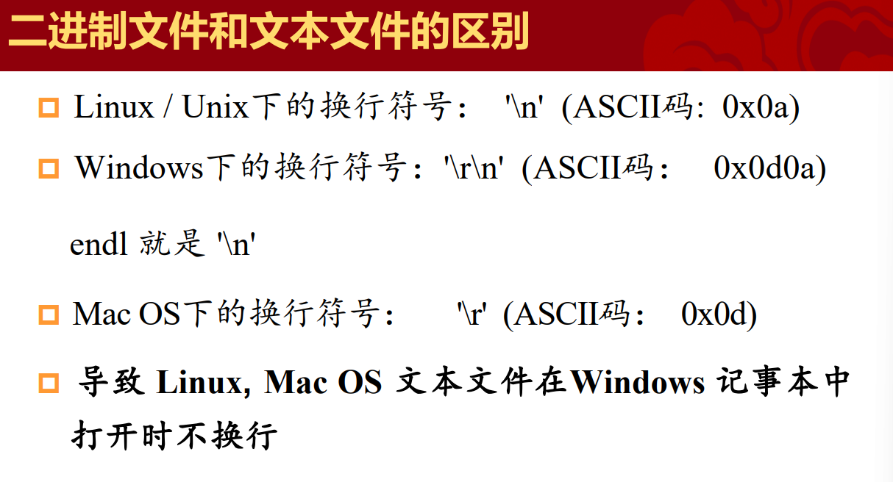


## 泛型程序设计

- Generic Programming
- 算法实现时不指定具体要操作的数据的类型 
- **泛型**— 算法实现一遍,就可以适用于多种数据结构 
- 优势 : 减少重复代码的编写
- 大量编写模板, 使用模板的程序设计
  - 函数模板
  - 类模板


### 函数模板

> 解决函数的泛用性问题 ==> 函数重载,**函数模板**

函数模板是C++中的一种特性,它允许我们编写通用的函数,可以处理不同类型的数据,而无需为每种类型编写单独的函数。**(调用时自动生成对应函数)**

函数模板通过类型参数化来实现代码的重用,提高了代码的灵活性和可维护性。

1. 函数模板的定义

函数模板的定义以关键字`template`开始,后跟一个尖括号`<>`，在尖括号中声明一个或多个类型参数。然后是函数的定义,其中可以使用类型参数作为函数参数的类型或返回值类型。

> 关于为什么会有多个类型参数
>
> 

**函数模板的类型参数可以用于函数模板的局部变量声明**

```c++
template <class T1, class T2> 
void print(T1 arg1, T2 arg2) {
  T1 locVar = arg1;
  cout << locVar << " " << arg2 << endl;
  return;
}
```


```cpp
template <typename T>
T max(T a, T b) {
    return (a > b) ? a : b;
}
```

在这个例子中,`T`是一个类型参数,表示函数可以接受任意类型的参数。函数`max`返回两个参数中的较大值。

2. 函数模板的调用

在调用函数模板时,编译器会根据传递的参数类型自动推导模板参数的实际类型。你也可以显式地指定模板参数的类型。

```cpp
int a = 5, b = 10;
int maxInt = max(a, b);  // 自动推导模板参数类型为int

double c = 3.14, d = 2.71;
double maxDouble = max<double>(c, d);  // 显式指定模板参数类型为double
```

3. 多个类型参数

函数模板可以有多个类型参数,用逗号分隔。

```cpp
template <typename T1, typename T2>
void print(T1 a, T2 b) {
    std::cout << a << " " << b << std::endl;
}
```

4. 函数模板特化

有时候,我们可能需要为特定的类型提供一个特殊的实现。这可以通过函数模板特化来实现。

```cpp
template <typename T>
void print(T a) {
    std::cout << "Generic: " << a << std::endl;
}

template <>
void print<std::string>(std::string a) {
    std::cout << "Specialized for string: " << a << std::endl;
}
```

在这个例子中,我们为`std::string`类型提供了一个特化版本的`print`函数。

5. 函数模板重载

函数模板也可以像普通函数一样被重载。编译器会根据传递的参数类型选择最合适的重载版本。


```cpp
template <typename T>
void print(T a) {
    std::cout << "Generic: " << a << std::endl;
}

template <typename T>
void print(T a, T b) {
    std::cout << "Generic: " << a << " " << b << std::endl;
}
```

函数模板是C++中非常强大和有用的特性,它可以帮助我们编写更加通用和灵活的代码。合理使用函数模板可以提高代码的重用性,减少代码重复,使代码更加简洁和易于维护。


#### 函数模板的匹配顺序

1. 参数完全匹配的函数
2. 参数完全匹配的模板
3. 在没有二义性的前提下,找一个参数经过**自动转化**后能够匹配的函数
4. 都找不到,就报错

```c++
#include <iostream>
using namespace std;
template <class T> void Max(T a, T b) { cout << "TemplateMax" << endl; }
void Max(double a, double b) { cout << "MyMax" << endl; }
int main() {

  int i = 4, j = 5;
  Max(1.2, 3.4); // MyMax
  Max(i, j);     // TemplateMax
  Max(1.2, 3); // 二义性,强制类型转换3为double,MyMax
}
```

> Ｑ：在没有二义性的前提下,找一个参数经过**自动转化**后能够匹配的函数 ，这句话如何理解,是找到的是一个普通的函数而不是函数模板吗？
>
> A：是的，你的理解是正确的。在C++中，函数模板的匹配顺序确实会优先考虑那些不需要通过参数类型转换就能匹配的函数和模板。当提到“在没有二义性的前提下,找一个参数经过自动转化后能够匹配的函数”，指的是如果没有直接匹配的函数或者模板函数，编译器会尝试通过自动类型转换来找到一个合适的非模板函数。这里强调的是非模板函数，因为模板实例化过程中的参数类型转换通常比较复杂，且容易产生二义性。
>
> 具体到匹配顺序的理解，可以这样看：
>
> 1. **参数完全匹配的函数**：首先，如果有一个非模板函数（普通函数）的参数类型与调用时提供的实参类型完全一致，那么这个函数将会被选中。
>
> 2. **参数完全匹配的模板**：如果没有非模板函数直接匹配，编译器会查找一个函数模板，该模板可以通过实参推导出完全匹配的模板实例。 
>
> 3. **自动转换匹配的函数**：如果前两步都没有找到匹配项，编译器会尝试找到一个非模板函数，该函数可以通过自动类型转换（如隐式类型转换、用户定义的类型转换等）来匹配实参。这里重点是“非模板函数”，因为这一步不考虑通过类型转换实例化模板。
>
> 4. **报错**：如果上述三个步骤都无法找到匹配的函数，编译器将报错。
>
> 这种设计部分原因是为了保证代码的清晰和确定性，避免在使用函数模板时因为隐式类型转换引入意外的复杂性和二义性。因此，在设计函数重载和模板时，需要考虑到这些匹配规则，以确保代码的行为符合预期。

### 类模板

> 为了多快好省地定义出一批相似的类, 可以定义**类模板**
>
> 由类模板生成不同的类

>Example
>
>- 数组是一种常见的数据类型, 元素可以是:
>
>  - 整数 
>
>  -  学生 
>
>  -  字符串 … 
>
>- 考虑一个数组类 , 需要提供的基本操作 
>  - len(): 查看数组的长度 
>  - getElement(int index): 获取其中的一个元素 
>  -  setElement(int index): 对其中的一个元素进行赋值
>- 这些数组类, 除了**元素的类型**不同不同之外, 其他的完全相同

**类模板**

- 在定义类的时候给它一个/多个参数,这些参数表示不同的数据类型

- 在调用类模板时,指定参数,由编译系统根据参数提供的数据类型自动产生相应的**模板类**

  ```c++
  template <class T> // 类模板的首部,声明类模板的参数
      class CArray{
  		T *ptrElement;
          int size;
      public:
          CArray(int length);
          ~CArray();
          int len();
          void setElement(T arg, int index);
          T getElement(int index);
      };
  ```

  > 　`CArray`是一个**模板类 **
  >
  > 　声明一个或多个**类型参数**, 用来定义`CArray`的属性类型, 成员函数的**参数类型**和**返回值类型**
  
  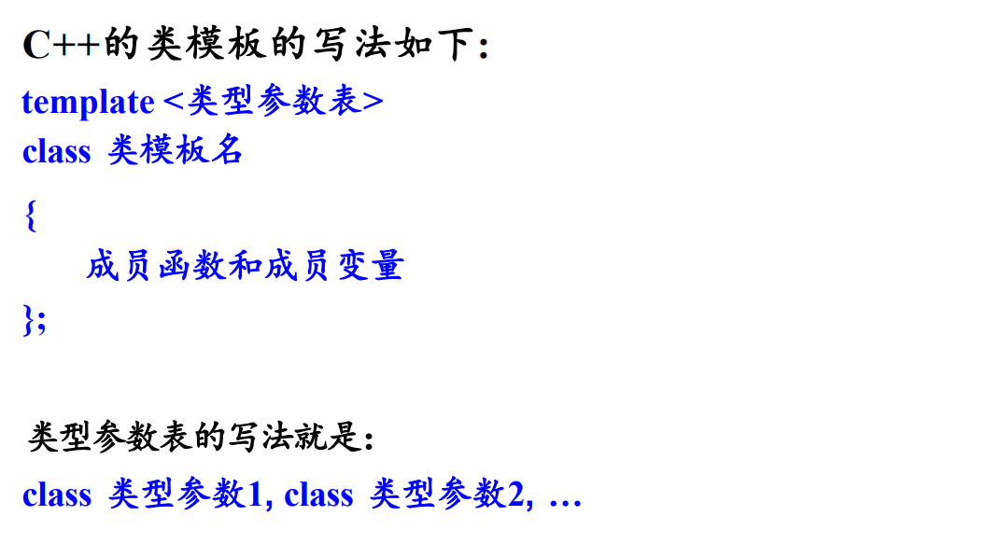
  
  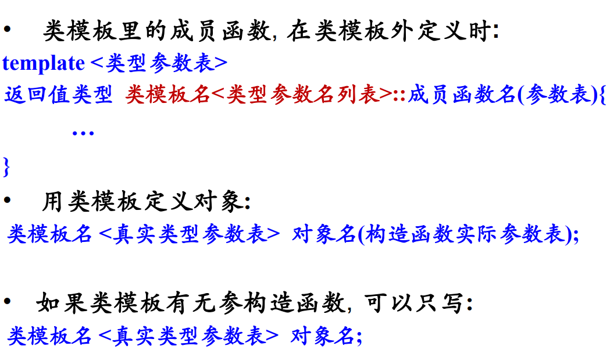
  
#### 声明类模板的对象

  > 　在C++中，类模板是一种强大的特性，允许你编写与数据类型无关的代码。这意味着你可以创建一个通用的类，以处理不同的数据类型，而不必为每种数据类型重写代码。类模板在实现如容器类（比如向量、列表、映射等）时非常有用，因为这些容器可以存储任何类型的数据。
  >
  > ### 类模板的定义
  >
  > 类模板的定义以关键字 `template` 开头，后跟模板参数列表。模板参数是在尖括号 `< >` 中定义的，通常是一个或多个类型参数或非类型参数。定义类模板的基本语法如下：
  >
  > ```cpp
  > template <typename T>
  > class ClassName {
  > public:
  >     // 构造函数
  >     ClassName(T value) : member(value)    // 成员函数
  >     void display() {
  >         std::cout << member << std::endl;
  >     }
  > 
  > private:
  >     T member; // 类模板成员
  > };
  > ```
  >
  > 这里，`T` 是一个类型参数，它在类模板实例化时将被具体的类型替换。
  >
  > ### 类模板的实例化
  >
  > 实例化类模板意味着根据模板创建一个具体类的过程，需要指定模板参数。例如，如果你有一个存储单一数据项的类模板，你可以为整数、浮点数或甚至自定义类型实例化它。
  >
  > ```cpp
  > ClassName<int> intObj(5);
  > ClassName<double> doubleObj(10.5);
  > ClassName<std::string> stringObj("Hello");
  > ```
  >
  > ### 类模板与成员函数
  >
  > 如果类模板中有成员函数在类外部定义，你需要在函数定义前再次使用 `template <typename T>`，并且在函数名前使用类名和模板参数。
  >
  > ```cpp
  > template <typename T>
  > class ClassName {
  > public:
  >     void display();
  > };
  > 
  > template <typename T>
  > void ClassName<T>::display() {
  >     std::cout << "Displaying: " << member << std::endl;
  > }
  > ```
  >
  > ### 类模板特化
  >
  > 有时候，你可能需要为特定类型提供特殊的实现，这称为模板特化。特化的类模板与原始模板具有相同的名称，但其后跟特定类型的模板参数。
  >
  > ```cpp
  > template <>
  > class ClassName<int> {
  > public:
  >     ClassName(int value) : member(value)    void display() {
  >         std::cout << "Integer specialization: " << member << std::endl;
  >     }
  > 
  > private:
  >     int member;
  > };
  > ```
  >
  > ### 注意事项
  >
  > - 类模板的定义通常包含在头文件中，以确保在实例化模板时所有的信息都是可用的。
  > - 类模板使得代码更加灵活和可重用，但也可能使得编译过程变慢，因为每个实例化都会生成新的类定义。
  >
  > 通过合理使用类模板，你可以编写出更加通用、可重用的C++代码，提高开发效率和代码质量。
  >
  > ## 关于类模板实例化的时机
  >
  > C++中的类模板实例化是一个将模板参数替换为具体类型或值的过程，从而生成具体类的编译时机制。类模板实例化可以发生在多种情况下，以下是一些典型的触发实例化的场景：
  >
  > ### 1. 显式实例化
  >
  > 开发者可以显式地指定模板参数来实例化一个模板类，这是最直接的实例化方式。
  >
  > ```cpp
  > template class ClassName<int>; // 显式实例化一个int类型的ClassName模板类
  > ```
  >
  > ### 2. 隐式实例化
  >
  > 当模板类的一个对象被声明时，会根据用于对象声明的类型自动实例化模板类。
  >
  > ```cpp
  > ClassName<int> obj; // 通过声明对象obj隐式实例化ClassName<int>
  > ```
  >
  > ### 3. 使用模板类的成员
  >
  > 当访问模板类的成员（包括成员函数、成员变量）时，如果该成员使用了模板参数，则会触发类模板的实例化。
  >
  > ```cpp
  > ClassName<double> obj;
  > obj.display(); // 访问成员函数，触发ClassName<double>的实例化
  > ```
  >
  > ### 4. 继承
  >
  > 当一个类模板被另一个类继承时，父类模板会根据子类提供的类型参数被实例化。
  >
  > ```cpp
  > template <typename T>
  > class Base {};
  > 
  > class Derived : public Base<int> {}; // 继承时实例化Base<int>
  > ```
  >
  > ### 5. 作为函数参数或返回类型
  >
  > 当模板类用作函数参数或函数返回类型时，如果涉及的操作需要类的具体定义，那么相应的模板类会被实例化。
  >
  > ```cpp
  > void func(ClassName<int> obj); // 函数声明使得ClassName<int>被实例化
  > 
  > ClassName<int> factory(); // 函数返回类型为ClassName<int>，触发实例化
  > ```
  >
  > ### 6. 模板特化和偏特化
  >
  > 当定义一个模板类的特化或偏特化版本时，对应的特化或偏特化类会根据特化的类型参数被实例化。
  >
  > ```cpp
  > template <>
  > class ClassName<char> {}; // 特化时实例化
  > 
  > template <typename T>
  > class ClassName<T*> {}; // 偏特化，使用指针类型时实例化
  > ```
  >
  > ### 7. 模板模板参数
  >
  > 当一个模板类作为另一个模板类或模板函数的模板参数时，外层模板的实例化可能会导致内层模板的实例化。
  >
  > ```cpp
  > template <template <typename> class Container>
  > class Wrapper {
  >     Container<int> c; // 使用Container模板参数时，实例化Container<int>
  > };
  > ```
  >
  > 这些场景概述了类模板实例化的常见情形。由于模板实例化涉及到复杂的编译时决策，不同编译器的优化和处理策略可能会影响实例化的具体行为。

  ```c++
  #include <iostream>
  #include <string>
  using namespace std;
  
  template <class T1, class T2> class Pair {
  public:
    T1 key;   // 关键字
    T2 value; // 值
    Pair(T1 k, T2 v) : key(k), value(v) {}
    bool operator<(const Pair<T1, T2> &p) const;
  };
  template <class T1, class T2>
  bool Pair<T1, T2>::operator<(const Pair<T1, T2> &p) const
  // Pair的成员函数 operator <
  {
    return key < p.key;
  }
  int main() {
    Pair<string, int> student("Tom", 19); // 实例化出一个类 Pair<string, int>
    cout << student.key << " " << student.value;
    return 0;
  }
  ```

  

  

- 模板类 - 为类模板中各类型参数指定了具体的数据类型之后,即得到一个模板类
  
  - 编译系统自动用具体的数据类型替换类模板中的类型参数,生成模板类的代码
  
  - 为类型指定的数据类型不同,得到的模板类不同
  
    
  
  
  
  ```c++
  #include <iostream>
  #include <string>
  using namespace std;
  
  template <class T> // 类模板的首部,声明类模板的参数
  class CArray {
    T *ptrElement;
    int size;
  
  public:
    CArray(int length);
    ~CArray();
    int len();
    void setElement(T arg, int index);
    T getElement(int index);
  };
  int main() {
    CArray<int> arrayInt(50), *ptrArrayInt;
    // 创建一个元素类型为int的CArray模板类
    // 声明该模板类的一个对象以及一个指针
    CArray<string> arrayStr(100);
    // 创建一个元素类型为string的CArray的模板类
    // 声明该模板类的一个指针
  }
  ```
  
  
  
  
  
- ==同一个**类模板**的两个模板类是**不兼容**的==(不能使用兼容赋值规则)
  
  ```c++
  Pair<string, int> * p;
  Pair<string, double> a;
  p = & a; // wrong
  ```
  
  
  
#### 定义类模板的成员函数

```c++  
#include <iostream>
#include <string>
using namespace std;
template <class T> // 类模板的首部,声明类模板的参数
class CArray {
  T *ptrElement;
  int size;

public:
  CArray(int length);
  ~CArray();
  int len();
  void setElement(T arg, int index);
  T getElement(int index);
};
template <class T> CArray<T>::CArray(int length) {
  ptrElement = new T[length];
  size = length;
}
template <class T> CArray<T>::~CArray() { delete[] ptrElement; }
template <class T> int CArray<T>::len() { return size; }
template <class T> void CArray<T>::setElement(T arg, int index) {
  *(ptrElement + index) = arg;
  return;
}
template <class T> T CArray<T>::getElement(int index) { return *(ptrElement + index); }
```

> ==在C++中，当你在类模板外部定义成员函数时，必须对每个成员函数的实现前都加上`template <class T>`。==这是因为类模板的成员函数本身也是模板，它们依赖于类模板的模板参数。当你在类模板外部定义这些函数时，编译器需要明确知道这些函数定义是模板定义，并且需要知道模板参数的具体类型。
>
> 在你的示例中，`CArray`是一个模板类，它有模板参数`T`。当你在类外部定义`CArray`的构造函数、析构函数等成员函数时，你需要重申这些函数属于一个模板，这样编译器就能正确地将函数和类模板联系起来。这是为什么每次在成员函数定义前你都看到`template <class T>`。
>
> 具体来说，每个`template <class T>`前缀都告诉编译器，接下来的函数定义是对所有可能的`T`类型参数通用的，而不是针对某个特定类型。这是模板类成员函数在类外定义时的必要语法，确保了模板的泛型性和可复用性。
>
> 另外，这样做的另一个好处是，这种定义方式使得模板的实例化变得灵活。编译器只会为实际使用到的类型参数`T`的具体实例生成代码，而不是为模板可能处理的所有类型生成。这样可以节省编译时间和生成的可执行文件大小。
>
> 所以，总结一下，之所以在类模板的每个成员函数定义前多次写`template <class T>`，是因为：
>
> - 明确指出随后的成员函数定义是模板的一部分。
> - 为了让编译器知道这些函数的定义依赖于模板参数`T`。
> - 确保模板的泛型性和可复用性，允许灵活地为特定的类型参数实例化模板类。

#### 函数模板作为类模板成员

- 类模板的成员函数可以是一个**函数模板**,该成员函数只有在被调用的时候才会被实例化

```c++
#include <iostream>
using namespace std;
template <class T> class A {
public:
  template <class T2> void Func(T2 t) { cout << t; } // 成员函数模板
};
int main() {
  A<int> a;
  a.Func('K');     // 成员函数模板Func被实例化
  a.Func("Hello"); // 成员函数模板Func被实例化
  return 0;
}
```

> 若改成
>
> ```c++
> #include <iostream>
> using namespace std;
> template <class T> class A {
> public:
>     template <class T>
>   void Func(T t) { cout << t; }
> };
> int main() {
>   A<int> a;
>   a.Func('K');   
>   a.Func("Hello"); 
>   return 0;
> }
> ```
>
> 在这段代码中，出现了一个典型的**模板参数名称遮蔽（shadowing）问题**。在类`A`的定义中，模板参数`T`被用于类模板和成员函数模板。当你在同一作用域内再次使用`T`作为成员函数模板的参数时，它会遮蔽（即隐藏）类模板级别的`T`。
>
> ### 问题分析
>
> - 类`A`是一个模板类，其模板参数被命名为`T`。
> - 在类`A`内部，成员函数`Func`也定义为一个模板，其参数同样命名为`T`。
>
> 这导致在`Func`的作用域内，参数`T`引用的是函数模板的参数，而不是类模板的参数。这种情况下，编译器无法区分两个层次的`T`，因此会报错，指出成员函数模板参数`T`遮蔽了类模板参数`T`。
>
> ### 解决方法
>
> 要解决这个问题，你需要为成员函数模板使用不同的参数名称，以避免与类模板参数的名称冲突。例如：
>
> ```cpp
> #include <iostream>
> using namespace std;
> 
> template <class T> // 类模板参数
> class A {
> public:
>     template <class U> // 成员函数模板参数，改为使用不同的名称，如 U
>     void Func(U t) {
>         cout << t << endl;
>     }
> };
> 
> int main() {
>     A<int> a;
>     a.Func('K');       // 正确调用，U 推断为 char
>     a.Func("Hello");   // 正确调用，U 推断为 const char*
>     return 0;
> }
> ```
>
> 在这个修正的代码中，成员函数`Func`现在有自己的模板参数`U`，这样它就不会与外部类的模板参数`T`发生冲突。这样，`Func`函数可以接受任何类型的参数，包括字符和字符串字面值，而不受外部类模板参数`T`的影响。

#### 类模板与非类型参数

- 类模板的<类型参数表>中可以包括非类型参数(non-type parameter)

- 非类型参数:

  - 用来说明类模板中的属性

  - 通常类模板参数声明中的非类型参数可以提高程序的执行效率, 在编译或链接期间即可确定参数的值

  - ```c++
    template <class T, int size> class CArray {
       
      T array[size];
    
    public:
      void Print() {
        for (int i = 0; i < size; ++i) {
          cout << array[i] << endl;
        }
      }
    };
    CArray<double, 40> a2;
    CArray<int, 50> a3;
    ```

- 类型参数

  - 用来说明类模板中的属性类型,成员函数的参数类型和返回值类型

  

#### 类模板与派生

- 类模板 ==> 类模板
- 模板类(即**类模板中类型/非类型参数实例化后的类**) ==> 类模板
- 普通类 ==> 类模板
- 模板类 ==> 普通类

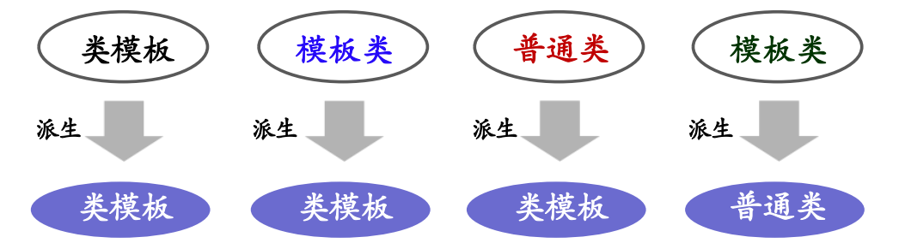

1. 类模板从类模板派生

   - ```c++
     template <class T1, class T2> class A {
       T1 v1;
       T2 v2;
     };
     template <class T1, class T2> class B : public A<T2, T1> {
       T1 v3;
       T2 v4;
     };
     template <class T> class C : public B<T, T> {
       T v5;
     };
     int main() {
       B<int, double> obj1;
       C<int> obj2;
       return 0;
     }
     ```

2. 类模板从模板类中派生

   - ```c++
     template <class T1, class T2> class A {
       T1 v1;
       T2 v2;
     };
     template <class T> class B : public A<int, double> {
       T v;
     };
     int main() {
       B<char> obj1; // : A<int, double> B<char>
       return 0;
     }
     ```

3. 类模板从普通类派生

   - ```c++
     class A {
       int v1;
     };
     template <class T> class B : public A {
       // 所有从b实例化得到的类,都以A为基类
       T v;
     };
     int main() {
       B<char> obj1;
       return 0;
     }
     ```

4. 普通类从模板类派生

   - ```c++
     template <class T> class A {
       T v1;
       int n;
     };
     class B : public A<int> {
       double v;
     };
     int main() {
       B obj1;
       return 0;
     }
     ```

> 当一个普通类（非模板类）从模板类派生时，需要对模板类进行特化，即必须为模板类提供具体的类型参数，从而创建一个特定类型的实例。这个过程并不是创建一个新的模板特化（这通常指的是为模板提供一个完全特定的实现），而是对模板进行实例化，创建一个具体类型的对象。
>
> 在您的例子中：
>
> ```cpp
> template <class T> class A {
>   T v1;
>   int n;
> };
> 
> class B : public A<int> {
>   double v;
> };
> ```
>
> `A<int>` 是一个模板实例化的表达式，表示使用 `int` 作为模板参数 `T` 的实例。所以，这里的 `A<int>` 实际上是 `A` 模板的一个特定类型实例，而不是创建了一个新的模板特化。
>
> 总结一下：
>
> - 当一个普通类继承自一个模板类时，必须为基类模板提供具体的类型参数以进行实例化。
> - 这个实例化过程不是创建一个新的模板特化，而是使用特定的类型参数创建模板的一个实例。
> - 在上述代码中，`B` 类通过继承 `A<int>` 明确了 `A` 的模板参数是 `int`，从而使得 `A` 成为一个具体的类，`B` 可以正常继承和使用它。


#### 类模板与友元函数

> RECALL:
>
>   1. **友元函数**:
>      - 在类内部使用`friend`关键字声明友元函数。
>      - 友元函数可以访问类的私有成员。
>      - 友元函数在类内部声明,但在类外部定义(也可以在类内定义),不属于类的成员函数。
>
>   2. **友元类**:
>      - 在一个类内部使用`friend class ClassName;`语句声明另一个类为友元类。(声明的对象可以访问本类的对象)
>      - ==**友元类可以访问当前类的私有成员。**==
>      - **友元关系是单向的,即使类A是类B的友元类,类B也不能自动访问类A的私有成员。**

- 函数/类/类的成员函数作为类模板的友元

  - ```c++
    void Func1() {} // 函数
    class A {};     // 类
    class B {
    public:
      void Func() {} // 类的成员函数
    };
    template <class T> 
      class Tmpl {
      friend void Func1();
      friend class A;
      friend void B::Func();
      int main() {
        Tmpl<int> i;
        Tmpl<double> f;
        return 0;
      }
    }; // 任何从Tmpl实例化来的类,都有以上三个友元
    int main() {
      Tmpl<int> i;
      Tmpl<double> f;
      return 0;
    }
    ```

- 函数模板作为类模板的友元

  - ```c++
    #include <iostream>
    #include <string>
    using namespace std;
    template <class T1, class T2> class Pair {
      T1 key;   // 关键字
      T2 value; // 值
    public:
      Pair(T1 k, T2 v) : key(k), value(v){};
      bool operator<(const Pair<T1, T2> &p) const;
      template <class T3, class T4>
      friend ostream &operator<<(ostream &o, const Pair<T3, T4> &p); // 函数模板
    };
    template <class T1, class T2>
    bool Pair<T1, T2>::operator<(const Pair<T1, T2> &p) const {
      // "小于"
      return key < p.key;
    }
    template <class T3, class T4>
    ostream &operator<<(ostream &o, const Pair<T3, T4> &p) {
      o << "(" << p.key << "," << p.value << ")";
      return o;
    }
    int main() {
      Pair<string, int> student("Tom", 29);
      Pair<int, double> obj(12, 3.14);
      cout << student << " " << obj;
      return 0;
    }
    /* 
    任意从template <class T3, class T4>
    ostream & operator<< (ostream & o, const Pair<T3,T4> & p)的函数,都是任意对应Pair模板类的友元*/
    ```

- 函数模板作为类的友元

  - ```c++
    #include <iostream>
    using namespace std;
    class A {
      int v;
    
    public:
      A(int n) : v(n) {}
      template <class T> friend void Print(const T &p);
    };
    template <class T> void Print(const T &p) { cout << p.v; }
    int main() {
      A a(4);
      Print(a);
      return 0;
    }
    /*
    所有从template <class T> void Print(const T &p)生成的函数,都是A的友元
    */
    ```

- 类模板作为类模板的友元

  - ```c++
    #include <iostream>
    using namespace std;
    template <class T> class A {
    public:
      void Func(const T &p) { cout << p.v; }
    };
    template <class T> class B {
      T v;
    
    public:
      B(T n) : v(n) {}
      template <class T2> friend class A; // 把类模板A声明为友元
    };
    int main() {
      B<int> b(5);
      A<B<int>> a;
      // 用B<int>替换掉A模板中的T
      a.Func(b);
      return 0;
    }
    ```

- 类型参数的影响

```c++
template <class T> class myClassA {};
template <class T> class myClassB {};
template <class T1, class T2, int size> class CTemp {
  friend myClassA<T1>;
  friend myClassB<T2>;

private:
  T1 elements[size];

public:
  CTemp(){};
};
```


#### 类模板与static成员

- 类模板中可以定义静态成员,那么从**该类模板实例化得到的模板类的所有对象,都包含同样的静态成员**

- 从同一个类模板产生的模板类不属于同一个模板类,不能共享静态变量,需要分别初始化

  - ```c++
    #include <iostream>
    using namespace std;
    template <class T> class A {
      static int count;
    
    public:
      A() { count++; }
      ~A() { count--; };
      A(A &) { count++; }
      static void PrintCount() { cout << count << endl; }
    };
    template <> int A<int>::count = 0; // 分别初始化
    template <> int A<double>::count = 0;
    int main() {
      A<int> ia;
      A<double> da;
      ia.PrintCount();
      da.PrintCount();
      return 0;
    }
    ```

  

### String类的实现

#### string类

- string 是一个**模板类** , 它的定义如下：

  - `typedef basic_string string;`

- 使用string类要包含头文件`#include<string>`

- string对象的初始化

  - ```c++
    string s1("hello"); // 一个参数的构造函数
    string s2(8,'x');  // 两个参数的构造函数
    string s3 = "March";
    string s4 = 'a'; //  将单个字符赋值给string
    ```

- 类中**不提供以字符和整数为参数的构造函数**

- 可以将字符赋值给string对象

```c++
#include <iostream>
#include <string>
using namespace std;
int main(int argc, char *argv[]) {
  string s1("Hello");
  cout << s1 << endl;
  string s2(8, 'x');
  cout << s2 << endl;
  string month = "March";
  cout << month << endl;
  string s;
  s = 'n';
  cout << s << endl;
  return 0;
}
```

- 构造的string太长而无法表达时会抛出`length_error`异常
- string 对象的长度用成员函数` length()`读取

```c++
string s("hello");
cout << s.length() << endl;
```

- string支持流读取运算符

```c++
string stringObject;
cin >> stringObject;
```

- string支持`getline`函数

```c++
string s;
getline(cin, s);
```


#### string的赋值与连接

- 用`=`赋值

```c++
string s1("cat"),s2;
s2 = s1;
```

- 用`assign()`成员函数复制

```c++
string s1("cat"),s2;
s2.assign(s1); // 参数为被复制的模板
```

- `assign()`成员函数部分复制

```c++
string s1("cat"),s2;
s2.assign(s1, 1, 3); // 从s1中下标为1的字符开始复制3个字符给s2
```

- 单个字符赋值

```c++
s2[5] = s1[3] = 'a';
```

- 逐个访问string对象中的字符

```c++
string s1("Hello");
for (int i = 0;i<s1.length();i++){
	cout<<s1.at(i)<<endl;
    cout<<s1[i]<<endl;
}
```

> **成员函数at**会做范围检查,如果超出范围,会抛出`out_of_range`异常
>
> **下标运算符**不做范围检查

- 用+运算符连接字符串

```c++
string s1("good "), s2("morning!");
s1 += s2;
cout << s1;
```

- 用成员函数`append`连接字符串

```c++
string s1("good "), s2("morning!");
s1.append(s2);
cout << s1;
s2.append(s1, 3, s1.size());
// 下标为3开始,s1.size()个字符,如果字符串内没有足够的字符,则复制到字符串的最后一个字符
cout << s2;
```

#### 比较string

- 用关系运算符比较string的大小`== , >, >=, <, <=, !=`
  - 返回值都是bool类型,成立返回true否则返回false;

```c++
string s1("hello"), s2("hello"), s3("hell");
bool b = (s1 == s2);
cout << b << endl;
b = (s1 == s3);
cout << b << endl;
b = (s1 > s3);
cout << b << endl;
```


- 用成员函数 compare比较string的大小

```c++
string s1("hello"), s2("hello"), s3("hell");
int f1 = s1.compare(s2);
int f2 = s1.compare(s3);
int f3 = s3.compare(s1);
int f4 = s1.compare(1, 2, s3, 0, 3); //s1 1-2; s3 0-3
int f5 = s1.compare(0, s1.size(), s3); //s1 0-end
cout << f1 << endl << f2 << endl << f3 << endl;
cout << f4 << endl << f5 << endl;
```

#### 子串

- 成员函数`substr`

```c++
string s1("helloworld"), s2;
s2 = s1.substr(4, 5);
cout << s2 << endl;
```

```
oworl
```

#### 交换string

- 成员函数swap

```c++
string s1("helloworld"), s2("really");
s1.swap(s2); // 先后无所谓,两者会交换
cout << s1 << endl;
cout << s2 << endl;
```

#### string的特性

- `capacity()`
  - 返回无需增加内存即可存放的字符数
- `max_size()`
  - 返回string对象可存放的最大字符数
- `length()`和`size()`
  - 返回字符串的大小/长度
- `empty()`
  - 返回string对象是否为空,**空返回true**
- `resize()`
  - 改变string对象的长度

#### 在string中寻找,替换和插入字符

- 成员函数`find()`

> 实现思路可能是**KMP算法**

```c++
string s1("helloworld");
s1.find("lo");
```

> 在s1中**从前向后**查找 "lo" **第一次**出现的地方, 如果找到, 返回 "lo"开始的位置, 即 l 所在的位置下标; 如果找不到, 返回 `string::npos` (string中定义的静态常量)

- 成员函数`rfind()`

```c++
string s1("helloworld");
s1.rfind("lo");
```

> 在s1中**从后向前**查找 "lo" 第一次出现的地方, 如果找到, 返回 "lo"开始的位置, 即 l 所在的位置下标; 如果找不到, 返回 `string::npos`

- 成员函数`find_first_of() `
```c++
string s1("helloworld"); 
s1.find_first_of("abcd");
```
> 在s1中 **从前向后**查找 "abcd" 中任何一个字符**第一次**出现的 地方, 如果找到, 返回找到字母的位置; 如果找不到, 返回 `string::npos `
- 成员函数`find_last_of() `
```c++
string s1("helloworld"); 
s1.find_last_of("abcd"); 
```
> 在s1中查找 "abcd" 中任何一个字符**最后一次**出现的地方, 如果找到, 返回找到字母的位置; 如果找不到, 返回 `string::npos `

- 成员函数`find_first_not_of() `

 ```c++
 string s1("helloworld");
 s1.find_first_not_of("abcd");
 ```
>  在s1中**从前向后**查找**不在 **"abcd" 中的字母**第一次**出现的 地方, 如果找到, 返回找到字母的位置; 如果找不到, 返回 `string::npos `

- 成员函数`find_last_not_of() `

 ```c++
 string s1("helloworld");
 s1.find_last_not_of("abcd"); 
 ```
>  在s1中**从后向前**查找**不在 ** "abcd" 中的字母**第一次**出现的 地方, 如果找到, 返回找到字母的位置; 如果找不到, 返回 `string::npos`

```c++
#include <iostream>
#include <string>
using namespace std;
int main() {
  string s1("hello worlld");
  cout << s1.find("ll") << endl;
  cout << s1.find("abc") << endl;
  cout << s1.rfind("ll") << endl;
  cout << s1.rfind("abc") << endl;
  cout << s1.find_first_of("abcde") << endl;
  cout << s1.find_first_of("abc") << endl;
  cout << s1.find_last_of("abcde") << endl;
  cout << s1.find_last_of("abc") << endl;
  cout << s1.find_first_not_of("abcde") << endl;
  cout << s1.find_first_not_of("helloworld") << endl;
  cout << s1.find_last_not_of("abcde") << endl;
  cout << s1.find_last_not_of("helloworld") << endl;
  return 0;
}
```

- 成员函数`erase()`

```c++
string s1("hello worlld");
s1.erase(5);
cout << s1;
cout << s1.length();
cout << s1.size();
```

- 成员函数`replace()`

```c++
string s1("helloworld");
s1.replace(2, 3, "haha");
cout << s1;
// 将s1中下标2开始的3个字符换成"haha"
```

- 成员函数`insert()`

```c++
string s1("helloworld");
string s2("show insert");
s1.insert(5, s2); // 将s2插入s1下标为5的位置
cout << s1 << endl;
s1.insert(2, s2, 5, 3);
// 将s2中下标5开始的3个字符插入s1下标2的位置
cout << s1 << endl;
```

```
helloshow insert world
heinslloshow insert world
```

#### 转换C语言式char*字符串

- 成员函数`copy()`

```c++
string s1("helloworld");
int len = s1.length();
char * p2 = new char[len+1];
s1.copy(p2, 5, 0);
p2[5]=0;
cout << p2 << endl;
```

> s1.copy(p2, 5, 0)从s1的下标0的字符开始制作一个最长5个字符长度的字符串副本并将其赋值给p2
>
> 返回值表明实际的复制字符串的长度

#### 字符串流处理

除了标准流和文件流输入输出外, 还可以从string进行输入输出

类似` istream`和`osteram`进行标准流输入输出,用`istringstream` 和 `ostringstream`进行字符串上的输入输出, 也称为**内存输入输出**


```c++
#include <iostream>
#include <sstream>
#include <string>
using namespace std;

// 字符串流处理
int main() {
  string input("Input test 123 4.7 A");
  istringstream inputString(input);
  string string1, string2;
  int i;
  double d;
  char c;
  inputString >> string1 >> string2 >> i >> d >> c;
  cout << string1 << endl << string2 << endl;
  cout << i << endl << d << endl << c << endl;
  long l;
  if (inputString >> l)
    cout << "long\n";
  else
    cout << "empty\n";
  inputString >> string1 >> string2 >> i >> d >> c;
  ostringstream outputString;
  outputString << string1 << endl << string2 << endl;
  outputString << i << endl << d << endl << c << endl;
  cout << outputString.str();
  return 0;
}

```


>  C++ 标准库中的 `std::string` 类提供了一系列成员函数，用于处理字符串。这个类基于 `char` 类型，并且封装了内存管理和字符操作，使得字符串操作更加安全和方便。以下是一些常用的 `std::string` 成员函数及其参数说明和实现原理：
>
> ### 1. 构造函数
>
> ```cpp
> std::string();
> std::string(const char* s, size_t n);
> std::string(const char* s);
> std::string(size_t n, char c);
> std::string(const std::string& str);
> std::string(std::string&& str);
> ```
>
> - 默认构造函数创建一个空字符串。
> - 从 C 风格字符串 `s` 和其长度 `n` 构造字符串。
> - 从 C 风格字符串 `s` 构造字符串，长度由 `std::strlen(s)` 决定。
> - 重复字符 `c` `n` 次构造字符串。
> - 拷贝构造函数，从另一个 `std::string` 对象 `str` 构造字符串。
> - 移动构造函数，使用 `std::move(str)` 将 `str` 中的资源移动到新对象。
>
> ### 2. 赋值操作
>
> ```cpp
> std::string& operator=(const std::string& str);
> std::string& operator=(std::string&& str);
> std::string& operator+=(const std::string& str);
> std::string& operator+=(char c);
> ```
>
> - 拷贝赋值操作符，将 `str` 的内容复制到当前对象。
> - 移动赋值操作符，使用 `std::move(str)` 将 `str` 中的资源移动到当前对象。
> - 连接操作符，将 `str` 的内容追加到当前对象的末尾。
> - 连接操作符，将字符 `c` 追加到当前对象的末尾。
>
> ### 3. 访问和修改
>
> ```cpp
> char& operator[](size_t index);
> const char& operator[](size_t index) const;
> at(size_t index) const;
> front();
> back();
> ```
>
> - 索引操作符，用于访问和修改指定位置的字符。
> - 索引操作符的 const 版本，用于只读访问指定位置的字符。
> - `at` 成员函数，用于带边界检查的访问和修改指定位置的字符。
> - `front` 成员函数，返回第一个字符的引用。
> - `back` 成员函数，返回最后一个字符的引用。
>
> ### 4. 迭代器
>
> ```cpp
> begin();
> end();
> cbegin() const;
> cend() const;
> rbegin();
> rend();
> crbegin() const;
> crend() const;
> ```
>
> - `begin` 返回指向第一个字符的迭代器。
> - `end` 返回指向最后一个字符之后的迭代器。
> - `cbegin` 和 `cend` 分别返回指向第一个字符和最后一个字符之后的 const 迭代器。
> - `rbegin` 和 `rend` 分别返回指向最后一个字符和第一个字符之前的逆向迭代器。
> - `crbegin` 和 `crend` 分别返回指向最后一个字符和第一个字符之前的 const 逆向迭代器。
>
> ### 5. 容量和大小
>
> ```cpp
> size_t size() const;
> size_t length() const;
> void resize(size_t n);
> void resize(size_t n, char c);
> capacity() const;
> ```
>
> - `size` 和 `length` 成员函数返回字符串的长度。
> - `resize` 成员函数改变字符串的长度，可以增加或减少字符，`n` 是新的长度，`c` 是用于填充的新字符。
> - `capacity` 成员函数返回字符串可以容纳的字符数，而不需要重新分配内存。
>
> ### 6. 搜索
>
> ```cpp
> size_t find(const std::string& str, size_t pos = 0) const;
> size_t find(char c, size_t pos = 0) const;
> size_t rfind(const std::string& str, size_t pos = npos) const;
> size_t rfind(char c, size_t pos = npos) const;
> ```
>
> - `find` 成员函数从字符串的开始位置搜索子字符串 `str` 或字符 `c`，`pos` 是搜索的起始位置。
> - `rfind` 成员函数从字符串的结束位置搜索子字符串 `str` 或字符 `c`，`pos` 是搜索的起始位置。
>
> ### 7. 插入和删除
>
> ```cpp
> void insert(size_t index, const std::string& str);
> void insert(size_t index, size_t n, char c);
> template <class InputIt>
> void insert(size_t index, InputIt first, InputIt last);
> void erase(size_t index = 0, size_t count = npos);
> ```
>
> - `insert` 成员函数在指定位置 `index` 插入另一个字符串 `str`、`n` 个字符 `c`，或者从输入迭代器 `first` 到 `last` 的字符序列。
> - `erase` 成员函数删除从位置 `index` 开始的 `count` 个字符，如果 `count` 被省略，则删除从 `index` 到字符串末尾的所有字符。
>
> ### 8. 其他
>
> ```cpp
> std::string substr(size_t pos = 0, size_t len = npos) const;
> void clear();
> std::string& operator+=(const std::string& str);
> std::string& operator+=(char c);
> std::string operator+(const std::string& lhs, const std::string& rhs);
> template <class InputIt>
> void append(InputIt first, InputIt last);
> ```
>
> - `substr` 成员函数返回从位置 `pos` 开始的、长度为 `len` 的子字符串。
> - `clear` 成员函数清除字符串中的所有字符。
> - `operator+=` 重载，用于连接当前字符串与另一个字符串 `str` 或字符 `c`。
> - `operator+` 重载，用于连接两个字符串 `lhs` 和 `rhs`。
> - `append` 成员函数用于将输入迭代器 `first` 到 `last` 指定的字符序列追加到当前字符串的末尾。
>
> ### 实现原理
>
> `std::string` 的实现原理通常依赖于一个内部字符数组，这个数组存储了字符串的字符以及一个结尾的空字符 `'\0'`。这个内部数组的大小通常会比字符串的实际长度大一些，这是为了优化性能和内存使用。当字符串增长时，可能会发生内存重新分配，这时会创建一个更大的数组，并将现有字符复制到新数组中。
>
> 为了提高性能，`std::string` 通常会预留一些额外的空间。当字符串缩短时，这些额外的空间会被保留下来，以便将来的增长，这就是为什么删除字符后字符串的容量可能会大于其长度的原因。
>
> 请注意，不同的编译器和不同的 C++ 标准库实现可能会在细节上有所不同，但上述描述的成员函数和行为是标准的 C++ 字符串类的一部分。

## STL(标准模板库)


> - **起源**
>
>  C++ 语言的语言优势之一    ==> **软件的重用**
>
>  C++中有两个方面体现重用: 
>
> 1. 面向对象的思想: 继承, 多态, 标准类库 
> 2. 泛型程序设计(Generic Programming) 的思想: 模板机制, 标准模板库 STL
>
> - **泛型程序设计**
>
> 使用**模板**的程序设计方法
>
> 将一些常用的 (例如 链表, 数组, 二叉树) 和 (例如 排序, 查找) 写成模板
>
> 数据结构里放的是什么对象/算法针对什么对象 都不必重新实现数据结构, 重新编写算法
>
> - **标准模板库 (Standard Template Library)**
>   - 一些常用数据结构和算法的模板的集合 
>   -  主要由`Alex Stepanov` 开发, 98年被添加进C++标准
>
> 有了STL,不必再写大多的标准数据结构和算法,并且可以获得非常高的性能

### 容器

> 可以容纳**各种**数据类型的数据结构
>
> **顺序容器和关联容器称为第一类容器**

- 可以用于存放各种类型的数据 (基本类型的变量, 对象等) 的数据结构

- 容器分为三大类:
  - 顺序容器/序列容器
  - 关联容器/有序容器
  - 容器适配器
- 当对象被插入容器时,被插入的是一个对象的复制品(**对于元对象的修改不改变容器内的值**)
- 许多算法, 例如 排序, 查找, 要求对容器中的元素 进行比较, 所以放入容器的对象所属的类 , 还应该**实现==和<运算符**

> 在 C++ 中，确实有许多算法和容器操作依赖于元素的比较。实现 `==`（等于）和 `<`（小于）运算符重载是为了定义对象之间如何进行比较。这在自定义类的实例被用于排序、查找、合并等操作时尤其重要。
>
> 以下是一些常见的算法和操作，它们可能需要 `==` 和 `<` 运算符的重载：
>
> 1. **排序算法**：==需要重载`<`==
>    - `std::sort`：对容器中的元素进行排序。
>    - `std::stable_sort`：对容器中的元素进行稳定排序，即相等元素的相对顺序保持不变。
>    - `std::partial_sort`：也需要`<`运算符。
>    - `std::nth_element`：仅需要`<`运算符。
>
> 2. **二分查找**：==需要重载`<`并且对数据已经进行了排序==
>    - `std::lower_bound`：查找容器中第一个不小于给定值的元素的位置。
>    - `std::upper_bound`：查找容器中第一个大于给定值的元素的位置。
>    - `std::equal_range`：查找容器中等于给定值的元素的范围。
>    - `std::binary_search`：在**已排序**的数据上进行查找，需要`<`运算符来比较元素。
>
> 3. **集合操作**：==需要重载`<`==
>    - `std::set` 和 `std::multiset`：这两种容器存储唯一的元素(后者会记录同种元素的数量)，并根据特定的排序准则自动排序。
>    - `std::set_intersection`：找出两个容器的交集。
>    - `std::set_difference`：找出两个容器的差集。
>    - `std::set_union`：合并两个容器中的所有元素。
>
> 4. **堆操作**：==需要重载`<`==
>    - `std::priority_queue`：一个容器适配器，它使用堆数据结构来管理元素，通常需要比较元素以确定优先级。
>
> 5. **合并和划分**：==需要重载`<`==
>    - `std::merge`：合并两个已排序的容器。
>    - `std::set_symmetric_difference`：找出两个集合的对称差集。
>
> 6. **算法稳定性**：==需要重载`<`==
>    - 稳定的算法（如 `std::stable_sort` 和 `std::lower_bound`）在比较相等的元素时，会保持它们的原始顺序。为了利用这种稳定性，你需要提供一个比较函数，它能够区分相等的元素。
> 7. **最大值和最小值算法**：==需要重载`<`==
>    - `std::max_element` 和 `std::min_element`：查找范围中的最大值和最小值，需要`<`运算符。
> 8. **唯一性和等价算法**：==需要重载`==`==
>    - `std::unique`：不需要`<`运算符，但需要`==`运算符来判断连续元素是否相等。(**需要事先排序才能达到预期的效果**)
>    - `std::equal`：比较两个序列是否相等，需要`==`运算符。
>
> 当你为自定义类实现 `==` 和 `<` 运算符时，你需要确保它们是一致的。也就是说，如果 `a == b` 为 `true`，则对于任何 `a` 和 `b`，`b < a` 应该为 `false`，反之亦然。此外，如果 `<` 运算符被重载，通常也需要重载 `>`，`!=` 和 `>=` 运算符，以保持一致性和满足不同算法的需求。
>
> 请注意，如果你的类用于 `std::sort` 或其他需要比较的算法，而且类中的元素具有自然的顺序，那么通常只需要重载 `<` 运算符。如果你的类表示的是等价关系（例如，表示一组等价的元素），那么可能需要重载 `==` 运算符，并且可能不需要 `<` 运算符。在这种情况下，你可以提供一个比较函数作为算法的第二个参数。

#### 顺序容器

- vector `<vector>`
  - **动态数组**,随机存取任何元素都能在常数时间完成,在**尾端增删元素**具有较佳的性能

  - 支持**随机访问迭代器**, 所有STL算法都能对vector操作
  
  - 随机访问时间为常数
  
  - 在尾部添加速度很快, 在中间插入慢
  
  - ```c++
    #include <algorithm>
    #include <iostream>
    #include <iterator>
    #include <stdexcept>
    #include <vector>
    using namespace std;
    int main() {
      int i;
      int a[5] = {1, 2, 3, 4, 5};
      vector<int> v(5);
      cout << v.end() - v.begin() << endl;
      for (i = 0; i < v.size(); i++)
        v[i] = i;
      v.at(4) = 100;
      for (i = 0; i < v.size(); i++)
        cout << v[i] << ", ";
      cout << endl;
      vector<int> v2(a, a + 5);   
      v2.insert(v2.begin() + 2, 13); 
      for (i = 0; i < v2.size(); i++)
        cout << v2[i] << ", ";
        
        
      const int SIZE = 5;
      int a[SIZE] = {1, 2, 3, 4, 5};
      vector<int> v(a, a + 5); 
      try {
        v.at(100) = 7;
      } 
      catch (out_of_range e) {
        cout << e.what() << endl;
      }
      cout << v.front() << "," << v.back() << endl;
      v.erase(v.begin());
      ostream_iterator<int> output(cout, "*");
      copy(v.begin(), v.end(), output);
      v.erase(v.begin(), v.end());
      if (v.empty()) {
        cout << "empty" << endl;
      }
      v.insert(v.begin(), a, a + SIZE);
      copy(v.begin(), v.end(), output);
      return 0;
    }
    ```
  
- deque `<deque>`
  - 也是个**动态数组** , 存取任何元素都能在常数时间完成 (但次于vector), 在**两端增删元素**具有较佳的性能
  - 包括以下操作
    - `push_front` 把元素插入到前面
    - `pop_front` 删除前面的元素
  
- list `<list>`
  - **双向链表**,在任何位置增删元素都能在常数时间完成,**不支持随机存取**

  - 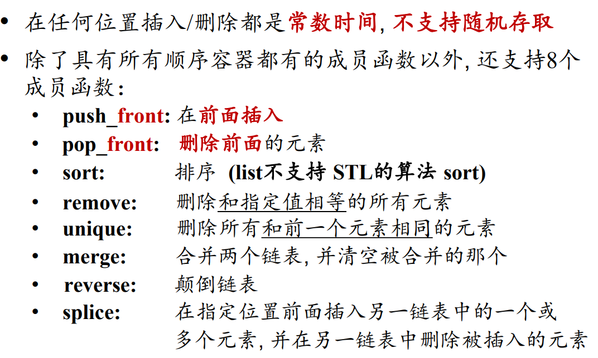
  
  - 
  
  - ```c++
    #include <algorithm>
    #include <iostream>
    #include <list>
    
    using namespace std;
    class A {
    private:
      int n;
    
    public:
      A(int n_) { n = n_; }
      friend bool operator<(const A &a1, const A &a2);
      friend bool operator==(const A &a1, const A &a2);
      friend ostream &operator<<(ostream &o, const A &a);
    };
    
    bool operator<(const A &a1, const A &a2) { return a1.n < a2.n; }
    bool operator==(const A &a1, const A &a2) { return a1.n == a2.n; }
    
    ostream &operator<<(ostream &o, const A &a) {
      o << a.n;
      return o;
    }
    // 定义模板函数PrintList
    template <class T> void PrintList(const list<T> &lst) {
      int tmp = lst.size();
      if (tmp > 0) {
        typename list<T>::const_iterator i; // typename用于声明依赖类型
        for (i = lst.begin(); i != lst.end(); i++){
            cout << *i << ", ";   
        } // 因为list不支持随机访问,所以只能使用双向迭代器
      }
    }
    int main() {
      list<A> lst1, lst2;
      lst1.push_back(1);
      lst1.push_back(3);
      lst1.push_back(2);
      lst1.push_back(4);
      lst1.push_back(2);
      lst2.push_back(10);
      lst2.push_front(20);
      lst2.push_back(30);
      lst2.push_back(30);
      lst2.push_back(30);
      lst2.push_front(40);
      lst2.push_back(40);
      cout << "1) ";
      PrintList(lst1);
      cout << endl;
      cout << "2) ";
      PrintList(lst2);
      cout << endl;
      lst2.sort(); // 默认的排序函数,按照从小到大的顺序排序
      cout << "3) ";
      PrintList(lst2);
      cout << endl;
    
      lst2.pop_front();
      cout << "4) ";
      PrintList(lst2);
      cout << endl;
      lst1.remove(2); // 删除所有与2相同的元素
      cout << "5) ";
      PrintList(lst1);
      cout << endl;
      lst2.unique(); // 删除所有和前一个元素相等的元素(去重)
      cout << "6) ";
      PrintList(lst2);
      cout << endl;
      lst1.merge(lst2); // 合并ls2到ls1并清空ls2
      PrintList(lst1);
      cout << endl;
      cout << "8) ";
      PrintList(lst2);
      cout << endl;
      lst1.reverse(); // 翻转
      cout << "9) ";
      PrintList(lst1);
      cout << endl;
    
      lst2.push_back(100);
      lst2.push_back(200);
      lst2.push_back(300);
      lst2.push_back(400);
      list<A>::iterator p1, p2, p3;
      p1 = find(lst1.begin(), lst1.end(), 3);
      p2 = find(lst2.begin(), lst2.end(), 200);
      p3 = find(lst2.begin(), lst2.end(), 400);
      lst1.splice(p1, lst2, p2, p3); // 将[p2,p3)插入p1之前,并从lst2中删除[p2,p3)
      cout << "11) ";
      PrintList(lst1);
      cout << endl;
      cout << "12) ";
      PrintList(lst2);
      cout << endl;
      return 0;
    }
    ```
  
  - 
  
- 上述三种容器成为顺序容器,是因为**元素插入的位置同元素的值无关**

- vector在非尾部的时间复杂度为$O(n)$,尾部为$O(1)$

- list的插入和删除均是$O(1)$

- deque在在两端的增删都是$O(1)$


#### 关联容器

> 关联容器内的元素是**排序**的, 插入任何元素, 都按相应的排序准则来确定其位置
>
> 关联容器的特点是在 **“查找” **时具有非常好的性能
>
> 下述四种容器通常以**平衡二叉树**方式实现
>
> > 平衡二叉树是一种特殊类型的二叉树，它可以保持数据的有序性，同时通过自我调整来保持树的高度平衡，从而实现在最坏情况下依然具有良好的查找、插入和删除性能。在一个平衡二叉树中，每个节点的左子树和右子树的高度差被严格控制在某个固定范围内。
> >
> > 平衡二叉树的目的是防止二叉查找树在极端情况下退化为链表，导致其操作的时间复杂度增加到O(n)。通过维持树的高度平衡，这些操作的时间复杂度可以保持在O(log n)。
> >
> > ### 常见类型的平衡二叉树
> >
> > 1. **AVL树**：
> >    - AVL树是最早的自平衡二叉查找树之一。在AVL树中，任何节点的两个子树的高度最大差别为一。这种高度平衡要求使得AVL树在增加和删除节点时可能需要通过一次或多次树旋转来重新平衡自身。
> >
> > 2. **红黑树**：
> >    - 红黑树是一种更加宽松平衡的二叉查找树。它通过确保没有一条路径会比其他路径长出两倍来近似平衡。具体规则包括：节点是红色或黑色；根节点是黑色；所有叶子（NIL节点）是黑色；如果一个节点是红色的，则它的子节点必须是黑色的；从任一节点到其每个叶子的所有路径都包含相同数目的黑色节点。
> >
> > 3. **Treap（树堆）**：
> >    - Treap结合了二叉搜索树和堆的性质。节点按键排序，但每个节点也赋予一个随机优先级，其父节点的优先级必须大于子节点的优先级，这通过旋转操作维持。Treap在平均情况下保持平衡，并且插入和删除操作的期望时间复杂度为O(log n)。
> >
> > 4. **Splay树**：
> >    - Splay树通过一种称为“伸展”的操作来保持树的平衡，该操作将被访问的节点通过一系列的旋转操作移到树根。这种方法不仅保证了平均的平衡性而且还具有潜在的局部性优势，即频繁访问的节点更容易访问。
> >
> > 5. **B树和B+树**：
> >    - 虽然严格来说不是二叉树，但B树和B+树在数据库和文件系统中广泛使用，因为它们非常适合大量数据的存储和访问。B树通过保持所有叶子节点在同一深度来保持平衡，每个节点可以有多个子女，这使得树的高度大大降低。
> >
> > ### 总结
> > 平衡二叉树的设计和实现是为了解决二叉查找树在极端情况下效率低下的问题。通过确保树的高度大致平衡，这些树结构能够提供快速的查找、插入和删除操作，非常适合用于需要高效数据检索的应用中。
>
> 插入和检索的时间都是$O(logn)$​
>
> - set/multiset `<set>`
>   - **集合**, set不允许相同元素, multiset中允许存在相同的元素
>
> - map/multimap `<map>`
>   - **映射**, map与set的不同在于map中存放的是key/value对并**根据key对元素**进行排序, 可快速地根据key来检索元素
>   - map同multimap的不同在于是否允许相同key的元素

> 支持以下成员函数:
>
> - `find` : 查找
> - `lower_bound`
> - `upper_bound`
> - `count` : 用于计算等于某个值的元素个数
> - `insert`  : 插入元素

##### multiset

```c++
template <class Key, class Pred = less<Key>, class A = allocator<Key>>
class multiset {};

```

```c++
multiset <A> a;
multiset<A, less<A>> a; // 二者等效
```


```c++
#include <iostream>
#include <iterator> // 包含 ostream_iterator 和 copy 函数
#include <set>      // 包含 multiset 的头文件

using namespace std;

class A {
private:
  int n;

public:
  A(int n_) { n = n_; }
  friend ostream &operator<<(ostream &o, const A &a) {
    o << a.n;
    return o;
  }
  friend bool operator<(const A &a1, const A &a2) { return a1.n < a2.n; }
  friend class MyLess; // 声明友元类
};
class MyLess { // 函数对象类,按照个位的大小排序
public:
  bool operator()(const A &a1, const A &a2) const {
    return (a1.n % 10) < (a2.n % 10);
  }
};

typedef multiset<A> MSET1;
typedef multiset<A, MyLess> MSET2;

int main() {
  const int SIZE = 5;
  A a[SIZE] = {4, 22, 19, 8, 33};

  ostream_iterator<A> output(cout, ", "); // 用于输出 multiset 中的元素

  MSET1 m1;
  m1.insert(a, a + SIZE); // 插入从 a 到 a+SIZE 位置的所有元素到集合中
  m1.insert(A(22));       // 插入一个新的 A 对象，而不是整数
  cout << "1) " << m1.count(22) << endl;
  MSET1::const_iterator p;
  cout << "2) ";
  for (p = m1.begin(); p != m1.end(); p++)
    cout << *p << ", ";
  cout << endl;

  MSET2 m2;
  m2.insert(a, a + SIZE);             // 使用 MyLess 比较函数插入元素
  copy(m2.begin(), m2.end(), output); // 输出 MSET2 中的元素
  cout << endl;

  MSET1::iterator pp = m1.find(A(19)); // 使用 A 对象作为查找目标
  if (pp != m1.end())
    cout << "found" << endl;

  cout << "4) ";
  copy(m1.begin(), m1.end(), output); // 输出 MSET1 中的元素

  MSET1::iterator lower = m1.lower_bound(A(22)); // 查找第一个不小于 22 的元素
  MSET1::iterator upper = m1.upper_bound(A(22)); // 查找第一个大于 22 的元素
  cout << "5) " << *lower << ", " << *upper << endl;

  pair<MSET1::iterator, MSET1::iterator> pr =
      m1.equal_range(A(22)); // 查找等于 22 的元素范围
  cout << "6) " << *pr.first << ", " << *pr.second << endl;

  return 0;
}
```

```
1) 2
2) 4, 8, 19, 22, 22, 33,
22, 33, 4, 8, 19,
found
4) 4, 8, 19, 22, 22, 33, 5) 22, 33
6) 22, 33
```


> ==注意==:由于**less** 模板是用**<** 进行比较的, 所以这要求 A 的
>
> 对象能用 **<** 比较, 即必须重载 **<** 如果没有重载`<`,则会报错

- 成员函数

| 成员函数                                             | 用途描述                                                     |
| ---------------------------------------------------- | ------------------------------------------------------------ |
| `iterator find(const T& val)`                        | 查找一个值为 `val` 的元素并**返回指向该元素的迭代器**，如果未找到则返回 `end()`。 |
| `iterator insert(const T& val)`                      | 插入一个值为 `val` 的元素到 `multiset` 中，并**返回指向该元素的迭代器**。 |
| `void insert(iterator first, iterator last)`         | 插入一个范围 `[first, last)` 的元素到 `multiset` 中。        |
| `int count(const T& val)`                            | 统计 `multiset` 中与 `val` 相等的元素的数量。                |
| `iterator lower_bound(const T& val)`                 | 返回一个迭代器，它指向第一个不小于 `val` 的元素。            |
| `iterator upper_bound(const T& val)`                 | 返回一个迭代器，它指向第一个大于 `val` 的元素。              |
| `pair<iterator, iterator> equal_range(const T& val)` | 返回一对迭代器，指示一个范围，包括所有与 `val` 相等的元素（`lower_bound` 和 `upper_bound` 的返回值）。使用`it.begin()`和`it.end()`来访问 |

这些成员函数提供了在 `multiset` 中进行搜索、插入和计数等操作的手段。由于 `multiset` 是一个有序容器，其中的元素根据特定的排序准则排列，这些成员函数能够高效执行。特别是 `lower_bound`、`upper_bound` 和 `equal_range` 这些函数利用了容器元素的有序特性，提供了快速定位元素的能力。

**附加内容 `pair`对象**


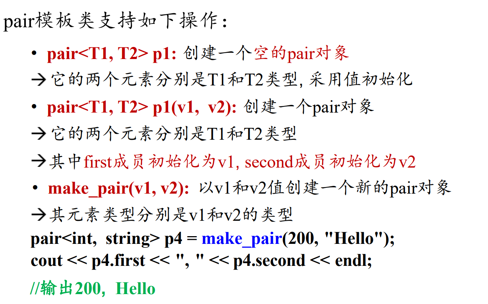

**`make_pair`**

> 其中`make pair`的介绍如下
>
> `make_pair` 是 C++ 标准库中的一个函数模板，它用于创建并返回一个 `std::pair` 对象，而无需直接指定其模板参数类型。`std::pair` 是一个结构，它可以将两个值组合成一个单一的对象，这两个值可以是同一种类型或不同类型的数据。`make_pair` 根据提供给它的两个值的类型**自动推导**出这个 `pair` 的类型。
>
> ##### 用法
>
> `make_pair` 的基本用法如下：
>
> ```cpp
> std::pair<T1, T2> p = std::make_pair(value1, value2);
> ```
>
> 其中，`value1` 和 `value2` 是要存储在 `pair` 中的值，`T1` 和 `T2` 是它们的类型。使用 `make_pair` 可以省去手动填写类型 `T1` 和 `T2`，让编译器自动进行类型推导。
>
> ##### 示例
>
> ```cpp
> #include <utility>  // For std::make_pair
> #include <iostream> // For std::cout
> 
> int main() {
>     auto p = std::make_pair(10, "Hello"); // 创建一个包含整数和字符串的pair对象
>     std::cout << "First: " << p.first << ", Second: " << p.second << std::endl;
> 
>     return 0;
> }
> ```
>
> 在这个示例中，`make_pair` 用于创建一个包含整数 (`int`) 和 C-style 字符串 (`const char*`) 的 `pair` 对象，而无需显式指定这些类型。
>
> `make_pair` 非常适合用在需要简洁地创建 `pair` 对象的场景中，特别是当与标准库容器或算法一起使用时，如 `std::map` 或 `std::set` 的插入操作。

##### set

> 如果定义`set`容器的元素为`pair`类型,则可以承担`map`的功能


```c++
#include <set>
#include <iostream>
#include <iterator>
using namespace std;

int main() {
    typedef set<double, less<double>> double_set;
    const int SIZE = 5;
    double a[SIZE] = {2.1, 4.2, 9.5, 2.1, 3.7};
    double_set doubleSet(a, a+SIZE);
    
    ostream_iterator<double> output(cout, " ");
    cout << "1) ";
    copy(doubleSet.begin(), doubleSet.end(), output);
    cout << endl;
    
    pair<double_set::const_iterator, bool> p;
    p = doubleSet.insert(9.5);
    if (p.second) {
        cout << "2) " << *(p.first) << " inserted" << endl;
    } else {
        cout << "2) " << *(p.first) << " not inserted" << endl;
    }
}

```

```
1) 2.1 3.7 4.2 9.5 
2) 9.5 not inserted
```

**关于`insert`函数返回值是一个`pair`对象，其`first`是被插入元素的迭代器，`second`代表是否成功插入了**(bool)==重要==

##### multimap


```c++
#include <iostream>
#include <map>
using namespace std;

int main() {
  typedef multimap<int, double, less<int>> mmid;
  mmid mmpairs;

  // 输出部分
  cout << "1) " << mmpairs.count(15) << endl; // 输出: 1) 0

  mmpairs.insert(mmid::value_type(15, 99.3));
  mmpairs.insert(mmid::value_type(15, 2.7));

  // 输出部分
  cout << "2) " << mmpairs.count(15) << endl; // 输出: 2) 2

  mmpairs.insert(mmid::value_type(30, 111.11));
  mmpairs.insert(mmid::value_type(10, 22.22));
  mmpairs.insert(mmid::value_type(25, 33.333));
  mmpairs.insert(mmid::value_type(20, 9.3));

  for (mmid::const_iterator i = mmpairs.begin(); i != mmpairs.end(); ++i) {
    cout << "(" << i->first << ", " << i->second << ") ";
  }
  cout << endl;

  // 输出的结果:
  // 1) 0
  // 2) 2
  // (10, 22.22) (15, 99.3) (15, 2.7) (20, 9.3) (25, 33.333) (30, 111.11)
}

```


##### map


```c++
#include <iostream>
#include <map>
using namespace std;

// 重载<<运算符以便直接输出pair<int, double>
ostream &operator<<(ostream &o, const pair<int, double> &p) {
  o << "(" << p.first << ", " << p.second << ")";
  return o;
}

int main() {
  typedef map<int, double, less<int>> mmid;
  mmid pairs;

  // 输出部分
  cout << "1) " << pairs.count(15) << endl; // 输出: 1) 0

  // insert pair using make_pair
  pairs.insert(mmid::value_type(15, 2.7)); // make_pair可以替换为value_type
  pairs.insert(make_pair(15, 99.3));       // inserts pair into map

  // 输出部分
  cout << "2) " << pairs.count(15) << endl; // 输出: 2) 1

  pairs.insert(mmid::value_type(20, 9.3));

  // iterator declaration
  mmid::iterator i;

  // 输出部分
  cout << "3) ";
  // 使用重载的<<运算符输出pairs中的元素
  for (i = pairs.begin(); i != pairs.end(); ++i)
    cout << *i << " ";
  cout << endl; // 输出结果：(15, 99.3) (20, 9.3)

  pairs[15] = 6.28; // 更改键为15的值
  pairs[40] = 0;    // 插入键为40的值

  // 输出部分
  cout << "4) ";
  // 再次输出所有元素
  for (i = pairs.begin(); i != pairs.end(); ++i)
    cout << *i << " ";
  cout << endl; // 输出结果：(15, 6.28) (20, 9.3) (40, 0)
}

```

> 在 C++ 标准模板库（STL）中，`value_type` 是一个关联容器（如 `std::map`、`std::set`、`std::multimap` 等）的成员类型，它表示容器中存储的元素的类型。对于 `std::map` 来说，`value_type` 通常是一个 `std::pair`，其中包含一个键（key）和一个值（value）。
>
> 例如，在 `std::map<int, double>` 中，`value_type` 是 `std::pair<int, double>`。这意味着每个元素都是一个键值对，其中键是 `int` 类型，值是 `double` 类型。
>
> `value_type` 在几种情况下非常有用：
>
> 1. **插入元素**：当你想要插入一个新元素到关联容器中时，你可以使用 `value_type` 来指定元素的类型。这通常与 `insert` 方法一起使用，如 `pairs.insert(mmid::value_type(15, 2.7));`。这样做的好处是你不需要显式地创建一个 `std::pair` 实例，而是==直接使用 `value_type` 构造函数。==
>
> 2. **迭代器解引用**：当你遍历关联容器时，迭代器解引用得到的是 `value_type` 类型的引用或副本。这允许你直接访问或修改容器中的元素。
>
> 3. **容器的元素访问**：在某些关联容器中，如 `std::map`，你可以使用 `at` 方法来访问或修改元素。`at` 方法接受一个键，并返回一个 `reference` 到对应的 `value_type`。
>
> 在提供的代码示例中，`value_type` 被用于两种情况：
>
> 1. 插入新元素到 `std::map` 中，使用 `mmid::value_type(15, 2.7)` 来创建一个新的键值对。
>
> 2. 在遍历 `std::map` 时，迭代器 `i` 解引用得到的是 `value_type` 类型的引用，因此可以直接使用 `*i` 来访问和输出每个元素。
>
> 使用 `value_type` 可以提高代码的可读性和可维护性，因为它避免了需要显式指定元素类型，使得代码更加简洁和清晰。


#### 容器适配器


##### stack `<stack>`

- **栈**,项的有限序列, 并满足序列中被删除、检索和修改的项只能 是最近插入序列的项. 即按照**后进先出**的原则


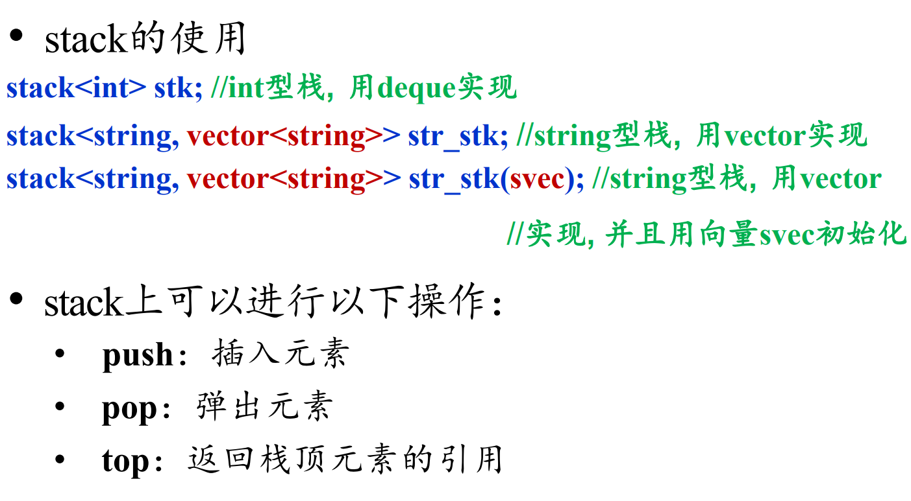

##### queue `<queue>`

- **队列**,插入只可以在尾部进行, 删除、检索和修改只允许从头部 进行. 按照**先进先出**的原则

  

##### priority_queue `<queue>`

- **优先级队列**,最高优先级的元素总是第一个出列(内部进行了比较操作)


> 大根堆（Max-Heap）和小根堆（Min-Heap）是二叉堆的两种形式，都是一种常见的数据结构，主要用于实现优先队列。二叉堆通常通过一个数组来实现，而且它是一个完全二叉树，即除了最底层，每层节点都是满的，最底层的节点则尽可能地集中在左边。
>
> ### 大根堆（Max-Heap）
>
> 在大根堆中，任何一个父节点的值都大于或等于其子节点的值。这意味着堆的根节点总是存储最大值。大根堆常用于实现优先队列，其中最大元素需要被首先取出（例如，用于任务调度，取出最高优先级任务）。
>
> #### 操作：
> - **插入（Insert）**：新元素被添加到堆的末端（即树的最底层最右边），然后向上调整（上浮），直到父节点的值不再小于这个插入的新元素。
> - **删除最大元素（Delete Max）**：通常删除的是堆顶元素，即最大元素。删除后，通常将堆中最后一个元素移到堆顶，然后进行下沉操作，以恢复大根堆的性质。
>
> ### 小根堆（Min-Heap）
>
> 在小根堆中，任何一个父节点的值都小于或等于其子节点的值。这意味着堆的根节点总是存储最小值。小根堆常用于需要快速访问最小元素的场景（例如，数据流的最小值查询，Dijkstra算法中的最短路径问题）。
>
> #### 操作：
> - **插入（Insert）**：新元素被添加到堆的末端，然后进行上浮操作，直到父节点的值不再大于这个插入的新元素。
> - **删除最小元素（Delete Min）**：通常删除的是堆顶元素，即最小元素。删除后，将堆中最后一个元素移到堆顶，然后进行下沉操作，以恢复小根堆的性质。
>
> ### 实现
>
> 在C++中，可以使用标准库中的 `std::priority_queue` 来实现大根堆。对于小根堆的实现，可以给 `std::priority_queue` 提供一个比较函数，以逆转其默认的比较行为。
>
> ```cpp
> #include <iostream>
> #include <queue>
> #include <vector>
> #include <functional>
> 
> // 默认是大根堆
> std::priority_queue<int> maxHeap;
> 
> // 小根堆，使用greater<>
> std::priority_queue<int, std::vector<int>, std::greater<int>> minHeap;
> 
> int main() {
>     // 添加元素到大根堆
>     maxHeap.push(10);
>     maxHeap.push(20);
>     maxHeap.push(15);
> 
>     std::cout << "Max-Heap top: " << maxHeap.top() << std::endl; // 20
> 
>     // 添加元素到小根堆
>     minHeap.push(10);
>     minHeap.push(20);
>     minHeap.push(15);
> 
>     std::cout << "Min-Heap top: " << minHeap.top() << std::endl; // 10
> }
> ```
>
> ### 总结
>
> 大根堆和小根堆都是高效管理数据的方式，可以在O(log n)时间内进行插入和删除根元素的操作，是实现优先队列的理想选择。根据具体需求选择合适的堆类型是关键，它们提供了一种既高效又直观的方式来处理那些需要频繁插入和删除并且需要快速访问最大或最小元素的场景。

#### 共有成员函数

##### 所有标准库容器共有的成员函数


- 相当于按词典顺序比较两个容器的运算符:`=, < , <= , > , >=, == , !=`
- `empty`: 判断容器中是否有元素 
- `max_size`: 容器中最多能装多少元素 
-  `size`: 容器中元素个数 
- `swap`: 交换两个容器的内容

```c++
#include <iostream>
#include <vector>

using namespace std;
class A {
private:
  int n;

public:
  friend bool operator<(const A &, const A &);
  A(int n_) { n = n_; }
};
bool operator<(const A &o1, const A &o2) { return o1.n < o2.n; }
int main() {
  vector<A> v1;
  vector<A> v2;
  v1.push_back(A(5));
  v1.push_back(A(1));
  v2.push_back(A(1));
  v2.push_back(A(2));
  v2.push_back(A(3));
  cout << (v1 < v2);
  return 0;
}
```

```
0
```

> 关于比较顺序
>
>  这段代码定义了一个名为 `A` 的类，该类有一个私有成员变量 `n`，并提供了一个构造函数来初始化这个成员变量。类 `A` 还声明了一个输出运算符 `<` 作为其友元函数，使得两个 `A` 类型的对象可以使用这个运算符进行比较。
>
>   在 `main` 函数中，创建了两个 `vector<A>` 类型的向量 `v1` 和 `v2`。向量 `v1` 中按顺序插入了两个 `A` 类型的对象，其 `n` 值分别为 5 和 1。向量 `v2` 中按顺序插入了三个 `A` 类型的对象，其 `n` 值分别为 1、2 和 3。
>
>   最后，代码使用 `<` 运算符比较两个向量 `v1` 和 `v2`，并将结果输出到 `cout`。在 C++ 中，当使用 `<` 运算符比较两个 `vector` 时，它会逐个元素地比较两个向量中的元素，直到找到第一个不相等的元素或者到达向量的末尾。
>
>   比较顺序如下：
>
>   1. 比较 `v1` 和 `v2` 中的第一个元素。`v1` 的第一个元素的 `n` 值为 5，`v2` 的第一个元素的 `n` 值为 1。因为 5 大于 1，所以 `v1` 不小于 `v2`，比较停止，输出 `false`。
>   2. 如果 `v1` 和 `v2` 的第一个元素相等，那么会比较第二个元素，以此类推，直到找到不相等的元素或者比较完所有元素。
>   3. 如果所有元素都相等，且两个向量的长度也相等，那么认为两个向量相等（即 `v1 < v2` 为 `false`）。
>   4. 如果所有元素都相等，但向量长度不同，那么较短的向量被认为是较小的（即 `v1 < v2` 为 `true`，如果 `v1` 较短）。
>
>   在这个例子中，由于 `v1` 的第一个元素的 `n` 值就大于 `v2` 的第一个元素的 `n` 值，所以 `v1 < v2` 的结果为 `false`，因此输出将是 `0`（`false` 在布尔上下文中的值）。

##### 只在第一类容器中有的函数

> 顺序容器和关联容器


- begin 返回指向容器中**第一个元素**的迭代器 
-  end 返回指向容器中**最后一个元素后面**的位置的迭代器
-  rbegin 返回指向容器中**最后一个元素**的迭代器
-  rend 返回指向容器中**第一个元素前面的位置**的迭代器 
- erase 从容器中删除一个或几个元素

  - > 在讨论`erase`函数时，首先需要指出你是在询问哪种编程语言或具体的数据结构的`erase`方法，因为不同的环境和库中的`erase`函数可能具有不同的行为和接口。在C++标准模板库（STL）中，`erase`方法被广泛用于各种容器类型，例如`std::vector`, `std::list`, `std::map`, 等等。我将基于C++ STL容器来进行介绍。
    >
    > ### 1. `std::vector`, `std::deque`, `std::string`
    >
    > 对于序列容器如`std::vector`, `std::deque`，和`std::string`，`erase`函数通常具有以下形式：
    >
    > - **参数**:
    >   - **单参数**: 接受一个迭代器`pos`，指向要删除的元素。
    >   - **双参数**: 接受两个迭代器`first`和`last`，表示一个范围，该范围内的元素将被删除（包含`first`，不包含`last`）。
    >
    > - **返回值**:
    >   - 返回一个迭代器，指向被删除的最后一个元素之后的元素。如果删除的是容器中的最后一个元素，则返回`end()`。
    >
    > 例如，对于`std::vector<int> vec = {1, 2, 3, 4, 5};`，调用`vec.erase(vec.begin() + 2);`将删除元素`3`，并返回一个指向元素`4`的迭代器。
    >
    > ### 2. `std::list`
    >
    > 对于`std::list`，`erase`的使用方法与`std::vector`相似，但由于`std::list`的节点基于链表实现，其删除操作效率更高，不涉及元素的移动。
    >
    > - **参数**和**返回值**与`std::vector`相同。
    >
    > ### 3. `std::map`, `std::set`
    >
    > 对于关联容器如`std::map`和`std::set`：
    >
    > - **参数**:
    >   - **单参数**: 接受一个指向要删除元素的迭代器。
    >   - 对于`std::map`，还可以接受一个键值作为参数来直接删除与键关联的元素。
    >
    > - **返回值**:
    >   - 对于单迭代器版本，`std::map`和`std::set`不返回新的迭代器。在C++11及以后版本，此函数返回void。
    >   - 对于接受键值的重载（只适用于`std::map`），返回被删除元素的数量（0或1）。
    >
    > 例如，`std::map<std::string, int> myMap = {{"one", 1}, {"two", 2}};` 调用`myMap.erase("two");`将删除键为`"two"`的元素。
    >
    > ### 总结
    >
    > 在使用`erase`方法时，了解具体容器的参数和返回值特性是非常重要的，这样可以确保你的代码既高效又符合预期。特别是在涉及效率和资源管理的上下文中，正确地使用`erase`对于性能优化尤为关键。

- clear 从容器中删除所有元素

==请注意正向迭代器器和反向迭代器不属于同一种迭代器==

##### 顺序容器

除前述共同操作外, **顺序容器**还有以下共同操作：

- front(): 返回容器中第一个元素的引用 

- back(): 返回容器中最后一个元素的引用

- push_back(): 在容器的末尾增加新元素

-  pop_back(): 删除容器末尾的元素

  >  例：查 list::front 的help, 得到的定义是： 
  >
  > ` reference front();` 
  >
  > ` const_reference front() const;`
  >
  > **list有两个front函数**
  >
  > 
  >
  > `reference`和`const_reference`是typedef的类型
  >
  > 对于 `list <double>`, 
  >
  > ` list::refrence` 实际上就是 `double &`
  >
  > ` list::const_refreence `实际上就是 `const double & `
  >
  > 对于 `list <int>`, 
  >
  > ` list::refrence `实际上就是` int & 
  >
  > ` list::const_refrence` 实际上就是 `const int &`

### 迭代器

> 可以一次存取容器中元素的工具
>
> - 普通的c++指针就是一种迭代器

- 用于指向**第一类容器**中的元素, 有const 和非 const两种
- 通过迭代器可以读取它指向的元素
  - 通过非const迭代器还能修改其指向的元素
  - 迭代器用法和指针类似
  - > 考虑自定义的类能被迭代器正常的访问
    >
    > 当你使用C++标准库容器（如`std::vector`, `std::list`, `std::map`等）来管理自定义类的对象时，通常不需要为迭代器进行特化。迭代器是容器自身提供的，设计用来遍历容器中的元素。如果你的类能够被容器正确管理，通常需要考虑以下几点：
    >
    > 1. **构造函数与析构函数**：
    >    - 确保你的类有适当的构造函数、拷贝构造函数、移动构造函数、析构函数等。这些都是管理类对象生命周期的基本要求。
    >
    > 2. **赋值操作符**：
    >    - 提供拷贝赋值运算符和移动赋值运算符。这些是在容器重新分配空间、插入元素或删除元素时可能需要调用的。
    >
    > 3. **比较操作符**（如果需要）：
    >    - 如果你的类对象将被用于需要元素比较的操作（如在`std::set`中，或者用于`std::sort`对`std::vector`排序），你需要重载适当的比较运算符（如`<`, `==`等）。
    >
    > 4. **哈希函数**（对于需要散列的容器，如`std::unordered_set`或`std::unordered_map`）：
    >    - 如果使用散列容器，你需要为你的类型提供一个哈希函数。这通常通过特化`std::hash<T>`模板来实现。
    >
    > ### 示例
    >
    > 假设你有一个简单的自定义类`Point`，并希望在`std::vector`中使用它：
    >
    > ```cpp
    > #include <vector>
    > #include <algorithm>
    > 
    > class Point {
    > public:
    >     int x, y;
    > 
    >     Point(int x = 0, int y = 0) : x(x), y(y) {}
    > 
    >     // 拷贝构造函数和赋值运算符
    >     Point(const Point& other) : x(other.x), y(other.y) Point& operator=(const Point& other) {
    >         if (this != &other) {
    >             x = other.x;
    >             y = other.y;
    >         }
    >         return *this;
    >     }
    > 
    >     // 移动构造函数和赋值运算符
    >     Point(Point&& other) noexcept : x(other.x), y(other.y) {
    >         other.x = 0; other.y = 0;
    >     }
    >     Point& operator=(Point&& other) noexcept {
    >         if (this != &other) {
    >             x = other.x;
    >             y = other.y;
    >             other.x = 0; other.y = 0;
    >         }
    >         return *this;
    >     }
    > 
    >     // 比较运算符
    >     bool operator<(const Point& rhs) const {
    >         return x < rhs.x || (x == rhs.x && y < rhs.y);
    >     }
    > };
    > 
    > int main() {
    >     std::vector<Point> points;
    >     points.push_back(Point(1, 2));
    >     points.push_back(Point(3, 4));
    >     std::sort(points.begin(), points.end());  // 需要比较运算符
    > }
    > ```
    >
    > 在这个例子中，`Point` 类提供了必要的构造函数和赋值运算符，以及用于排序的比较运算符。你不需要为迭代器做特殊处理，因为`std::vector<Point>`的迭代器由标准库直接提供。
    >
    > 总的来说，只要确保你的类具有合适的构造、赋值、比较逻辑，以及（在需要的情况下）适当的哈希函数，就可以在STL容器中有效地管理自定义类型的对象。

```c++
// 定义一个容器类的迭代器
容器类::iterator 变量名;
容器类名::const_iterator 变量名;
// 访问迭代器变量名
* 迭代器变量名
```

- 迭代器可以 ++ 操作, 以指向容器中的下一个元素 
- 如果迭代器到达了容器中的最后一个元素的后面, 则迭代器变成past-the-end值 (一般对应`容器.end()`)
- 使用一个past-the-end值的迭代器来访问对象是非法的
- 类似用NULL或未初始化的指针一样(**但是相比于直接使用指针要更加安全**)

```c++
#include <iostream>
#include <vector>

using namespace std;
int main() {
  vector<int> v;
  v.push_back(1);
  v.push_back(2);
  v.push_back(3);
  v.push_back(4);
  vector<int>::const_iterator i; // 常量迭代器
  for (i = v.begin(); i != v.end(); i++)
    cout << *i << ", ";
  cout << endl;
  vector<int>::reverse_iterator r; // 反向迭代器
  for (r = v.rbegin(); r != v.rend(); r++)
    cout << *r << ", ";
  cout << endl;
  vector<int>::iterator j; // 非常量迭代器
  for (j = v.begin(); j != v.end(); j++)
    *j = 100;
  for (i = v.begin(); i != v.end(); i++)
    cout << *i << ", ";
}
```

- 不同容器上支持的迭代器功能强弱有所不同
- 容器的迭代器的功能强弱, 决定了该容器是否支持STL中的某种算法 
-  **只有第一类容器能用迭代器遍历 **(recall:顺序容器和关联容器)
-  **排序算法需要通过随机迭代器来访问容器中的元素**,  那么有的容器就不支持排序算法

#### 迭代器的分类

STL 中的迭代器按功能分为5种： 

- 1. **输入**:Input iterators 提供对数据的**只读**访问 

- 1. **输出**:Output iterators 提供对数据的**只写**访问 

- 2. **正向**:Forward iterators 提供**读写**操作, 并能一次一个地**向后**推进迭代器 

- 2. **反向**:Reserve iterators 提供**读写**操作, 并能一次一个地**向前**推进迭代器 

- 3. **双向**:Bidirectional iterators提供**读写**操作, 并能一次一个地**向前或向后**移动 

- 4. **随机访问**:Random access iterators提供**读写**操作, 并能在数据中**随机移动** , 

   

   编号大的迭代器拥有编号小的迭代器的全部功能,能当作编号小的迭代器使用

   不同迭代器所能进行的操作(功能): 

   1. 所有迭代器： `++p, p ++ `
   2.  输入迭代器： `* p, p = p1, p == p1, p!= p1 `
   3.  输出迭代器：` * p, p = p1 `
   4. 正向迭代器： 上面全部 
   5. 双向迭代器： 上面全部,` --p, p --,`
   6. 随机访问迭代器:上面全部,以及
      1. 移动i个单元:`p+= i, p -= i, p + i, p - i `
      2. 大于小于比较:` p < p1, p <= p1, p > p1, p>= p1`
      3. 数组下标p[i]: p 后面的第i个元素的引用


> 在 C++ 中，`std::deque`（双端队列）是一个容器适配器，它提供了从两端进行插入和删除操作的能力。`std::deque` 支持随机访问迭代器，这可能看起来有些不直观，因为 `std::deque` 的设计初衷是为了提供快速的双端访问和修改，而不是为了提供像 `std::vector` 那样的快速随机访问。
>
> `std::deque` 支持随机访问迭代器的原因主要有以下几点：
>
> 1. **通用性**：C++ 标准库的设计目标之一是提供通用的接口和算法。通过支持随机访问迭代器，`std::deque` 可以与需要随机访问迭代器的算法无缝协作，例如 `std::sort`、`std::for_each` 等。
>
> 2. **灵活性**：虽然 `std::deque` 的主要优势在于双端操作，但支持随机访问迭代器使得它可以在需要随机访问的场景中使用，增加了其灵活性。
>
> 3. **迭代器性能**：`std::deque` 的迭代器提供了与 `std::vector` 类似的性能特性。在大多数情况下，访问 `std::deque` 中的元素与访问 `std::vector` 中的元素速度相近。这是因为 `std::deque` 内部使用了一个节点列表，每个节点包含多个元素，这使得迭代器可以在不涉及节点分配和释放的情况下快速移动。
>
> 4. **内存分配**：`std::deque` 通过使用多个固定大小的块来存储元素，这些块在内存中可以是连续的，也可以是不连续的。当使用随机访问迭代器时，`std::deque` 可以通过直接计算块和偏移量来快速定位元素，这与 `std::vector` 的随机访问性能相似。
>
> 5. **算法要求**：许多标准库算法要求输入范围支持随机访问迭代器。为了使 `std::deque` 能够与这些算法兼容，它提供了随机访问迭代器。
>
> 尽管 `std::deque` 支持随机访问迭代器，但在实际使用中，频繁的随机访问可能不是 `std::deque` 的最佳使用场景。如果你的应用主要涉及到随机访问而不是双端操作，那么 `std::vector` 或 `std::array` 可能是更好的选择，因为它们的随机访问性能通常更优。

#### 输入输出流迭代器


需要实现

- `*`
- `++`

```c++
#include <iostream>
#include <list>
#include <ostream>
#include <string>
using namespace std;

template <class T1, class T2> void Copy(T1 s, T1 e, T2 x) {
  for (; s != e; ++s, ++x)
    *x = *s;
}

template <class T> class myostream_iteraotr {
  // 在此处补充你的代码
public:
  ostream *op;
  const char *link;
  T temp;
  myostream_iteraotr(ostream &os, char *link) {
    op = &os;
    this->link = link;
  }
  T &operator*() { return temp; } // 实现解引用
  myostream_iteraotr &operator++() { // 实现前置++
    (*op) << temp << link;
    return *this;
  }
};

int main() {
  const int SIZE = 5;
  int a[SIZE] = {5, 21, 14, 2, 3};
  double b[SIZE] = {1.4, 5.56, 3.2, 98.3, 3.3};
  list<int> lst(a, a + SIZE);
  myostream_iteraotr<int> output(cout, ",");
  Copy(lst.begin(), lst.end(), output);
  cout << endl;
  myostream_iteraotr<double> output2(cout, "--");
  Copy(b, b + SIZE, output2);
  return 0;
}
```

```c++
#include <iostream>
using namespace std;
int main() {
  istream_iterator<int> inputInt(cin);
  int n1, n2;
  n1 = *inputInt; // 读入n1
  inputInt++;
  n2 = *inputInt; // 读入n2
  cout << n1 << ", " << n2 << endl;
  ostream_iterator<int> outputInt(cout);
  *outputInt = n1 + n2;
  cout << endl;
  int a[5] = {1, 2, 3, 4, 5};
  copy(a, a + 5, outputInt);
  return 0;
}
```

```c++
#include <algorithm>
#include <fstream>
#include <iostream>
#include <iterator>
#include <string>
using namespace std;

template <class T> class My_ostream_iterator {
private:
  string sep; // 分隔符
  ostream &os;

public:
  My_ostream_iterator(ostream &o, string s) : sep(s), os(o) {}
  void operator++() {} // ++只需要有定义即可
  My_ostream_iterator &operator*() { return *this; }
  My_ostream_iterator &operator=(const T &val) {
    os << val << sep;
    return *this;
  }
};
template <class _II, typename _OI> inline _OI copy(_II _F, _II _L, _OI _X) {
  for (; _F != _L; ++_X, ++_F)
    *_X = *_F;
  return (_X);
}

int main() {
  int a[4] = {1, 2, 3, 4};
  My_ostream_iterator<int> oit(cout, "*");
  std::copy(a, a + 4, oit); // 输出1*2*3*4*
  ofstream oFile("test.txt", ios::out);
  My_ostream_iterator<int> oitf(oFile, "*");
  std::copy(a, a + 4, oitf); // 向test.txt文件写入1*2*3*4*
  oFile.close();
  return 0;
}
```

> 在31和34行如果不指定`std::`,则可能导致二义性
>
> 让我详细解释一下二义性问题的原因。
>
> 在 C++ 中，二义性通常指的是编译器在解析代码时遇到了多个可能的解释。在你的代码示例中，二义性问题出现在 `copy` 函数的使用上。标准库中的 `copy` 函数有两个常见的重载版本：
>
> 1. `copy(Iterator first, Iterator last, OutputIterator result)`：这个版本接受两个输入迭代器（`first` 和 `last`）和一个输出迭代器（`result`），并将 `[first, last)` 范围内的元素复制到可以通过 `result` 访问的位置。
>
> 2. `copy(FirstType first, LastType last, UnaryFunction func)`：这个版本接受两个值（`first` 和 `last`）和一个一元函数（`func`），并将 `[first, last)` 范围内的元素依次传递给 `func`。
>
> 在你的代码中，你定义了一个自定义的输出迭代器 `My_ostream_iterator`，它看起来像一个普通的迭代器，但实际上它是一个输出流的包装器。当 `copy` 函数被调用时，编译器可能会混淆应该使用哪个 `copy` 函数版本，因为 `My_ostream_iterator` 可以被误认为是第二个版本的 `UnaryFunction`。
>
> 这是因为 `My_ostream_iterator` 的行为类似于一个函数，它重载了 `operator=`，使得它看起来可以作为函数一样被调用。但实际上，你希望 `copy` 函数将其视为一个输出迭代器，而不是函数。这种混淆可能导致编译器无法确定应该使用哪个 `copy` 函数版本，从而导致二义性错误。
>
> 为了解决这个问题，你需要确保 `copy` 函数的调用明确地指定了所使用的重载版本，即 `copy(Iterator first, Iterator last, OutputIterator result)`。这可以通过使用 `std::copy` 来实现，因为 `std::copy` 明确地表示我们想要使用的是输出迭代器版本的 `copy` 函数。这样，编译器就不会将 `My_ostream_iterator` 误认为是一元函数，从而消除了二义性。
>
> 在 C++ 中，避免二义性的一个常见做法是使用 `std::` 前缀来明确指定标准库中的函数或对象，这样可以确保编译器正确解析你的代码，避免潜在的歧义。

### 算法

> - 用来操作容器中元素的函数模板
>
> - STL中提供能在各种容器中 , 例如插入/删除/  查找/排序等. 
>
> - 大约有70种标准算法 ,算法就是一个个函数模板
>
> - 算法通过迭代器来操纵容器中的元素
>
> 许多算法需要两个参数, 一个是起始元素的迭代器 ,一个是 终止元素后面一个元素的迭代器
>
> 排序和查找 
>
> 有的算法**返回一个迭代器**
>
> 例如 find() 算法, 在容器中 查找一个元素, 并返回一个指向该元素的迭代器      
>
> 算法可以处理容器 , 也可以处理c语言的数组

#### 算法简介

1) **变化序列算法**: copy, remove, fill, replace, random_shuffle, swap, … 会改变容器 
2) **非变化序列算法** : adjacent-find, equal, mismatch, find, count, search, count_if, for_each, search_n

- 以上函数模板都在`<algorithm>`中定义,还有其他算法,例如`<numeric>`中的算法

> 例子:`find()`
>
> ```c++
> template <class InIt, class T>
> InIt find(InIt first, InIt last, const T& val); 
> ```
>
> - first 和 last 这两个参数都是容器的迭代器, 它们给出了容器中的查找区间起点和终点 
> - 这个区间是个**左闭右开**的区间, 即区间的起点是位于查找范围之中的, 而终点不是 
> - ` val`参数是要查找的元素的值
> - 函数返回值是一个迭代器 
> - 如果找到, 则该迭代器**指向被找到的元素**
> - 如果找不到, 则该迭代**指向查找区间的终点**
>
> ```c++
> #include <algorithm>
> #include <iostream>
> #include <vector>
> 
> using namespace std;
> int main() {
>   int array[10] = {10, 20, 30, 40};
>   vector<int> v;
>   v.push_back(1);
>   v.push_back(2);
>   v.push_back(3);
>   v.push_back(4);
>   vector<int>::iterator p;
>   p = find(v.begin(), v.end(), 3);
>   if (p != v.end())
>     cout << *p << endl;
>   p = find(v.begin(), v.end(), 9);
>   if (p == v.end())
>     cout << "not found " << endl;
>   p = find(v.begin() + 1, v.end() - 2, 1); // 查找区间[2, 3)
>   if (p != v.end())
>     cout << *p << endl;
>   int *pp = find(array, array + 4, 20);
>   cout << *pp << endl;
> }
> ```

#### STL中的大/小/相等的概念

- STL中, 缺省的情况下, 比较大小是用 "<" 运算符进行的, 和 ">" 运算符无关 
-  使用STL时, 在缺省的情况下, 以下三个说法**等价** ： 
  - `X<Y`
  - `(X<Y)==true`
  - `Y>X`
- 与`>`无关,可以没定义

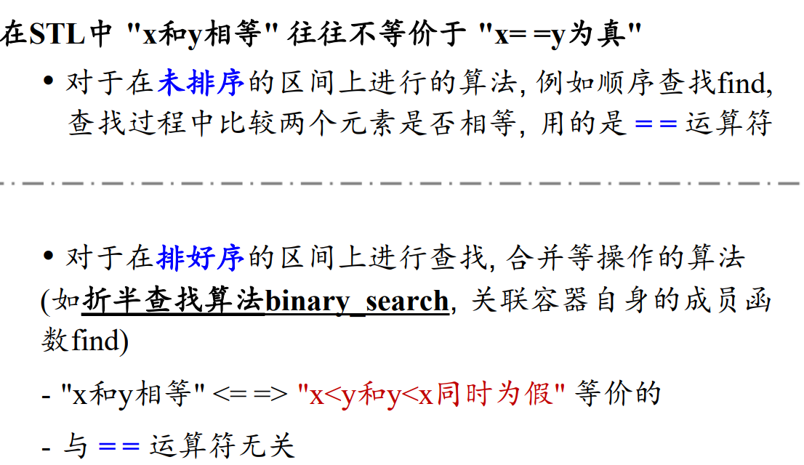

```c++
#include <algorithm>
#include <iostream>

using namespace std;
class A {
  int v;

public:
  A(int n) : v(n) {}
  bool operator<(const A &a2) const {
    cout << v << "<" << a2.v << "?" << endl;
    return false;
  }
  bool operator==(const A &a2) const {
    cout << v << "==" << a2.v << "?" << endl;
    return v == a2.v;
  }
};
// STL中 "相等" 概念演示
int main() {
  A a[] = {A(1), A(2), A(3), A(4), A(5)};
  cout << binary_search(a, a + 4, A(9)); // 折半查找
  return 0;
}
```

### 不变序列算法


| 算法名称        | 算法原型                                                     | 算法功能                                     |
| --------------- | ------------------------------------------------------------ | -------------------------------------------- |
| `count`         | `template <class InputIterator, class T> typename iterator_traits<InputIterator>::difference_type count(InputIterator first, InputIterator last, const T& val)` | 统计区间中等于特定值的元素个数               |
| `count_if`      | `template <class InputIterator, class Predicate> typename iterator_traits<InputIterator>::difference_type count_if(InputIterator first, InputIterator last, Predicate pred)` | 统计区间中符合特定条件的元素个数             |
| `find`          | `template <class InputIterator, class T> InputIterator find(InputIterator first, InputIterator last, const T& val)`返回区间 [first, last) 中的迭代器 i, 使得 * i == val | 在区间中查找等于特定值的元素                 |
| `find_if`       | `template <class InputIterator, class Predicate> InputIterator find_if(InputIterator first, InputIterator last, Predicate pred)` 返回区间 [first, last) 中的迭代器 i, 使得 pr(* i) == true | 在区间中查找符合特定条件的元素               |
| `find_end`      | `template <class ForwardIterator1, class ForwardIterator2> ForwardIterator1 find_end(ForwardIterator1 first1, ForwardIterator1 last1, ForwardIterator2 first2, ForwardIterator2 last2)` | 在区间中查找另一个区间最后一次出现的位置     |
| `find_first_of` | `template <class InputIterator, class ForwardIterator> InputIterator find_first_of(InputIterator first1, InputIterator last1, ForwardIterator first2, ForwardIterator last2)` | 在区间中查找第一个出现在另一个区间中的元素   |
| `adjacent_find` | `template <class ForwardIterator> ForwardIterator adjacent_find(ForwardIterator first, ForwardIterator last)` | 在区间中查找第一对相邻元素满足特定条件的位置 |


| 算法名称      | 算法原型                                                     | 算法功能                               |
| ------------- | ------------------------------------------------------------ | -------------------------------------- |
| `min`         | `template <class T> const T& min(const T& a, const T& b)`    | 返回两个值中的较小值                   |
| `max`         | `template <class T> const T& max(const T& a, const T& b)`    | 返回两个值中的较大值                   |
| `min_element` | `template <class ForwardIt> ForwardIt min_element(ForwardIt first, ForwardIt last)` | 在指定区间内找到最小元素的迭代器       |
| `max_element` | `template <class ForwardIt> ForwardIt max_element(ForwardIt first, ForwardIt last)` | 在指定区间内找到最大元素的迭代器       |
| `for_each`    | `template <class InputIt, class UnaryFunction> UnaryFunction for_each(InputIt first, InputIt last, UnaryFunction f)` | 对指定区间的每个元素应用函数或函数对象 |


| 算法名称                  | 算法原型                                                     | 算法功能                                       |
| ------------------------- | ------------------------------------------------------------ | ---------------------------------------------- |
| `search`                  | `template<class ForwardIt1, class ForwardIt2> ForwardIt1 search(ForwardIt1 first1, ForwardIt1 last1, ForwardIt2 first2, ForwardIt2 last2)` | 查找第一个区间中的一个子区间的第一次出现       |
| `search_n`                | `template<class ForwardIt, class Size, class T> ForwardIt search_n(ForwardIt first, ForwardIt last, Size count, const T& value)` | 在区间中查找一个由连续重复的特定值组成的子区间 |
| `equal`                   | `template<class InputIt1, class InputIt2> bool equal(InputIt1 first1, InputIt1 last1, InputIt2 first2)` | 判断两个区间是否相等                           |
| `mismatch`                | `template<class InputIt1, class InputIt2> std::pair<InputIt1, InputIt2> mismatch(InputIt1 first1, InputIt1 last1, InputIt2 first2)` | 查找两个区间中首个不匹配的元素                 |
| `lexicographical_compare` | `template<class InputIt1, class InputIt2> bool lexicographical_compare(InputIt1 first1, InputIt1 last1, InputIt2 first2, InputIt2 last2)` | 按字典序比较两个区间的大小                     |

==用法==

```cpp
#include <algorithm>
#include <iostream>

using namespace std;

class A {
public:
  int n;
  A(int i) : n(i) {}
};

bool operator<(const A &a1, const A &a2) {
  cout << "< called,a1=" << a1.n << " a2=" << a2.n << endl;
  if (a1.n == 3 && a2.n == 7)
    return true;
  return false;
}

int main() {
  A aa[] = {3, 5, 7, 2, 1};
  // 输出部分作为注释
  cout << min_element(aa, aa + 5)->n << endl; // 输出最小元素的n成员
  cout << max_element(aa, aa + 5)->n << endl; // 输出最大元素的n成员
  return 0;
}

```

```
< called,a1=5 a2=3
< called,a1=7 a2=3
< called,a1=2 a2=3
< called,a1=1 a2=3
3
< called,a1=3 a2=5
< called,a1=3 a2=7
< called,a1=7 a2=2
< called,a1=7 a2=1
7
```

> `size_t` 是一种数据类型，在 C 和 C++ 编程语言中广泛使用，主要用来表示对象的大小或是数组的索引。在标准库中，`size_t` 通常用于数组或容器的大小、循环计数、内存块的大小计算等场景。
>
> ### 特性
> - `size_t` 是一个无符号的整型类型，确保了其值不会是负的。
> - 它是由标准库定义的，通常在 `<stddef.h>`（在 C 中）或 `<cstddef>`（在 C++ 中）头文件中定义。
> - 它的确切大小依赖于平台，但设计上足以存储内存中任意对象的大小。在 32 位系统中，`size_t` 通常是 32 位的，而在 64 位系统中则是 64 位的。
>
> ### 使用场景
> - 在内存分配函数如 `malloc` 和 `calloc` 中，用于指定要分配的字节数。
> - 在标准库函数如 `strlen`、`memcpy` 和 `std::vector::size` 中，用于返回大小或长度。
> - 在循环中，特别是需要遍历字符串或数组时，`size_t` 用作循环变量以避免类型不匹配的警告或错误。
>
> ### 示例
> 下面是一个使用 `size_t` 的 C++ 示例，演示了如何在遍历 `std::vector` 时使用它：
>
> ```cpp
> #include <iostream>
> #include <vector>
> 
> int main() {
>     std::vector<int> numbers = {1, 2, 3, 4, 5};
> 
>     // 使用 size_t 作为循环变量
>     for (size_t i = 0; i < numbers.size(); ++i) {
>         std::cout << numbers[i] << " ";
>     }
>     std::cout << std::endl;
> 
>     return 0;
> }
> ```
>
> 在这个例子中，`size_t` 用作索引来遍历 `vector` 的所有元素，确保索引类型与 `vector::size()` 返回的类型相匹配，避免了潜在的类型转换警告或错误。
>
> ### 结论
> `size_t` 是一种非常有用的数据类型，特别是在需要表达大小、长度或范围的编程场景中。它的无符号属性和平台依赖性设计使其成为处理这类问题的理想选择。

### 变值算法


| 算法名称        | 算法原型                                                     | 算法功能                               |
| --------------- | ------------------------------------------------------------ | -------------------------------------- |
| `for_each`      | `template<class InputIt, class UnaryFunction> UnaryFunction for_each(InputIt first, InputIt last, UnaryFunction f);` | 对区间内的每个元素执行某个操作         |
| `copy`          | `template<class InputIt, class OutputIt> OutputIt copy(InputIt first, InputIt last, OutputIt d_first);` | 复制一个区间到另一个区间               |
| `copy_backward` | `template<class BidirIt1, class BidirIt2> BidirIt2 copy_backward(BidirIt1 first, BidirIt1 last, BidirIt2 d_last);` | 反向复制一个区间到另一个区间           |
| `transform`     | `template<class InputIt, class OutputIt, class UnaryOperation>  OutputIt transform(InputIt first1, InputIt last1, OutputIt d_first, UnaryOperation unary_op);` | 将一个区间的元素转换后输出到另一个区间 |

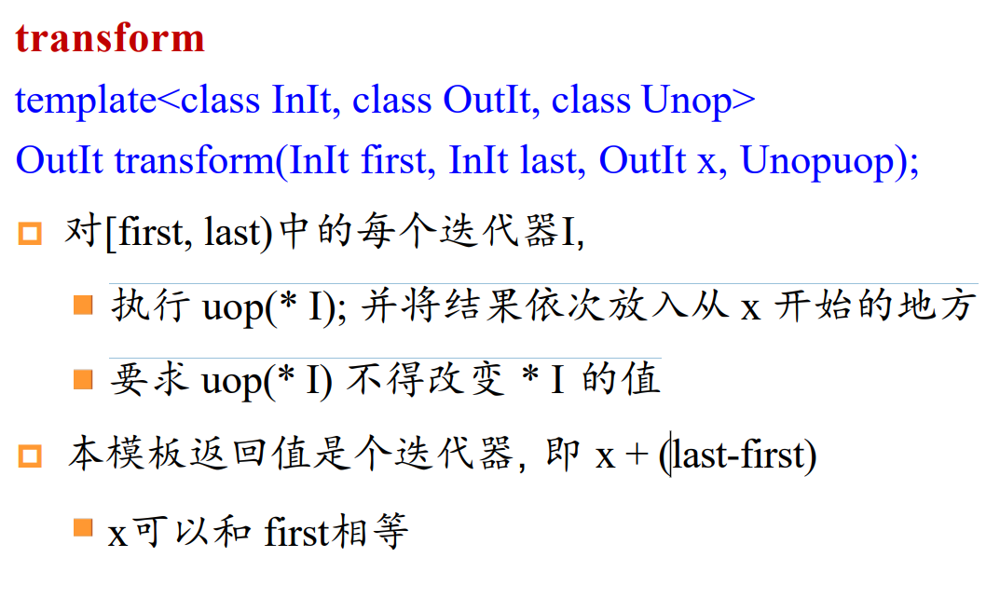

| 算法名称          | 算法原型                                                     | 算法功能                         |
| ----------------- | ------------------------------------------------------------ | -------------------------------- |
| `swap_ranges`     | `template<class ForwardIt1, class ForwardIt2> ForwardIt2 swap_ranges(ForwardIt1 first1, ForwardIt1 last1, ForwardIt2 first2);` | 交换两个区间内的值               |
| `fill`            | `template<class ForwardIt, class T> void fill(ForwardIt first, ForwardIt last, const T& value);` | 将某个值赋给区间内的所有元素     |
| `fill_n`          | `template<class OutputIt, class Size, class T> OutputIt fill_n(OutputIt first, Size count, const T& value);` | 为指定数量的元素赋予指定值       |
| `generate`        | `template<class ForwardIt, class Generator> void generate(ForwardIt first, ForwardIt last, Generator g);` | 使用生成函数初始化区间           |
| `generate_n`      | `template<class OutputIt, class Size, class Generator> OutputIt generate_n(OutputIt first, Size count, Generator g);` | 为指定数量的元素生成值           |
| `replace`         | `template<class ForwardIt, class T> void replace(ForwardIt first, ForwardIt last, const T& old_value, const T& new_value);` | 将区间内的指定值替换为另一个值   |
| `replace_if`      | `template<class ForwardIt, class UnaryPredicate, class T> void replace_if(ForwardIt first, ForwardIt last, UnaryPredicate p, const T& new_value);` | 根据条件替换区间内的值           |
| `replace_copy`    | `template<class InputIt, class OutputIt, class T> OutputIt replace_copy(InputIt first, InputIt last, OutputIt d_first, const T& old_value, const T& new_value);` | 复制区间，并替换其中的指定值     |
| `replace_copy_if` | `template<class InputIt, class OutputIt, class UnaryPredicate, class T> OutputIt replace_copy_if(InputIt first, InputIt last, OutputIt d_first, UnaryPredicate p, const T& new_value);` | 复制区间，并根据条件替换其中的值 |

> 注意：算法原型是根据图片中的说明进行简化且遵循 C++ 标准的版本。实际的 C++ 标准库算法可能包括更多的模板参数和重载形式。

```cpp
#include <algorithm>
#include <iostream>
#include <iterator>
#include <list>
#include <numeric>
#include <vector>


using namespace std;

// 定义一个小于9的判断类
class CLessThen9 {
public:
  bool operator()(int n) { return n < 9; }
};

// 输出平方值的函数
void outputSquare(int value) { cout << value * value << " "; }

// 计算立方值的函数
int calculateCube(int value) { return value * value * value; }

int main() {
  const int SIZE = 10;
  int a1[] = {1, 2, 3, 4, 5, 6, 7, 8, 9, 10};
  int a2[] = {100, 2, 8, 1, 50, 3, 8, 9, 10, 2};
  vector<int> v(a1, a1 + SIZE);            // 创建vector v并初始化
  ostream_iterator<int> output(cout, " "); // 创建输出迭代器

  // 随机打乱vector v中的元素
  random_shuffle(v.begin(), v.end());
  cout << "1) " << endl;
  copy(v.begin(), v.end(), output); // 输出vector v

  // 将数组a2复制到vector v中
  copy(a2, a2 + SIZE, v.begin());
  cout << "2) " << endl;

  // 输出统计结果
  cout << "3) " << count(v.begin(), v.end(), 8) << endl; // 统计v中值为8的个数
  cout << "4) " << *(min_element(v.begin(), v.end()))
       << endl; // 输出v中的最小值
  cout << "5) " << *(max_element(v.begin(), v.end()))
       << endl; // 输出v中的最大值
  cout << "6) " << accumulate(v.begin(), v.end(), 0)
       << endl; // 计算v中所有元素的和

  // 对v中的每个元素求平方并输出
  cout << "7) " << endl;
  for_each(v.begin(), v.end(), outputSquare);

  // 计算a1中每个元素的立方并存储到vector cubes中
  vector<int> cubes(SIZE);
  transform(a1, a1 + SIZE, cubes.begin(), calculateCube);
  cout << "8) " << endl;
  copy(cubes.begin(), cubes.end(), output); // 输出vector cubes

  return 0;
}
```

```
1) 
9 2 10 3 1 6 8 4 5 7 2) 
3) 2
4) 1
5) 100
6) 193
7) 
10000 4 64 1 2500 9 64 81 100 4 8) 
1 8 27 64 125 216 343 512 729 1000 
```


### 删除算法

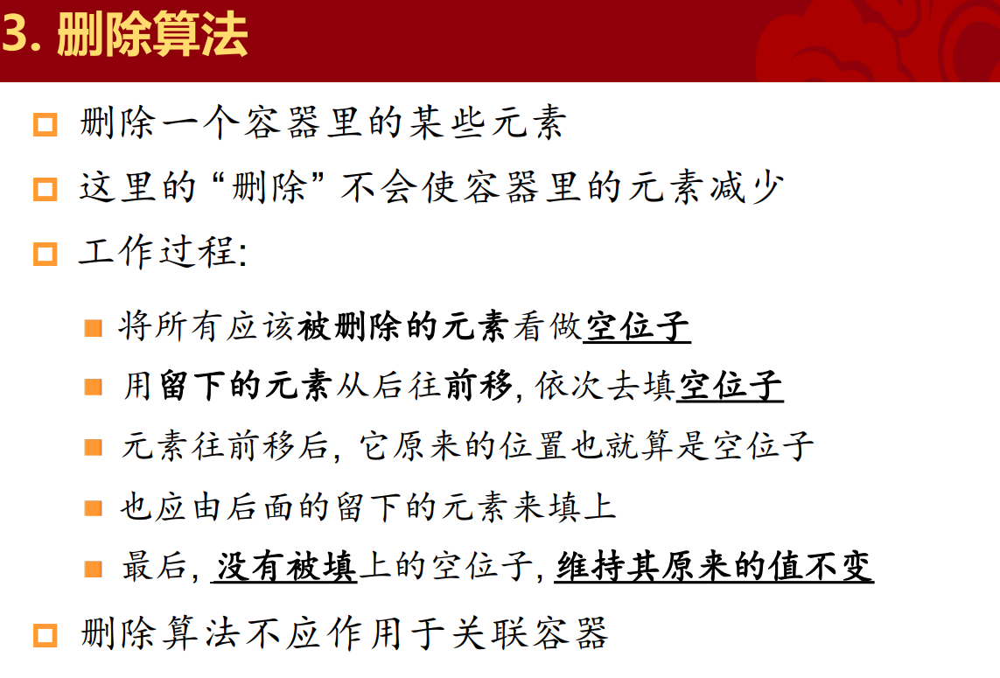


| 算法名称         | 算法原型                                                     | 算法功能                                               |
| ---------------- | ------------------------------------------------------------ | ------------------------------------------------------ |
| `remove`         | `ForwardIt remove(ForwardIt first, ForwardIt last, const T& value);` | 删除区间中等于某个值的元素                             |
| `remove_if`      | `ForwardIt remove_if(ForwardIt first, ForwardIt last, UnaryPredicate p);` | 删除区间中满足某条件的元素                             |
| `remove_copy`    | `OutputIt remove_copy(InputIt first, InputIt last, OutputIt d_first, const T& value);` | 复制区间，删除等于某个值的元素后放入其他区间           |
| `remove_copy_if` | `OutputIt remove_copy_if(InputIt first, InputIt last, OutputIt d_first, UnaryPredicate p);` | 复制区间，删除满足某条件的元素后放入其他区间           |
| `unique`         | `ForwardIt unique(ForwardIt first, ForwardIt last);`         | 删除区间中相邻的重复元素                               |
| `unique`         | `ForwardIt unique(ForwardIt first, ForwardIt last, BinaryPredicate p);` | 删除区间中满足特定条件的相邻重复元素                   |
| `unique_copy`    | `OutputIt unique_copy(InputIt first, InputIt last, OutputIt d_first);` | 复制区间，删除相邻重复元素后放入其他区间               |
| `unique_copy`    | `OutputIt unique_copy(InputIt first, InputIt last, OutputIt d_first, BinaryPredicate p);` | 复制区间，删除满足特定条件的相邻重复元素后放入其他区间 |


```cpp
#include <algorithm> // 用于remove算法
#include <iostream>  // 用于输入输出
#include <iterator>  // 用于ostream_iterator
#include <vector>    // 用于vector容器


using namespace std;

int main() {
  int a[5] = {1, 2, 3, 2, 5};
  int b[6] = {1, 2, 3, 2, 5, 6};
  ostream_iterator<int> oit(cout, " ");
  int *p = remove(a, a + 5, 2);
  cout << "1) ";
  copy(a, a + 5, oit);
  cout << endl;                   // 输出 1) 1,3,5,2,5,
  cout << "2) " << p - a << endl; // 输出 2) 3
  vector<int> v(b, b + 6);
  remove(v.begin(), v.end(), 2);
  cout << "3) ";
  copy(v.begin(), v.end(), oit);
  cout << endl; // 输出 3) 1,3,5,6,5,6,
  cout << "4) ";
  cout << v.size() << endl; // 输出 4) 6
  return 0;
}

```

```
1) 1 3 5 2 5 
2) 3
3) 1 3 5 6 5 6 
4) 6
```


### 变序算法

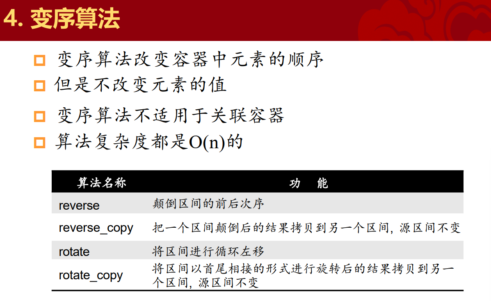

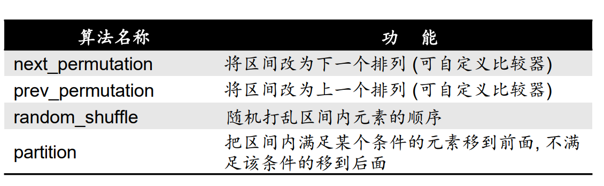


| 算法名称           | 算法原型                                                     | 算法功能                                                     |
| ------------------ | ------------------------------------------------------------ | ------------------------------------------------------------ |
| `reverse`          | `void reverse(BidirectionalIt first, BidirectionalIt last);` | 翻转区间内的元素顺序。                                       |
| `reverse_copy`     | `OutputIt reverse_copy(BidirectionalIt first, BidirectionalIt last, OutputIt d_first);` | 将一个区间内的元素的逆序复制到另一个区间，原区间不变         |
| `rotate`           | `ForwardIt rotate(ForwardIt first, ForwardIt n_first, ForwardIt last);` | 将区间内的元素旋转（将[first, n_first)区间的元素旋转到[first, last)区间的末尾） |
| `rotate_copy`      | `OutputIt rotate_copy(ForwardIt first, ForwardIt n_first, ForwardIt last, OutputIt d_first);` | 将区间内某段连续的子区间的元素复制并旋转到另一个区间，原区间不变 |
| `next_permutation` | `bool next_permutation(BidirectionalIt first, BidirectionalIt last);` | 将区间内的元素变更为下一个排列（可能改变区间内容）           |
| `prev_permutation` | `bool prev_permutation(BidirectionalIt first, BidirectionalIt last);` | 将区间内的元素变更为上一个排列（可能改变区间内容）           |
| `random_shuffle`   | `void random_shuffle(RandomIt first, RandomIt last);`        | 将区间内的元素随机重新排序。                                 |
| `random_shuffle`   | `void random_shuffle(RandomIt first, RandomIt last, RandomFunc&& r);` | 将区间内的元素随机重新排序，使用自定义的随机数生成器。       |
| `partition`        | `ForwardIt partition(ForwardIt first, ForwardIt last, UnaryPredicate p);` | 根据条件划分区间，满足条件的元素移到区间前部，不满足条件的移动到后部。 |

注意：
1. `BidirectionalIt` 是指支持双向迭代的迭代器类型。
2. `ForwardIt` 是指支持向前迭代的迭代器类型。
3. `OutputIt` 是指输出迭代器类型。
4. `RandomIt` 是指支持完全随机访问的迭代器类型。
5. `UnaryPredicate` 是指接受单个参数并返回布尔值的谓词。
6. `RandomFunc` 是指用于生成随机数的函数或函数对象。

```cpp
#include <algorithm> // 用于remove算法
#include <algorithm>
#include <iostream> // 用于输入输出
#include <iostream>
#include <iterator> // 用于ostream_iterator
#include <iterator>
#include <string>
#include <vector> // 用于vector容器

using namespace std;

// 将字符串中的字符按照升序排列
void sortString(string &str) { sort(str.begin(), str.end()); }
using namespace std;

int main() {

  string str = "231";
  char szStr[] = "324";

  // 输出原始字符串
  cout << "Original string: " << str << endl;
  cout << "Original string: " << szStr << endl;

  // 对字符串str进行排序并输出
  sortString(str);
  cout << "Sorted string: " << str << endl;

  // 对字符数组szStr进行排序并输出
  sort(szStr, szStr + 3);
  cout << "Sorted string: " << szStr << endl;

  int a[5] = {1, 2, 3, 2, 5};
  int b[6] = {1, 2, 3, 2, 5, 6};
  ostream_iterator<int> oit(cout, " ");
  int *p = remove(a, a + 5, 2);
  cout << "1) ";
  copy(a, a + 5, oit);
  cout << endl;                   // 输出 1) 1,3,5,2,5,
  cout << "2) " << p - a << endl; // 输出 2) 3
  vector<int> v(b, b + 6);
  remove(v.begin(), v.end(), 2);
  cout << "3) ";
  copy(v.begin(), v.end(), oit);
  cout << endl; // 输出 3) 1,3,5,6,5,6,
  cout << "4) ";
  cout << v.size() << endl; // 输出 4) 6
  return 0;
}

```

这段代码中，首先定义了一个`sortString`函数，它接受一个字符串引用作为参数，并使用`sort`函数对字符串中的字符进行升序排序。

在`main`函数中，定义了一个`string`类型的变量`str`和一个字符数组`szStr`，分别初始化为"231"和"324"。然后，程序输出原始字符串，调用`sortString`函数对`str`进行排序，并输出排序后的字符串。对于字符数组`szStr`，直接使用`sort`函数进行排序，并输出排序后的结果。

输出结果将是：
```
Original string: 231
Original string: 324
Sorted string: 123
Sorted string: 234
1) 1 3 5 2 5
2) 3
3) 1 3 5 6 5 6
4) 6
```

### 排序算法


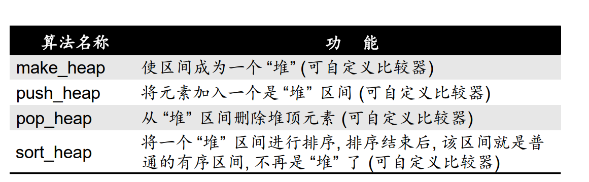


| 算法名称            | 算法原型                                                     | 算法功能                                                     |
| ------------------- | ------------------------------------------------------------ | ------------------------------------------------------------ |
| `sort`              | `void sort(BidIt first, BidIt last);`                        | 将区间从小到大排序（可自定义比较器）                         |
| `sort`              | `void sort(BidIt first, BidIt last, Comp pred);`             | 将区间从小到大排序并使用自定义比较器                         |
| `stable_sort`       | `void stable_sort(BidIt first, BidIt last);`                 | 保持相等元素间的相对次序进行排序（可自定义比较器）           |
| `stable_sort`       | `void stable_sort(BidIt first, BidIt last, Comp pred);`      | 使用自定义比较器保持相等元素间的相对次序进行排序             |
| `partial_sort`      | `void partial_sort(BidIt first, BidIt middle, BidIt last);`  | 对区间部分排序，直到最小的n个元素就位（可自定义比较器）      |
| `partial_sort_copy` | `void partial_sort_copy(BidIt first, BidIt middle, BidIt last, OutIt result);` | 将区间前n个元素的排序结果拷贝到别处，源区间不变（可自定义比较器） |
| `nth_element`       | `void nth_element(BidIt first, BidIt nth, BidIt last);`      | 对区间部分排序，使得第n小的元素就位，而且比它小的都在它前面，比它大的都在它后面（可自定义比较器） |
| `make_heap`         | `void make_heap(BidIt first, BidIt last);`                   | 使区间成为一个“堆”（可自定义比较器）                         |
| `push_heap`         | `void push_heap(BidIt first, BidIt last);`                   | 将元素加入一个堆区间（可自定义比较器）                       |
| `pop_heap`          | `void pop_heap(BidIt first, BidIt last);`                    | 从堆区间删除堆顶元素（可自定义比较器）                       |
| `sort_heap`         | `void sort_heap(BidIt first, BidIt last);`                   | 将一个堆区间进行排序，排序结束后，该区间就是普通的有序区间，不再是“堆”了（可自定义比较器） |

>  这里的`BidIt`代表双向迭代器，`OutIt`代表输出迭代器，`Comp`代表比较函数对象。这些算法都是C++标准模板库（STL）中用于处理序列的算法，它们可以应用于各种容器，如数组、向量（vector）、双端队列（deque）等。


```cpp
#include <algorithm> // 包含排序算法的头文件
#include <iostream>


using namespace std;

// 自定义比较类，用于sort函数
class MyLess {
public:
  bool operator()(int n1, int n2) { return (n1 % 10) < (n2 % 10); }
};

int main() {
  int a[] = {14, 2, 9, 111, 78}; // 定义一个整数数组
  sort(a, a + 5, MyLess());      // 使用自定义的比较类进行排序

  // 输出排序后的数组
  for (int i = 0; i < 5; i++) {
    cout << a[i] << " ";
  }
  cout << endl;

  // 使用标准库的greater<int>()进行降序排序
  sort(a, a + 5, greater<int>());

  // 再次输出排序后的数组
  for (int i = 0; i < 5; i++) {
    cout << a[i] << " ";
  }
  cout << endl;

  return 0;
}
```

```
111 2 14 78 9 
111 78 14 9 2
```

### 有序区间算法


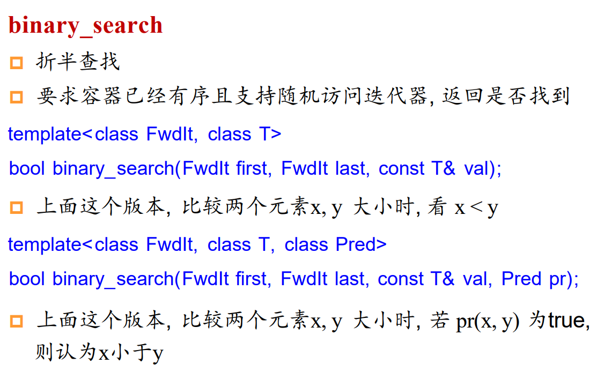


### biset


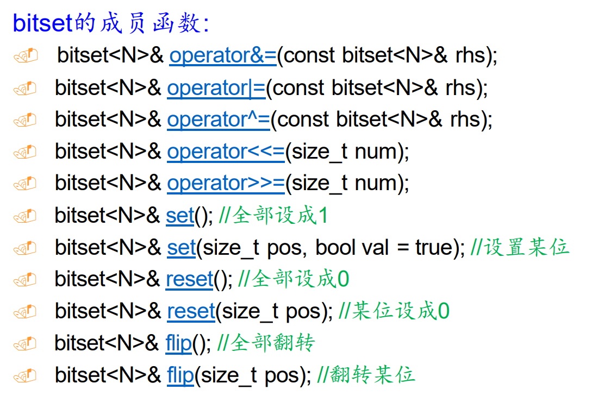


### 函数对象

- 一个类重载了`()`为成员函数 ==> 该类为**函数对象类**
- 这个类的对象叫做**函数对象**
- 看上去像是函数调用,实际上也执行了函数调用

**目的:** 为了STL算法可以复用,其中的子操作应该是可以参数化的,函数对象就用来描述这些子对象

> STL（Standard Template Library，标准模板库）是 C++ 中的一套模板类和函数的集合，它提供了一系列的数据结构和算法，用于处理各种容器和迭代器。STL 的设计基于泛型编程，这意味着它的组件可以与任何数据类型一起工作，只要这些数据类型满足某些基本要求。
>
> 在 STL 中，算法和容器是分离的，算法通常接受迭代器作为参数，这样可以在不同的容器上重用同一个算法。为了使算法可复用，STL 需要能够灵活地处理各种不同的操作，这就引入了函数对象（也称为仿函数或 functor）的概念。
>
> **函数对象是一种可以像函数一样被调用的对象。**在 C++ 中，可以通过定义一个类，并重载 `operator()`，来创建一个函数对象。这个操作符的重载允许对象像函数一样被调用，并且可以携带状态和参数。
>
> 在 STL 算法中使用函数对象的目的是提供一种机制，使得算法可以接受用户定义的参数化操作。这些参数化操作可以是比较函数、计算函数、修改函数等，它们通过函数对象的形式传递给算法。这样，同一个算法就可以用于执行不同的操作，只需通过传递不同的函数对象即可。
>
> 例如，STL 提供的 `std::sort` 算法可以接受一个自定义的比较函数对象作为参数，这个函数对象定义了排序的标准。通过传递不同的比较函数对象，`std::sort` 可以按照不同的规则对数据进行排序。
>
> 下面是一个简单的函数对象示例，它定义了一个比较两个整数的函数对象：
>
> ```cpp
> #include <iostream>
> 
> // 定义一个函数对象类
> class Compare {
> public:
>     bool operator()(int a, int b) const {
>         return a < b;
>     }
> };
> 
> int main() {
>     int arr[] = {4, 3, 2, 1};
>     Compare cmp; // 创建一个函数对象实例
>     // 使用函数对象作为参数调用 std::sort
>     std::sort(arr, arr + 4, cmp);
>     for (int i = 0; i < 4; ++i) {
>         std::cout << arr[i] << " ";
>     }
>     std::cout << std::endl;
>     return 0;
> }
> ```
>
> 在这个例子中，`Compare` 类定义了一个函数对象，它重载了 `operator()` 来实现比较操作。然后，我们创建了一个 `Compare` 类的实例 `cmp`，并将其作为参数传递给 `std::sort` 算法，以按照自定义的顺序对数组进行排序。
>
> 通过使用函数对象，STL 算法变得更加灵活和强大，因为它们可以适应各种不同的操作和自定义的行为。这种设计使得 STL 成为一个高度可扩展和可定制的库。

```c++
class CMyAverage {
public:
  double operator()(int a1, int a2, int a3) {
    return (double)(a1 + a2 + a3) / 3;
  }
};
CMyAverage Average; 
cout << Average(3, 2, 3);
```

> 注意,想要使用重载的括号,则需要先创建该类的一个对象
> 一些模板函数没有使用函数对象而是传入模板的原因是它们创建了临时的对象
>
> **归根结底一定会调用对象来访问非静态的成员函数**

- `accumulate`,定义在`<numeric>`中

```c++
// 一般用于累加
template<class InIt, class T, class Pred>
T accumulate(InIt first, InIt last, T val, Pred pr);
// 其中前两个参数指向了可迭代对象的首尾
// pr是一个函数对象,对于[first,last)中的每个迭代器I,执行val = pr(val,*I),返回最终的val
```

```c++
template <typename _InputIterator, typename _Tp>
_Tp accumulate(_InputIterator first, _InputIterator last, _Tp init) {
  for (; first != last; ++first)
    init = init + *first;
  return init;
}
```

#### 函数对象的参数

- 根据函数对象参数的个数,STL算法中用到的主要有**三类基类**

  - 没有参数的函数对象,相当于`f()`

  - 一个参数的函数对象,相当于`f(x)`;STL用`unary_function`定义了一元函数基类

    - ```c++
      template <class _Arg, class _Result>
      struct unary_function {
      	typedef _Arg argument_type;
      	typedef _Result result_type;
      }
      ```

  - 两个参数的函数对象,二元函数,相当于`f(x,y)`,`binary_function`定义了二元函数基类

    - ```c++
      template <class _Arg1, class _Arg2, class _Result>
      struct binary_function {
      	typedef_Arg1 first_argument_type;
      	typedef_Arg2 second_argument_type;
      	typedef_Result result_type;
      };
      ```

- 例子:

  - `greater`函数对象类模板

  ```c++
  template <class T> 
  struct greater : public binary_function<T, T, bool> {
    bool operator()(const T &x, const T &y) const { return x > y; }
  };
  ```

> list 有两个sort函数
>
> 前面例子中看到的是不带参数的sort函数, 将list中的元素按 < 规定的比较方法升序排列 
>
>  list还有另一个sort函数： `void sort (greater<T> pr);` 可以用来进行降序排序

```c++
#include <iostream>
#include <iterator>
#include <list>

using namespace std;
int main() {
  const int SIZE = 5;
  int a[SIZE] = {5, 1, 4, 2, 3};
  list<int> lst(a, a + SIZE);
  lst.sort(greater<int>()); // 这里传入的就是函数对象类而非对象
// 将进行升序排序
  ostream_iterator<int> output(cout, ", ");
  copy(lst.begin(), lst.end(), output);
  cout << endl;
  return 0;
}
```

### typedef

> `typedef` 在C++中是一个关键字，用于为已有的数据类型定义一个新的名称（别名）。这可以使代码更具可读性和便于管理，特别是对于复杂的数据类型，如指向函数的指针或者容器类型等。使用`typedef`可以使这些复杂类型的声明更简洁易懂。
>
> ### 用法
>
> 基本的`typedef`用法如下：
>
> ```cpp
> typedef existing_type new_name;
> ```
>
> 其中，`existing_type`是已经存在的数据类型，`new_name`是你为它创建的别名。
>
> #### 示例
>
> 1. **为基本数据类型定义别名**：
>
> ```cpp
> typedef int Integer;
> Integer a = 5; // 等价于 int a = 5;
> ```
>
> 2. **为结构体定义别名**：
>
> ```cpp
> typedef struct {
>     int x;
>     int y;
> } Point;
> 
> Point p1; // 等价于 struct { int x; int y; } p1;
> ```
>
> 3. **为指针类型定义别名**：
>
> ```cpp
> typedef char* charPtr;
> charPtr cp, cp2; // cp 和 cp2 都是 char* 类型的指针
> ```
>
> 4. **为函数指针定义别名**：
>
> ```cpp
> typedef void (*funcPtr)(int, int);
> funcPtr fp; // fp 是一个指向函数的指针，该函数接受两个int参数并返回void
> ```
>
> #### 使用场景
>
> - 简化复杂的类型声明，如指向函数的指针或者嵌套的容器类型等。
> - 提高代码的可移植性。例如，使用`typedef`为平台特定的数据类型定义通用别名，可以使得在不同平台之间迁移代码时更加容易。
> - 在编写库代码时，为内部数据结构或者对外接口提供更清晰、更简洁的类型名称，增强代码的可读性和易用性。
>
> #### `typedef` vs `using`
>
> 在C++11及之后的版本中，引入了`using`关键字作为`typedef`的一个现代替代品，提供了更灵活的语法来定义类型别名。例如，使用`using`定义函数指针的别名比`typedef`更直观：
>
> ```cpp
> using funcPtr = void (*)(int, int); // 使用 using 的语法
> ```
>
> `using`语法在定义模板别名（template alias）时尤其有用，提供了`typedef`所不具备的能力。
>
> 总的来说，`typedef`是C++中一个重要的关键字，用于定义类型的别名，使得类型更易于理解和使用。随着C++的发展，`using`提供了一个更加灵活和强大的方式来定义别名，特别是在模板编程中。

## C++11

### 统一的初始化方法

**使用==大括号==对数组或是容器进行统一的初始化方式**

```c++
#include <iostream>
#include <map>
#include <vector>
using namespace std;
struct A {
  int i, j;
  A(int m, int n) : i(m), j(n) {}
};
A func(int m, int n) { return {m, n}; }
int main() {
  int arr[3]{1, 2, 3};
  vector<int> iv{1, 2, 3};
  map<int, string> mp{{1, "a"}, {2, "b"}};
  string str{"Hello World"};
  int *p = new int[20]{1, 2, 3};
  A *pa = new A{3, 7};
  A a[] = {{1, 2}, {3, 4}, {5, 6}}; // 使用圆括号则不可以
  return 0;
}
```

初始化列表语法可防止缩窄, 即**禁止将数值赋给无法储存它的数值变量**,常规初始化运行程序执行可能没有意义的操作 

如果使用初始化列表语法, 编译器将禁止进行这样的类型转换, 即数值存储到比它 “窄”的变量中

```c++
#include <iostream>
#include <map>
#include <vector>
using namespace std;

int main() {
  char c1 = 3.14e10;
  int x1 = 3.14;
  char c2{3.14e10};        // 此操作会出现编译错误
  int x2 = {459557885821}; // 此操作会出现编译错误
  return 0;
}
```

### `initializer_list`

c++11提供了**模板类`initializer_list`**,可将其用作构造函数的参数

```c++
double SumByIntialList(std::initializer_list<double> il) {
  double sum = 0.0;
  for (auto p = il.begin(); p != il.end(); p++) {
    sum += *p;
  }
  return sum;
}
double total = SumByIntialList({2.5, 3.1, 4});
```

### 成员变量默认初始值

```c++
class B {
public:
  int m = 1234;
  int n;
};
int main() {
  B b;
  cout << b.m << endl; // 输出1234
  return 0;
}
```

### auto关键字


==可以作为函数的返回值类型==


### `decltype`关键字

> `decltype` 是 C++11 引入的一个关键字，用于查询表达式的类型而不实际计算表达式的值。这个关键字在泛型编程中特别有用，因为它允许编译器在不执行代码的情况下推断出表达式的类型。这可以帮助在模板编程和类型推导中更准确地指定类型，特别是当类型难以手动指定或者类型依赖于模板参数时。
>
> ### 基本用法
>
> 基本上，`decltype` 的语法如下：
>
> ```cpp
> decltype(expression) var;
> ```
>
> 这里，`var` 将有与 `expression` 相同的类型。`decltype` 检查表达式并返回其类型，但不实际计算表达式的值。
>
> ### 示例
>
> ```cpp
> #include <iostream>
> #include <vector>
> 
> int main() {
>     int x = 5;
>     std::vector<int> v;
> 
>     // decltype 用于推导 x 的类型，即 int
>     decltype(x) y = 10;
> 
>     // decltype 用于推导 std::vector<int>::iterator 的类型
>     decltype(v.begin()) it = v.begin();
> 
>     // decltype 也可以用于复杂表达式
>     decltype(x + 3.14) z;  // z 的类型是表达式 x + 3.14 的结果类型，即 double
> 
>     std::cout << "y = " << y << ", *it may be undefined as vector is empty, z = " << z << std::endl;
> 
>     return 0;
> }
> ```
>
> ### 特殊情况
>
> - 当 `decltype` 用于一个普通变量时，它返回变量的类型。
> - **当用于解引用操作（如 `*ptr`）时，它返回一个引用。**
> - **如果表达式是函数调用，它返回函数的返回类型。**
> - 对于类成员访问，`decltype` 考虑到访问方式（即是通过对象还是指针访问）来确定是返回引用类型还是值类型。
>
> ### 在返回类型后置语法中的使用
>
> C++11 同时引入了返回类型后置的语法，允许在函数声明中使用 `decltype`。这在模板编程或者当函数返回类型依赖于其参数类型时非常有用。
>
> ```cpp
> template<typename T, typename U>
> auto add(T t, U u) -> decltype(t + u) {
>     return t + u;
> }
> ```
>
> 在这个例子中，`add` 函数的返回类型由 `t` 和 `u` 的类型决定，通过 `decltype` 推导。
>
> ### 总结
>
> `decltype` 是一个非常强大的工具，特别是在涉及到模板和自动类型推导的情冀下。它提高了代码的灵活性和通用性，使得编译时类型推导更加精确和方便。


> 对于最后一句代码的解释
>
> 这行代码使用了 `decltype` 关键字来推导某个表达式的类型，并声明了一个变量 `x4`。为了准确解释这段代码，我们需要详细分析表达式 `decltype((a->x))` 和变量声明。
>
> 假设有一个指针 `a` 指向某个对象，该对象有一个成员变量 `x`。这里，`a->x` 表达式访问该对象的成员变量 `x`。
>
> ### decltype 表达式分析
>
> - `decltype((a->x))` 中的 `(a->x)` 是一个加了额外括号的表达式。**在 `decltype` 中，如果你对一个单独的变量加上括号，结果会是该变量的引用类型。**这是因为加括号后的表达式被视为一个左值表达式，而 `decltype` 对左值表达式的推导结果是该左值的引用类型。
> - 因此，如果 `a->x` 是 `int` 类型，那么 `decltype((a->x))` 的结果将是 `int&`，即 `x` 的引用类型。
>
> ### 变量声明
>
> - `x4` 是使用 `decltype((a->x))` 推导出的类型来声明的变量。根据上述分析，如果 `a->x` 的类型是 `int`，那么 `x4` 的类型将是 `int&`。
> - `x4 = t;` 这部分代码将 `t` 赋值给 `x4`。这里，`t` 必须是一个可以赋给 `x4` 类型的值或引用。继续使用前面的假设，如果 `x4` 是 `int&` 类型，那么 `t` 必须是 `int` 类型的变量或 `int` 类型的变量的引用，使得这个赋值操作合法。
>
> ### 示例
>
> 假设有以下类定义和变量：
>
> ```cpp
> class MyClass {
> public:
>     int x;
> };
> 
> MyClass obj;
> MyClass* a = &obj;
> int t = 10;
> ```
>
> 然后使用 `decltype` 的代码如下：
>
> ```cpp
> decltype((a->x)) x4 = t;  // x4 的类型是 int&
> ```
>
> 在这个例子中，`x4` 是对 `obj.x` 的引用。通过 `x4 = t;` 赋值，实际上是修改了 `obj.x` 的值。
>
> ### 结论
>
> 通过使用 `decltype((expression))`，你可以推导出表达式的引用类型，这在需要精确控制变量类型的高级编程场景中非常有用。此代码段演示了如何利用 `decltype` 对复杂表达式进行类型推导，并通过这种方式声明引用类型的变量。

### 智能指针shared_ptr

- 包含在头文件`<memory>`中
- 通过shared_ptr的构造函数, 可以让shared_ptr对象托管一个new运 算符返回的指针, 写法如下：

```c++
shared_ptr<T> ptr(newT); // T 可以是int, char,类名等各种类型
```


```c++
#include <iostream>
#include <memory>

using namespace std;

struct A {
  int n;
  A(int v = 0) : n(v) {}
  ~A() { cout << n << " destructor" << endl; }
};

int main() {
  shared_ptr<A> sp1(new A(2));                      // sp1指向A(2)
  shared_ptr<A> sp2(sp1);                           // sp2指向A(2)
  cout << "1)" << sp1->n << ", " << sp2->n << endl; // 输出：1)2, 2

  shared_ptr<A> sp3;
  A *p = sp1.get();             // p指向A(2)
  cout << "2)" << p->n << endl; // 输出：2)2

  sp3 = sp1;                        // sp3指向A(2)
  cout << "3)" << (*sp3).n << endl; // 输出：3)2
  sp1.reset();                      // sp1指向空
  if (!sp1) {
    cout << "4)sp1 is null" << endl; // 输出：4)sp1 is null
  }
  sp1.reset(new A(3));            // sp1指向A(3)
  cout << "5)" << sp1->n << endl; // 输出：5)3
  sp1.reset();                    // sp1指向空，触发delete A(3)
  sp2.reset();                    // sp2指向空，触发delete A(2)
  sp3.reset();                    // sp3指向空
  shared_ptr<A> sp4(sp1);     // sp4指向sp1, sp1指向空, 此处不会输出
  shared_ptr<A> sp5;          // sp5初始为空指针
  sp5.reset(new A(4));        // sp5指向A(4)
  sp1.reset();                // sp1指向空
  cout << "end main" << endl; // 输出：end main

  return 0; // 退出main函数，delete A(4)
}

```


==注意多个智能指针托管同一个对象的是通过后续的只能指针托管原来被创建的智能指针实现的,而不是重新指向同一个位置==

> 您的表述涉及到了智能指针的使用原则，特别是在管理同一个对象时的注意事项。在C++中，智能指针如 `std::shared_ptr` 和 `std::unique_ptr` 被广泛用来自动管理动态分配的内存，以防止内存泄漏。关于智能指针管理同一个对象，有几个关键点需要注意：
>
> ### 1. `std::unique_ptr`
> `std::unique_ptr` 是一种独占所有权的智能指针，它不允许多个 `std::unique_ptr` 同时管理同一个原始指针。如果需要将 `std::unique_ptr` 指向的对象传递给另一个 `std::unique_ptr`，你需要显式地使用 `std::move`，这将转移所有权，并使原来的指针为空。
>
> ```cpp
> #include <memory>
> std::unique_ptr<int> ptr1(new int(10));
> std::unique_ptr<int> ptr2 = std::move(ptr1); // 所有权转移
> ```
>
> ### 2. `std::shared_ptr`
> `std::shared_ptr` 允许多个指针实例共享同一个对象的所有权。它通过引用计数机制来确保当最后一个 `std::shared_ptr` 被销毁时，所管理的对象也会被正确删除。要使多个 `std::shared_ptr` 共享同一个对象，你应该让它们直接或间接地从一个共同的 `std::shared_ptr` 实例复制构造或赋值。
>
> ```cpp
> #include <memory>
> std::shared_ptr<int> shared1(new int(100));
> std::shared_ptr<int> shared2 = shared1; // 正确的共享方式
> ```
>
> ==如果你错误地将同一个裸指针分配给多个 `std::shared_ptr`，则每个 `std::shared_ptr` 都会认为自己拥有该对象的唯一所有权，这将导致对同一资源的多次释放，引起未定义行为（通常是程序崩溃）：==
>
> ```cpp
> int* rawPtr = new int(100);
> std::shared_ptr<int> wrongShared1(rawPtr);
> std::shared_ptr<int> wrongShared2(rawPtr); // 错误！独立的引用计数导致重复释放
> ```
>
> ### 3. 管理现有智能指针指向的对象
> ==正如您所指出的，如果需要多个智能指针管理同一个对象，应该确保这些智能指针是从某个已存在的智能指针中派生出来的，这样它们会共享所有权和引用计数。==这是通过复制或赋值已有的 `std::shared_ptr` 来实现的，而非通过传递同一个原始指针给多个智能指针实例。
>
> ### 总结
> 在使用智能指针时，特别是涉及到对象所有权和生命周期管理时，非常重要的一点是正确理解和使用 `std::unique_ptr` 和 `std::shared_ptr`。确保不要独立地用相同的裸指针初始化多个 `std::shared_ptr`，这样可以避免多次删除同一内存块的问题，而应通过智能指针间的复制或赋值来共享对象。

> 智能指针（Smart Pointers）在C++中的作用是自动管理动态分配的内存，帮助防止内存泄漏，并使得内存的管理更加安全与方便。它们表现得就像普通指针，但提供了自动的内存回收机制。智能指针是一种资源管理的RAII（Resource Acquisition Is Initialization）模式的实现，确保在对象生命周期结束时自动释放资源。
>
> 智能指针的主要作用包括：
>
> 1. **自动内存管理**：当智能指针不再使用（如超出作用域或被重新赋值）时，它会自动释放所管理的资源。
> 2. **异常安全**：如果程序的某个部分由于异常而提前退出，智能指针会确保动态分配的资源得到释放，防止内存泄漏。
> 3. **所有权语义**：某些智能指针类型提供所有权模型，比如`std::unique_ptr`，它保证同一时间内只有一个所有者。
>
> 以下是C++中几种常见智能指针类型及其作用：
>
> - `std::unique_ptr`：提供对于动态分配内存的独占所有权，不能复制，但可以移动。当`unique_ptr`被销毁时，它指向的对象也会被删除。
> - `std::shared_ptr`：通过引用计数机制，允许多个智能指针共享对象的所有权。当最后一个`shared_ptr`被销毁时，对象会被删除。
> - `std::weak_ptr`：与`shared_ptr`一起使用，但不增加引用计数。它用于访问`shared_ptr`管理的对象，而不会阻止该对象被销毁。
>
> 使用智能指针有助于简化代码，避免忘记手动释放内存的风险，并使代码更加健壮和易于维护。它们是现代C++程序中资源管理的重要工具。

### 空指针nullptr

> 在C++中，`nullptr` 和 `NULL` 都用于表示空指针，但它们在使用和语义上存在重要差异。了解这些差异对于写出更清晰、更健壮的程序很重要。
>
> ### NULL
> - `NULL` 在C语言中被引入，也被C++早期标准采纳。在C++中，`NULL` 通常定义为 `0` 或者 `(void*)0`。这是一个宏，其本质上是一个整数零值。
> - 使用 `NULL` 可能会引起一些类型相关的问题，尤其是在C++的函数重载和模板编程中。例如，如果有一个函数重载接受整数和指针两种参数，使用 `NULL` 可能导致调用整数版本的函数，因为 `NULL` 被视为 `0`，即一个整数。
>
> ### nullptr
> - `nullptr` 是在C++11中引入的新关键字，专门用于表示空指针。它的类型是 `std::nullptr_t`，可以转换为任何类型的指针，但不能转换为整数类型。
> - 使用 `nullptr` 可以避免 `NULL` 所引起的类型歧义问题。当你使用 `nullptr` 时，编译器知道你指的是空指针，这使得函数重载和模板特化更加清晰和直观。
> - `nullptr` 提供了更好的类型安全。例如，在函数重载的情况下，使用 `nullptr` 可以确保调用的是接受指针参数的版本，而不是可能的整型版本。
>
> ### 示例
> 下面是一个示例，展示 `nullptr` 和 `NULL` 在函数重载中如何表现不同：
>
> ```cpp
> #include <iostream>
> 
> void func(int i) {
>     std::cout << "Integer version called: " << i << std::endl;
> }
> 
> void func(char* ptr) {
>     if (ptr == nullptr) {
>         std::cout << "Pointer version called: null pointer" << std::endl;
>     } else {
>         std::cout << "Pointer version called: " << ptr << std::endl;
>     }
> }
> 
> int main() {
>     // 使用 NULL 可能会导致调用整数版本的 func，取决于 NULL 的定义
>     func(NULL);  // 可能输出 "Integer version called: 0"
> 
>     // 使用 nullptr 总是调用指针版本的 func
>     func(nullptr);  // 输出 "Pointer version called: null pointer"
> 
>     return 0;
> }
> ```
>
> ### 总结
> 尽管 `NULL` 和 `nullptr` 都用于表示空指针，`nullptr` 提供了更好的类型安全和更清晰的意图表达。从C++11开始，推荐使用 `nullptr` 替代 `NULL`，以避免潜在的类型混淆和错误。这一做法现已成为现代C++编程的最佳实践。

### 基于范围的for循环


> 评价:这是一种懒惰的写法,丢弃了随机访问的能力,在一些不需要特殊需要的场景下可以使用

### 左值与右值

> 在 C++ 中，理解左值（lvalue）和右值（rvalue）的概念对于深入掌握语言特性尤其是高级特性如移动语义和完美转发至关重要。这些概念是 C++ 类型系统的基石之一，帮助程序员理解如何高效地管理对象的内存和状态。
>
> ### 左值（Lvalue）
>
> 左值指的是具有持久状态的对象。它们的名称出自“可以出现在赋值语句左侧”的事实，意味着你可以对其进行赋值（如果它们不是常量）。
>
> **特点：**
> - 左值可以在多个表达式中持续存在，具有明确的存储位置。
> - 左值可以是非临时的对象、函数或数组等。
> - 左值可以取地址，即可以用 `&` 操作符来获取其地址。
>
> **示例：**
> ```cpp
> int x = 10;    // x 是左值
> int& ref = x;  // ref 也是左值，它是 x 的引用
> ```
>
> ### 右值（Rvalue）
>
> 右值通常是临时的，不能再赋值表达式的左侧。它们不具有可识别的存储位置，而是在表达式求值后立即被销毁。右值通常是用来描述那些不需要持久存储的临时对象。
>
> **特点：**
> - 右值是那些不指向存储持久对象的表达式产生的值，比如临时对象、字面量或返回值。
>
>   - **临时对象**：由函数返回的临时对象或者是中间的计算结果都是右值，例如：
>
>   ```cpp
>   int getNumber() { return 42; }
>   &(getNumber()); // 错误：不能取得返回临时对象的地址
>   &(int(42)); // 错误：不能取字面量对象的地址
>   ```
>
>   - **字面量**：除了字符串字面量外，如整数、浮点数等，这些也是右值：
>
>   ```cpp
>   &42; // 错误：不能取字面值的地址
>   ```
>
>   - **表达式结果**：例如一个算术表达式的结果：
>
>   ```cpp
>   int a = 5;
>   int b = 10;
>   &(a + b); // 错误：不能取表达式结果的地址
>   ```
>
>   - **匿名对象**：创建的无名对象也是右值：
>
>   ```cpp
>   &(std::string("temporary")); // 错误：不能取匿名对象的地址
>   ```
>
>   - **标准库中一些返回右值引用的函数**，例如`std::move`：
>
>   ```cpp
>   int x = 10;
>   &(std::move(x)); // 错误：std::move 返回右值引用
>   ```
> - 右值可以是将要被销毁的对象，可以安全地从右值中窃取资源。
> - 右值不能取地址，因为它们通常不具有可访问的内存地址。
>
> **示例：**
> ```cpp
> int getNumber() { return 42; }
> int&& rref = getNumber(); // rref 是右值引用，getNumber() 的返回值是右值
> ```
>
> ### 左值引用与右值引用
>
> C++11 引入了右值引用的概念，这是对现有左值引用的补充，使得移动语义和完美转发成为可能。
>
> - **左值引用（Lvalue Reference）：** 通常表示为 `Type&`，可以引用左值。
> - **右值引用（Rvalue Reference）：** 通常表示为 `Type&&`，专门用来绑定到右值，使得可以安全地从右值中移动数据。
>
>   - > 在 C++ 中，当一个右值被绑定到一个右值引用时，确实会延长该右值的生命周期。这是右值引用的一个重要特性，它允许临时对象的资源被重用，从而提高程序的效率。
>     >
>     > ### 生命周期延长
>     >
>     > 右值引用延长右值生命周期的机制如下：
>     >
>     > - 通常，临时对象（右值）的生命周期仅限于其在表达式中的存在。换句话说，临时对象在创建它的表达式结束时被销毁。
>     > - 然而，如果一个临时对象被绑定到一个右值引用上，这个临时对象的生命周期会被延长，使其与该右值引用变量的生命周期一致。
>     >
>     > ### 示例
>     >
>     > 考虑下面的示例，展示了如何通过右值引用延长临时对象的生命周期：
>     >
>     > ```cpp
>     > #include <iostream>
>     > #include <vector>
>     > 
>     > std::vector<int> getVector() {
>     >     return std::vector<int>{1, 2, 3, 4, 5};
>     > }
>     > 
>     > int main() {
>     >     // 临时对象 getVector() 返回的 std::vector<int> 绑定到右值引用 v
>     >     std::vector<int>&& v = getVector();
>     > 
>     >     // v 现在持有临时对象的资源，临时对象的生命周期被延长到 v 的生命周期
>     >     std::cout << "Vector contents: ";
>     >     for (int i : v) {
>     >         std::cout << i << " ";
>     >     }
>     >     std::cout << std::endl;
>     > 
>     >     // v 在 main 函数结束时销毁，此时才销毁临时对象
>     >     return 0;
>     > }
>     > ```
>     >
>     > 在这个例子中，函数 `getVector` 返回一个临时的 `std::vector<int>` 对象。如果没有右值引用 `v`，这个临时对象会在其表达式结束时被销毁。但是因为它被绑定到右值引用 `v` 上，其生命周期被延长至 `v` 的生命周期，即 `main` 函数的结束。
>     >
>     > ### 重要性
>     >
>     > 这种通过右值引用延长生命周期的特性在实现移动语义和优化资源管理方面非常关键。它允许：
>     >
>     > - **避免不必要的对象复制**：可以直接使用临时对象的资源，而不需要复制。
>     > - **提高性能**：特别是在处理大型数据对象如字符串、向量等时，移动操作比复制操作要快得多。
>     >
>     > 总的来说，右值引用和生命周期延长的机制是 C++11 中为了优化性能而引入的重要特性，让程序能够更高效地处理临时数据。
>
>
> ### 为什么重要？
>
> 左值和右值的区分对于理解如何高效地处理 C++ 中的数据尤其重要。例如，在构造和赋值时，如果能够区分一个对象是左值还是右值，就可以通过移动构造函数和移动赋值操作符来优化性能，从而避免不必要的复制。
>
> 通过右值引用和移动语义，C++ 程序可以更有效地处理大型数据结构，比如动态数组或复杂对象，从而提高了应用程序的性能和响应速度。
>
> 总的来说，左值和右值的概念及其引用是 C++ 中进行高效资源管理的关键，使得开发者可以写出更加高效、简洁且功能强大的代码。

#### `std::move`

> 在 C++ 中，`std::move` 函数和移动语义（Move Semantics）是紧密相关的概念，它们共同作用于提升代码效率，特别是在涉及到大对象或资源密集型操作时。下面详细解释 `std::move` 函数和移动语义之间的关系以及它们各自的作用。
>
> ### 移动语义（Move Semantics）
>
> 移动语义是 C++11 引入的一个特性，旨在减少不必要的对象复制，从而优化程序性能。它允许资源（如动态内存）的所有权从一个对象转移到另一个对象，而不是进行传统的复制。这通常通过定义移动构造函数和移动赋值运算符来实现。
>
> - **移动构造函数**：接收另一个同类型对象的右值引用（例如，`MyClass(MyClass&& other)`），并窃取该对象的资源，而不复制它们。原对象留下的是一个有效但未定义的状态，通常是空或默认状态。
> - **移动赋值运算符**：类似于移动构造函数，但用于赋值。它通常会释放接收对象当前持有的资源，并窃取源对象的资源（例如，`MyClass& operator=(MyClass&& other)`）。
>
> ### std::move 函数
>
> `std::move` 是一个标准库函数，它实际上并不执行任何移动操作。它的作用是将其参数转换为右值引用，从而使得可以在移动构造函数和移动赋值运算符中使用。你可以认为 `std::move` 告诉编译器：我们有一个对象，我不再需要在此对象上保持任何数据，因此可以安全地“移动”其数据。
>
> - **作用**：`std::move` 仅仅进行类型转换，将一个左值转换为该左值的右值引用，从而激活移动语义。
> - **使用**：在你明确知道一个对象不再被需要，且想要将资源从这个对象移动到另一个对象时使用。
>
> ### 关系
>
> `std::move` 和移动语义之间的关系是协作的：
>
> - **启用机制**：`std::move` 函数是启用移动语义的机制。它通过将对象的左值引用转换为右值引用，使得该对象的资源可以被移动而非复制。
> - **优化作用**：移动语义通过定义如何有效地转移资源来优化程序性能，而 `std::move` 提供了一种方法来触发这种优化。
>
> ### 示例代码
>
> ```cpp
> #include <iostream>
> #include <vector>
> #include <string>
> 
> int main() {
>     std::vector<std::string> v1 = {"hello", "world"};
>     std::vector<std::string> v2;
> 
>     // 使用 std::move 触发移动语义
>     v2 = std::move(v1);
> 
>     std::cout << "v1 size: " << v1.size() << std::endl;  // v1 现在为空
>     std::cout << "v2 size: " << v2.size() << std::endl;  // v2 接管了 v1 的数据
> 
>     return 0;
> }
> ```
>
> 在这个例子中，`std::move(v1)` 将 `v1` 转换为一个右值，这使得 `std::vector` 的移动赋值运算符被调用，`v1` 的内容被“移动”到 `v2`。这种移动是通过简单地转移资源（如内存指针）实现的，而不是通过逐一复制元素。
>
> ### 总结
>
> `std::move` 和移动语义共同提供了一种高效的资源管理方式，特别适用于管理大型数据或资源密集型对象的场景。通过使用 `std::move` 来激活移动语义，可以显著减少不必要的数据复制，从而提高程序的整体性能和响应速度。

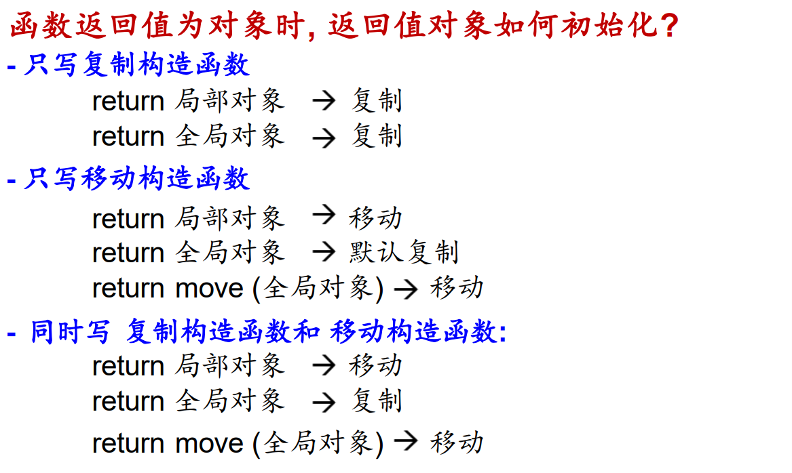


**通过将对应的函数标记为delete来防止进行相应的操作**

### 无序容器(哈希表)

> 哈希表插入和查询的时间复杂度几乎是常数

> 在 C++ 中，无序容器是基于哈希表实现的数据结构，属于 C++11 标准库的一部分。这些容器提供了平均常数时间复杂度的快速访问性能，不同于基于红黑树实现的有序容器（如 `std::set` 和 `std::map`），无序容器不会根据元素的值自动排序。无序容器包括 `unordered_set`、`unordered_multiset`、`unordered_map` 和 `unordered_multimap`。
>
> ### 1. `unordered_set`
>
> `std::unordered_set` 是一个集合，它存储唯一的元素，并且不保持任何特定的顺序。它的主要操作包括插入、删除和查找，这些操作的平均时间复杂度是 O(1)。
>
> **示例：**
> ```cpp
> #include <iostream>
> #include <unordered_set>
> 
> int main() {
>     std::unordered_set<int> nums = {1, 2, 3, 4, 5};
>     nums.insert(6); // 添加元素
>     if (nums.find(4) != nums.end()) {
>         std::cout << "4 found" << std::endl;
>     }
>     nums.erase(3); // 删除元素
> }
> ```
>
> ### 2. `unordered_multiset`
>
> `std::unordered_multiset` 与 `unordered_set` 类似，但它允许存储重复的元素。同样，它也不保持元素的任何顺序。
>
> **示例：**
> ```cpp
> #include <iostream>
> #include <unordered_set>
> 
> int main() {
>     std::unordered_multiset<int> nums = {1, 2, 2, 3, 4, 4, 4};
>     nums.insert(5); // 添加元素
>     std::cout << "Count of 4: " << nums.count(4) << std::endl; // 计数元素
> }
> ```
>
> ### 3. `unordered_map`
>
> `std::unordered_map` 存储键值对，每个键是唯一的，而值则可以重复。这个容器提供了基于键的快速查找能力。
>
> **示例：**
> ```cpp
> #include <iostream>
> #include <unordered_map>
> #include <string>
> 
> int main() {
>     std::unordered_map<std::string, int> age = {
>         {"Alice", 30},
>         {"Bob", 25},
>         {"Charlie", 35}
>     };
>     age["David"] = 28; // 添加或修改元素
> 
>     for (const auto& pair : age) {
>         std::cout << pair.first << ": " << pair.second << std::endl;
>     }
> }
> ```
>
> ### 4. `unordered_multimap`
>
> `std::unordered_multimap` 类似于 `unordered_map`，但它允许键关联多个值。因此，一个键可以映射到多个值。
>
> **示例：**
> ```cpp
> #include <iostream>
> #include <unordered_map>
> #include <string>
> 
> int main() {
>     std::unordered_multimap<std::string, int> age;
>     age.insert({"Alice", 30});
>     age.insert({"Alice", 22}); // Alice 可以有多个值
> 
>     for (auto& pair : age) {
>         std::cout << pair.first << ": " << pair.second << std::endl;
>     }
> }
> ```
>
> ### 特性和用途
>
> 无序容器是通过哈希表实现的，这意味着：
> - 它们提供快速的插入、删除和查找操作。
> - 容器中的元素不会自动排序。
> - 容器的性能依赖于哈希函数的质量和冲突解决机制。
> - 它们非常适用于需要快速查找但不需要元素排序的场景。
>
> 无序容器在 C++11 及之后的版本中提供，是现代 C++ 应用中处理集合数据的重要工具。使用时，需要包含对应的头文件 `<unordered_set>` 和 `<unordered_map>`。

Q:无序容器是否不支持对于所有元素的遍历?

> 无序容器在 C++ 中完全支持遍历其所有元素，尽管元素的顺序是不确定的。由于无序容器是基于哈希表实现的，它们不会按照元素的值或插入的顺序来存储元素。然而，你仍然可以使用迭代器来访问并遍历容器中的每个元素。
>
> ### 遍历无序容器
>
> 要遍历无序容器中的所有元素，你可以使用迭代器（例如 `begin()` 和 `end()` 方法提供的迭代器）或范围基 `for` 循环。以下是几个示例，展示如何使用这些方法遍历不同类型的无序容器：
>
> #### 遍历 `unordered_set`
>
> ```cpp
> #include <iostream>
> #include <unordered_set>
> 
> int main() {
>     std::unordered_set<int> set = {4, 1, 2, 8, 5};
> 
>     // 使用范围基 for 循环遍历
>     std::cout << "unordered_set contents: ";
>     for (int num : set) {
>         std::cout << num << " ";
>     }
>     std::cout << std::endl;
> }
> ```
>
> #### 遍历 `unordered_map`
>
> ```cpp
> #include <iostream>
> #include <unordered_map>
> #include <string>
> 
> int main() {
>     std::unordered_map<std::string, int> map = {
>         {"Alice", 30},
>         {"Bob", 25},
>         {"Charlie", 35}
>     };
> 
>     // 使用迭代器遍历
>     std::cout << "unordered_map contents:\n";
>     for (auto it = map.begin(); it != map.end(); ++it) {
>         std::cout << it->first << ": " << it->second << std::endl;
>     }
> }
> ```
>
> 在这些示例中，遍历的顺序是不确定的，因为无序容器不保持任何特定的元素顺序。但是，每次程序运行时，所有元素都会被访问一次，只是顺序可能会不同。
>
> ### 总结
>
> 尽管无序容器不保持元素的排序顺序，但它们完全支持使用迭代器进行全面遍历。这使得无序容器在需要快速访问和操作无需排序的数据集时非常有用。你可以放心地使用迭代器或范围基 `for` 循环来访问无序容器中的每个元素。


### 正则表达式

> 正则表达式是一种强大的文本处理工具，用于搜索、替换、匹配和拆分字符串。它们通过定义一个搜索模式来工作，这个模式可以匹配一系列符合某种特定序列的字符串。正则表达式广泛应用于文本搜索、数据验证、数据提取等领域。
>
> C++11 标准引入了对正则表达式的支持，通过 `<regex>` 头文件提供了一套丰富的正则表达式库。这个库允许编译和匹配正则表达式，提供了与其他语言中正则表达式相似的功能。
>
> ### 基本使用
>
> 在 C++ 中，`std::regex` 类用于表示一个正则表达式。可以使用 `std::regex_match`、`std::regex_search` 和 `std::regex_replace` 等函数来执行匹配、搜索和替换操作。此外，`std::smatch` 类用于保存匹配结果。
>
> #### 匹配整个字符串 - `regex_match`
>
> ```cpp
> #include <iostream>
> #include <regex>
> 
> int main() {
>     std::string str = "hello 123";
>     std::regex re("hello \\d+"); // 匹配字符串 "hello" 后跟着一个或多个数字
>     bool match = std::regex_match(str, re);
>     std::cout << (match ? "Match" : "No Match") << std::endl;
> }
> ```
>
> #### 搜索字符串中的模式 - `regex_search`
>
> ```cpp
> #include <iostream>
> #include <regex>
> 
> int main() {
>     std::string str = "The zip code is 12345";
>     std::regex re("\\d{5}"); // 匹配正好 5 位数字
>     std::smatch match;
>     if (std::regex_search(str, match, re)) {
>         std::cout << "Found zip code: " << match[0] << std::endl;
>     }
> }
> ```
>
> #### 替换匹配的文本 - `regex_replace`
>
> ```cpp
> #include <iostream>
> #include <regex>
> 
> int main() {
>     std::string str = "The date is 2023-04-30";
>     std::regex re("\\d{4}-\\d{2}-\\d{2}"); // 匹配日期格式 yyyy-mm-dd
>     std::string format = "[date]";
>     std::string result = std::regex_replace(str, re, format);
>     std::cout << result << std::endl; // 输出: The date is [date]
> }
> ```
>
> ### 正则表达式语法
>
> C++ 正则表达式库支持多种正则表达式语法标准，如 ECMAScript（默认）、basic、extended、awk、grep 和 egrep。通过在 `std::regex` 构造函数中传递相应的标志，可以选择使用这些语法之一。
>
> 正则表达式的模式可以包含各种字符和操作符来表示不同的匹配策略，例如：
>
> - `.` 匹配除换行符外的任何单个字符
> - `*` 匹配前面的元素零次或多次
> - `+` 匹配前面的元素一次或多次
> - `?` 匹配前面的元素零次或一次
> - `\\d` 匹配数字
> - `\\w` 匹配字母数字或下划线
> - `(a|b)` 匹配 `a` 或 `b`
> - `[abc]` 匹配方括号内的任一字符（在这里是 `a`、`b` 或 `c`）
>
> ### 注意事项
>
> - 正则表达式可以非常复杂，并且性能可能会是一个问题。对于简单的字符串操作，考虑使用标准库的其他字符串处理功能。
> - 使用正则表达式时，特别是在处理用户输入的数据时，务必注意安全性和效率问题。
>
> C++ 中的正则表达式库提供了一种强大而灵活的方式来处理字符串，使得搜索、验证和格式化文本变得更加简单和高效。

### lambda表达式


> 在C++中，有四种主要的类型转换运算符，它们分别是：
>
> 1. `static_cast`
> 2. `dynamic_cast`
> 3. `reinterpret_cast`
> 4. `const_cast`
>
> 每种转换都有其特定的用途和规则。
>
> ### static_cast
>
> `static_cast` 是最常用的类型转换运算符之一，它执行非多态的转换，也就是说，它不会考虑对象的运行时类型。`static_cast` 通常用于内置的数据类型之间的转换，例如：
>
> - 整数类型转换到浮点数类型
> - 浮点数类型转换到整数类型（可能会丢失精度）
> - 不同整数类型之间的转换
> - 指针类型之间的转换（但不能转换为void指针）
>
> 示例：
>
> ```cpp
> double pi = 3.14159;
> int intPi = static_cast<int>(pi); // 转换pi的值到int类型
> ```
>
> ### dynamic_cast
>
> `dynamic_cast` 用于处理多态性，也就是说，它依赖于对象的运行时类型。`dynamic_cast` 主要用于两种情况：
>
> 1. **向下转型（downcast）**：将基类指针或引用转换为派生类指针或引用。
> 2. 执行安全的空指针检查。
> 3. 转换失败返回NULL
>
> `dynamic_cast` 只能应用于具有继承关系的类指针或引用，并且只能转换为相关类型。
>
> 示例：
>
> ```cpp
> class Base { virtual void dummy() {} };
> class Derived : public Base {};
> Base* basePtr = new Derived();
> Derived* derivedPtr = dynamic_cast<Derived*>(basePtr); // 安全的向下转型
> ```
>
> ### reinterpret_cast
>
> `reinterpret_cast` 是一种低级别的转换，它允许几乎任何类型的指针转换为任何其他类型的指针。它还可以转换指针和足够大的整数类型之间。这种转换是危险的，因为它不考虑类型之间的逻辑关系，可能会导致未定义行为。
>
> 示例：
>
> ```cpp
> int *p = new int(65);
> char *ch = reinterpret_cast<char*>(p); // 转换int指针为char指针
> ```
>
> ### const_cast
>
> `const_cast` 用于修改类型的 `const` 或 `volatile` 属性。它可以用来添加或移除 `const` 或 `volatile` 限定符，使指针或引用能够修改那些被声明为 `const` 或 `volatile` 的对象。
>
> 示例：
>
> ```cpp
> const int* ci = new int(10);
> int* modifiable = const_cast<int*>(ci); // 移除const属性，允许修改ci指向的值
> ```
>
> ### 注意事项
>
> - 使用类型转换时应该非常小心，因为不恰当的使用可能会导致程序中难以发现的错误。
> - 转换应该只在你完全了解源类型和目标类型之间的关系时才进行。
> - 优先使用 `static_cast` 和 `dynamic_cast`，因为它们提供了一定程度的类型安全检查。
> - 避免使用 `reinterpret_cast`，除非你完全清楚你在做什么，并且没有更好的选择。
> - 使用 `const_cast` 时，要确保不会违反程序的其他部分对 `const` 和 `volatile` 的期望。

## 基础知识

