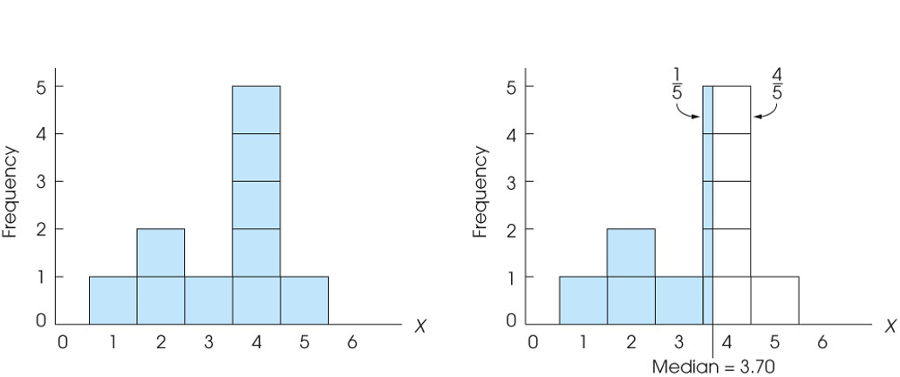
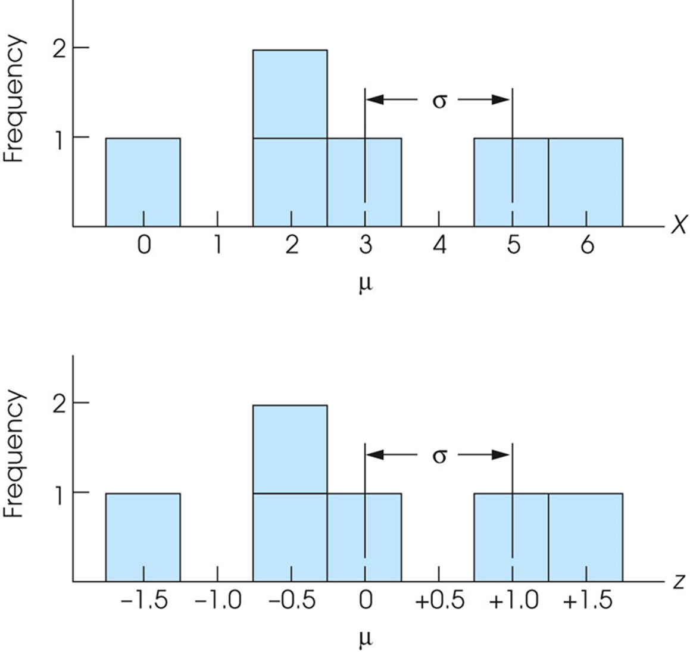
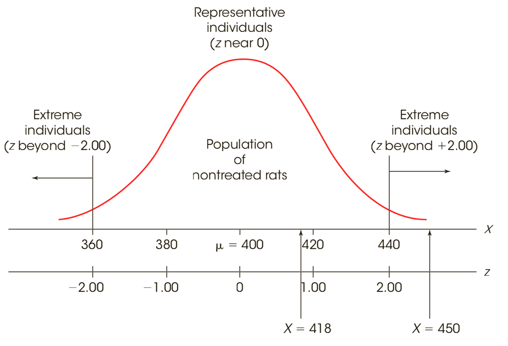
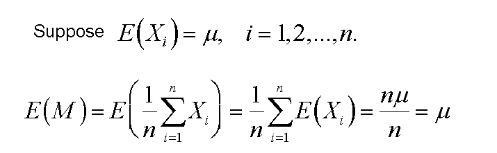
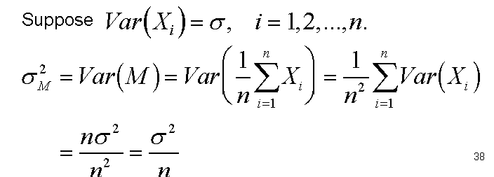
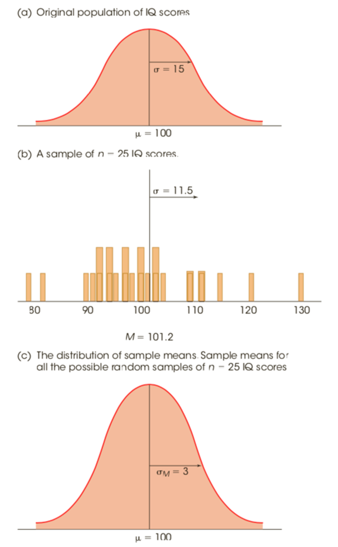
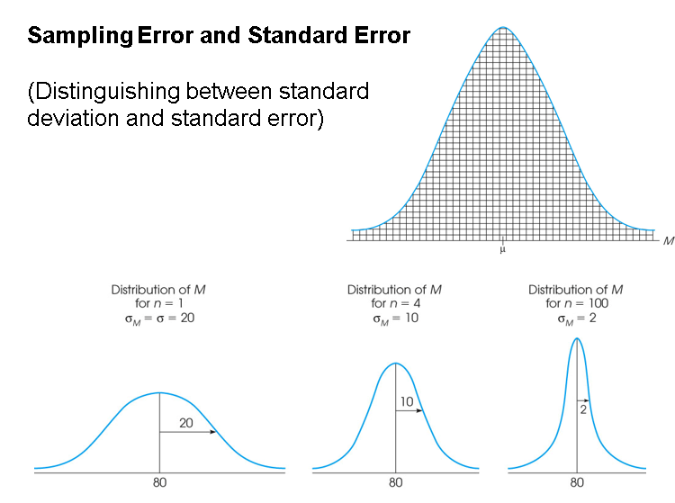

## 1 Introduction to Statistics

- 基本概念对
  - 总体population；
    - A **population** is the set of all the individuals of interest in a particular study.
  - 样本sample
    - A **sample** is a set of individuals selected from a population, usually intended to represent the population in a research study.
  - 参数parameter
    - A **parameter** is a value—usually a numerical value—that describes a **population**. A parameter is usually derived from measurements of the individuals in the population.
  - 统计量statistic
    - A **statistic** is a value—usually a numerical value—that describes a **sample**. A statistic is usually derived from measurements of the individuals in the sample.
- 统计
  - 描述性descriptive统计
    - **Descriptive statistics** are statistical procedures used to summarize, organize, and simplify data.
  - 推论inferential统计
    - **Inferential statistics** consist of techniques that allow us to study samples and then **make generalizations about the populations from which they were selected.**（从样本泛化到总体）
    - 取样误差sampling error
      - **Sampling error** is the naturally occurring discrepancy, or error, that exists between a sample statistic and the corresponding population parameter.
         (a fundamental problem for inferential statistics)
- 变量(variable)
  - 离散型discrete
    - A **discrete variable** consists of separate, indivisible categories. No values can exist between two neighboring categories.
       e.g. number of people, academic major (psychology, biology, math, etc.) 
  - 连续型continuous
    - For a **continuous variable**, there are an infinite number of possible values that fall between any two observed values. A continuous variable is divisible into an infinite number of fractional parts.
       e.g. time, space, height, weight, blood pressure
    - 精确上下限real limits
      - **Real limits** are the boundaries of intervals for scores that are represented on a *continuous* number line（连续数轴）. The real limit separating two adjacent scores is located exactly halfway between the scores. Each score has two real limits. The **upper real limit** is at the top of the interval, and the **lower real limit** is at the bottom.

- 测量水平(scale)

  - 命名型nominal

    - A **nominal scale** consists of a set of categories that have different names. Measurements on a nominal scale label and categorize observations, but do not make any quantitative distinctions between observations.（对观察对象进行标注和分类，但是不做任何数量上的区别）

       e.g. gender, academic major, room number

    - mode

  - 顺序型ordinal

    - An **ordinal scale** consists of a set of categories that are organized in an ordered sequence. Measurements on an ordinal scale rank observations in terms of size or magnitude.（顺序量表的测量根据事物的大小或者数量来排列观测结果）

       e.g. T-shirt sizes (small, medium, large), food preferences

    - mode,medium

  - 等距型interval

    - An **interval scale** consists of ordered categories that are all intervals of exactly the same size. Equal differences between numbers on scale reflect equal differences in magnitude. However, the zero point on an interval scale is arbitrary and does not indicate a zero amount of the variable being measured.

       e.g. Fahrenheit or Celsius temperature scale

    - mode,medium,mean,add,minus

  - 等比型ratio

    - A **ratio scale** is an interval scale with the additional feature that a score of zero indicates none of the variable being measured. With a ratio scale, ratios of numbers do reflect ratios of magnitude.

       e.g. Kelvin temperature scale, response time, accuracy

    - mode,medium,mean,add,minus,multiply,division

> three data structures 
>
> research methods  

## 2 Frequency Distributions

- 频数分布frequency distributions
  - 频数 （f）
  - 频率proportion （p = f/N）
  - 百分位数percentage (频率的百分比)
  - all of the individual categories -> regular frequency distribution
  - groups of scores (class intervals) -> grouped frequency distribution

- 分组grouped频率分布
  - 组距class interval的概念和选择
  - **These intervals all have the same width**, usually a simple number such as 2, 5, 10, and so on. 
  - Each interval begins with a value that is a multiple of the interval width. (每个分组区间的下限值是组距的倍数)
  - The interval width is selected so that the table will have approximately **10** intervals

> Suppose a class interval of 40–49 contains scores from X = 40 to X = 49. 

- 表面界限apparent limits
  - The **apparent limits** of the interval are the values that appear to form the upper and lower boundaries for the class interval (40 and 49 in this case). 
- 精确上下限real limits
  - **The real limits** of the class interval are thus 39.5 (lower real limit) and 49.5 (upper real limit). The distance between these two real limits (10 points) is the width of the interval.

- 频率分布图

  - continuous

    - When the score categories consist of numerical scores from an **interval** or **ratio** scale, the graph should be either a **histogram** or a **polygon**. 

    - 直方图histogram（bar之间无间距）

      - ```r
        hist()
        ```

    - 多边形图polygon

      - ```r
        polygon() # 不能直接使用
        ```

  - discrete

    - When the score categories (X values) are measurements from a **nominal** or an **ordinal** scale, the graph should be a **bar** graph. 

    - 棒图bar graph（bar之间有间距）

    - 茎叶图stem-and-leaf（离散的数字）

      - ```r
        stem()
        ```

- 相对频率relative frequency （large population）

  - 能告知倍数关系

- 平滑曲线smooth curve

  - If the scores in the **population** are measured on an interval or ratio scale, it is customary to present the distribution as a **smooth curve** rather than a jagged histogram or polygon. 

    The smooth curve emphasizes the fact that the distribution is not showing the exact frequency for each category. Rather, we say xx% of scores is between xx and xx. 

- 分布
  - 
  - 对称symmetrical
  - 正偏态positively skewed
    - 图形峰值左偏，众数<中位数<平均数
    - In a **positively skewed** distribution, the scores tend to pile up on the left side of the distribution with the tail tapering off to the right. a.k.a. right skewed
  - 负偏态negatively skewed
    - 图形峰值右偏，平均数<中位数<众数
    - In a **negatively skewed** distribution, the scores tend to pile up on the right side and the tail points to the left. a.k.a. left skewed

## 3 Central tendency

- 集中趋势central tendency：关注定义definition、性质propertied、适用范围
  - In general terms, **central tendency** is a statistical measure that determines **a single value** that accurately describes **the center of the distribution and represents the entire distribution of scores. **
  - The goal of central tendency is to identify the single value that is **the best representative for the entire set of data.**
  - By identifying the “average score”, central tendency allows researchers to **summarize** or condense a large set of data into a single value. 
  - In addition, it is **possible** **to** **compare** two (or more) sets of data by simply comparing the average score (central tendency) for one set versus the average score for another set. 

- 均值mean：加权weighted平均值，线性性质(add multiple)
  - Requires scores that are **numerical** values measured on an **interval **or **ratio** scale. 
  - The mean is the balance point of the distribution because the sum of the distances below the mean is exactly equal to the sum of the distances above the mean.
  - The Mean is Influenced by **Every Score** **in the Distribution**
  - $E(ax+b)=aE(x)+b$
  - When a distribution contains a few **extreme** scores (or is very **skewed**), the mean will be pulled toward the extremes (displaced toward the tail). In this case, the mean will not provide a "central" value. 
  - With data from a **nominal** scale it is impossible to compute a mean, and when data are measured on an **ordinal** scale (ranks), it is usually inappropriate to compute a mean. 
- 中位数median
  - Computation of the median requires scores that can be placed in rank order (smallest to largest) and are measured on an **ordinal, interval, or ratio scale.** 
  - With an odd number of scores, list the values in order, and the median is the middle score in the list.
  - With an even number of scores, list the values in order, and the median is **half-way between the middle two scores**.
  - 精确precise中位数（**continuous**）
    - If the scores are measurements of a continuous variable, it is possible to find the median by first placing the scores in a frequency distribution histogram with each score represented by a box in the graph. 
    - Then, draw a vertical line through the distribution so that exactly half the boxes are on each side of the line (面积平分). The median is defined by the location of the line.
    - 使用比例劈分具体的数
      - 
    - One advantage of the median is that it is relatively unaffected by extreme scores. 
    - Thus, the median tends to stay in the "center" of the distribution even when there are a few extreme scores or when the distribution is very skewed. In these situations, the median serves as a good alternative to the mean.
- 众数mode
  - In a frequency distribution graph, the mode is the category or score corresponding to **the peak or high point** of the distribution. 
  - The mode can be determined for data measured on any scale of measurement: **nominal, ordinal, interval, or ratio**.
  - •The primary value of the mode is that it is the only measure of central tendency that can be used for data measured on a **nominal** scale. In addition, the mode often is used as **a supplemental measure** of central tendency that is reported along with the mean or the median. 
  - 双峰bimodal分布
    - It is possible for a distribution to have more than one mode. Such a distribution is called **bimodal**. (Note that a distribution can have only one mean and only one median.) （两个峰值并不一定等高）
    - In addition, the term "mode" is often used to describe a peak in a distribution that is not really the highest point. Thus, a distribution may have a *major mode* at the highest peak and a *minor mode* at a secondary peak in a different location.（主要模式和次要模式）

- 综合：不同条件怎样选择，不同偏态条件下统计量的关系

  - 

  - **When to Use the Median**
    - 
    - Extreme Scores or Skewed Distributions (mean not suitable)
    - Undetermined Values (unspecified data)
    - Open-Ended Distributions (unspecified)
    - Ordinal Scale (mean cannot be computed)
  - **When to Use the Mode**
    - Nominal Scales
    - Discrete Variables
    - Describing Shape


## 4 Variability

- 变异性variability：关注定义definition、性质propertied、适用范围

  - **Variability** provides a quantitative measure of the differences between scores in a distribution and describes the degree to which the scores are spread out or clustered together. 

  - Variability can be measured with 

    –the range

    –the interquartile range

    –the standard deviation/variance. 

    In each case, variability is determined by measuring **distance**.

- 全距range
  - The **range** is the total distance covered by the distribution, from the highest score to the lowest score (**using the upper and lower real limits of the range**). 
  - $range = X_{max}-X_{min}$ （discrete）
  - $range = URL \space for \space X_{max}-LRL \space for \space X_{min}$（continuous）
  - $range = X_{max}-X_{min} +1 $（int，continuous）
  - 精确上下限real limits

- 四分位距interquartile range
  - The **interquartile range** is the distance covered by the middle 50% of the distribution (the difference between Q1 and Q3). （中间50%）
  - 

- 方差variance/标准差standard deviation

  - **Variance** equals the mean of the squared deviations. Variance is the average squared distance from the mean.

  - ```r
    var() # 无偏估计
    ```

  - **Standard deviation** is the square root of the variance and provides a measure of the standard, or average distance from the mean. 

  - ```r
    sd() # 无偏估计
    ```

- 离差deviation

  - A **deviation** or **deviation score** is the difference between a score and the mean, and is calculated as:

     $deviation = X – \mu$

- 和方sum of squares（SS）

  - $SS = \sum(X-\mu)^{2} = \sum X^2-\frac{(\sum X)^2}{N}$

- 总体方差和样本方差公式;总体标准差和样本标准差

  - Population
    - $population \space standard \space deviation= \sigma = \sqrt{\sigma^2} = \sqrt{\frac{SS}{N}}$
    - $ population \space variance = \sigma^2 = \frac{SS}{N}$
  - Sample
    - The variability for the scores in the sample is on average smaller than the variability for the scores in the population.
    - $sample \space variance = s^2 = \frac{SS}{n-1}$
    - $sample \space standard \space deviation = s = \sqrt{s^2} = \sqrt{\frac{SS}{n-1}}$

- 自由度degree of freedom

  - For a sample of *n* scores, the **degrees of freedom**, or **df**, for the sample variance are defined as *df* = *n* – 1. The degrees of freedom determine the number of scores in the sample that are **independent and free to vary.**

- 无偏unbiased估计和有偏biased估计

  - A sample statistic is **unbiased** if the average value of the statistic is equal to the population parameter. (The average value of the statistic is obtained from all the possible samples for a specific sample size, *n*.)
  - A sample statistic is **biased** if the average value of the statistic either underestimates or overestimates the corresponding population parameter.
  - Sample variance (i.e. divided by *n*–1) is an unbiased estimate of the variance of the population.

- 线性性质(add multiple)

  - $D(aX+b) = a^2D(X)$
  - $SD(aX+b) = aSD(X)$

## 5 Z-score

- 相对总体和相对样本z分数z-score的计算
  - The process of changing an X value into a z-score involves creating a signed number, called a **z-score**, such that
    - a. The **sign** of the z-score (+ or –) identifies  whether the X value is located above the  mean (positive) or below the mean (negative).
    -  b. The **numerical** value of the z-score  corresponds to the number of standard deviations （$\sigma$）between X and the mean of the  distribution.
  - If the raw score is transformed into a z-score, the value of the z-score tells exactly where the score is located relative to all the other scores in the distribution.
  - Computing *z*-Scores for a Population
    - $z = \frac{X-\mu}{\sigma},\space X = \mu + z\sigma$
  - Computing *z*-Scores for Samples
    - $z = \frac{X-M}{\sigma},\space X = M + zs$
    - 注意，这里的M是样本均值，s是样本标准差（无偏估计）

- z分布的性质properties
  - 形状shape
    - 
    - The distribution of z-scores will have exactly **the same shape** as the original distribution of scores. The transformation does not change the location of any individual score relative to others in the distribution.（只改变量纲，形状完全不变）
    - 
  - 均值mean
    - The z-score distribution will always have a mean of zero. 
  - 标准差standard deviation
    - The distribution of z-scores will always have a standard deviation of 1.
  - 作为一个转换的工具
    - To create a simpler standardized distribution, you first select the mean and standard deviation that you would like for the new distribution. （先选出均值和标准差）
    - Then, z-scores are used to identify each individual's position in the original distribution and to compute the individual's position in the new distribution. （Zscore确定原始数据在分布中的位置，在新的分布中位置由zscore确定）
    - A **standardized distribution** is composed of scores that have been transformed to create predetermined values for μ and σ. Standardized distributions are used to make dissimilar distributions comparable.（不同的数据之间可以相互比较）

- 包括z分数在内的标准化分布standardized distribution能提供哪些和location有关的信息

  - •The fact that z-scores identify exact locations within a distribution means that z-scores can be used as descriptive statistics and as inferential statistics. 

    –As descriptive statistics, z-scores describe exactly where each individual is located. 

    –As inferential statistics, z-scores determine whether a specific sample is representative of its population, or is extreme and unrepresentative. 

  - 

## 6 Probability and Distributions

- 概率Probalility

  - 条件conditional概率

    - $P(A|B) = {P(AB) \over P(B)}$

  - 加法公式addition law

    - $P(A\or B) = P(A) + P(B) - P(AB)$

  - 贝叶斯公式bayes theorem

    - $P(A|B) = {P(B|A)*P(A)\over P(B)}$


>  | 事实\预测 | Positive | Negative |
>  | --------- | -------- | :------: |
>  | True      | TP       |    FN    |
>  | False     | FP       |    TN    |
>
> 特异性Specificity = TN / (TN + FP)
>
> 敏感性(召回率) Sensitivity = TP / (TP + FN)

- 离散型discrete随机变量 (DRV)

  - A random variable for which there exists a discrete set of values with specified probabilities is a **discrete random variable**.

- CRV 连续型continuous随机变量

  - A **continuous random variable** is a variable that can assume any value on a continuum (an uncountable number of values, cannot be enumerated)

- 二项分布binomial（参数n，p的影响和形状shape）

  - $P(x) = C_n^{x}p^x(1-p)^{n-x}$

    - n是试验次数，p是成功概率，x是要求的成功次数

  - ```r
    rbinom(n, size, prob)
    # n：生成随机数的数量。
    # size：每次试验的次数。
    # prob：每次试验成功的概率。
    ```

  - $\mu = E(X) = np$

  - $\sigma =\sqrt{np(1-p)}$

- 概率质量函数PMF

  - 针对于离散随机变量
  -  A **Probability Mass Function** (PMF) is a mathematical relationship which assigns a probability to each possible value, *x*, of the discrete random variable *X.*

- 分布列

  - 一般是表格形式

- 期望Expected Value

  - $E(X) = \int_{-\infin}^{\infin}x*f(x)dx$
  - $E(X) = \sum x*P(x)$

- 方差

  - $\sigma ^2 = \int_{-\infin}^{\infin}(x-\mu)^2f(x)dx$

- 标准差

  - $\sigma = \sqrt{\int_{-\infin}^{\infin}(x-\mu)^2f(x)dx}$


- 正态分布normal（参数mu，sigma的影响和形状shape）
  - $\mu$描述对称轴
  - $\sigma $描述高矮胖瘦
    - 越大越胖矮
    - 越小越高瘦
- 概率密度函数PDF
  - The Probability Density Function (PDF,概率密度函数) of the random variable X is the curve such that the area under the curve between any two points *a* and *b* is equal to the probability that the random variable, *X,* falls between *a* and *b.*
  - It is used extensively in methods of estimation and hypothesis testing (actually almost everything…).
  -  $p(x) = \frac{1}{\sigma \sqrt{2\pi}}e^{-(x-\mu)^2\over 2\sigma^2}$ 正态分布
- 累计分布函数CDF
  - The Cumulative Distribution Function (CDF,累计分布函数,*F(a)*) of the random variable X evaluated at the point *a* is defined as the probability that X will take on values ≤ *a.* It is represented by the area under the PDF to the left of *a.* 
  - 可以用于DRV
  - $F(a) = Pr(X<=a) = \int_{-\infin}^{a}f(x)dx$

## 7 Normal Distribution 

- 标准正态分布
  - nN(0,1) is referred to as the standard normal distribution (标准正态分布，or unit normal, or **z distribution**). 
  - Any normal distribution can be transformed into N(0, 1). 
    - $if \space X\sim N(\mu,\sigma ^2),we \space have \space Y = \frac{X-\mu}{\sigma} \sim N(0,1)$ 一般正态分布: 和标准正态分布的关系
  - 累计分布函数CDF和百分位数percentile
    - The relative location of individual scores within a distribution can be described by percentiles and percentile ranks. 
    - The **percentile rank** for a specific X value is the percentage of individuals with scores at or below that value. 
    -  When a score is referred to by its rank, the score is called a **percentile**. The percentile rank for a score in a normal distribution is simply the proportion to the left of the score. 
    - 常用的值
      - $\Phi(1.96) = 0.975 = z_.975$   97.5%
      - $\Phi(1.645) = 0.95=z_.95$  95%
      - $\Phi(-1.96) = 0.025 = z_.025$   2.5%
  - 对称性symmetry

- 近似二项分布（近似准确的条件when the approximation is good、具体计算、精确上下限real limits）

  - **When *n* is large and *p* is not near 0 or 1,** the binomial distribution tends to be symmetric and is well approximated by a normal distribution with mean $μ=np$, variance $σ^2=npq$.

  - **Use N(** **np,** **npq** **) to approximate it**

  - **When the approximation is good**

    - Rule of thumb for when approximation of Binomial by normal is “reasonably good”:

       npq≥5

       or *n* moderate and *p* away from 0 and 1.

    - From the text book, the rule of thumb:

       np>10 and nq>10

  - **If X~ Binomial(n,p), then** Pr(a=<X=<b) is approximated by the area under an N(np,npq) curve from(a-0.5) to (b+0.5). 

- 样本均值分布distribution of sample means

  - The **distribution of sample means** is defined as the set of means from *all the possible random samples of a specific size* (*n*) selected from a specific population.
  - The sample means should pile up around the population mean. 
  - The pile of sample means should tend to form a normal-shaped distribution. See the **Central Limit Theorem**.
  - In general, the larger the sample size *n*, the closer the sample means should be to the population mean, *μ*. See the **Law of Large Numbers**.
  - The mean of the distribution of sample means is called the **Expected Value of** **M**, and is equal to the population mean *μ*.
  - 
  - Within the distribution of sample means, the location of each sample mean can be specified by a z-score,$z = \frac{M - \mu}{\sigma _M}$ ，**注意分母是标准误**

- 抽样分布sampling distribution

  - A **sampling distribution** is a distribution of statistics obtained by selecting *all the possible samples of a specific size* from a population.
  - The distribution of sample means is an example of a sampling distribution, often called the sampling distribution of *M*.

- 中心极限定理central limit theorem（样本均值分布是正态分布的条件）

  - For any population with mean *μ* and standard deviation *σ*, the distribution of sample means for sample size *n* will have a mean of *μ* and a standard deviation of $\sigma \over \sqrt{n}$ and will approach a normal distribution as *n* approaches infinity.

  - a cornerstone of inferential statistics

  - 

  - The distribution of sample means is perfectly or almost perfectly normal when either of the following two conditions is satisfied:

    1. The population from which the samples are selected is a normal distribution. 

    2. The number of scores (*n*) in each sample is relatively large, around 30 or more.

- 标准误standard error（SE）

  - The standard deviation of the distribution of sample means, $σ_M$, is called the **standard error of** **M**.
  - The standard error provides a measure of how much distance is expected on average between a sample mean (*M*) and the population mean (*μ*).
  - 
    - $D(x+y) = {SS(x+y) \over n} = {SS(x)+SS(y) \over n} = {SS(x) \over n}+{SS(y) \over n} = D(x)+D(y)$
  - 
  - 

- 大数定律law of large numbers

  - The **law of large numbers** states that the larger the sample size (*n*), the more probable it is that the sample mean will be close to the population mean.
  - 

- 

- 

## 8 Hypothesis Testing

推论统计inferential statistics：估计estimation（只要求点估计，置信区间估计不考），假设检验hypothesis testing（z检验和单样本t检验，配对样本t检验不考）

假设检验hypothesis testing中的一般规程：虚无假设null hypothesis，备择假设alternative hypothesis，双尾two-tailed检验和单尾directional/one-tailed检验, alpha水平alpha level，拒绝域critical region/rejection region，检验统计量test statistic，显著性significant，第一类错误Type I error，第二类错误Type II error，效应量effect size，检验力power的计算

z检验：使用条件，z统计量，Cohens d 和power的计算

## 9 One sample t-tests

t分布：形状、自由度、查拒绝域critical region

估计标准误estimated standard error和t统计量statistic

单样本t检验：适用条件，效应量cohen’s d，r^2，

## 10 补充的R的基本操作

```r
library()
read_excel()
+
- 
*
/
^
%%
%/%
sum()
prod() # 向量元素乘积
sort()
abs()
sqrt()
factorial()
log()
exp()
log10()
log2()
<
>
==
<=
>=
!=
range()
max()
min()
floor()
ceiling()
var()
sd()
median()
quantile()
cat()
print()
```


使用library函数调用安装的包

读取数据：read_excel读取excel文件；load读取Rdata文件

变量：定义变量c，四则运算，平方，根号，绝对值，比较大小，取整操作

数据框：定义数据框data.frame，读取变量（列的选择），切片（行的选择）

描述性统计：频数分布，均值，中位数，众数，全距，四分位距，标准差，方差

绘图（不直接考察）：直方图hist，茎叶图stem，饼图pie，概率密度PDF，概率质量PMF，累计分布CDF

概率和分布：二项（dbinom和pbinom），正态(dnorm, pnorm和qnorm）,t（dt，pt和qt）