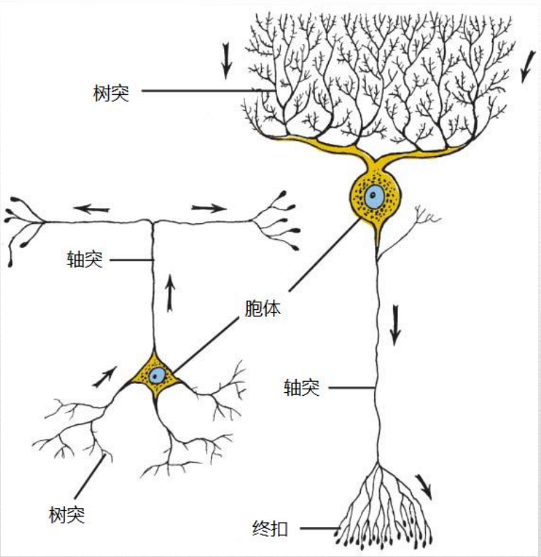

# 普通心理学

## 第一章 生活中的心理学

### 心理学为独具特色

心理学：关于**个体**的**行为**及**心理**过程（心智过程）的**科学**研究

科学方法：由一套用来分析和解决问题的有序步骤组成，用客观收集到的信息作为得出结论的事实基础

行为：人和其他动物的可观察行为

心理过程（心智）：发生在个体内部的过程——思考、计划、归因、创造以及做梦

- 心理学的目标：

  - 描述发生的事情

    - 行为数据：关于有机体的行为以及行为发生条件的观察报告
    - 整合不同分析水平提供的信息
      - 复杂社会环境和文化环境中最为整体的人的行为（暴力、偏见的根源）
      - 狭窄和精细的行为单元（对交通灯的反应速度）
      - 更小的行为单元——生物基础（大脑中存储不同记忆类型的部位）
    - 保证客观性
      - 排除主观观点——偏差、偏见和期望——的影响

  - 解释发生的事情

    - 大多数行为受到内部因素和外部因素的共同影响

      > 解释一些人为什么开始吸烟？

      - 内部解释：个体的冒险倾向
      - 外部解释：大量的同辈压力
      - 综合解释：上述二者都是必不可少的

    - 通过一个潜在的原因解释多种行为（通常的目标）

    - 见多识广的想象力

      - 把已知和未知的事物创造性地整合起来

  - 预测将要发生的事情

    - 科学预测的措辞必须足够精确，以便能对其进行检验，若证据不支持就予以拒绝
    - 对于某些行为方式背后原因的准确解释，常常能让研究者对未来的行为做出准确的预测

  - 控制发生的事情

    - 控制意味着使行为发生或不发生——启动行为，维持行为，停止行为，以及影响行为的形式、强度或发生率
    - 如果我们根据一个对行为的因果解释能够创造出行为得以被控制的条件，那么这个因果解释就是令人信服的
    - 帮助人们提升生活质量的途径
    
### 现代心理学的发展

> 心理学史、结构主义、机能主义、作为先驱者的女性、
>
> - 柏拉图与亚里士多德的哲学思想之争 
>   - 亚里士多德、约翰∙洛克：经验主义者 
>     -  人们的心智生来是白板，通过在世界上的经验来获取信息 
>   - 柏拉图、伊曼努尔∙ 康德：先天论者 
>     - 人们生来便具有心理结构，对人们经验世界的方式产生了限制
>
> - 实验心理学实验室的建立 
>   - 威廉∙冯特：建立了第一个正式的实验心理学实验室 
>   -  爱德华∙铁钦纳：美国第一批心理学家之一 
>   - 威廉∙詹姆士：《心理学原理》
>   - 斯坦利∙霍尔：美国心理学协会
>
> - 结构主义
>   - 对心理和行为的结构的研究
>   - 铁钦纳：内省法
>   - 存在的问题：简化论、元素论
>   - 马克思∙惠特海默：格式塔心理学
>
> - 机能主义
>
>   - 行为的机能或目的是什么
>
>   - 约翰∙杜威：美国教育领域的改革
>
> 
>
> - 玛丽∙惠顿∙卡尔金斯 
>   - 美国心理学协会的第一位女主席 
>   - 创造了研究记忆的重要技术 
> - 玛格丽特∙沃什布恩 
>   - 第一位获得心理学博士学位的女性
>   - 《动物心理》 
> - 海伦∙汤普森∙伍利 
>   - 智力和情绪测验的性别差异研究
> - 丽塔∙斯塔特∙霍林沃斯 
>   -  智力的性别差异研究 
>   - 智力极端儿童的研究

- 心理学的观点

| 观点       | 研究的焦点             | 基本研究主题                               |
| ---------- | ---------------------- | ------------------------------------------ |
| 心理动力学 | 无意识驱力、冲突       | 作为无意识动机外显表达的行为               |
| 行为主义   | 特定的外显反应         | 行为及其刺激的原因和结果                   |
| 人本主义   | 人类的经验和潜能       | 生活模式、价值观、目标                     |
| 认知       | 心理过程、语言         | 通过行为指标推断心理过程                   |
| 生物学     | 脑与神经系统的加工过程 | 行为和心理加工过程的生物化学基础           |
| 进化       | 进化而来的心理适应性   | 从进化而来的适应性功能的角度来阐述心理机制 |
| 社会文化   | 态度和行为的跨文化模式 | 人类经验的普遍性方面和文化特异性方面       |

- 心理动力学观点
  - 人类的行为源于遗传的本能、生物驱力，以及为解决个人需要与社会要求之间的冲突而做的努力
  - 剥夺状态、生理唤起和冲突都为行为提供了力量
  - 西格蒙德∙弗洛伊德：行为有可能是由意识觉知之外的动机驱动的；强调儿童早期是人格形成的阶段
- 行为主义观点
  - 试图理解特定的环境刺激如何控制特定类型的行为
  - 强调严格的实验和严谨定义的变量
  - 约翰·华生、B.F.斯金纳
- 人本主义观点具体
  - 人是具有能动性的生物，本性善良而且具有选择能力，人类的主要任务是争取积极的发展
  - 卡尔·罗杰斯：积极关注
  - 亚伯拉罕·马斯洛：自我实现
- 认知观点
  - 关注人的思维以及所有的认识过程——注意、思考、记忆和理解，一些最重要的行为是从全新的思维方式中产生的
  - 在认知视角下，个体不是对客观的物质世界做出反应，而是对个体思维和想象的内在世界的主观现实作出反应。
  - 诺姆∙乔姆斯基：儿童语法的获得 
  -  让∙皮亚杰：儿童的认知发展理论
- 生物学观点
  - 在基因、大脑、神经系统以及内分泌系统的机能中寻找行为的原因
  - 行为取决于生理结构和遗传过程，经验可以通过改变基础的生物结构和过程来改变行为。
  - 行为神经科学：试图理解诸如感觉、学习、情绪等行为背后的大脑过程
  - 认知神经科学：关注高级认知功能的脑机制，比如记忆和语言
- 进化观点
  - 心理能力和身体能力一样，经过了几百万年的进化以达成特定的适应性目标
  - 适应性问题：躲避食肉动物和寄生虫、采集和交换食物、寻找并留住配偶以及抚育健康的子女
  - 男性和女性所承担的不同性别角色
- 社会文化观点
  - 研究行为的原因和结果的跨文化差异（弗洛伊德的心理动力学理论中的很多方面都不能应用到与弗洛伊德时代的维也纳几位不同的其他文化中）

### 心理学家做些什么

> 心理学家们做些什么、学位分布，工作场所
>
> - 认知心理学家 
>   - 基本的认知过程，如记忆和语言  
> - 社会心理学家 
>   - 塑造人们态度和行为的社会力量
> - 工业与组织心理学家
>   - 提升工作场所中人们的调适能力 
> - 教育心理学家
>   - 教育环境下学生的调适能力
> -  临床心理学家
>   - 应用心理学知识来改善人们的生活

## 第二章 心理学的研究方法

### 研究过程

1. 初始的观察或问题
2. 形成假设
3. 设计研究
4. 分析数据并得出结论
5. 报告研究发现
   1. 所有的数据和方法都必须接受公开检验
   2. 同行评审
   3. 向更广泛的公众传播科研结果
6. 考虑开放的问腿
7. 对开放的问题开展研究

理论：一套用于解释一种现象或一系列现象的有组织的概念集合。

决定论假设：一切事件，包括生理的、心理的和行为的，都是特定原因的结果，或者是由其所决定的。

假设：对原因和结果关系的试探性的、可以检验的阐述。

科学方法：一套以能够限制误差源并得出可靠结论的方式收集和解释证据的一般程序。

观察者偏差：由观察者个人的动机和预期导致的错误。（观察者偏差起着过滤器的作用，一些事情被视为是相关的和重要的而获得注意，另一些则被视为无关和不重要的而被忽略）

标准化：在数据收集的所有阶段均使用统一的、一致的程序。

操作性定义：以测量该概念或决定它是否存在的特定操作或程序来界定一个概念从而在实验内使其含义标准化。（一个实验中的所有变量都必须给予操作性定义）

- 变量：任何在数量或性质上可以有不同取值的因素。
  - 自变量：被操纵的变量
  - 因变量：实验者所测量的变量

- 实验法
  - 研究者操纵一个自变量来观察其对因变量的影响
  - 优势：允许实验者得出关于变量间因果关系的判断
  - 劣势：人为控制的实验环境本身可能歪曲原本可自然发生的行为；参与者在知道被监控的情况下可能试图取悦研究者、尝试揣测研究的目的；有一些重要的问题受到伦理的约束而不可能实施

混淆变量：并非实验者有意引入到实验情境中的一些因素确实影响了参与者的行为，并混淆了数据的解释。

期望效应：研究者或观察者以微妙的方式向参与者传达他所预期发现的行为，并因此引发期望的反应。

安慰剂效应：因个体相信治疗有效而导致的健康或幸福感的改善。（当没有施加任何一种实验操纵，但实验者却改变了他们的行为。）

控制程序：一些试图使所有变量和条件（除了那些与被验证的假设相关的）保持恒定的方法

双盲控制：实验助手和参与者都不知道哪些参与者接受了何种处理

安慰剂控制：引入一个不进行任何处理的实验条件

- 研究设计
  - 被试间设计：参与者被随机分配到实验条件和控制条件
  - 代表性样本：在性别、种族等方面的分布都与总体的特征非常吻合的样本
  - 随机取样：总体的每个成员参与实验的可能性都是相等的
  - 被试内设计：利用每一个参与者作为自己的控制组

相关法：用于确定两个变量、特质或者属性之间的关联程度（相关不意味着因果关系）

### 心理测量

信度：心理测验或实验研究得到的行为数据的一致性和可靠性（可重复性）

效度：研究或测验得到的信息准确地测量了研究者想要测量的心理变量或品质（预测性）

- 自我报告法：通过言语（手写或口述）回答研究者提出的问题。
  - 获得无法直接观察到的经验的数据（包括内部的心理状态和外部行为）
  - 问卷法和访谈法
  - 局限性
    - 不适用于语言能力受限的参与者
    - 参与者可能错误理解问题或不能清楚地记得过去的经历
    - 受到社会期望的影响
    - 参与者可能说谎或捏造事实
    - 访谈的情境会产生个人偏见和成见

行为测量：研究外显行为和可观察、可记录的反应的方法

- 观察
  - 直接观察：清晰可见的、外显的、容易记录的行为（面部表情）
  - 技术辅助的间接观察（计算机：反应时，脑成像技术：大脑的活动）
  - 自然观察：研究者观察一些自然发生的行为而不试图改变或干涉它

许多研究结合使用自我报告法和行为观察法

个案研究：集中在个体或小群体上进行各种测量（有时对特殊个体进行透彻分析有助于理解人类经验的普遍特性）

### 人类和动物研究中的伦理问题

- 知情同意（签署同意书）
  - 告知将要经历的程序以及参与研究的潜在风险和利益
  - 确保参与者的隐私得到保护
  - 提前告知参与者可以在任何时间停止实验，没有任何处罚
- 风险/收益的评估
  - 把风险降至最低程度
  - 把风险告知参与者
  - 采取适当的防范措施应对可能的强烈反应
- 故意欺骗（不让参与者事先知道研究的目的）
  - 研究必须具有充分的科学价值和教育价值
  - 如果研究有很高的可能性导致参与者身体疼痛或严重的情绪痛苦，那么研究者一定不能欺骗参与者
  - 必须证明除了欺骗之外，没有任何同等有效的替代研究程序
  - 研究者必须在研究结束后，对参与者解释实验中欺骗
  - 参与者在欺骗得到解释后，必须有机会收回自己的数据

事后解释：尽可能多地提供有关该研究的信息，确保参与者离开时没有疑惑、心烦或尴尬。

- 动物实验
  - 获益
    - 可以进行一些非常重要的突破性研究，如药物成瘾等
    - 有利于动物本身，如更好的治疗方法等
  - 3R原则：
    - 减少所需的动物数量（reduce）
    - 替换动物的使用（replace)
    - 改善实验步骤以使疼痛和不适降至最小（refine)

### 成为有批判精神的研究消费者

- 避免把相关推论为因果。
- 要求关键术语和概念有操作性定义，这样人们才能对其含义有一致的理解。
- 在寻找证实性数据之前，首先要考虑如何反驳一个理论、假设或信念，因为只要你想证明它们合理，证据总能很容易找到。
- 不要轻信显而易见的解释，要不断寻找其他可能的解释，尤其在已有的解释会给提出者带来利益之时。
- 要认识到个人偏差会怎样歪曲对现实的感知。
- 要对复杂问题的简单答案以及复杂效应和问题的单一原因和解决方案保持怀疑。
- 对所有宣称有效的治疗、干预或产品保持质疑，找出其效果的对照基础：与什么相比？
- 心智开放，保持怀疑态度 ：必须意识到，大多数结论是初步的而非确定的；寻找新证据以减少你的不确定感，同时对变化和修正保持开放态度。
- 挑战那些在做结论时使用个人观点取代证据且不接受建设性批评的权威。

### 理解统计学：分析数据并得出结论

描述统计：以一种客观的、统一的方式使用数学程序来描述数值型数据的不同方面

推论统计：利用概率论来确定一组数据完全因随机变异而出现的可能性

- 集中量数：可作为一组参与者最典型分数指标的单个代表性分数
  - 中数
  - 众数
  - 平均数
- 差异量数：描述围绕在集中量数周围的分数分布情况的统计量
  - 全距（极差）
  - 标准差
  - 方差
- 相关
  - 相关系数：关于两个变量之间相关程度和性质的度量
  - 绝对值反应相关性大小，正负反应相关性方向
- 正态曲线 
  - 当从大量个体身上收集关于某个变量的数据时，数据的分布常常符合正态曲线 
  - 完全由随机因素造成的差异也符合正态曲线
- 统计显著性
  - 当差异由随机所致的概率不足5%时，（以p<0.05来表示），心理学家将接受这个差异为“真”。
  - 检验方法的选择取决于研究设计、数据类型以及样本的大小
  - t检验：考察两组数据的均值差异是否达到统计上的显著性
- 成为一个明智的统计学消费者
  -  参与者群体的选择会对结果造成很大的影响 
  - 当数据不能满足统计学的基本假设时（如有极端值）， 统计分析会得出一些误导结果
    - 检查样本的大小 
    - 同时检查中数、众数以及平均数
  - 研究应当报告样本大小、变异量数以及显著性水平

## 第三章 行为的生物学和进化基础

### 遗传和行为

心理学研究的主要目标之一是发现各种人类行为产生的原因。

天性和教养，或者说遗传与环境，是心理学对因果解释的一个重要维度。

物种的多样性反映了自然选择的作用。

基因型：个体的全部基因组合（基因结构）

表型：个体的外表和行为模式

环境压力（环境的变化）->竞争（为了获得资源）->最适表型得到选择（从各种表型之中）->繁殖成功（最适表型相应的基因型传递给下一代）->基因型（和表型）的频率增加（在下一代中）

两足化和大脑化是人类的两大适应性进化

两足化：直立行走的能力

直立行走使得人类的祖先可以探索新资源和开发新环境。

大脑化：脑容量的增大，发展出复杂的思考、推理、记忆和计划能力

语言的出现是人类进化的下一个里程碑，也是文化进化的基础

遗传：从祖先那里对生理和心理特质的继承（研究遗传机制的学科：遗传学）

>  遗传力：亲代性状传递给后代的能力大小

基因组：一个有机体的基因组是指染色体上基因以及相关DNA的全部序列

> 人类行为遗传学：结合遗传学和心理学来探究遗传和行为之间的因果联系，==关注个体差异的来源==（关注于估计特定人类性状或行为的遗传力 (heritability)）

研究方法：收养研究；双生子研究

- 比较同卵双生子和异卵双生子在特定特质或行为上的相似性（食物偏好的遗传力）

### 神经系统的活动

- 神经元的结构
  - 树突：接受从感受器或其他神经元发出的刺激
  - 胞体：维持细胞的生命，整合从树突接收的刺激
  - 轴突：向外延展的纤维，将整合后的信息传递出去
  - 终扣：轴突末端膨大的球状结构

感觉神经元：携带来自感受器细胞的信息向内传至中枢神经系统

感受器：高度特化的细胞，对光线、声音或身体姿势等非常敏感

运动神经元：携带来自中枢神经系统的信息向外传至肌肉和腺体

中间神经元：（大脑中的绝大多数）将来自感觉神经元的信息，再传递到其他中间神经元或运动神经元

镜像神经元：观察其他个体执行动作时模拟相同动作以理解其行为意图

- 胶质细胞

  - 固定神经元的位置

  - 帮助新生的神经元找到其在脑中的适当位置（发育过程中）
  - 清理脑内环境，清除受损或死亡的神经元留下的废物；吸收过量的神经递质和神经元间隙的其他物质
  - 绝缘作用，形成髓鞘增加神经信号的传导速度
  - 被称为星形胶质细胞的特化胶质细胞构成血脑屏障阻碍有毒有害物质（非脂溶性物质）

静息电位：细胞内液相对细胞外液具有70mv的负电压的极化电位

动作电位：

 1. 在静息状态下，轴突周围液体的离子浓度不同于轴突内部的液体。正因如此，细胞内液发生相对细胞外液的极化，产生神经元的静息电位。

 2. 当神经冲动到达轴突的一个节段时，带正电的钠离子流入轴突。钠离子的内流导致神经元变成去极化。随着每个阶段依次变成去极化，神经冲动沿着轴突向下传递。（离子通道）

    1. > 兴奋性输入引起离子通道允许钠离子流入细胞=》导致细胞发放
       >
       > 抑制性输入引起离子通道努力保持细胞内呈现负电位=》阻止细胞发放

 3. 一旦神经冲动传过，钠离子流出轴突，则静息电位得以恢复。（泵出）

 4. 一旦恢复静息电位，轴突的这个节段就准备好了传递下一个冲动。

全或无定律：阈值以上，动作电位的大小不受刺激强度增加的影响；一旦兴奋性输入的总和达到阈值，统一大小的动作电位便会产生；如果未达到阈值水平，动作电位就不会产生。

- 不应期
  - 绝对不应期：无法引发动作电位
  - 相对不应期：只对比平常发放所需强度更加强烈的刺激作出反应

在轴突覆盖髓鞘的神经元上，动作电位从一个节点向下一个节点跳跃式传导。(节省时间；节省在轴突各个位置的离子通道开闭所需的能量)

> 多发性硬化症：由于髓鞘退化而引起的严重障碍。症状：复视、震颤，最终导致瘫痪。来自身体免疫系统的特化细胞侵害了有髓鞘的神经元，使轴突裸露出来破坏了正常的突触传递。

### 生物学和行为

