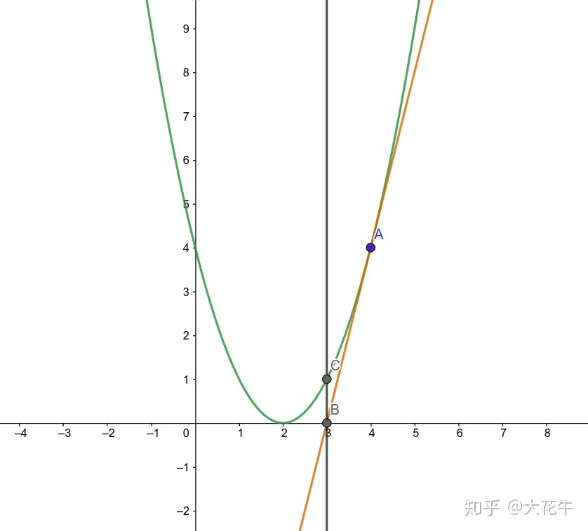

## 思想

## 排序算法 

### 冒泡排序  

- 比较相邻的元素,如果第一个比第二个大,就交换他们的位置
- 对每一组相邻的元素做相同的工作,直到得出第一个最大值
- 重复上述步骤,每次比较次数-1,直到不需要比较

```c++
#include<iostream>
using namespace std;
int main()
{
 int arr[] = {9,7,6,5,1,2,8,4,60,40,50,23,98,52,78,65,52};
 int n = sizeof(arr)/sizeof(arr[0]);
 for(int s = 0;s < n - 1;s++) 
 {
  for(int i = 0;i < n -s- 1;i++)
  {
   if(arr[i] > arr[i+1])
   {
    int temp = 0;
    temp = arr[i+1];
    arr[i+1] = arr[i];
    arr[i] = temp;  
   }
  }
 }
 for(int j = 0;j < n;j++)
 {
  cout<<arr[j]<<endl;
 }
 return 0;
} 
```

### 快速排序

> 通过一趟排序将待排记录分隔成独立的两部分，其中一部分记录的关键字均比另一部分的关键字小，则可分别对这两部分记录继续进行排序，以达到整个序列有序。主要采用`分治法`和`挖坑填数`等方法，分治法就是大问题分解成各个小问题，堆小问题求解，使得大问题得以解决。

```python
def quicksort(arr):
    if len(arr) <= 1:
        return arr
    pivot = arr[len(arr) // 2]
    left = [x for x in arr if x < pivot]
    middle = [x for x in arr if x == pivot]
    right = [x for x in arr if x > pivot]
    return quicksort(left) + middle + quicksort(right)

print(quicksort([3,6,8,10,1,2,1]))
```

## 分数的处理

### 求两个数的最大公约数  

- **辗转相减法**

```c++
while (a!=b)
{
    if(a > b)
    {
        a = a - b;
    }
    else
    {
        b = b - a;
    }
}
```

- **欧几里得法**

```c++
while (a!=b)
{
 c = a;a = b % a;b = c;
}

```

## 牛顿迭代法求近似解  

> 用于求一元方程的解
>
> 牛顿迭代法使用函数的**泰勒级数**的前面几项来寻找方程的根。

- 先猜测一个初始值 x₀；
- 在函数 f (x) 上找到点 (x₀, f (x₀)) 处的切线；
- 
- 切线与 x 轴的交点作为新的猜测值 x₁；
- 
- 重复步骤2和步骤3，直到满足所需的精度或达到最大迭代次数。
- 注意多个输入的时候记得重新初始化值

## 递归算法  

- 假设有一个函数f()可以解决问题,接下来的问题,这个函数长什么样
- 找到`fn()`与`fn-1()`之间的关系
- 确定`f()`的参数
- 分析并写出边界条件

**带有记忆的递归函数 **：用于提升递归的效率，减少深层次的递归

### 逆波兰表达式

> - 总时间限制: 
>
>   1000ms
>
> - 内存限制: 
>
>   65536kB
>
> - 描述
>
>   波兰表达式是一种把运算符前置的算术表达式，例如普通的表达式2 + 3的波兰表示法为+ 2 3。波兰表达式的优点是运算符之间不必有优先级关系，也不必用括号改变运算次序，例如(2 + 3) * 4的波兰表示法为* + 2 3 4。本题求解波兰表达式的值，其中运算符包括+ - * /四个。
>
> - 输入
>
>   输入为一行，其中运算符和运算数之间都用空格分隔，运算数是浮点数。
>
> - 输出
>
>   输出为一行，表达式的值。 可直接用printf("%f\n", v)输出表达式的值v。
>
> - 样例输入
>
>   `* + 11.0 12.0 + 24.0 35.0`
>
> - 样例输出
>
>   `1357.000000`
>
> - 提示
>
>   可使用atof(str)把字符串转换为一个double类型的浮点数。atof定义在math.h中。 此题可使用函数递归调用的方法求解。

```c++
#include <iomanip>
#include <iostream>
#include <string>

using namespace std;
double calulate() {
  string temp;
  cin >> temp;
  if (temp == "+") {
    return calulate() + calulate();
  } else if (temp == "-") {
    return calulate() - calulate();
  } else if (temp == "*") {
    return calulate() * calulate();
  } else if (temp == "/") {
    return calulate() / calulate(); 
  } else {
    return stod(temp);
  }
}

int main() {
  double ans = 0;
  ans += calulate();
  cout << fixed << setprecision(6) << ans << endl;
  return 0;
}
```


### 深度优先搜索(DFS)  

Depth-First Search  

- 适合搜索全部的解
- 首次找到的不一定是最优解
- 空间复杂度低(和深度有关)
- 对每一个可能的分支路径深入到不能再深入为止,并且每个节点只能访问一次

```c++
/*
关于输入
输入数据第一行两个整数n,m（1<=n,m<=100）,表示照片的长和宽。
接下来n行，每行都有m个用空格隔开的整数（0或者1），表示这一照
片行的状态（有无细菌）。
关于输出
输出一个整数，表示该张照片中菌落数量
例子输入
3 5 
0 0 1 0 1 
0 1 0 1 1 
1 1 0 0 1
例子输出
3
*/
#include <iostream>
using namespace std;
#define MAXN 105
int map[MAXN][MAXN] = {};      // 用来记录细菌是否存在
int checkmap[MAXN][MAXN] = {}; // 用来标记该细菌是否被遍历过
int n = 0, m = 0, sum = 0; // n和m表示矩阵的高宽,sum用于记录连通块的个数
void dfs(int i, int j) // 深度优先搜索函数
{
   if (map[i][j] && !checkmap[i][j]) {
      checkmap[i][j] = 1; // 标记这个位置被遍历过了
    map[i][j] = sum;//用于修改对应位置的记号
      // 四个方向搜索
  dfs(i - 1, j);
      dfs(i + 1, j);
      dfs(i, j - 1);
      dfs(i, j + 1);
    
  }
}
int main() {
   cin >> n >> m;
   for (int i = 1; i <= n; i++) {
      for (int j = 1; j <= m; j++) {
         cin >> map[i][j];
       
    }
    
  }
   for (int i = 1; i <= n; i++) {
      for (int j = 1; j <= m; j++) {
         // cout<<map[i][j]<<endl;
   if (map[i][j] && !checkmap[i][j]) {
            sum++;
            dfs(i, j);

          
      }
       
    }
    
  }
   cout << sum << endl;
  //  for (int i = 1; i <= n; i++) {
  //     for (int j = 1; j <= m; j++) {
  //       cout<<map[i][j]<<' ';
  //     }
  //     cout<<endl;}

   return 0;
}
```

```c++
/*
下楼问题:
u 从楼上走到楼下共有h个台阶，每一步有3种走法：
走1个台阶；走2个台阶；走3个台阶。问可以走出多
少种方案？将所有的方案输出
*/
#include <iostream>
using namespace std;
int take[99];
int num = 0;                    // num表示解决方案的总数
void trys(int i, int s) {       // i表示所剩台阶数
  for (int j = 3; j > 0; j--) { // 枚举第s步走的台阶数j
    if (i < j)                  // 如果所剩台阶数i小于允许走的台阶数j
      continue;
    take[s] = j;                // 记录第s步走j个台阶；
    if (i == j) {               // 如果已经走完全部台阶；
      num++;                    // 方案数加1
      cout << "solution" << num << ": ";
      for (int k = 1; k <= s; k++)
        cout << take[k];
      cout << endl;
    } else
      trys(i - j, s + 1);       // 尚未走到楼下
  }
}
int main() {
  int h = 0;
  cout << "how many stairs : ";
  cin >> h;
  trys(h, 1);                  // 有h级台阶要走，从第一步开始走
  cout << "there are " << num << " solutions." << endl;
  return 0;
}
```

### 回溯算法 

回溯需要还原节点状态  

## 广度优先搜索(BFS)  

Breadth-First Search  

- 适合搜索最短路径
- 首次找到的一定是最优解(最浅层)
- 空间复杂度高(越深宽度越大,占用内存越多)

## 快速幂算法  


## 高精度计算的实现

对于每一个数，将其设置为一个bool变量和一个整型数组表示

### 大整数加法

```c++
#include <iostream>
#include <string>
using namespace std;
int main() {
  string as, bs;
  cin >> as >> bs;
  if (as[0] == '+') {
    as[0] = '0';
  }
  if (bs[0] == '+') {
    bs[0] = '0';
  }
  int a[201]{0}, b[201]{0}, c[201]{0};
  for (int i = as.size() - 1; i >= 0; i--) {
    a[as.size() - 1 - i] = as[i] - '0';
  }
  for (int i = bs.size() - 1; i >= 0; i--) {
    b[bs.size() - 1 - i] = bs[i] - '0';
  }
  int left = 0;
  for (int i = 0; i < 201; i++) {
    int temp = a[i] + b[i] + left;
    c[i] = temp % 10;
    left = temp / 10;
  }
  bool flag = false;
  for (int j = 200; j >= 0; j--) {
    if (flag) {
      cout << c[j];
    }
    if (!flag && c[j]) {
      flag = true;
      cout << c[j];
    }
  }
  if (flag == false) {
    cout << 0;
  }
  return 0;
}
```


### 大整数减法

```c++
```


### 大整数乘法

```c++
#include <iostream>
#include <string>
using namespace std;

int main() {
    string as, bs;
    cin >> as >> bs;

    int a[201]{0}, b[201]{0}, c[402]{0}; // 增加结果数组的大小

    // 将字符串转换为数字数组
    for (int i = as.size() - 1; i >= 0; i--) {
        a[as.size() - 1 - i] = as[i] - '0';
    }
    for (int i = bs.size() - 1; i >= 0; i--) {
        b[bs.size() - 1 - i] = bs[i] - '0';
    }

    // 执行乘法运算
    for (int i = 0; i < as.size(); i++) {
        for (int j = 0; j < bs.size(); j++) {
            c[i + j] += a[i] * b[j];
        }
    }

    // 处理进位
    for (int i = 0; i < 401; i++) {
        if (c[i] > 9) {
            c[i + 1] += c[i] / 10;
            c[i] %= 10;
        }
    }

    // 找到第一个非零数字
    int start = 401;
    while (start >= 0 && c[start] == 0) {
        start--;
    }

    // 输出结果
    if (start < 0) {
        cout << "0";
    } else {
        for (int i = start; i >= 0; i--) {
            cout << c[i];
        }
    }

    return 0;
}

```


### 大整数除法

```c++
#include <stdio.h>
#include <string.h>
#define MAX_LEN 200
char szLine1[MAX_LEN + 10];
char szLine2[MAX_LEN + 10];
int an1[MAX_LEN + 10];     // 被除数, an1[0]对应于个位
int an2[MAX_LEN + 10];     // 除数, an2[0]对应于个位
int aResult[MAX_LEN + 10]; // 存放商，aResult[0]对应于个位

/* Substract 函数：长度为 nLen1 的大整数 p1 减去长度为 nLen2 的大整数 p2
减的结果放在 p1 里，返回值代表结果的长度
如不够减返回-1，正好减完返回 0
p1[0]、p2[0] 是个位 */
int Substract(int *p1, int *p2, int nLen1, int nLen2) {
  int i;
  if (nLen1 < nLen2)
    return -1;
  // 下面判断 p1 是否比 p2 大，如果不是，返回-1
  bool bLarger = false;
  if (nLen1 == nLen2) {
    for (i = nLen1 - 1; i >= 0; i--) {
      if (p1[i] > p2[i])
        bLarger = true;
      else if (p1[i] < p2[i]) {
        if (!bLarger)
          return -1;
      }
    }
  }
  for (i = 0; i < nLen1; i++) { // 做减法
    p1[i] -= p2[i]; // 要求调用本函数时给的参数能确保当 i>=nLen2 时，p2[i] ＝ 0
    if (p1[i] < 0) {
      p1[i] += 10;
      p1[i + 1]--;
    }
  }
  for (i = nLen1 - 1; i >= 0; i--)
    if (p1[i])
      return i + 1;
  return 0;
}

int main() {
  int t, n;
  char szBlank[20];
  scanf("%d", &n);
  for (t = 0; t < n; t++) {
    scanf("%s", szLine1);
    scanf("%s", szLine2);
    int i, j;
    int nLen1 = strlen(szLine1);
    memset(an1, 0, sizeof(an1));
    memset(an2, 0, sizeof(an2));
    memset(aResult, 0, sizeof(aResult));
    j = 0;
    for (i = nLen1 - 1; i >= 0; i--)
      an1[j++] = szLine1[i] - '0';
    int nLen2 = strlen(szLine2);
    j = 0;
    for (i = nLen2 - 1; i >= 0; i--)
      an2[j++] = szLine2[i] - '0';
    if (nLen1 < nLen2) {
      printf("0\n");
      continue;
    }
    nLen1 = Substract(an1, an2, nLen1, nLen2);
    if (nLen1 < 0) {
      printf("0\n");
      continue;
    } else if (nLen1 == 0) {
      printf("1\n");
      continue;
    }
    aResult[0]++; // 减掉一次了，商加 1
    // 减去一次后的结果长度是 nLen1
    int nTimes = nLen1 - nLen2;
    if (nTimes < 0) // 减一次后就不能再减了
      goto OutputResult;
    else if (nTimes > 0) {
      // 将 an2 乘以 10 的某次幂，使得结果长度和 an1 相同
      for (i = nLen1 - 1; i >= 0; i--) {
        if (i >= nTimes)
          an2[i] = an2[i - nTimes];
        else
          an2[i] = 0;
      }
    }
    nLen2 = nLen1;
    for (j = 0; j <= nTimes; j++) {
      int nTmp;
      // 一直减到不够减为止
      // 先减去若干个 an2×(10 的 nTimes 次方)，
      // 不够减了，再减去若干个 an2×(10 的 nTimes-1 次方)，......
      while ((nTmp = Substract(an1, an2 + j, nLen1, nLen2 - j)) >= 0) {
        nLen1 = nTmp;
        aResult[nTimes - j]++; // 每成功减一次，则将商的相应位加 1
      }
    }
  OutputResult: // 下面的循环统一处理进位问题
    for (i = 0; i < MAX_LEN; i++) {
      if (aResult[i] >= 10) {
        aResult[i + 1] += aResult[i] / 10;
        aResult[i] %= 10;
      }
    }
    // 下面输出结果
    bool bStartOutput = false;
    for (i = MAX_LEN; i >= 0; i--)
      if (bStartOutput)
        printf("%d", aResult[i]);
      else if (aResult[i]) {
        printf("%d", aResult[i]);
        bStartOutput = true;
      }
    if (!bStartOutput)
      printf("0\n");
    printf("\n");
  }
  return 0;
}
```

## 图论

### Floyd 算法

### Dijkstra 算法

### Bellman-Ford 算法

## 贪心算法

  

